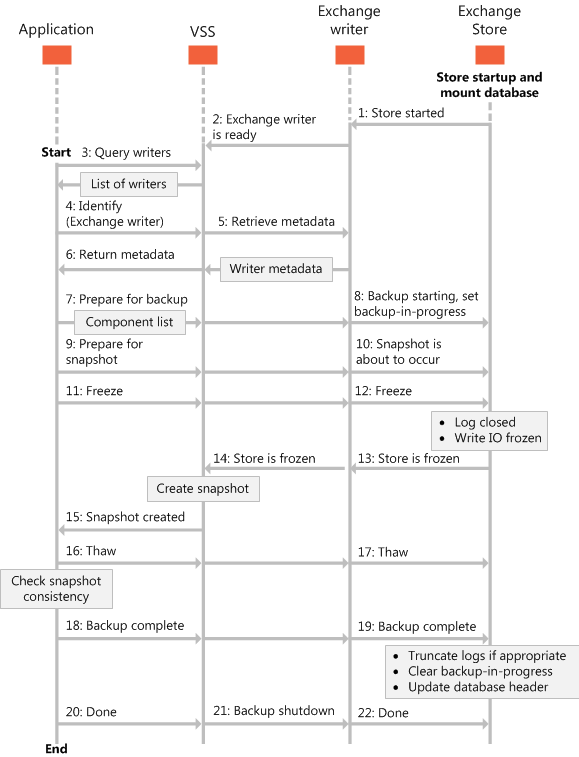

# Типы операций резервного копирования для Exchange 2013Types of backup operations for Exchange 2013

Поиск сведений о различных типах резервных копий, которые можно выполнять на сервере Exchange 2013 хранилища баз данных, включая полный, копия, добавочный и разностные резервные копии.Find information about the different types of backups you can perform on your Exchange 2013 store databases, including full, copy, incremental, and differential backups.
  
**Применимо к:** Exchange Server 2013**Applies to:** Exchange Server 2013 
  
В этой статье представлены сведения о различных типах резервных копий на Exchange Server 2013 баз данных, можно выполнить и влияние этих резервных копий файлов базы данных.This article provides information about the different types of backups you can perform on Exchange Server 2013 databases, and how those backups affect the database files. 
  
Резервное копирование и восстановление приложений, использующих тома теневой копии Service (VSS) и записи Exchange можно выполнить типы резервных копий, перечисленные в следующей таблице.Backup and restore applications that use the Volume Shadow Copy Service (VSS) and the Exchange writer can perform the types of backups listed in the following table.
  
**В таблице 1. Типы операций резервного копирования****Table 1. Types of backup operations**

|**Тип резервного копирования****Backup type**|**Описание****Description**|
|:-----|:-----|
|[Полные резервные копииFull backups](types-of-backup-operations-for-exchange-2013.md#bk_FullBackups)   |Выполняет резервное копирование баз данных (\*.edb), журналы транзакций (\*.log), файлы контрольной точки (\*.chk) и затем ограничивает длину журналов транзакций для определенной базе данных.Backs up the databases (\*.edb), transaction logs (\*.log), checkpoint files (\*.chk), and then truncates the transaction logs for a specific database.    |
|[Скопируйте резервные копииCopy backups](types-of-backup-operations-for-exchange-2013.md#bk_CopyBackups)   |Выполняет резервное копирование базы данных, журналов транзакций и файлов контрольной точки.Backs up the database, transaction logs, and checkpoint files. Копий не усекать журнал транзакций для базы данных.Copy backups do not truncate the transaction logs for the database.    |
|[Добавочное резервное копированиеIncremental backups](types-of-backup-operations-for-exchange-2013.md#bk_IncrementalBackups)   |Выполняет резервное копирование журналов транзакций для регистрации изменений с момента последней полной или добавочной архивации, а затем ограничивает длину журналов транзакций.Backs up the transaction logs to record changes since the last full or incremental backup, and then truncates the transaction logs.    |
|[Разностные резервные копииDifferential backups](types-of-backup-operations-for-exchange-2013.md#bk_DifferentialBackups)   |Выполняет резервное копирование журналов транзакций для регистрации изменений с момента последней полной или добавочной архивации, а не усечения журналов транзакций.Backs up the transaction logs to record changes since the last full or incremental backup, and does not truncate the transaction logs.    |
   
Компоненты или файлы базы данных, определенные в записи Exchange представляют файлы базы данных и журналы транзакций в базах данных Exchange 2013.The components, or database files, defined by the Exchange writer represent the database files and transaction logs within Exchange 2013 databases. Это позволяет резервное копирование и восстановление приложения, чтобы отобразить имена компонентов в базе данных Exchange 2013 во время операции резервного копирования.This allows your backup and restore application to display the names of the components within an Exchange 2013 database during backup operations. Ваше приложение резервного копирования резервное копирование не компоненты отдельной базы данных его можно только резервное копирование всей базы данных.Your backup application cannot back up individual database components, however; it can only back up whole databases. 
  
Модуль записи Exchange стандартизация пути логических компонентов базы данных, указанных в метаданных модуля записи Exchange.The Exchange writer standardizes the database component logical paths, which are specified in the Exchange writer metadata. Записи Exchange возвращает логической пути для резервного копирования и восстановления приложения при необходимости.The Exchange writer returns the logical paths to your backup and restore application as needed.
  
Модуль записи Exchange предоставляет логических путей к папкам в форме:The Exchange writer provides logical paths in the form: 
  
 `logicalPath = "Exchange Server\Microsoft Information Store\<Server name>"`
  
Компоненты сервера и базы данных — это компоненты группы файлов, но они не имеют все связанные файлы.The server and database components are file group components, but they do not have any associated files. У них есть подкомпоненты, которые задают отдельные файлы.They have subcomponents that specify the individual files. База данных содержит только один компонент журнала, с именем журналы.A database contains only one log component, named Logs. Имена компонентов компонентов отдельной базы данных являются GUID базы данных, отображаться в виде строки.The component names of the individual database components are the GUIDs of the databases, shown as strings. 
  
Модуль записи Exchange только приведены баз данных, которые можно сделать резервные копии, на основании руководство служба теневого копирования ТОМОВ.The Exchange writer only lists databases that can be backed up, based on VSS framework guidelines. Баз данных, установленных в качестве базы данных восстановления Exchange 2013, а также баз данных, которые не подключены, не поддаются резервному копированию и поэтому не указана в метаданных модуля записи Exchange.Databases that are mounted as the Exchange 2013 recovery database, as well as databases that are not mounted, cannot be backed up, and therefore are not listed in the Exchange writer's metadata.
  
На следующем рисунке показана модуля записи Exchange резервного копирования.The following figure shows the Exchange writer backup process. 
  
**На рисунке 1. Последовательность событий для резервного копирования****Figure 1. Sequence of events for the backup process**

  
## Полные резервные копииFull backups

Полное резервное копирование базы данных Exchange включает создание и сохранение копии файла базы данных, журналов транзакций и файлов контрольной точки.A full backup of an Exchange database involves creating and storing a copy of the database file, transaction logs, and checkpoint files. Базы данных Exchange 2013 имеет один набор выделенных журналов транзакций.An Exchange 2013 database has one set of dedicated transaction log files.
  
После резервного копирования базы данных файлы журнала транзакций на диске усекаются, чтобы останутся только изменения базы данных, которые произошли после создания резервной копии.After the database has been backed up, the transaction log files on the disk are truncated so that only database changes that occurred after the backup was made will remain. Во время этого процесса модуля записи Exchange удаляет все записи журнала до контрольной точки, исходя из предположения, что базы данных теперь созданы резервные копии согласованность, содержащий все изменения копирование для последней контрольной точки.During this process, the Exchange writer deletes all log entries up to the checkpoint, based on the assumption that the databases have now been backed up in a consistent state that contains all changes up to the most recent checkpoint. 
  
Если база данных, копирования отключается во время операции резервного копирования, Exchange 2013 не удалит журналов транзакций и результатом будет аналогичной операции резервного копирования копии, не операцию полной резервной копии.If the database being backed up is dismounted during the backup operation, Exchange 2013 will not truncate the transaction logs and the result will be the equivalent of a copy backup operation, not a full backup operation. 
  
После завершения полного резервного копирования в заголовках active подключенная база данных обновляются сведения о текущей резервной копии.When a full backup is completed, the headers of the active mounted database are updated with the current backup information. В реплицированной развертываний эти сведения будут зафиксированы в файл журнала транзакций и реплицировать на другие группы доступности базы данных копии базы данных.In replicated deployments, this information will be committed to a transaction log file and replicated to the other DAG copies of the database. Заголовки копия базы данных обновляются по мере воспроизведения файла журнала транзакций в копии базы данных.Headers of the database copies are updated as this transaction log file is replayed into the database copy.
  
Резервное копирование с полной теневой является обязательным для запуска добавочного или разностного теневых копий.A full shadow copy backup is required in order to run incremental or differential shadow copy backups. Полные резервные копии могут быть взяты из любого копии, пока является теневой копии резервного копирования.The full backups can be taken from any copy as long as it is a shadow copy backup.
  
Полные резервные копии используются в следующих случаях:Full backups are used in the following scenarios:
  
- База данных повреждена или теряются, но файлы журнала транзакций на диске без изменений.A database becomes corrupted or is lost, but the transaction log files on disk are intact. В этом сценарии затронутой базы данных восстановлена из полной резервной копии и файлов нажмите восстановить путем воспроизведения журналов транзакций, которые будут по-прежнему на диске.In this scenario, the affected database files can be restored from the full backup, and then recovered by replaying the transaction logs that are still on disk. 
    
- Файлы журнала транзакций, а также файл базы данных на диске, не сохраняются.Transaction log files, as well as the database file on disk, are lost. В этом сценарии вместе с базы данных будут восстановлены файлы журнала транзакций, которые были заархивированы во время полного резервного копирования.In this scenario, the transaction log files that were backed up at the time of the full backup are restored together with the database.
    
В Exchange 2013 журналы могут быть восстановлены без необходимости восстановления применимых базы данных из набора полной резервной копии.In Exchange 2013, logs can be restored without having to restore the applicable database from a full backup set. Этот параметр позволяет предыдущей полной резервной копии для восстановления и в сочетании с файлы журнала транзакций с последнего полного резервного копирования к развертыванию вперед.This option makes it possible for a previous full backup to be restored and combined with the transaction log files from the most recent full backup to roll forward.
  
При перечислении [VSS_BACKUP_TYPE](http://msdn.microsoft.com/ru-ru/library/windows/desktop/aa384679%28v=vs.85%29.aspx) в VSS имеет значение **VSS_BT_FULL** при записи Exchange выполняет резервное копирование, в резервную копию включаются следующие компоненты:When the [VSS_BACKUP_TYPE](http://msdn.microsoft.com/ru-ru/library/windows/desktop/aa384679%28v=vs.85%29.aspx) enumeration in VSS is set to **VSS_BT_FULL** when the Exchange writer performs a backup, the following components are included in the backup: 
  
- Базы данных с помощью логических путь банка данных Exchange Server\Microsoft\\< имя сервера\>\\< GUID базы данных\>A database with the logical path Exchange Server\Microsoft Information Store\\<Server Name\>\\<Database GUID\> 
    
- Файл журнала с помощью логических путь банка данных Exchange Server\Microsoft\\< имя сервера\>\\< GUID базы данных\>A log file with the logical path Exchange Server\Microsoft Information Store\\<Server Name\>\\<Database GUID\> 
    
## Скопируйте резервные копииCopy backups

Резервной копии базы данных Exchange включает создание и сохранение те же элементы, которые включены в полную резервную копию.A copy backup of an Exchange database involves creating and storing the same elements that are included in a full backup. Тем не менее в отличие от с полной резервной копии журнала транзакций на диске не усекаются по завершении резервного копирования.However, unlike with a full backup, the transaction log files on disk are not truncated when the backup is complete. Копий не предназначены для целей восстановления данных.Copy backups are not intended for data recovery purposes. Вместо этого копий предоставления изображения данных для использования при тестировании диагностики, или для заполнения реплики.Instead, copy backups provide an image of the data for use in testing, problem diagnosis, or for seeding a replica.
  
К примеру администратор Exchange 2013, возникают проблемы с хранилищем Exchange можно копировать резервного копирования для использования в тестовой среде без воздействия на производственной системы.For example, an Exchange 2013 administrator who is experiencing problems with the Exchange store can make a copy backup for use in a test environment without affecting the production system. Копий не влияют на регулярного расписания резервного копирования; Тем не менее так как в хранилище Exchange также размещает резервной копии в резервной копии в процессе выполнения, блокирует другие запланированного резервного копирования с продолжением работы до завершения резервного копирования или прервана.Copy backups do not affect regular backup schedules; however, because a copy backup also puts the Exchange store in a backup-in-progress state, it blocks other scheduled backups from proceeding until the copy backup is completed or aborted. 
  
При перечислении [VSS_BACKUP_TYPE](http://msdn.microsoft.com/ru-ru/library/windows/desktop/aa384679%28v=vs.85%29.aspx) в VSS имеет значение **VSS_BT_COPY**, в резервной копии, включаются следующие компоненты:When the [VSS_BACKUP_TYPE](http://msdn.microsoft.com/ru-ru/library/windows/desktop/aa384679%28v=vs.85%29.aspx) enumeration in VSS is set to **VSS_BT_COPY**, the following components are included in a copy backup: 
  
- Базы данных с помощью логических путь банка данных Exchange Server\Microsoft\\< имя сервера\>\\< GUID базы данных\>A database with the logical path Exchange Server\Microsoft Information Store\\<Server Name\>\\<Database GUID\> 
    
- Компонент файла журнала с помощью логических путь банка данных Exchange Server\Microsoft\\< имя сервера\>\\< GUID базы данных\>A log file component with the logical path Exchange Server\Microsoft Information Store\\<Server Name\>\\<Database GUID\>
    
## Добавочное резервное копированиеIncremental backups

Добавочное резервное копирование базы данных Exchange 2013 сохраняет изменения, произошедшие с момента последнего полного или добавочного резервного копирования базы данных.An incremental backup of an Exchange 2013 database saves changes to the database that have occurred since the last full or incremental backup. При восстановлении все файлы базы данных и файлов журнала в систему, они могут быть восстановлены в состояние, в котором они находились во время последнего добавочного резервного копирования.When all the database files and log files are restored to the system, they can be recovered to the state they were in at the time of the last incremental backup. Данные, хранящиеся в добавочного резервного копирования включает в себя только файлы журнала транзакций до текущего времени.The data stored in an incremental backup includes only the transaction log files up to the current time. 
  
По завершении резервного копирования Exchange server ограничивает длину файлов журнала и помечает время резервного копирования в заголовках базы данных.When the backup is complete, the Exchange server truncates the log files and marks the backup time in the database headers. Использование добавочного резервного копирования для восстановления базы данных требуется по крайней мере двух наборов данных, которую необходимо восстановить: последнего полного резервного копирования, а затем каждые добавочное резервное копирование взяты после последнего полного резервного копирования.Using an incremental backup to recover a database requires at least two data sets to be restored: the last full backup, and then every incremental backup taken after the last full backup. Преимущество использования добавочного резервного копирования является отдельным резервные копии намного меньше, чем полное резервное копирование и отдельных добавочного резервного копирования часто меньше, чем разностные резервные копии.The advantage to using incremental backups is that the individual backups are much smaller than a full backup and individual incremental backups are frequently smaller than differential backups. 
  
Недостаток использования добавочного резервного копирования —, что если между полные резервные копии вносятся многих добавочного резервного копирования, восстановления хранилища Exchange может включать в себя восстановление много добавочного резервного копирования.The disadvantage to using incremental backups is that if many incremental backups were made between full backups, recovering the Exchange store may involve recovering many incremental backups. Exchange не разрешает добавочное резервное копирование в случае, когда нет предыдущей полной резервной копии для установления Начальная точка добавочные изменения.Exchange does not allow an incremental backup to occur when no previous full backup exists to establish the starting point for the incremental changes. 
  
Полное резервное копирование, взяты из расположение копии группы доступности базы данных можно следовать добавочное резервное копирование из активной расположения и наоборот.A full backup taken from a DAG copy location can be followed by an incremental backup from the active location and vice versa. Одно ограничение необходимо иметь в виду, что состояния последней резервной копии сохраняется в заголовке активной базы данных и изменения заголовка базы данных записываются в журналы транзакций, репликации и воспроизведения в расположении копии базы данных так же, как другие операции журналы в развертываниях обеспечения доступности баз данных.One restriction to keep in mind is that the last backup state is maintained in the active database's header, and the changes to the database header are written to transaction logs, replicated, and replayed at the copy database location just like all other transaction logs in DAG deployments. Так как резервное копирование и восстановление взаимодействовать, приложений резервного копирования можно обеспечить функциональные возможности для выполнения резервного копирования исключительно на определенного узла группы доступности базы данных, независимо от того, является ли узел активном или пассивном состоянии, а также для выполнения резервного копирования исключительно из пассивного узла или только с активного узла.Because backups and restores interoperate, backup applications can provide the functionality to run backups exclusively on a specific DAG node, regardless of whether the node is active or passive, as well as to run backups exclusively from the passive node or exclusively from the active node.
  
При перечислении [VSS_BACKUP_TYPE](http://msdn.microsoft.com/ru-ru/library/windows/desktop/aa384679%28v=vs.85%29.aspx) в VSS имеет значение **VSS_BT_INCREMENTAL**, добавочного резервного копирования включает следующие компоненты:When the [VSS_BACKUP_TYPE](http://msdn.microsoft.com/ru-ru/library/windows/desktop/aa384679%28v=vs.85%29.aspx) enumeration in VSS is set to **VSS_BT_INCREMENTAL**, the following components are included in an incremental backup: 
  
- Базы данных с помощью логических путь банка данных Exchange Server\Microsoft\\< имя сервера\>\\< GUID базы данных\>A database with the logical path Exchange Server\Microsoft Information Store\\<Server Name\>\\<Database GUID\> 
    
- Файл журнала с помощью логических путь банка данных Exchange Server\Microsoft\\< имя сервера\>\\< GUID базы данных\>A log file with the logical path Exchange Server\Microsoft Information Store\\<Server Name\>\\<Database GUID\>
    
## Разностные резервные копииDifferential backups

Разностной резервной копии базы данных Exchange 2013 сохраняет изменения, произошедшие с момента последнего полного или добавочного резервного копирования базы данных.A differential backup of an Exchange 2013 database saves changes to the database that have occurred since the last full or incremental backup. При восстановлении файлов базы данных и файлов журнала в системе, могут быть восстановлены в состояние, в котором они были в последней разностной резервной копии.When the database files and log files are restored by the system, they can be recovered to the state they were in at the last differential backup. 
  
Данные, хранящиеся в разностного резервного копирования включает в себя только файлы журнала транзакций до текущего контрольной точки.The data stored in a differential backup includes only the transaction log files up to the current checkpoint. Разностные резервные копии не удаление или изменение файлов журнала и не изменяйте заголовки базы данных.Differential backups do not delete or change the log files or change the database headers. Использование разностного резервного копирования для восстановления базы данных, необходимо только восстановление двух наборов данных: последнего полного резервного копирования, а затем последнюю разностную резервную копию.To use a differential backup to recover a database, you only need to restore two data sets: the last full backup, and then the most recent differential backup. 
  
Недостаток разностные резервные копии с помощью заключается в том, что разностные резервные копии дублирующиеся резервной копии данных в каждом резервной копии до полной резервной копии.The disadvantage to using differential backups is that the differential backups duplicate the backed up data in each backup until a full backup is performed. Если множество разностные резервные копии создаются между полные резервные копии, объем пространства, необходимого может превышать, необходимые для такое же число добавочного резервного копирования.If many differential backups are taken between full backups, the storage space required can exceed that required by the same number of incremental backups. Exchange не разрешает разностного резервного копирования в случае, когда не был полного или добавочного резервного копирования для установления Начальная точка разностные резервные копии.Exchange does not allow a differential backup to occur when there has not been a full or incremental backup to establish the starting point for differential backups.
  
Полное резервное копирование, взяты из Копировать расположение может следовать разностного резервного копирования из активной расположения и наоборот.A full backup taken from the copy location can be followed by a differential backup from the active location and vice versa. Одно ограничение необходимо иметь в виду, что состояния последней резервной копии сохраняется в заголовке активной базы данных и изменения заголовка базы данных записываются в журналы транзакций, репликации и воспроизведения в расположении копии базы данных так же, как другие операции журналы в развертываниях обеспечения доступности баз данных.One restriction to keep in mind is that the last backup state is maintained in the active database's header, and the changes to the database header are written to transaction logs, replicated, and replayed at the copy database location just like all other transaction logs in DAG deployments. Так как резервное копирование и восстановление взаимодействовать, приложений резервного копирования предоставляют функциональные возможности для запуска всех резервных копий исключительно на конкретный узел группы доступности базы данных, независимо от того, является ли узел активном или пассивном состоянии, а также для выполнения резервного копирования исключительно из пассивного узла или только с активного узла.Because backups and restores interoperate, backup applications provide the functionality to run all backups exclusively on a specific DAG node, regardless of whether the node is active or passive, as well as to run backups exclusively from the passive node or exclusively from the active node.
  
При перечислении [VSS_BACKUP_TYPE](http://msdn.microsoft.com/ru-ru/library/windows/desktop/aa384679%28v=vs.85%29.aspx) в VSS имеет значение **VSS_BT_DIFFERENTIAL**, разностного резервного копирования включает следующие компоненты:When the [VSS_BACKUP_TYPE](http://msdn.microsoft.com/ru-ru/library/windows/desktop/aa384679%28v=vs.85%29.aspx) enumeration in VSS is set to **VSS_BT_DIFFERENTIAL**, the following components are included in a differential backup: 
  
- Базы данных с помощью логических путь банка данных Exchange Server\Microsoft\\< имя сервера\>\\< GUID базы данных\>A database with the logical path Exchange Server\Microsoft Information Store\\<Server Name\>\\<Database GUID\> 
    
- Файл журнала с помощью логических путь банка данных Exchange Server\Microsoft\\< имя сервера\>\\< GUID базы данных\>A log file with the logical path Exchange Server\Microsoft Information Store\\<Server Name\>\\<Database GUID\>
    
## См. такжеSee also

- [Построение резервное копирование и восстановление приложений для Exchange 2013Build backup and restore applications for Exchange 2013](build-backup-and-restore-applications-for-exchange-2013.md)
    
- [Основные понятия резервного копирования и восстановления для Exchange 2013Backup and restore concepts for Exchange 2013](backup-and-restore-concepts-for-exchange-2013.md)
    
- [Восстановление баз данных Exchange 2013Restoring Exchange 2013 databases](restoring-exchange-2013-databases.md)
    
- [Проверка целостности резервной копии с помощью CHKSGFILES API в Exchange 2013Validate backup integrity by using the CHKSGFILES API in Exchange 2013](how-to-validate-backup-integrity-by-using-the-chksgfiles-api-in-exchange.md)
    
- [Проверка целостности резервной копии с помощью средства Eseutil в Exchange 2013Validate backup integrity by using the Eseutil tool in Exchange 2013](how-to-validate-backup-integrity-by-using-the-eseutil-tool-in-exchange-2013.md)
    

