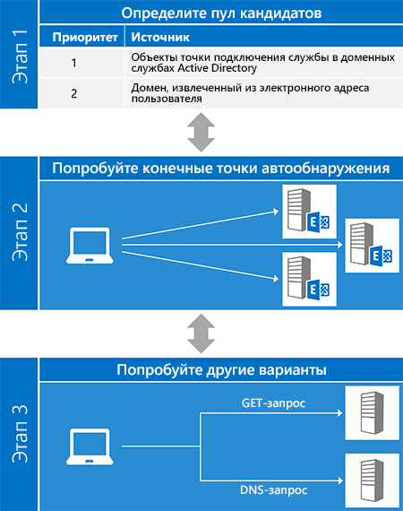
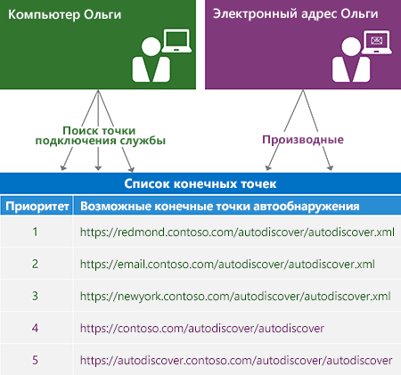
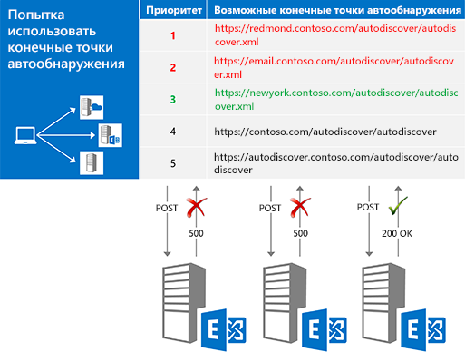
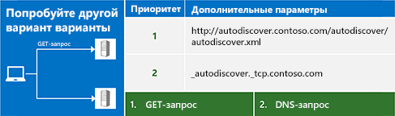

# Автообнаружение для Exchange

Информация, содержащаяся в этом документе, может относиться к функциям и продуктам предварительной версии и может претерпеть значительные изменения до окончательного коммерческого выпуска. Настоящий документ предоставляется "как есть" и служит только для информационных целей. Корпорация Майкрософт не предоставляет никаких гарантий, явных или подразумеваемых, в связи с этим документом Сведения о службе автообнаружения в Exchange.
  
Служба автообнаружения Exchange позволяет клиентскому приложению с легкостью настроиться практически без участия пользователя. Большинство пользователей знают свои адрес электронной почты и пароль, и с помощью этих сведений вы можете получить все остальные сведения, необходимые для начала работы. Для клиентов веб-служб Exchange (EWS) автообнаружение обычно используется, чтобы найти URL-адрес конечной точки EWS, но служба автообнаружения также может предоставлять сведения для настройки клиентов, использующих другие протоколы. Автообнаружение работает с клиентскими приложениями как за брандмауэрами, так и за их пределами, и будет работать в сценариях с лесом ресурсов или несколькими лесами.
  
## Обзор процесса автообнаружения

Процесс автообнаружения состоит из трех основных этапов. На первом этапе создается список потенциальных серверов автообнаружения, а на втором вы проверяете каждый сервер в списке, пока (при благоприятном исходе) не будет получен успешный ответ. Если ни один из кандидатов не подошел, вы переходите к третьему этапу, который представляет последнюю попытку найти конечную точку автообнаружения.
  
Метод [ExchangeService.AutodiscoverUrl](http://msdn.microsoft.com/en-us/library/microsoft.exchange.webservices.data.exchangeservice.autodiscoverurl%28v=exchg.80%29.aspx) в управляемом API EWS реализует все три этапа, поэтому при использовании управляемого API EWS вам не нужно беспокоиться о реализации автообнаружения. На следующем рисунке показаны три этапа процесса автообнаружения. 
  
**Рисунок 1. Три этапа процесса автообнаружения**

  
### Этап 1. Определение пула кандидатов

Прежде чем использовать службу автообнаружения, необходимо найти подходящий сервер автообнаружения для пользователя. К счастью, служба автообнаружения задает ограниченное количество мест для поиска. Если найдено несколько кандидатов, служба автообнаружения также определяет [способ создания и сортировки списка по приоритету](how-to-generate-a-list-of-autodiscover-endpoints.md).
  
**Таблица 1. Источники кандидатов на конечную точку автообнаружения**

|**Место для поиска**|**Результат поиска**|
|:-----|:-----|
|Доменные службы Active Directory (AD DS)    |Для клиентов, присоединенных к домену, поиск следует начинать отсюда. Exchange публикует объекты точек подключения службы (SCP) в AD DS, что позволяет направлять запросы автообнаружения на сайты Active Directory. Результаты [поиска SCP](how-to-find-autodiscover-endpoints-by-using-scp-lookup-in-exchange.md) должны находиться в начале списка кандидатов.    **Примечание**: поиска SCP недоступно для клиентов, не присоединенного к домену или, не имеющие доступа к серверам Active Directory. В этом случае следует пропустить поиска SCP.  |
|Домен адреса электронной почты пользователя    | Служба автообнаружения задает две стандартных формы URL-адресов конечных точек, получаемых из доменной части адреса электронной почты пользователя:   `"https://" + domain + "/autodiscover/autodiscover" +  *fileExtension*`   `"https://autodiscover." + domain + "/autodiscover/autodiscover" +  *fileExtension*`    Значение  *fileExtension*  зависит от используемого метода автообнаружения, [SOAP](http://msdn.microsoft.com/library/61c21ea9-7fea-4f56-8ada-bf80e1e6b074%28Office.15%29.aspx) или [POX](http://msdn.microsoft.com/library/877152f0-f4b1-4f63-b2ce-924f4bdf2d20%28Office.15%29.aspx). Служба SOAP использует расширение файлов SVC, а POX использует XML.    |
   
На следующем рисунке показано, как создать список конечных точек автообнаружения.
  
**Рисунок 2. Процесс создания списка конечных точек автообнаружения**

  
### Этап 2. Проверка кандидатов

После создания упорядоченного списка потенциальных кандидатов следует проверить каждого из них, [отправив запрос на URL-адрес](how-to-get-user-settings-from-exchange-by-using-autodiscover.md) и проверив результаты, как показано на рисунке 3. Когда вы получите успешный ответ, все готово! 
  
**Рисунок 3. Проверка кандидатов на конечные точки по порядку**

  
Прежде чем отправлять запрос кандидату, убедитесь в его надежности. Помните, что вы отправляете учетные данные пользователя, поэтому важно убедиться, что вы сообщаете их только надежным серверам. Как минимум, следует убедиться:
  
- что конечная точка является конечной точкой HTTPS. Клиентские приложения не должны проходить проверку подлинности или отправлять данные конечным точкам без SSL;
    
- что сертификат SSL, предоставленный сервером, действителен и поступил из надежного центра.
    
> [!NOTE]
> [!Примечание] Это лишь базовые рекомендации по безопасности. Работая с проверкой подлинности, убедитесь, что ваш код соответствует требованиям к безопасности в вашей организации. 
  
Тип отправляемого запроса зависит от того, как вы получаете доступ к службе автообнаружения.
  
**Таблица 2. Типы запросов автообнаружения**

|**Используемый метод**|**Средство для отправки запроса**|
|:-----|:-----|
|Управляемый API EWS    |Метод [GetUserSettings](http://msdn.microsoft.com/en-us/library/microsoft.exchange.webservices.autodiscover.autodiscoverservice.getusersettings%28v=exchg.80%29.aspx).    |
|Служба автообнаружения SOAP    |Операция [GetUserSettings](http://msdn.microsoft.com/library/758d965c-ef63-4de4-9120-e293abf14ff8%28Office.15%29.aspx).    |
|Служба автообнаружения POX    |Запрос HTTP POST с [текстом запроса автообнаружения](http://msdn.microsoft.com/library/75671b1d-f35b-497b-8d8c-706f3f2535fd%28Office.15%29.aspx).    |
   
### Этап 3. Проверка других альтернатив

В некоторых случаях вы можете проверить все конечные точки в списке, и все они возвращают ошибку. Прежде чем сдаваться, вы можете попробовать еще несколько способов: отправить запрос GET без проверки подлинности или запросить у DNS запись SRV. Если эти попытки не принесли результатов, то подключиться к службе автообнаружения невозможно.
  
**Рисунок 4. Проверка других альтернатив**

  
#### Отправка запроса GET без проверки подлинности

Для начала следует попробовать отправить запрос GET без проверки подлинности конечной точке, полученной из адреса электронной почты пользователя. Эта конечная точка имеет формат "http://autodiscover." + домен + "/autodiscover/autodiscover.xml". Обратите внимание, что это НЕ конечная точка SSL. Если сервер возвращает ответ об ошибке перенаправления 302, вы можете попробовать [повторно отправить запрос автообнаружения](handling-autodiscover-error-messages.md#bk_ResendRequest) на URL-адрес конечной точки в заголовке Location ответа. 
  
#### Запрос к DNS на запись SRV

Если запрос GET без проверки подлинности не принес результатов, вы можете попробовать запросить у DNS запись SRV для службы автообнаружения. Запись будет иметь вид "_autodiscover._tcp." + домен. Этот запрос может вернуть несколько записей, но следует использовать только те записи, которые указывают на конечную точку SSL, а также имеют самые высокие приоритет и вес.
  
## Варианты использования автообнаружения

Вы можете получить доступ к службе автообнаружения с помощью веб-службы SOAP или POX. Выбор метода зависит от ваших требований и среды. Тем не менее, мы рекомендуем по возможности использовать веб-службу SOAP. Кроме того, можно использовать управляемый API EWS. Он реализует часть клиента в службах автообнаружения SOAP и POX.
  
**Таблица 3: Варианты доступа к службе автообнаружения**

|**Вариант**|**Преимущества**|**Недостатки**|
|:-----|:-----|:-----|
|[Управляемый API EWS](get-started-with-ews-managed-api-client-applications.md)   | Реализует процесс автообнаружения.  Использует службы автообнаружения SOAP и POX.  Работает с Exchange Online, Exchange Online в составе Office 365 и всеми версиями Exchange, начиная с Exchange 2007 с пакетом обновления 1 (SP1).  Простой в использовании.    | Ограничен параметрами пользователей, доступными в перечислении [Microsoft.Exchange.WebServices.Autodiscover.UserSettingName](http://msdn.microsoft.com/en-us/library/microsoft.exchange.webservices.autodiscover.usersettingname%28v=EXCHG.80%29.aspx).  Доступен только для приложений .NET Framework.    |
|[Служба автообнаружения SOAP](http://msdn.microsoft.com/library/61c21ea9-7fea-4f56-8ada-bf80e1e6b074%28Office.15%29.aspx)   | Не зависит от платформы.  Позволяет запрашивать только интересующие вас параметры.    | Недоступна в Exchange 2007.    |
|[Служба автообнаружения POX](http://msdn.microsoft.com/library/877152f0-f4b1-4f63-b2ce-924f4bdf2d20%28Office.15%29.aspx)   | Не зависит от платформы.  Поддерживается в Exchange Online и всех версиях Exchange, начиная с Exchange 2007 с пакетом обновления (SP1).    | Не позволяет запрашивать конкретные параметры.    |
   
## В этом разделе

- [Найдите конечных точек службы автообнаружения с помощью поиска SCP в Exchange](how-to-find-autodiscover-endpoints-by-using-scp-lookup-in-exchange.md)
    
- [Создать список конечных точек службы автообнаружения](how-to-generate-a-list-of-autodiscover-endpoints.md)
    
- [Использование службы автообнаружения для поиска точек подключения](how-to-use-autodiscover-to-find-connection-points.md)
    
- [Получить параметры пользователя из Exchange с помощью службы автообнаружения](how-to-get-user-settings-from-exchange-by-using-autodiscover.md)
    
- [Получение параметров домена с сервера Exchange](how-to-get-domain-settings-from-an-exchange-server.md)
    
- [Обновление сведений о конфигурации с помощью службы автообнаружения](how-to-refresh-configuration-information-by-using-autodiscover.md)
    
- [Обработка сообщений об ошибках службы автообнаружения](handling-autodiscover-error-messages.md)
    
- [Повышение производительности при использовании автообнаружения для Exchange](improving-performance-when-using-autodiscover-for-exchange.md)
    
## См. также

- [Начать работу с использованием веб-служб Exchange](start-using-web-services-in-exchange.md)    
- [Exchange 2013: получение параметров пользователей с помощью автообнаружения](http://code.msdn.microsoft.com/Exchange-2013-Get-user-7e22c86e)
- [Пример проверки автообнаружения](http://code.msdn.microsoft.com/exchange/Autodiscover-Checker-e1ebca42)  
- [Разработка клиентов веб-служб для Exchange](develop-web-service-clients-for-exchange.md)
    

