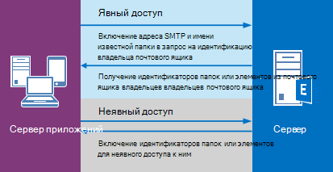

# <a name="delegate-access-and-ews-in-exchange"></a>Передача прав доступа и веб-службах Exchange

Узнайте, как использовать управляемый API EWS и веб-служб Exchange в Exchange для обеспечения делегированный доступ к почтовым ящикам пользователей.
  
Можно предоставить пользователям возможность доступа к почтовым ящикам других пользователей в одном из трех следующих способов: 
  
- Добавление делегатов и задание разрешений для каждого делегата.
    
- Путем изменения разрешений для папки напрямую.
    
- С помощью олицетворения.
    
Разрешения для делегирования и папок, наиболее при только в случае предоставления доступа для нескольких пользователей, так как требуется добавить разрешения отдельно для каждого почтового ящика. Олицетворение является оптимальным выбором, когда вы имеете дело с количества почтовых ящиков, так как можно просто включить одну учетную запись службы для доступа к всех почтовых ящиков в базе данных. На рисунке 1 показаны некоторые различия между каждый тип доступа.
  
**На рисунке 1. Способы доступа к почтовым ящикам других пользователей**


  
При отправке почты и планирования собраний, делегаты можно задавать в разрешений «Отправить от имени», получателя сообщения электронной почты или приглашения на собрание, отправленное делегата будут видеть « *Делегирование* от имени *владельца почтового ящика* » при их receiv электронной почты или приглашения на собрание в Outlook. Текст «Отправить от имени» — это сведения о реализации клиент - и могут быть созданы с помощью «от» и «отправитель» значений. Значение «от» указывает владельца почтового ящика, а значение «отправителя» — делегата, отправленных сообщений. Если учетная запись службы, олицетворение пользователя отправляет сообщение электронной почты или планирует собрание для владельца почтового ящика, сообщение «отправляется как» владельца почтового ящика. Нет возможности для получателя о том, что сообщение было отправлено функцией учетной записи службы. Пользователи, использующие предоставляются разрешения для папки не делегированный доступ, не могут «отправить как» или «отправить от имени» владельца почтового ящика. Они имеют доступ к папкам почтовых ящиков и может иметь возможность создавать элементы в папках, но они не могут отправлять элементы. 
  
Когда это соответствующие непосредственно изменение разрешений для папки? Как правило, когда нужно предоставить пользователю доступ к папке, но не требуется предоставить разрешения «Отправить от имени», когда требований к разрешения не соответствуют значения перечисления [DelegateFolderPermissionLevel](http://msdn.microsoft.com/en-us/library/microsoft.exchange.webservices.data.delegatefolderpermissionlevel%28v=exchg.80%29.aspx) управляемый API EWS или [PermissionLevel](http://msdn.microsoft.com/library/87978600-3523-451e-a725-ef092c543e2a%28Office.15%29.aspx) Значения элементов веб-служб Exchange, или когда требуется предоставить пользователю доступ к одной папке настраиваемых. 
  
Если требуется изменить разрешения папки для достижения поставленной цели и не нужно добавить делегата (то есть, не требуются разрешения «Отправить от имени»), содержатся в разделе [Задание разрешений папки другого пользователя с помощью веб-служб Exchange в Exchange](how-to-set-folder-permissions-for-another-user-by-using-ews-in-exchange.md). 
  
Обратите внимание, что можно также использовать [Outlook](http://office.microsoft.com/en-us/outlook-help/allow-someone-else-to-manage-your-mail-and-calendar-HA102749417.aspx) и [Exchange Server PowerShell (Командная консоль Exchange)](https://docs.microsoft.com/en-us/powershell/exchange/exchange-server/exchange-management-shell?view=exchange-ps) для настройки доступа делегата. 
  
## <a name="how-does-delegate-access-work"></a>Как делегирования доступа?

Передача прав доступа позволяет пользователям получить доступ к некоторые или все папках владельца почтового ящика и действовать от имени владельца почтового ящика. Владелец почтового ящика может быть пользователя или ресурса, например конференц-зала. Например секретарю могут быть предоставлены разрешения делегат для конференц-зала папки календаря, обрабатывать запросы на резервирование. Можно использовать управляемый API EWS или веб-служб Exchange для включения владельца почтового ящика или быть администратором добавить делегата, укажите, какие папки можно получить доступ к представителю, а затем укажите разрешения для этой папки. Делегаты могут иметь доступ к следующие папки: 
  
- Календарь
    
- Задачи
    
- Inbox
    
- Контакты
    
- ����������
    
- ������
    
При наличии делегированный доступ к одному или нескольким из этих папок, их можно создавать, получение, обновление, удаление, копировать и поиск элементов в этой папке и вложенных папок, в зависимости от [разрешений](#bk_delegateperms) , установленные в общей папке. Способ, в которой приложение выполняет следующие действия зависит от ли [явных](#bk_explicit) и [неявных](#bk_implicit) доступа является обязательным. 
  
## <a name="delegate-permissions"></a>Делегирование разрешений
<a name="bk_delegateperms"> </a>

Когда администратор или владелец почтового ящика добавляет делегата в почтовый ящик, их можно задать уровень разрешений для одной или нескольких папок. Если уровень разрешений для папки не задано, значение разрешения по умолчанию используется значение None. Несколько пользователей может иметь уровень разрешений на папку, а пользователи могут иметь разные уровни для разных папок. Если вы используете управляемый API веб-служб Exchange, используется свойство [DelegateUser.Permissions](http://msdn.microsoft.com/en-us/library/microsoft.exchange.webservices.data.delegateuser.permissions%28v=exchg.80%29.aspx) , которое содержит одно из значений перечисления [DelegateFolderPermissionLevel](http://msdn.microsoft.com/en-us/library/microsoft.exchange.webservices.data.delegatefolderpermissionlevel%28v=exchg.80%29.aspx) для каждой папки, чтобы задать делегированных разрешений для папки. При использовании веб-служб Exchange, используйте элемент [PermissionLevel](http://msdn.microsoft.com/library/87978600-3523-451e-a725-ef092c543e2a%28Office.15%29.aspx) and [DelegatePermissions](http://msdn.microsoft.com/library/292badc7-bab3-4368-9d7c-9a8b7edb279b%28Office.15%29.aspx) элемента, который требуется задать делегат разрешения для определения уровня разрешений. 
  
**В таблице 2. Делегирование уровни разрешений**

|**Уровень разрешений**|**Описание**|
|:-----|:-----|
|Нет  <br/> |Это значение по умолчанию для всех папок.  <br/> |
|Author  <br/> |Делегат можно читать и создавать элементы и изменять и удалять элементы, которые они создают. Например делегата Создание приглашений на собрания и поручения непосредственно в папке календаря или задач владельца почтового ящика и затем отправить их от имени владельца почтового ящика.  <br/> |
|Редактор  <br/> |Делегат можно делать все автор сделать, а также можно изменять и удалять элементы, созданные владельца почтового ящика.  <br/> |
|Редактор  <br/> |Делегат может читать элементы. Например делегат с разрешением редактор можно читать сообщения в папки «Входящие» другого пользователя.  <br/> |
|Пользовательский сервер  <br/> |Владелец почтового ящика присвоен пользовательский набор разрешений для делегата.  <br/> |
   
Управляемый API EWS [DelgateUser.ViewPrivateItems](http://msdn.microsoft.com/en-us/library/microsoft.exchange.webservices.data.delegateuser.viewprivateitems%28v=exchg.80%29.aspx) свойство и элемент [ViewPrivateItems](http://msdn.microsoft.com/library/80b949ac-440c-4a01-b428-ebafb5b1b802%28Office.15%29.aspx) веб-служб Exchange — это глобальный параметр, который влияет на все владельца почтового ящика, включая все почты, контакты, календарь, задачи, заметки и журнала папки. Не удается разрешить доступ к частной элементов в папке. 
  
## <a name="explicit-access"></a>Явный доступ
<a name="bk_explicit"> </a>

Просто put, явные доступа — это способ входа для делегатов, которые будут выполнять действия с папкам или элементам владельца почтового ящика. Явные доступа для делегата при они включают имя хорошо известные папки для папки владельца почтового ящика, а также SMTP-адреса владельца почтового ящика в запросе на сервере. Доступ является явных, поскольку запрос делегата явным образом том, что контекст для метода или операция почтового ящика владельца почтового ящика и не в почтовом ящике представителя.
  
Явный доступ определяет контекст для всех методов и операции, выполненные папок и элементов, переход вперед. Все идентификаторы элементов и папок, возвращаемое при явный доступ задано однозначно идентифицируют себя как принадлежащие владельцу почтового ящика (не в любой человеческого формат для чтения). Таким образом, приложение может не указать SMTP-адреса владельца почтового ящика повторно; контекст скрыта в идентификаторы. После идентификации элемента или папки делегат использует [неявный доступ](#bk_implicit) для изменения элемента. На следующем рисунке показана в процессе получения явных и неявных доступа. 
  
**На рисунке 2. Разрешения на запрос явных и неявных доступ к элементу или папки**


  
Можно задать явный доступ в различных сценариях. В сущности каждый раз при отправке папки код в метод или операции, задается явный доступ. Это может включать в себя выявление папки, поиск встречи, извлечение элементов, поиск бесед и т. д.
  
### <a name="explicit-access-and-the-ews-managed-api"></a>Явный доступ и управляемый API веб-служб Exchange
<a name="bk_explicitewsma"> </a>

Можно инициировать явные делегированный доступ, можно использовать любой из следующих перегруженные методы, которые принимают параметр [FolderId](http://msdn.microsoft.com/en-us/library/microsoft.exchange.webservices.data.folderid%28v=exchg.80%29.aspx) ввода для идентификации целевой папке: 
  
- [Folder.Bind](http://msdn.microsoft.com/en-us/library/microsoft.exchange.webservices.data.folder.bind%28v=exchg.80%29.aspx)
    
- [ExchangeService.FindItems](http://msdn.microsoft.com/en-us/library/microsoft.exchange.webservices.data.exchangeservice.finditems%28v=exchg.80%29.aspx)
    
- [ExchangeService.FindAppointments](http://msdn.microsoft.com/en-us/library/microsoft.exchange.webservices.data.exchangeservice.findappointments%28v=exchg.80%29.aspx)
    
- [ExchangeService.FindFolders](http://msdn.microsoft.com/en-us/library/microsoft.exchange.webservices.data.exchangeservice.findfolders%28v=exchg.80%29.aspx)
    
- И многое другое.
    
Параметр **FolderId** в каждой из этих методов для определения папка назначения владельца почтового ящика, как показано ниже. 
  
```cs
new FolderId(WellKnownFolderName.Calendar, "primary@contoso.com");
```

Например для привязки к папке календаря **FolderId** в этот метод **привязки** указывает имя известных папки и SMTP-адреса владельца почтового ящика. 
  
```cs
CalendarFolder calendar = CalendarFolder.Bind(service, new FolderId(WellKnownFolderName.Calendar, "primary@contoso.com"), new PropertySet());
```

Указав имя известных папки и SMTP-адрес, делегат можно привязать к папке календаря владельца почтового ящика, а следовательно, увеличит явный доступ к папке. Все последующие запросы на [неявный доступ](#bk_implicit) для элементов в папке, в затем используют контекста, возвращаемых в элементе идентификаторов и папки. По сути идентификаторы содержит контекста для вызовов доступа подразумеваемых делегата. Или, чтобы получить идентификатор элемента, который соответствует определенному набору условий, используйте следующее. 
  
```cs
FindItemsResults<Item> results = service.FindItems(new FolderId(WellKnownFolderName.Calendar, "primary@contoso.com"), filter, view);
```

В этом случае возвращается идентификатор элемента, и затем делегат использовать неявный доступ для внесения изменений к элементу с помощью идентификатор элемента.
  
У вас нет для инициации явный доступ еще раз, пока не требуется идентификатор элемента или идентификатор папки, не получить доступ с помощью существующих явный доступ. 
  
### <a name="explicit-access-and-ews"></a>Явный доступ и веб-служб Exchange
<a name="bk_explicitewsma"> </a>

Можно инициировать явный доступ с помощью операции [GetFolder](http://msdn.microsoft.com/library/355bcf93-dc71-4493-b177-622afac5fdb9%28Office.15%29.aspx), [FindItem](http://msdn.microsoft.com/library/ebad6aae-16e7-44de-ae63-a95b24539729%28Office.15%29.aspx)или [FindFolder](http://msdn.microsoft.com/library/7a9855aa-06cc-45ba-ad2a-645c15b7d031%28Office.15%29.aspx) . Эти операции содержат параметр, чтобы использовать элемент [DistinguishedFolderId](http://msdn.microsoft.com/library/50018162-2941-4227-8a5b-d6b4686bb32f%28Office.15%29.aspx) для идентификации целевой папке. Элемент **DistinguishedFolderId** имеет один необязательный дочерний элемент, элемент [почтового ящика](http://msdn.microsoft.com/library/befc70fd-51cb-4258-884c-80c9050f0e82%28Office.15%29.aspx) . Элемент **почтового ящика** , при использовании в качестве дочернего для элемента **DistinguishedFolderId** , указывает почтовый ящик для делегата для доступа. Если вызывающий пользователь имеет разрешения на доступ к папке владельца почтового ящика, ответ будет содержать коллекцию идентификаторов для элементов или папок в этот почтовый ящик. Идентификаторы элементов и папок, возвращаемого в ответе можно использовать для доступа к неявных делегата. 
  
## <a name="implicit-access"></a>Неявный доступ
<a name="bk_implicit"> </a>

После того как делегат извлек идентификатор для элемента или папки в почтовом ящике владельца почтового ящика и делегата, где требуется реализовать для обновления, удаления или скопировать элемент используется неявный доступ. Если делегат использует этот идентификатор ID элемента или папки в запросе, изменении элемента в почтовом ящике владельца почтового ящика. Делегат не нужно включать SMTP-адреса владельца почтового ящика. 
  
К примеру при делегата включен в одной из папок владельца почтового ящика, делегат можно выполнить операции **FindItem** папку с помощью идентификатора папки без явного определения почтового ящика владельца почтового ящика. На этом этапе делегат могут выполнять действия с папки владельца почтового ящика с помощью идентификаторов, возвращаемых в ответах. 
  
### <a name="implicit-access-and-the-ews-managed-api"></a>Неявный доступ и управляемый API веб-служб Exchange

Если идентификатор элемента извлекается с помощью метода [FindItems](http://msdn.microsoft.com/en-us/library/microsoft.exchange.webservices.data.exchangeservice.finditems%28v=exchg.80%29.aspx) , можно использовать этот идентификатор элемента в последующих вызова метода [Item.Bind](http://msdn.microsoft.com/en-us/library/microsoft.exchange.webservices.data.item.bind%28v=exchg.80%29.aspx) для привязки к элементу. Затем можно вызвать метод [Item.Update](http://msdn.microsoft.com/en-us/library/office/microsoft.exchange.webservices.data.item.update%28v=exchg.80%29.aspx), [Item.Delete](http://msdn.microsoft.com/en-us/library/office/microsoft.exchange.webservices.data.item.delete%28v=exchg.80%29.aspx)или [Item.Copy](http://msdn.microsoft.com/en-us/library/office/microsoft.exchange.webservices.data.item.copy%28v=exchg.80%29.aspx) — или любой вызов метода, которому требуется идентификатор элемента — при необходимости для завершения задачи. Поскольку делегат имеет соответствующие разрешения на папку, содержащую элемент (и, если это возможно, в папке элемент перемещается), делегат можно внести изменения в соответствии с их уровни разрешений. 
  
### <a name="implicit-access-and-ews"></a>Неявный доступ и веб-служб Exchange

Если идентификатор элемента было извлечено операцией [FindItem](http://msdn.microsoft.com/library/ebad6aae-16e7-44de-ae63-a95b24539729%28Office.15%29.aspx) , можно использовать этот идентификатор элемента в последующие операции [GetItem](http://msdn.microsoft.com/library/e3590b8b-c2a7-4dad-a014-6360197b68e4%28Office.15%29.aspx) для привязки к элементу. Затем можно вызвать операции [UpdateItem](http://msdn.microsoft.com/library/5d027523-e0bc-4da2-b60b-0cb9fc1fdfe4%28Office.15%29.aspx), [DeleteItem](http://msdn.microsoft.com/library/3e26c416-fa12-476e-bfd2-5c1f4bb7b348%28Office.15%29.aspx)или [CopyItem](http://msdn.microsoft.com/library/bcc68f9e-d511-4c29-bba6-ed535524624a%28Office.15%29.aspx) — или любые операции, требующие идентификатор элемента, необходимые для выполнения задачи. Поскольку делегат имеет соответствующие разрешения на папку, содержащую элемент (и, если это возможно, в папке элемент перемещается), делегат можно внести изменения в соответствии с их уровни разрешений. 
  
## <a name="in-this-section"></a>В этом разделе
<a name="bk_implicit"> </a>

- [Добавление и удаление делегаты с помощью веб-служб Exchange в Exchange](how-to-add-and-remove-delegates-by-using-ews-in-exchange.md)
    
- [Доступ к календарю в качестве делегата с помощью веб-служб Exchange в Exchange](how-to-access-a-calendar-as-a-delegate-by-using-ews-in-exchange.md)
    
- [Контакты доступа роли представителя с помощью веб-служб Exchange в Exchange](how-to-access-contacts-as-a-delegate-by-using-ews-in-exchange.md)
    
- [Доступ к электронной почте в качестве делегата с помощью веб-служб Exchange в Exchange](how-to-access-email-as-a-delegate-by-using-ews-in-exchange.md)
    
- [Настройка разрешений папки другого пользователя с помощью веб-служб Exchange в Exchange](how-to-set-folder-permissions-for-another-user-by-using-ews-in-exchange.md)
    
- [Обработка ошибок, связанных с делегирования в веб-служб Exchange в Exchange](handling-delegation-related-errors-in-ews-in-exchange.md)
    
## <a name="see-also"></a>См. также


- [Разработка клиентов веб-служб для Exchange](develop-web-service-clients-for-exchange.md)
    
- [Разрешить другому пользователю управлять почта и календарь](http://office.microsoft.com/en-us/outlook-help/allow-someone-else-to-manage-your-mail-and-calendar-HA102749417.aspx)
    
- [Добавление MailboxPermission](http://technet.microsoft.com/en-us/library/bb124097%28v=exchg.150%29.aspx)
    

