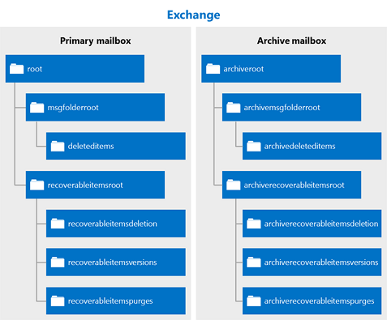

# Удаление элементов с помощью EWS в ExchangeDeleting items by using EWS in Exchange

Сведения о том, как можно использовать управляемый API EWS или EWS в Exchange для удаления элементов, перемещая их в папку "Удаленные" или в корзину.Find out how you can use the EWS Managed API or EWS in Exchange to delete items either by moving them to the Deleted Items folder or to the dumpster.
  
Вы когда-нибудь запросили разницу между перемещением элементов в папку "Удаленные" и перемещением их в корзину?Have you ever asked yourself what the difference is between moving items to the Deleted Items folder, and moving them to the dumpster? Возможно, вы хотите узнать о различных вариантах обработки удаленных элементов и о том, как реализовать эти параметры в приложении.You might be curious about the different options for handling deleted items and how to implement those options in your application. Веб-службы Exchange (EWS) включают три варианта обработки удаленных элементов.Exchange Web Services (EWS) includes three options for handling deleted items. В этой статье мы будем удалять все различия между ними.This article will hopefully clear up any confusion you might have about the differences between them.
  
## Удаление элементов: что такое "Мои параметры"?Deleting items - what are my options?

Прежде чем вы сможете понять общую ориентацию по удалению элементов, важно понять разницу между следующими особенностями.Before you can understand the overall landscape for deleting items, it's important to recognize the difference between the following:
  
- Папка "Удаленные" — при удалении элементов в почтовом ящике это место.The Deleted Items folder - When you delete items in a mailbox, this is where they go.
    
- Корзина (как и папка "элементы с возможностью восстановления") — при удалении элементов из почтового ящика это место, где они находятся.The dumpster (aka the Recoverable Items folder) - When you remove items from a mailbox, this is where they go.
    
На рисунках 1 и 2 показано, как выглядит процесс удаления для элементов и папок в почтовом ящике.Figures 1 and 2 show what the deletion process looks like for items and folders in a mailbox. 

**Рис. 1. Процесс удаления элементов из почтового ящика****Figure 1. Process for deleting items from a mailbox**

 

**Рис. 2. Процесс удаления папок из почтового ящика****Figure 2. Process for deleting folders from a mailbox**

   
Вы можете удалять элементы и папки тремя различными способами, в зависимости от того, как "постоянное" нужно удалить.You can delete items and folders three different ways, depending on how "permanent" you would like the deletion to be.
  
**Таблица 1: параметры удаления элементов с помощью EWS****Table 1: Options for deleting items by using EWS**

|**Вариант****Option**|**Что происходит****What happens**|
|:-----|:-----|
|Перемещение в папку удаленных элементовMove to the Deleted Items folder    |Это наименее постоянный способ удаления элементов.This is the least permanent way to delete items.  Это аналогично размещению бумажной бумаги в корзине на рабочем месте.This is like putting a piece of paper in the recycle bin by your desk. Его можно легко захватить, если это необходимо.You can easily grab it if you need it again.  Для выполнения этого действия можно использовать любую [операцию удаления](deleting-items-by-using-ews-in-exchange.md#bk_howdoIdeleteitems) , которая реализует параметр переместить в папку "Удаленные".You can use any [deletion operation](deleting-items-by-using-ews-in-exchange.md#bk_howdoIdeleteitems) that implements the move to the Deleted Items folder option to perform this action.  Вы также можете использовать [операцию MoveItem](https://msdn.microsoft.com/library/dcf40fa7-7796-4a5c-bf5b-7a509a18d208%28Office.15%29.aspx) ( [Item. Move ()](https://msdn.microsoft.com/library/microsoft.exchange.webservices.data.item.move%28v=exchg.80%29.aspx)) или [операцию MoveFolder](https://msdn.microsoft.com/library/c7233966-6c87-4a14-8156-b1610760176d%28Office.15%29.aspx) ( [Folder. Move ()](https://msdn.microsoft.com/library/microsoft.exchange.webservices.data.folder.move%28v=exchg.80%29.aspx)), чтобы переместить элемент или папку в папку "Удаленные".You can also use the [MoveItem operation](https://msdn.microsoft.com/library/dcf40fa7-7796-4a5c-bf5b-7a509a18d208%28Office.15%29.aspx) ( [Item.Move()](https://msdn.microsoft.com/library/microsoft.exchange.webservices.data.item.move%28v=exchg.80%29.aspx)) or the [MoveFolder operation](https://msdn.microsoft.com/library/c7233966-6c87-4a14-8156-b1610760176d%28Office.15%29.aspx) ( [Folder.Move()](https://msdn.microsoft.com/library/microsoft.exchange.webservices.data.folder.move%28v=exchg.80%29.aspx)) to move an item or folder to the Deleted Items folder.    |
|Обратимое удалениеSoft delete    |Элемент перемещается в папку "удаления" в корзине.The item is moved to the Deletions folder in the dumpster.  Это аналогично очистке корзины в контейнере курбсиде.This is like emptying your recycle bin into your curbside container. Вы по-прежнему можете получать доступ к элементу, если это необходимо, но немного сложнее.You can still access the item if you need to, it's just a little harder.    Для получения дополнительных сведений о корзине (также называемой папкой "элементы с возможностью восстановления") и сценариями, такими как обнаружение электронных данных и судебное разбирательства, просмотрите [папку элементы с возможностью восстановления](https://technet.microsoft.com/library/ee364755%28v=exchg.150%29.aspx) на сайте TechNet.For more about the dumpster (also called the Recoverable Items folder) and scenarios such as eDiscovery or litigation holds, see [Recoverable Items Folder](https://technet.microsoft.com/library/ee364755%28v=exchg.150%29.aspx) on TechNet.  Обратимое удаление не рекомендуется для приложений, предназначенных для Exchange 2007.Soft deletions aren't recommended for applications that target Exchange 2007. В Exchange 2007, обратимое удаление обрабатывается путем установки бита для элемента, указывающего на то, что он будет перемещен в корзину в неуказанное время.In Exchange 2007, soft deletions are handled by setting a bit on the item to indicate that it will be moved to the dumpster at an unspecified time.  При обратимом удалении или поиске элементов, которые были обратимо удалены с помощью [операции FindItem](https://msdn.microsoft.com/library/ebad6aae-16e7-44de-ae63-a95b24539729%28Office.15%29.aspx), не поддерживаются в Exchange Online, Exchange Online в составе Office 365 и версиях Exchange, начиная с Exchange 2010.Soft delete traversals, or searches of items that have been soft deleted via the [FindItem operation](https://msdn.microsoft.com/library/ebad6aae-16e7-44de-ae63-a95b24539729%28Office.15%29.aspx), are not supported in Exchange Online, Exchange Online as part of Office 365, and versions of Exchange starting with Exchange 2010.    **Note**: папки нельзя удалять с возможностью восстановления.**NOTE**:  Folders cannot be soft deleted.           |
|Необратимое удалениеHard delete    |Элемент или папка окончательно удаляется.The item or folder is permanently deleted.  Окончательно удаленные элементы помещаются в папку очистки корзины.Hard-deleted items are placed in the Purges folder of the dumpster. Это аналогично, когда грузовик перезапуска очищает контейнер курбсиде.This is like when the recycling truck empties your curbside recycle container. Доступ к элементам из почтового клиента, например Outlook или Outlook Web App, невозможен, если для почтового ящика не указан набор удержаний, элементы будут безвозвратно удалены по истечении определенного периода времени.The items cannot be accessed from an email client like Outlook or Outlook Web App, and, unless there is a hold set on the mailbox, the items will be permanently deleted after a set period of time.  Дополнительные сведения о хранении элементов можно узнать в статье [Настройка квот хранения удаленных элементов и элементов для восстановления](https://technet.microsoft.com/library/ee364752%28v=exchg.150%29.aspx).You can read more about item retention in the article [Configure Deleted Item Retention and Recoverable Items Quotas](https://technet.microsoft.com/library/ee364752%28v=exchg.150%29.aspx).  **Note**: папки не помещаются в папку "очистки" при их окончательном удалении.**NOTE**:  Folders are not placed in the Purges folder when they are hard deleted. Окончательно удаленные папки удаляются из почтового ящика.Hard-deleted folders are removed from the mailbox.  |
   
Перемещение в папку "Удаленные" и параметры окончательного удаления являются транзакционными, что означает, что при завершении вызова веб-службы элемент был перемещен в папку "Удаленные" или в корзину.The move to the Deleted Items folder and the hard delete options are transactional, which means that by the time the web service call finishes, the item has been moved to the Deleted Items folder or the dumpster.
  
Чтобы лучше понять экосистему папок, которые используются для хранения удаленных элементов, на следующем рисунке показана иерархия папок, которые могут содержать удаленные элементы.To help you better understand the ecosystem of folders that are used to store deleted items, the following figure shows the hierarchy of folders that can contain deleted items. Имена папок отображаются в соответствии с типом схемы **дистингуишедфолдериднаметипе** или перечислением **веллкновнфолдернаме** в управляемом API EWS.The folder names are as they appear in the **DistinguishedFolderIdNameType** schema type, or the **WellKnownFolderName** enumeration in the EWS Managed API. 
  
**Рис. 3. Иерархия папок, содержащих удаленные элементы****Figure 3. Hierarchy of folders that contain deleted items**

  
**Таблица 2: папки, содержащие удаленные элементы****Table 2: Folders that contain deleted items**

|**Имя папки****Folder name**|**Версия, где параметр был представлен****Introduced in**|**Описание****Description**|
|:-----|:-----|:-----|
|deleteditemsdeleteditems    |Exchange 2007Exchange 2007    |Папка "Удаленные", используемая по умолчанию.The default Deleted Items folder. Элементы хранятся в этой папке до тех пор, пока они не будут мягкими или жестко удалены или пока не будет превышен срок хранения.Items remain in this folder until they are soft- or hard-deleted or until a retention period has been exceeded. Затем они перемещаются в папку корзины.Then they are moved to a folder in the dumpster. Удаленные папки помещаются в папку "Удаленные", а при их обратимом удалении они удаляются из почтового ящика и не могут быть восстановлены.Deleted folders are placed in the Deleted Items folder, and when they are soft- or hard-deleted, they are permanently removed from the mailbox and are not recoverable.    |
|рековераблеитемсрутrecoverableitemsroot    |Exchange 2010Exchange 2010    |Корневой каталог корзины или папка "элементы с возможностью восстановления".The root of the dumpster, or the Recoverable Items folder. Доступ к корзине реализован в EWS в Exchange 2010.Dumpster access was implemented in EWS in Exchange 2010. Отображаемое имя этой папки — "элементы с возможностью восстановления".The display name for this folder is "Recoverable Items".    |
|recoverableitemsdeletionsrecoverableitemsdeletions    |Exchange 2010Exchange 2010    |Основная папка корзины для почтового ящика.The main dumpster folder for a mailbox. Обратимо удаленные элементы и элементы, перемещенные из папки "Удаленные" в соответствии с политикой хранения, помещаются в эту папку.Soft-deleted items and items moved from the Deleted Items folder by a retention policy are placed in this folder. Отображаемое имя этой папки — "удаления".The display name for this folder is "Deletions".    |
|рековераблеитемсверсионсrecoverableitemsversions    |Exchange 2010Exchange 2010    |Где хранятся более ранние версии элемента.Where older versions of an item are stored. Старые версии элемента создаются при обновлении элемента.Old versions of an item are created when an item is updated. Версии элементов черновиков не сохраняются в этой папке.Draft item versions are not saved to this folder. Отображаемым именем этой папки является "Versions".The display name of this folder is "Versions".    |
|рековераблеитемспуржесrecoverableitemspurges    |Exchange 2010Exchange 2010    |Место хранения элементов, удаленных из папки "удаления".Where items that are removed from the Deletions folder are stored. Все окончательно удаленные элементы хранилища перемещаются в эту папку.All store hard-deleted items are moved to this folder. Отображаемое имя папки "очищается".The display name for this folder is "Purges".    |
|арчиведделетедтитемсarchiveddeletedtitems    |Exchange 2010Exchange 2010    |Папка "Удаленные" по умолчанию для архивного почтового ящика.The default Deleted Items folder for an archive mailbox.    |
|арчиверековераблеситемсрутarchiverecoverablesitemsroot    |Exchange 2010Exchange 2010    |Корневая папка корзины для архивного почтового ящика.The root dumpster folder for an archive mailbox. Архивированные элементы, удаленные с возможностью восстановления, перемещаются в подпапку, находящийся в этой папке.Archived items that are soft-deleted are moved to a subfolder in this folder.    |
|арчиверековераблеитемсделетионсarchiverecoverableitemsdeletions    |Exchange 2010Exchange 2010    |Основная папка корзины для архивного почтового ящика.The main dumpster folder for an archive mailbox. Архивированные элементы, перемещенные в корзину, размещаются здесь.Archived items moved to the dumpster are placed here.    |
|арчиверековераблеитемсверсионсarchiverecoverableitemsversions    |Exchange 2010Exchange 2010    |Где хранятся более ранние версии архивных элементов.Where older versions of archived items are stored.    |
|арчиверековераблеитемспуржесarchiverecoverableitemspurges    |Exchange 2010Exchange 2010    |Место хранения необратимо удаленных элементов из папки "архивы" в корзине.Where items that are hard-deleted from the archive Deletions folder in the dumpster are stored. Все архивные элементы, архивы которых были удалены в хранилище, перемещаются в эту папку.All store hard-deleted archived items are moved to this folder.    |
   
## Как удалить элементы?How do I delete items?

Используйте один из следующих вариантов, чтобы указать, следует ли переместить элемент в папку "Удаленные" или выполнить обратимое удаление или жесткое удаление.Use one of the following to indicate whether to move an item to the Deleted Items folder or perform a soft delete or a hard delete:
  
- Простой тип **диспосалтипе** , если вы используете EWS для доступа к Exchange.The **DisposalType** simple type, if you use EWS to access Exchange. 
    
- [Перечисление делетемоде](https://msdn.microsoft.com/library/exchange/microsoft.exchange.webservices.data.deletemode%28v=exchg.80%29.aspx), если используется управляемый API EWS.The [DeleteMode enumeration](https://msdn.microsoft.com/library/exchange/microsoft.exchange.webservices.data.deletemode%28v=exchg.80%29.aspx), if you use the EWS Managed API.
    
Чтобы удалить элементы и папки из почтового ящика, можно использовать несколько различных операций EWS или методов управляемого API EWS.You can use a number of different EWS operations or EWS Managed API methods to delete items and folders from a mailbox.
  
**Таблица 3: операции служб EWS и методы управляемого API EWS для удаления элементов****Table 3: EWS operations and EWS Managed API methods for deleting items**

|**Операция служб EWS****EWS operation**|**Метод управляемого API EWS****EWS Managed API method**|**Версия, где параметр был представлен****Introduced in**|**Действие****What it does**|
|:-----|:-----|:-----|:-----|
|[Операция DeleteFolderDeleteFolder operation](https://msdn.microsoft.com/library/b0f92682-4895-4bcf-a4a1-e4c2e8403979%28Office.15%29.aspx)   |[Метод Folder. DeleteFolder.Delete method](https://msdn.microsoft.com/library/exchange/microsoft.exchange.webservices.data.folder.delete%28v=exchg.80%29.aspx)   |Exchange 2007Exchange 2007    |Удаляет папки из почтового ящика.Deletes folders from a mailbox. С помощью EWS можно пакетно удалить папки.With EWS, you can batch delete folders. С помощью управляемого API EWS можно удалить только одну папку для каждого вызова.With the EWS Managed API, you can only delete a single folder per call.    |
|[Операция DeleteItemDeleteItem operation](https://msdn.microsoft.com/library/3e26c416-fa12-476e-bfd2-5c1f4bb7b348%28Office.15%29.aspx)   |[Метод Item. DeleteItem.Delete method](https://msdn.microsoft.com/library/exchange/microsoft.exchange.webservices.data.item.delete%28v=exchg.80%29.aspx)  [Метод ExchangeService. ДелетеитемсExchangeService.DeleteItems method](https://msdn.microsoft.com/library/exchange/microsoft.exchange.webservices.data.exchangeservice.deleteitems%28v=exchg.80%29.aspx)   |Exchange 2007Exchange 2007    |Удаляет элементы из почтового ящика.Deletes items from a mailbox.    |
|[Операция EmptyFolderEmptyFolder operation](https://msdn.microsoft.com/library/98161486-e2f2-480f-8d5d-708ba81b208a%28Office.15%29.aspx)   |[Метод Folder. EmptyFolder.Empty method](https://msdn.microsoft.com/library/exchange/microsoft.exchange.webservices.data.folder.empty%28v=exchg.80%29.aspx)   |Exchange 2010Exchange 2010    |Удаляет все элементы в папке, а при необходимости удаляет все вложенные папки в папке.Deletes all the items in a folder, and, optionally, deletes all subfolders in a folder.    |
|[Операция ApplyConversationActionApplyConversationAction operation](https://msdn.microsoft.com/library/73d7943d-d361-4f8b-9948-d85f886efa1a%28Office.15%29.aspx)   |[Метод CONVERSATION. ЕнаблеалвайсделетеитемсConversation.EnableAlwaysDeleteItems method](https://msdn.microsoft.com/library/exchange/microsoft.exchange.webservices.data.conversation.enablealwaysdeleteitems%28v=exchg.80%29.aspx)  [Метод CONVERSATION. ДелетеитемсConversation.DeleteItems method](https://msdn.microsoft.com/library/exchange/microsoft.exchange.webservices.data.conversation.deleteitems%28v=exchg.80%29.aspx)   |Exchange 2010Exchange 2010    |Задает действие по удалению для обработки сообщений электронной почты в беседе, чтобы они были удалены.Sets a delete processing action on email messages in a conversation so that they are deleted.    |
|[Операция DeleteUserConfigurationDeleteUserConfiguration operation](https://msdn.microsoft.com/library/93e44690-be2d-4fdb-96a8-4ded3c193aed%28Office.15%29.aspx)   |[Метод Усерконфигуратион. DeleteUserConfiguration.Delete method](https://msdn.microsoft.com/library/exchange/microsoft.exchange.webservices.data.userconfiguration.delete%28v=exchg.80%29.aspx)   |Exchange 2010Exchange 2010    |Удаляет элемент, связанный с папкой, и перемещает его в корзину.Deletes a folder associated item and moves it to the dumpster.    |
|[Операция CreateItemCreateItem operation](https://msdn.microsoft.com/library/78a52120-f1d0-4ed7-8748-436e554f75b6%28Office.15%29.aspx)   |[Метод встречи. AcceptAppointment.Accept method](https://msdn.microsoft.com/library/microsoft.exchange.webservices.data.appointment.accept%28v=exchg.80%29.aspx)   [Метод встреча. АкцепттентативелиAppointment.AcceptTentatively method](https://msdn.microsoft.com/library/microsoft.exchange.webservices.data.appointment.accepttentatively%28v=exchg.80%29.aspx)  [Метод встреча. КанцелмитингAppointment.CancelMeeting method](https://msdn.microsoft.com/library/microsoft.exchange.webservices.data.appointment.cancelmeeting%28v=exchg.80%29.aspx)  [Встреча. отклонитьAppointment.Decline](https://msdn.microsoft.com/library/microsoft.exchange.webservices.data.appointment.decline%28v=exchg.80%29.aspx)  [Метод свойство meetingrequest. AcceptMeetingRequest.Accept method](https://msdn.microsoft.com/library/microsoft.exchange.webservices.data.meetingrequest.accept%28v=exchg.80%29.aspx)  [Метод свойство meetingrequest. АкцепттентативелиMeetingRequest.AcceptTentatively method](https://msdn.microsoft.com/library/microsoft.exchange.webservices.data.meetingrequest.accepttentatively%28v=exchg.80%29.aspx)  [Метод свойство meetingrequest. отклонитьMeetingRequest.Decline method](https://msdn.microsoft.com/library/microsoft.exchange.webservices.data.meetingrequest.decline%28v=exchg.80%29.aspx)   |Exchange 2007Exchange 2007    |Косвенно перемещает элемент в папку "Удаленные" при отправке ответа на приглашение на собрание или при задании ответа на встречу.Indirectly moves an item to the Deleted Items folder whenever a response to a meeting request is sent or the response is set on the appointment.  Для этой операции не задан тип удаления.The deletion type is not set on this operation. Сообщения о собраниях перемещаются в папку "Удаленные", когда служба успешно обрабатывает объект ответа.The meeting messages are moved to the Deleted Items folder when a response object is successfully processed by the service.    |
   
Вы также можете перемещать элементы в папку "Удаленные" с помощью правил папки "Входящие".You can also move items to the Deleted Items folder by using Inbox rules. Например, вы можете [создать правила](inbox-management-and-ews-in-exchange.md) с действием Delete (удалить).For example, you can [create rules](inbox-management-and-ews-in-exchange.md) that have a delete action. 
  
Некоторые моменты, которые следует учитывать при удалении элементов:Some points to note about deleting items:
  
- Удаление повторяющегося элемента не вызывает перемещение в папку "Удаленные" или в корзину.Deleting an occurrence of a recurring item does not trigger a move to the Deleted Items folder or the dumpster. Это приводит к обновлению повторяющегося элемента шаблона повторяющейся серии.This results in an update to the recurring master item of the recurring series.
    
- Вы не можете удалять папки по умолчанию из почтового ящика.You cannot delete default folders from the mailbox.
    
- Избегайте удаления собраний и сообщений о собраниях, таких как приглашения на собрания и обновления собраний.Avoid deleting meetings or meeting messages, such as meeting requests and or meeting updates. Вместо этого ответьте на эти элементы с помощью объектов ответа.Instead, respond to these items by using response objects. Таким образом, связанные элементы календаря обновляются в соответствии с действиями респондента или организатора.This way, the associated calendar items are updated to reflect the responder's or organizer's actions.
    
- Ключ изменения элемента не обновляется при перемещении элемента в папку "Удаленные" или "удаления".An item's change key is not updated when the item is moved to the Deleted Items or Deletions folder.
    
- Если выполняется окончательное удаление элемента, а затем вызывается [Операция SyncFolderHierarchy](https://msdn.microsoft.com/library/b31916b1-bc6c-4451-a475-b7c5417f752d%28Office.15%29.aspx) или метод [SyncFolderHierarchy](https://msdn.microsoft.com/library/microsoft.exchange.webservices.data.exchangeservice.syncfolderhierarchy%28v=exchg.80%29.aspx) , управляемый API, или метод [SyncFolderItems](https://msdn.microsoft.com/library/7f0de089-8876-47ec-a871-df118ceae75d%28Office.15%29.aspx) или метод [SyncFolderItems](https://msdn.microsoft.com/library/microsoft.exchange.webservices.data.exchangeservice.syncfolderitems%28v=exchg.80%29.aspx) , возвращается запись об **удалении** изменений.If you perform a hard delete on an item and then call a [SyncFolderHierarchy operation](https://msdn.microsoft.com/library/b31916b1-bc6c-4451-a475-b7c5417f752d%28Office.15%29.aspx) or [SyncFolderHierarchy](https://msdn.microsoft.com/library/microsoft.exchange.webservices.data.exchangeservice.syncfolderhierarchy%28v=exchg.80%29.aspx) EWS Managed API method, or a [SyncFolderItems operation](https://msdn.microsoft.com/library/7f0de089-8876-47ec-a871-df118ceae75d%28Office.15%29.aspx) or [SyncFolderItems](https://msdn.microsoft.com/library/microsoft.exchange.webservices.data.exchangeservice.syncfolderitems%28v=exchg.80%29.aspx) method, a **Delete** change entry will be returned. Если переместить элемент в папку "Удаленные", возвращается запись изменения **обновления** .If you move an item to the Deleted Items folder, an **Update** change entry is returned. Это связано с тем, что элемент или папка будут иметь новое значение свойства [ParentFolderId](https://msdn.microsoft.com/library/258f4b1f-367e-4c7d-9c29-eb775a2398c7%28Office.15%29.aspx) .This is because the item or folder will have a new [ParentFolderId](https://msdn.microsoft.com/library/258f4b1f-367e-4c7d-9c29-eb775a2398c7%28Office.15%29.aspx) property value. [Узнайте больше о синхронизации](mailbox-synchronization-and-ews-in-exchange.md) , если синхронизация удаленных элементов является частью вашего сценария.[Read more about synchronization](mailbox-synchronization-and-ews-in-exchange.md) if synchronizing deleted items is part of your scenario. 
    
## Узнайте больше об удалении элементовFind out more about deleting items

- [Получение уведомлений о событиях почтовых ящиков, связанных с удалением EWS, в ExchangePull notifications for EWS deletion-related mailbox events in Exchange](pull-notifications-for-ews-deletion-related-mailbox-events-in-exchange.md)
    
- [Обработка ошибок, связанных с удалением, в EWS в ExchangeHandling deletion-related errors in EWS in Exchange](handling-deletion-related-errors-in-ews-in-exchange.md)
    
## См. такжеSee also

- [Папки и элементы в веб-службах ExchangeFolders and items in EWS in Exchange](folders-and-items-in-ews-in-exchange.md)    
- [Разработка клиентов веб-служб для ExchangeDevelop web service clients for Exchange](develop-web-service-clients-for-exchange.md)    
- [Папка "элементы с возможностью восстановления"Recoverable Items Folder](https://technet.microsoft.com/library/ee364755.aspx)    
- [Восстановление отдельных элементов в Exchange Server 2010Single Item Recovery in Exchange Server 2010](https://blogs.technet.com/b/exchange/archive/2009/09/25/3408389.aspx#_Single_Item_Recovery)    
- [Exchange 2013: удаление повторяющихся рядов программным способом из серверов Exchange ServerExchange 2013: Delete a recurring series programmatically from Exchange servers](https://code.msdn.microsoft.com/exchange/Exchange-2013-Delete-a-e1c7b89d)    
- [Exchange 2013: Программное удаление задач из учетной записи на серверах Exchange ServerExchange 2013: Delete tasks from an account on Exchange servers programmatically](https://code.msdn.microsoft.com/exchange/Exchange-2013-Delete-tasks-13824637)    
- [Exchange 2013: пустые папки на серверах Exchange Server программным способомExchange 2013: Empty folders on Exchange servers programmatically](https://code.msdn.microsoft.com/exchange/Exchange-2013-Empty-6487df37)    
- [Exchange 2013: Программное удаление папок из серверов Exchange ServerExchange 2013: Delete folders programmatically from Exchange servers](https://code.msdn.microsoft.com/exchange/Exchange-2013-Delete-aa1a5823)    
- [Exchange 2013: Программное удаление многих элементов из серверов Exchange ServerExchange 2013: Delete many items programmatically from Exchange servers](https://code.msdn.microsoft.com/exchange/Exchange-2013-Delete-many-064f8760)    
- [Exchange 2013: Программное удаление контактов из серверов Exchange ServerExchange 2013: Delete contacts programmatically from Exchange servers](https://code.msdn.microsoft.com/exchange/Exchange-2013-Delete-3b8b0640)    
- [Удаление встреч и отмена собраний с помощью EWS в ExchangeDelete appointments and cancel meetings by using EWS in Exchange](how-to-delete-appointments-and-cancel-meetings-by-using-ews-in-exchange.md)    
- [Управление параметрами сохраняемого приложения с помощью EWS в ExchangeManage persistent application settings by using EWS in Exchange](how-to-manage-persistent-application-settings-by-using-ews-in-exchange.md)
    

