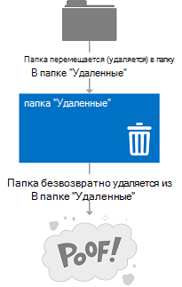

# Удаление элементов с помощью веб-служб Exchange в ExchangeDeleting items by using EWS in Exchange

Узнайте, как использовать управляемый API EWS или веб-службах Exchange для удаления элементов, либо при перемещении их в папку Удаленные или в корзину.Find out how you can use the EWS Managed API or EWS in Exchange to delete items either by moving them to the Deleted Items folder or to the dumpster.
  
Вы когда-либо обратились самостоятельно является различие между перемещение элементов папки «Удаленные», а также сдвиг их в корзину?Have you ever asked yourself what the difference is between moving items to the Deleted Items folder, and moving them to the dumpster? Может быть интересно различные варианты для обработки удаленных элементов и как реализовать эти параметры в приложении.You might be curious about the different options for handling deleted items and how to implement those options in your application. Веб-служб Exchange (EWS) включает в себя три варианта для обработки удаленных элементов.Exchange Web Services (EWS) includes three options for handling deleted items. В этой статье будет надеюсь снимите все путаницы, следует подумать о различиях между ними.This article will hopefully clear up any confusion you might have about the differences between them.
  
## Удаление элементов - параметры?Deleting items - what are my options?

Прежде чем можно понять общий альбомная для удаления элементов, важно понять разницу между следующее:Before you can understand the overall landscape for deleting items, it's important to recognize the difference between the following:
  
- Папки «Удаленные» — при удалении элементов в почтовом ящике, это куда они.The Deleted Items folder - When you delete items in a mailbox, this is where they go.
    
- Корзина (также называемого папка элементов для восстановления) — при удалении элементов из почтового ящика, это куда они.The dumpster (aka the Recoverable Items folder) - When you remove items from a mailbox, this is where they go.
    
Рисунки 1 и 2 показано, как выглядит процесс удаления элементов и папок в почтовом ящике.Figures 1 and 2 show what the deletion process looks like for items and folders in a mailbox. 

**На рисунке 1. Процесс удаления элементов из почтового ящика****Figure 1. Process for deleting items from a mailbox**

 

**На рисунке 2. Процесс удаления папки из почтового ящика****Figure 2. Process for deleting folders from a mailbox**

   
Можно удалить элементов и папок тремя разными способами, в зависимости от того, как «постоянные», предоставляемых удаления быть.You can delete items and folders three different ways, depending on how "permanent" you would like the deletion to be.
  
**Таблица 1: Параметры для удаления элементов с помощью веб-служб Exchange****Table 1: Options for deleting items by using EWS**

|**Возможные варианты****Option**|**Что происходит****What happens**|
|:-----|:-----|
|Перемещение папки "Удаленные"Move to the Deleted Items folder    |Этот способ наименее постоянная удалять элементы.This is the least permanent way to delete items.  Это как выравнивание часть документ в корзины с на рабочем месте.This is like putting a piece of paper in the recycle bin by your desk. Можно легко отобразить его, если это необходимо.You can easily grab it if you need it again.  Можно использовать любые [операции удаления](deleting-items-by-using-ews-in-exchange.md#bk_howdoIdeleteitems) , который реализует переход на параметр папку Deleted Items для выполнения этого действия.You can use any [deletion operation](deleting-items-by-using-ews-in-exchange.md#bk_howdoIdeleteitems) that implements the move to the Deleted Items folder option to perform this action.  Также можно использовать [операцию MoveFolder](http://msdn.microsoft.com/library/c7233966-6c87-4a14-8156-b1610760176d%28Office.15%29.aspx) ( [Folder.Move()](http://msdn.microsoft.com/ru-ru/library/microsoft.exchange.webservices.data.folder.move%28v=exchg.80%29.aspx)) или [MoveItem операции](http://msdn.microsoft.com/library/dcf40fa7-7796-4a5c-bf5b-7a509a18d208%28Office.15%29.aspx) ( [Item.Move()](http://msdn.microsoft.com/ru-ru/library/microsoft.exchange.webservices.data.item.move%28v=exchg.80%29.aspx)) для перемещения элемента или папки для папки «Удаленные».You can also use the [MoveItem operation](http://msdn.microsoft.com/library/dcf40fa7-7796-4a5c-bf5b-7a509a18d208%28Office.15%29.aspx) ( [Item.Move()](http://msdn.microsoft.com/ru-ru/library/microsoft.exchange.webservices.data.item.move%28v=exchg.80%29.aspx)) or the [MoveFolder operation](http://msdn.microsoft.com/library/c7233966-6c87-4a14-8156-b1610760176d%28Office.15%29.aspx) ( [Folder.Move()](http://msdn.microsoft.com/ru-ru/library/microsoft.exchange.webservices.data.folder.move%28v=exchg.80%29.aspx)) to move an item or folder to the Deleted Items folder.    |
|Обратимым удалениемSoft delete    |Перемещено в папку Удаленные элементы в корзине.The item is moved to the Deletions folder in the dumpster.  Это как очистите корзину в curbside контейнер.This is like emptying your recycle bin into your curbside container. Можно получить доступ элемент, если требуется, это лишь немного сложнее.You can still access the item if you need to, it's just a little harder.    Дополнительные сведения о корзины (также называемая папки элементов для восстановления) и сценарии, такие как обнаружение электронных данных или судебного удержания, ознакомьтесь с разделом [Папки восстанавливаемых элементов](http://technet.microsoft.com/ru-ru/library/ee364755%28v=exchg.150%29.aspx) на сайте TechNet.For more about the dumpster (also called the Recoverable Items folder) and scenarios such as eDiscovery or litigation holds, see [Recoverable Items Folder](http://technet.microsoft.com/ru-ru/library/ee364755%28v=exchg.150%29.aspx) on TechNet.  Программных удалений не рекомендуется для приложений, предназначенных для Exchange 2007.Soft deletions aren't recommended for applications that target Exchange 2007. В Exchange 2007, использования программных удалений обрабатываются параметр немного на элемент, чтобы указать, что он перемещается в корзину на неопределенное время.In Exchange 2007, soft deletions are handled by setting a bit on the item to indicate that it will be moved to the dumpster at an unspecified time.  Обходы обратимым удалением или поиск элементов, которые были программных удален с помощью [операции FindItem](http://msdn.microsoft.com/library/ebad6aae-16e7-44de-ae63-a95b24539729%28Office.15%29.aspx), не поддерживается в Exchange Online, Exchange Online как часть Office 365 и версии Exchange, начиная с Exchange 2010.Soft delete traversals, or searches of items that have been soft deleted via the [FindItem operation](http://msdn.microsoft.com/library/ebad6aae-16e7-44de-ae63-a95b24539729%28Office.15%29.aspx), are not supported in Exchange Online, Exchange Online as part of Office 365, and versions of Exchange starting with Exchange 2010.    **Примечание**: папок Мягкая удалить невозможно.**NOTE**:  Folders cannot be soft deleted.           |
|Окончательного удаленияHard delete    |Окончательно удалить элемент или папку.The item or folder is permanently deleted.  Удаленные элементы помещаются в папку удаляет из корзины.Hard-deleted items are placed in the Purges folder of the dumpster. Это, как и когда утилизации грузовик приводит к очистке curbside recycle контейнера.This is like when the recycling truck empties your curbside recycle container. Элементы, которые не были доступны из клиента электронной почты как Outlook или Outlook Web App и при отсутствии удержания установленный для почтового ящика элементы будут окончательно удалены после определенного периода времени.The items cannot be accessed from an email client like Outlook or Outlook Web App, and, unless there is a hold set on the mailbox, the items will be permanently deleted after a set period of time.  Можно получить дополнительные о хранение объектов в статье [Настройка параметре хранение удаленных записей и восстанавливаемых элементов квот](http://technet.microsoft.com/ru-ru/library/ee364752%28v=exchg.150%29.aspx).You can read more about item retention in the article [Configure Deleted Item Retention and Recoverable Items Quotas](http://technet.microsoft.com/ru-ru/library/ee364752%28v=exchg.150%29.aspx).  **Примечание**: папки не размещаются в папке удаляет при серьезный удаляются.**NOTE**:  Folders are not placed in the Purges folder when they are hard deleted. Удаленных папок, удаляются из почтового ящика.Hard-deleted folders are removed from the mailbox.  |
   
Перемещение папки «Удаленные» и параметры окончательного удаления транзакций, что означает, что время завершения вызова веб-службы, элемент был перемещен для папки «Удаленные» или корзины.The move to the Deleted Items folder and the hard delete options are transactional, which means that by the time the web service call finishes, the item has been moved to the Deleted Items folder or the dumpster.
  
Помогут вам лучше понять экосистеме папки, которые используются для хранения удаленных элементов на следующем рисунке показана что иерархии папок, которые могут содержать удаленных элементов.To help you better understand the ecosystem of folders that are used to store deleted items, the following figure shows the hierarchy of folders that can contain deleted items. Имена папок, как они отображаются в тип схемы **DistinguishedFolderIdNameType** или перечисление **WellKnownFolderName** в управляемый API веб-служб Exchange.The folder names are as they appear in the **DistinguishedFolderIdNameType** schema type, or the **WellKnownFolderName** enumeration in the EWS Managed API. 
  
**На рисунке 3. Иерархия папок, содержащих "Удаленные"****Figure 3. Hierarchy of folders that contain deleted items**

  
**В таблице 2: Папок, содержащих удаленных элементов****Table 2: Folders that contain deleted items**

|**Имя папки****Folder name**|**Представлены в****Introduced in**|**Описание****Description**|
|:-----|:-----|:-----|
|deleteditemsdeleteditems    |Exchange 2007Exchange 2007    |По умолчанию папки "Удаленные".The default Deleted Items folder. Элементы остаются в этой папке до их или жестко удаленные или пока период хранения превышена.Items remain in this folder until they are soft- or hard-deleted or until a retention period has been exceeded. Затем они перемещаются в папку в корзину.Then they are moved to a folder in the dumpster. Удаленные папки помещаются в папку «Удаленные», и время, когда он или жестко удаленные, они будут окончательно удалены из почтового ящика и, восстановить невозможно.Deleted folders are placed in the Deleted Items folder, and when they are soft- or hard-deleted, they are permanently removed from the mailbox and are not recoverable.    |
|recoverableitemsrootrecoverableitemsroot    |Exchange 2010Exchange 2010    |В корневой каталог корзины, или папки элементов для восстановления.The root of the dumpster, or the Recoverable Items folder. Корзины доступ был реализован в веб-службах Exchange 2010.Dumpster access was implemented in EWS in Exchange 2010. Отображаемое имя для этой папки — «Элементов для восстановления».The display name for this folder is "Recoverable Items".    |
|recoverableitemsdeletionsrecoverableitemsdeletions    |Exchange 2010Exchange 2010    |Основной корзины папок для почтового ящика.The main dumpster folder for a mailbox. Удаленные элементы и элементы перемещаются из папки "Удаленные" политикой хранения помещаются в этой папке.Soft-deleted items and items moved from the Deleted Items folder by a retention policy are placed in this folder. Отображаемое имя для этой папки — «Удаление».The display name for this folder is "Deletions".    |
|recoverableitemsversionsrecoverableitemsversions    |Exchange 2010Exchange 2010    |Где хранятся старые версии элемента.Where older versions of an item are stored. Старые версии элемента создаются при обновлении элемента.Old versions of an item are created when an item is updated. Черновых версий элемента не сохраняются в этой папке.Draft item versions are not saved to this folder. Отображаемое имя этой папки — «Версии».The display name of this folder is "Versions".    |
|recoverableitemspurgesrecoverableitemspurges    |Exchange 2010Exchange 2010    |Где хранятся элементы, удаленные из папки "Удаленные элементы".Where items that are removed from the Deletions folder are stored. Все элементы хранения удаленных перемещаются в эту папку.All store hard-deleted items are moved to this folder. Отображаемое имя для этой папки — «Удаление».The display name for this folder is "Purges".    |
|archiveddeletedtitemsarchiveddeletedtitems    |Exchange 2010Exchange 2010    |По умолчанию папки "Удаленные" для архивного почтового ящика.The default Deleted Items folder for an archive mailbox.    |
|archiverecoverablesitemsrootarchiverecoverablesitemsroot    |Exchange 2010Exchange 2010    |Корневой корзины папок для архивного почтового ящика.The root dumpster folder for an archive mailbox. Архивные элементы, удаленные перемещаются в папке в этой папке.Archived items that are soft-deleted are moved to a subfolder in this folder.    |
|archiverecoverableitemsdeletionsarchiverecoverableitemsdeletions    |Exchange 2010Exchange 2010    |Основной корзины папок для архивного почтового ящика.The main dumpster folder for an archive mailbox. Архивируются элементы помещаются в корзину помещаются здесь.Archived items moved to the dumpster are placed here.    |
|archiverecoverableitemsversionsarchiverecoverableitemsversions    |Exchange 2010Exchange 2010    |Где хранятся старые версии архивных элементов.Where older versions of archived items are stored.    |
|archiverecoverableitemspurgesarchiverecoverableitemspurges    |Exchange 2010Exchange 2010    |Где элементов, которые удаляется из архива удалений папки в корзине хранятся.Where items that are hard-deleted from the archive Deletions folder in the dumpster are stored. Все элементы-удаления хранилища архивации перемещаются в эту папку.All store hard-deleted archived items are moved to this folder.    |
   
## Удаление элементовHow do I delete items?

Удалить, выполните одну из следующих значений, чтобы указать, следует ли переместить элемент папки «Удаленные» или выполнить мягкое или жестко:Use one of the following to indicate whether to move an item to the Deleted Items folder or perform a soft delete or a hard delete:
  
- **DisposalType** простой тип, при использовании веб-служб Exchange для доступа к Exchange.The **DisposalType** simple type, if you use EWS to access Exchange. 
    
- [Перечисление DeleteMode](http://msdn.microsoft.com/ru-ru/library/exchange/microsoft.exchange.webservices.data.deletemode%28v=exchg.80%29.aspx), если используется управляемый API веб-служб Exchange.The [DeleteMode enumeration](http://msdn.microsoft.com/ru-ru/library/exchange/microsoft.exchange.webservices.data.deletemode%28v=exchg.80%29.aspx), if you use the EWS Managed API.
    
Количество различных операций веб-служб Exchange или управляемый API EWS методы можно использовать для удаления элементов и папок из почтового ящика.You can use a number of different EWS operations or EWS Managed API methods to delete items and folders from a mailbox.
  
**В таблице 3: Операции веб-служб Exchange и методы управляемый API веб-служб Exchange для удаления элементов****Table 3: EWS operations and EWS Managed API methods for deleting items**

|**Операция служб EWS****EWS operation**|**Метод управляемого API EWS****EWS Managed API method**|**Представлены в****Introduced in**|**Назначение****What it does**|
|:-----|:-----|:-----|:-----|
|[Операция DeleteFolderDeleteFolder operation](http://msdn.microsoft.com/library/b0f92682-4895-4bcf-a4a1-e4c2e8403979%28Office.15%29.aspx)   |[Метод Folder.DeleteFolder.Delete method](http://msdn.microsoft.com/ru-ru/library/exchange/microsoft.exchange.webservices.data.folder.delete%28v=exchg.80%29.aspx)   |Exchange 2007Exchange 2007    |Удаление папки из почтового ящика.Deletes folders from a mailbox. С помощью веб-служб Exchange можно пакетного удаление папок.With EWS, you can batch delete folders. С помощью управляемый API веб-служб Exchange можно удалить только одной папке на вызов.With the EWS Managed API, you can only delete a single folder per call.    |
|[Операция DeleteItemDeleteItem operation](http://msdn.microsoft.com/library/3e26c416-fa12-476e-bfd2-5c1f4bb7b348%28Office.15%29.aspx)   |[Метод Item.DeleteItem.Delete method](http://msdn.microsoft.com/ru-ru/library/exchange/microsoft.exchange.webservices.data.item.delete%28v=exchg.80%29.aspx)  [Метод ExchangeService.DeleteItemsExchangeService.DeleteItems method](http://msdn.microsoft.com/ru-ru/library/exchange/microsoft.exchange.webservices.data.exchangeservice.deleteitems%28v=exchg.80%29.aspx)   |Exchange 2007Exchange 2007    |Удаление элементов из почтового ящика.Deletes items from a mailbox.    |
|[Операция EmptyFolderEmptyFolder operation](http://msdn.microsoft.com/library/98161486-e2f2-480f-8d5d-708ba81b208a%28Office.15%29.aspx)   |[Метод Folder.EmptyFolder.Empty method](http://msdn.microsoft.com/ru-ru/library/exchange/microsoft.exchange.webservices.data.folder.empty%28v=exchg.80%29.aspx)   |Exchange 2010Exchange 2010    |Удаляет все элементы в папке, а при необходимости, удаляет все вложенные папки в папке.Deletes all the items in a folder, and, optionally, deletes all subfolders in a folder.    |
|[Операция ApplyConversationActionApplyConversationAction operation](http://msdn.microsoft.com/library/73d7943d-d361-4f8b-9948-d85f886efa1a%28Office.15%29.aspx)   |[Метод Conversation.EnableAlwaysDeleteItemsConversation.EnableAlwaysDeleteItems method](http://msdn.microsoft.com/ru-ru/library/exchange/microsoft.exchange.webservices.data.conversation.enablealwaysdeleteitems%28v=exchg.80%29.aspx)  [Метод Conversation.DeleteItemsConversation.DeleteItems method](http://msdn.microsoft.com/ru-ru/library/exchange/microsoft.exchange.webservices.data.conversation.deleteitems%28v=exchg.80%29.aspx)   |Exchange 2010Exchange 2010    |Задание удаления обработки действий в сообщениях электронной почты в беседе, чтобы они будут удалены.Sets a delete processing action on email messages in a conversation so that they are deleted.    |
|[Операция DeleteUserConfigurationDeleteUserConfiguration operation](http://msdn.microsoft.com/library/93e44690-be2d-4fdb-96a8-4ded3c193aed%28Office.15%29.aspx)   |[Метод UserConfiguration.DeleteUserConfiguration.Delete method](http://msdn.microsoft.com/ru-ru/library/exchange/microsoft.exchange.webservices.data.userconfiguration.delete%28v=exchg.80%29.aspx)   |Exchange 2010Exchange 2010    |Удаляет папку связанных элементов и переводит его в корзину.Deletes a folder associated item and moves it to the dumpster.    |
|[CreateItem OperationCreateItem operation](http://msdn.microsoft.com/library/78a52120-f1d0-4ed7-8748-436e554f75b6%28Office.15%29.aspx)   |[Метод Appointment.AcceptAppointment.Accept method](http://msdn.microsoft.com/ru-ru/library/microsoft.exchange.webservices.data.appointment.accept%28v=exchg.80%29.aspx)   [Метод Appointment.AcceptTentativelyAppointment.AcceptTentatively method](http://msdn.microsoft.com/ru-ru/library/microsoft.exchange.webservices.data.appointment.accepttentatively%28v=exchg.80%29.aspx)  [Метод Appointment.CancelMeetingAppointment.CancelMeeting method](http://msdn.microsoft.com/ru-ru/library/microsoft.exchange.webservices.data.appointment.cancelmeeting%28v=exchg.80%29.aspx)  [Appointment.DeclineAppointment.Decline](http://msdn.microsoft.com/ru-ru/library/microsoft.exchange.webservices.data.appointment.decline%28v=exchg.80%29.aspx)  [Метод MeetingRequest.AcceptMeetingRequest.Accept method](http://msdn.microsoft.com/ru-ru/library/microsoft.exchange.webservices.data.meetingrequest.accept%28v=exchg.80%29.aspx)  [Метод MeetingRequest.AcceptTentativelyMeetingRequest.AcceptTentatively method](http://msdn.microsoft.com/ru-ru/library/microsoft.exchange.webservices.data.meetingrequest.accepttentatively%28v=exchg.80%29.aspx)  [Метод MeetingRequest.DeclineMeetingRequest.Decline method](http://msdn.microsoft.com/ru-ru/library/microsoft.exchange.webservices.data.meetingrequest.decline%28v=exchg.80%29.aspx)   |Exchange 2007Exchange 2007    |Косвенно перемещает элемент папки «Удаленные» каждый раз, когда отправляется ответ на приглашения на собрание или установлено ответ для встречи.Indirectly moves an item to the Deleted Items folder whenever a response to a meeting request is sent or the response is set on the appointment.  Тип удаления установлено на этой операции.The deletion type is not set on this operation. Сообщения собрания перемещаются папки "Удаленные", когда объект ответа успешно обработан службой.The meeting messages are moved to the Deleted Items folder when a response object is successfully processed by the service.    |
   
Перемещение элементов папки «Удаленные» можно также с помощью правила папки «Входящие».You can also move items to the Deleted Items folder by using Inbox rules. Например можно [создавать правила](inbox-management-and-ews-in-exchange.md) , для которого действие удаления.For example, you can [create rules](inbox-management-and-ews-in-exchange.md) that have a delete action. 
  
Некоторые замечания об удалении элементов:Some points to note about deleting items:
  
- Удаление вхождения повторяющегося элемента не вызывает переход в папку «Удаленные» или корзины.Deleting an occurrence of a recurring item does not trigger a move to the Deleted Items folder or the dumpster. В результате обновление для повторяющегося элемента главных ряда повторяющейся.This results in an update to the recurring master item of the recurring series.
    
- Папки по умолчанию нельзя удалить из почтового ящика.You cannot delete default folders from the mailbox.
    
- Отменить удаление встречи или сообщения о собраниях, например, приглашений на собрания, а или обновлений встреч.Avoid deleting meetings or meeting messages, such as meeting requests and or meeting updates. Вместо этого ответ на эти элементы с помощью объектов ответа.Instead, respond to these items by using response objects. Таким образом, элементы календаря связанного обновляются в соответствии с действиями пользователя ответчика или организатора.This way, the associated calendar items are updated to reflect the responder's or organizer's actions.
    
- Ключ изменения элемента не обновляются при перемещении элемента в папку Deleted Items или удалять.An item's change key is not updated when the item is moved to the Deleted Items or Deletions folder.
    
- При выполнении жестко удаления элемента и затем вызвать [SyncFolderHierarchy операции](http://msdn.microsoft.com/library/b31916b1-bc6c-4451-a475-b7c5417f752d%28Office.15%29.aspx) или метод управляемый API EWS [SyncFolderHierarchy](http://msdn.microsoft.com/ru-ru/library/microsoft.exchange.webservices.data.exchangeservice.syncfolderhierarchy%28v=exchg.80%29.aspx) или [SyncFolderItems операции](http://msdn.microsoft.com/library/7f0de089-8876-47ec-a871-df118ceae75d%28Office.15%29.aspx) или [SyncFolderItems](http://msdn.microsoft.com/ru-ru/library/microsoft.exchange.webservices.data.exchangeservice.syncfolderitems%28v=exchg.80%29.aspx) метода, изменение, **Удаление** будут возвращены запись.If you perform a hard delete on an item and then call a [SyncFolderHierarchy operation](http://msdn.microsoft.com/library/b31916b1-bc6c-4451-a475-b7c5417f752d%28Office.15%29.aspx) or [SyncFolderHierarchy](http://msdn.microsoft.com/ru-ru/library/microsoft.exchange.webservices.data.exchangeservice.syncfolderhierarchy%28v=exchg.80%29.aspx) EWS Managed API method, or a [SyncFolderItems operation](http://msdn.microsoft.com/library/7f0de089-8876-47ec-a871-df118ceae75d%28Office.15%29.aspx) or [SyncFolderItems](http://msdn.microsoft.com/ru-ru/library/microsoft.exchange.webservices.data.exchangeservice.syncfolderitems%28v=exchg.80%29.aspx) method, a **Delete** change entry will be returned. При перемещении элемента в папку Deleted Items возвращается записи изменений **обновления** .If you move an item to the Deleted Items folder, an **Update** change entry is returned. Это, так как элемент или папку, будут иметь новое значение свойства [ParentFolderId](http://msdn.microsoft.com/library/258f4b1f-367e-4c7d-9c29-eb775a2398c7%28Office.15%29.aspx) .This is because the item or folder will have a new [ParentFolderId](http://msdn.microsoft.com/library/258f4b1f-367e-4c7d-9c29-eb775a2398c7%28Office.15%29.aspx) property value. [Более подробные сведения о синхронизации](mailbox-synchronization-and-ews-in-exchange.md) при синхронизации удаленных элементов является частью сценария.[Read more about synchronization](mailbox-synchronization-and-ews-in-exchange.md) if synchronizing deleted items is part of your scenario. 
    
## Дополнительные сведения о удаление элементовFind out more about deleting items

- [По запросу уведомления для событий, связанных с удаления почтового ящика веб-служб Exchange в ExchangePull notifications for EWS deletion-related mailbox events in Exchange](pull-notifications-for-ews-deletion-related-mailbox-events-in-exchange.md)
    
- [Обработка ошибок, связанных с удаления в веб-служб Exchange в ExchangeHandling deletion-related errors in EWS in Exchange](handling-deletion-related-errors-in-ews-in-exchange.md)
    
## См. такжеSee also

- [Папки и элементы в веб-службах ExchangeFolders and items in EWS in Exchange](folders-and-items-in-ews-in-exchange.md)    
- [Разработка клиентов веб-служб для ExchangeDevelop web service clients for Exchange](develop-web-service-clients-for-exchange.md)    
- [Папка элементов для восстановленияRecoverable Items Folder](http://technet.microsoft.com/ru-ru/library/ee364755.aspx)    
- [Функцию восстановления отдельных элементов в Exchange Server 2010Single Item Recovery in Exchange Server 2010](http://blogs.technet.com/b/exchange/archive/2009/09/25/3408389.aspx#_Single_Item_Recovery)    
- [Exchange 2013: Удаление повторяющихся серии программными средствами с серверов ExchangeExchange 2013: Delete a recurring series programmatically from Exchange servers](http://code.msdn.microsoft.com/exchange/Exchange-2013-Delete-a-e1c7b89d)    
- [Exchange 2013: Удаление задачи из учетной записи на серверах Exchange программным путемExchange 2013: Delete tasks from an account on Exchange servers programmatically](http://code.msdn.microsoft.com/exchange/Exchange-2013-Delete-tasks-13824637)    
- [Exchange 2013: Очистите папки на серверах Exchange программным путемExchange 2013: Empty folders on Exchange servers programmatically](http://code.msdn.microsoft.com/exchange/Exchange-2013-Empty-6487df37)    
- [Exchange 2013: Удаление папок программными средствами с серверов ExchangeExchange 2013: Delete folders programmatically from Exchange servers](http://code.msdn.microsoft.com/exchange/Exchange-2013-Delete-aa1a5823)    
- [Exchange 2013: Удаление много элементов программными средствами с серверов ExchangeExchange 2013: Delete many items programmatically from Exchange servers](http://code.msdn.microsoft.com/exchange/Exchange-2013-Delete-many-064f8760)    
- [Exchange 2013: Удаление контактов программными средствами с серверов ExchangeExchange 2013: Delete contacts programmatically from Exchange servers](http://code.msdn.microsoft.com/exchange/Exchange-2013-Delete-3b8b0640)    
- [Удаление встреч и отмены собраний с помощью веб-служб Exchange в ExchangeDelete appointments and cancel meetings by using EWS in Exchange](how-to-delete-appointments-and-cancel-meetings-by-using-ews-in-exchange.md)    
- [Управление параметрами сохраняемого приложения с помощью веб-служб Exchange в ExchangeManage persistent application settings by using EWS in Exchange](how-to-manage-persistent-application-settings-by-using-ews-in-exchange.md)
    

