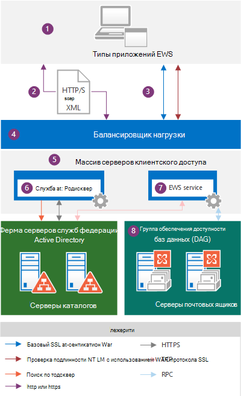
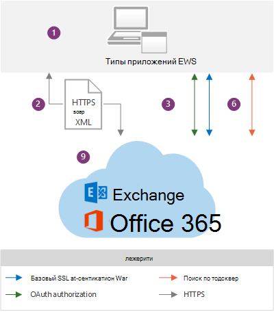

# Приложения EWS и архитектура Exchange

Узнайте, как работает служба EWS в архитектуре Exchange, и Узнайте, какие протоколы EWS использует.
  
Веб-службы Exchange (EWS) — это межплатформенный API, позволяющий приложениям получать доступ к элементам почтовых ящиков, собраниям и контактам из Exchange Online, Exchange Online в составе Office 365 или локальной версии Exchange, начиная с Exchange Server 2007. [Приложения EWS](ews-application-types.md) могут получать доступ к элементам почтовых ящиков локально или удаленно, отправляя запрос в XML-сообщении на основе SOAP. Сообщение SOAP внедряется в HTTP-сообщение при отправке между приложением и сервером, что означает, что если ваше приложение может отправлять XML-данные через HTTP, для доступа к Exchange можно использовать EWS. 
  
## Обзор архитектуры Exchange

На следующих схемах показаны методы проверки подлинности и пути для обмена данными, используемые приложениями EWS при взаимодействии с Exchange 2013 и Exchange Online. С точки зрения приложения EWS пути связи идентичны, и методы проверки подлинности незначительно различаются. Основное отличие заключается в том, что вы используете внутренний сервер Exchange.
  
**Рис. 1. Приложение EWS и локальная архитектура Exchange**

  
На рисунке 2 показаны одни и те же пути связи, показанные на рисунке 1, которые используются приложениями EWS при взаимодействии с Exchange Online.
  
**Рис. 2. Приложение EWS и архитектура Exchange Online**

  
Ниже приведены компоненты, показанные на схемах.
  
1. Приложение EWS — это может быть [клиент, портал или приложение-служба](ews-application-types.md) , которое может быть установлено на клиенте или на локальном сервере клиентского доступа Exchange. Если вы используете управляемый API EWS для разработки приложения EWS, сборки управляемого API EWS необходимо установить на клиенте и [перераспределить в приложении](redistribution-requirements-for-the-ews-managed-api.md).
    
2. XML-сообщение SOAP — XML-сообщение в конверте SOAP, внедренное в сообщение HTTP/S, которое соответствует файлу Services. WSDL на сервере клиентского доступа. Протокол HTTPS рекомендуется для локальной организации Exchange и необходим для Exchange Online. 
    
3. Методы проверки подлинности — сообщения EWS включают основную проверку подлинности Windows (встроенную проверку подлинности Windows) или сведения проверки подлинности OAuth в составе полезных данных HTTP. 
    
4. Подсистема балансировки нагрузки — подсистема балансировки нагрузки распространяет сообщение на сервер клиентского доступа в массиве серверов клиентского доступа. Этот компонент виден только в локальной архитектуре Exchange.
    
5. Массив серверов клиентского доступа — серверы клиентского доступа организованы в группу с балансировкой нагрузки, называемую массивом серверов клиентского доступа. Отдельные серверы клиентского доступа обеспечивают проверку подлинности, ограниченное перенаправление и прокси-службы. Сами серверы клиентского доступа не выполняют отрисовку данных, а данные не помещаются в очередь или не хранятся на сервере клиентского доступа — он является тонким и без состояний; Он просто проверяет подлинность запроса, выполняет поиск автообнаружения, а затем передает прокси-серверу запрос на сервер почтовых ящиков. Сервер клиентского доступа поддерживает связь 1:1 с сервером почтовых ящиков, на котором размещаются данные пользователя. Протокол HTTP (защищенный через SSL с помощью самозаверяющего сертификата) используется между сервером клиентского доступа и сервером почтовых ящиков. Этот компонент виден только в локальной архитектуре Exchange.
    
6. Служба автообнаружения — служба автообнаружения выполняет обнаружение службы при доступе к доменным службам Active Directory (AD DS), чтобы получить версию почтового ящика и расположение сервера почтовых ящиков, на котором размещается активная копия данных пользователя.
    
7. Служба EWS — служба EWS описана тремя файлами: Services. WSDL, messages. xsd и Types. xsd, а также сборками управляемого API EWS. Services. WSDL описывает контракт между клиентом и сервером, messages. xsd определяет сообщения запроса и ответа SOAP, а Types. xsd определяет элементы, используемые в сообщениях SOAP. Messages. xsd и Types. xsd всегда содержат последние версии схемы, хотя существуют более ранние версии схемы. Обратите внимание, что Services. WSDL, messages. xsd и Types. xsd становятся доступными на сервере клиентского доступа, но фактически не используются для проверки схемы, они предоставляются только для справки. Сборки управляемого API EWS предоставляются для серверных клиентских приложений EWS и развертываются во всех ролях Exchange Server, а не только на серверах клиентского доступа. Этот компонент виден только в локальной архитектуре Exchange.
    
    Доступность функций основана на версии схемы EWS, для которой предназначено приложение. Так как схемы EWS поддерживают обратную и обратную совместимость, при создании приложения, предназначенного для более ранней версии схемы, например Exchange 2007 с пакетом обновления 1 (SP1), ваше приложение также будет работать с более поздней версией схемы, такой как служба Exchange 2010 с пакетом обновления 2 (SP2), а также Exchange Online. Так как функции и их обновления зависят от схемы, рекомендуем использовать наиболее раннюю базу общего кода, которая относится к тем возможностям EWS, которые нужно реализовать в клиентском приложении. Многие приложения могут работать с версией Exchange2007_SP1, потому что схема Exchange 2007 с пакетом обновления 1 содержит почти все основные возможности Exchange для работы с элементами и папками в хранилище Exchange. Для получения дополнительных сведений обратитесь к [компонентам клиента EWS](ews-client-design-overview-for-exchange.md#EWSFeatures).
    
8. Группа обеспечения доступности баз данных — серверы почтовых ящиков организованы в группу обеспечения доступности баз данных с высокой доступностью, которая может быть развернута в одном или нескольких центрах обработки данных. Сервер почтовых ящиков содержит базу данных почтовых ящиков и обрабатывает все действия для активных почтовых ящиков на этом сервере. Все компоненты, которые обрабатывают, отображают и хранят данные, находятся на сервере почтовых ящиков. Клиенты не подключаются непосредственно к серверу почтовых ящиков; все подключения обрабатываются сервером клиентского доступа. Этот компонент виден только в локальной архитектуре Exchange.
    
9. Exchange Online и Exchange Online в составе Office 365 — решение для обмена сообщениями, которое предоставляет функции Exchange в виде облачной службы.
    
Когда приложение EWS запрашивает сведения из хранилища Exchange, создается и отправляется на сервер Exchange сообщение XML-запроса, которое соответствует стандарту SOAP. Когда сервер Exchange получает запрос, он проверяет учетные данные, предоставляемые клиентом, и автоматически анализирует XML для запрошенных данных. Затем сервер создает ответ SOAP, содержащий XML-данные, которые представляют запрошенные строго типизированные объекты и их свойства. XML-данные отправляются обратно в приложение в ответе HTTP. Затем приложение десериализует XML и использует данные для выполнения более новые строго типизированные объекты.
  
## Протоколы и стандарты, которые должны поддерживаться приложениями EWS

Для обмена данными с сервером Exchange приложения EWS должны поддерживать указанные ниже протоколы и стандарты.
  
**Таблица 1. QP**

|**Protocol** (Протокол)|**Использование**|
|:-----|:-----|
|HTTP/S    |Позволяет приложениям EWS получать доступ к данным базы данных Exchange по сети независимо от того, находится ли клиент в Интернете или интрасети.    |
|SOAP 1,0    |Формирует оболочку вокруг полезных данных обмена сообщениями. В веб-службах EWS протокол SOAP реализован с помощью различных частей конверта SOAP для поддержки различных функциональных возможностей. Заголовок SOAP используется для олицетворения и предоставления данных управления версиями. Основной текст SOAP предоставляет сведения о выполняемой операции и данных, которые передаются в операцию. SOAP использует WSDL для описания операций, которые необходимо вызвать.    |
|WSDL 1,0    |Описывает привязки, операции и свойства, используемые для вызова операций EWS, в файле Services. WSDL. Этот файл вместе с файлами схемы, на которые имеются ссылки, включает контракт между приложением EWS и сервером Exchange Server и часто используется вместе с инструментами, зависящими от поставщика, для создания приложений для определенных платформ. Файл WSDL находится в виртуальном каталоге EWS, который находится в корневом каталоге веб-сайта.    |
|Протокол TLS (Transport Layer Security)/ССЛ    |Обеспечивает безопасную веб-связь в Интернете или интрасети. Протокол TLS позволяет приложениям проверять подлинность серверов или, при необходимости, серверы для проверки подлинности приложений EWS. Он также предоставляет канал безопасности, шифруя связь. Протокол TLS является более последней версией протокола SSL.    |
|XML/XSD    |Предоставляет универсальный формат сообщений для обмена данными между сервером Exchange Server и клиентом. XML обеспечивает сложные данные базы данных Exchange для клиентских приложений, но в определенной структуре. Красота XML заключается в том, что он обеспечивает обмен данными даже в том случае, если приложение EWS и сервер не используют общую платформу.    |
   
Кроме того, приложения EWS должны поддерживать следующие стандарты проверки подлинности:
  
- Обычная проверка подлинности по протоколу SSL для приложений, предназначенных для локального сервера Exchange Online или Exchange.
    
- Проверка подлинности NTLM через SSL для приложений, поддерживающих локальную систему Exchange.
    
- Аутентификация маркеров OAuth 2,0 для доверенных партнерских приложений и взаимодействия с Lync Server 2013 и SharePoint Server 2013.
    
## См. также

- [Начало работы с веб-службами Exchange](start-using-web-services-in-exchange.md)
    
- [Типы приложений EWS](ews-application-types.md)
    
- [Общие сведения о разработке клиента EWS для Exchange](ews-client-design-overview-for-exchange.md)
    

