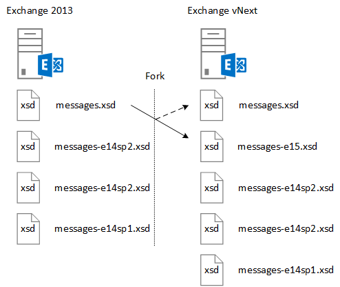

# <a name="ews-schema-versions-in-exchange"></a>Версии схемы EWS в Exchange

Узнайте о схеме EWS и о том, как разрабатывать приложение для работы с ним, а также функции, доступные с каждой версией схемы, и как схема соотносится с версией службы Exchange.
  
Схема EWS определяет структуры данных, которые могут быть отправлены и возвращены в Exchange. Каждая новая версия Exchange, содержащая существенные изменения в функциях EWS, будет содержать новую схему. EWS и схема EWS в обратном направлении, а в некоторых случаях пересылка совместимых приложений, разработанных для более ранних версий EWS, будет работать, в большинстве случаев, с более поздними версиями EWS, а приложения, нацеленные на более поздние версии EWS, будут работать при условии, что одна и та же функциональная возможность включена в предыдущую версию. В этой статье вы узнаете о роли схемы EWS, о том, как работает управление версиями схемы, отношение между версией схемы и версией службы, а также как разрабатывать приложение для работы с схемой EWS. 
  
## <a name="role-of-the-ews-schema"></a>Роль схемы EWS

Схема EWS выполняет следующие действия:
  
- Определяет набор функций, доступный для клиента. Клиент может получить список поддерживаемых версий схемы с помощью [службы АВТООБНАРУЖЕНИЯ](autodiscover-for-exchange.md)SOAP. После этого клиент может определить, к каким функциям он может получить доступ, так как каждая версия схемы представляет [набор функций EWS](ews-schema-versions-in-exchange.md#bk_features). Каждая новая схема, выпущенная для EWS, содержит элементы схемы из предыдущей версии, а также определения схемы для новых функциональных возможностей. Таким образом, EWS поддерживает приложения, предназначенные для более ранней версии EWS.
    
- Предоставляет общее описание контракта API. Этот контракт можно использовать для определения структур данных, которые могут быть отправлены и получены из Exchange.
    
- Предоставляет механизм управления версиями для отправки запросов. Сервер Exchange содержит все поддерживаемые версии схемы EWS в виртуальном каталоге. 
    
## <a name="designing-your-application-with-schema-version-in-mind"></a>Разработка приложения с использованием версии схемы

При проектировании приложения для работы с различными версиями схемы EWS учитывайте следующие моменты.
  
- Функции включения/выключения на основе версии схемы. Вы хотите сопоставить функциональные возможности клиента с версией схемы и, в некоторых случаях, с версией службы. Следующий пример вернет набор [свойств](https://msdn.microsoft.com/library/office/microsoft.exchange.webservices.data.propertyset%28v=exchg.80%29.aspx) на основе версии схемы и службы. 
    
  ```cs
  private static PropertySet InitPropertySetByVersion(ExchangeService service)
  {
      PropertySet props;
      // The schema version to target to access the NormalizedBody property 
      // is Exchange2013 or later. The server version to target to access the 
      // NormalizedBody property on an email is 15 or later, which 
      // equates to Exchange 2013.
      if (service.RequestedServerVersion >= ExchangeVersion.Exchange2013 &amp;&amp;
          service.ServerInfo.MajorVersion >= 15)
      {
          props = new PropertySet(EmailMessageSchema.NormalizedBody);
      }
      else
      {
          props = new PropertySet(EmailMessageSchema.Body);
      }
      return props;
  }
  ```

- Попросите попытаться указать версию схемы EWS, которая поддерживает необходимые функции. При этом клиент будет использовать большое количество потенциальных серверов Exchange. Это менее важно, если вы разрабатываете бизнес-приложение, предназначенное только для серверов вашей организации, но это очень важно, если вы создаете приложение для более широкой аудитории Exchange.
    
## <a name="features-by-schema-version"></a>Функции по версии схемы
<a name="bk_features"> </a>

Версии схемы, доступные для клиента, определены в простом типе **простом типе exchangeversiontype** , расположенном в схеме Types. xsd. **Простом типе exchangeversiontype** реализуется с помощью элемента [рекуестсерверверсион](https://msdn.microsoft.com/library/af4032d5-42b3-463e-9d0a-8236d78e5b75%28Office.15%29.aspx) . Элемент **рекуестсерверверсион** отправляется во всех ЗАПРОСах EWS, чтобы показать серверу, какая версия схемы предназначена для клиента. Это, в свою очередь, определяет набор функций, доступный для клиента. 
  
**Таблица 1: функции EWS по продуктам и версиям схемы**

|**Версия продукта**|**Связанная версия схемы**|**Компоненты**|
|:-----|:-----|:-----|
|Exchange Online  |Последняя версия схемы.  |Включает все компоненты в текущей версии Exchange, а также новые возможности, добавленные для клиентов Online. |
|Exchange 2013 SP1 |Exchange2013_SP1 | Включает все функции Exchange 2013.<br/><br/>Следующие функции были представлены в Exchange 2013 с пакетом обновления 1 (SP1): <ul><li>[Политика хранения почтовых ящиков](https://msdn.microsoft.com/library/office/microsoft.exchange.webservices.data.exchangeservice.setholdonmailboxes%28v=exchg.80%29.aspx) </li><li> [Предложение нового времени](how-to-propose-a-new-meeting-time-by-using-ews-in-exchange.md) </li><li>  Считывание обновлений уведомлений для [обновления](https://msdn.microsoft.com/library/office/dn600559%28v=exchg.80%29.aspx) и [удаления](https://msdn.microsoft.com/library/office/dn600557%28v=exchg.80%29.aspx) элементов  </li><li> Обновление [информации IRM](https://msdn.microsoft.com/library/office/microsoft.exchange.webservices.data.conversation.hasirm%28v=exchg.80%29.aspx) для бесед  </li></ul> |
|Exchange 2013   |Exchange2013   | Включает все возможности, представленные в Exchange 2007 и Exchange 2010. <br/><br/>Следующие функции были представлены в Exchange 2013:<ul><li>Архивация  </li><li>  Обнаружение электронных данных  </li><li>  Фиктивные пользователи  </li><li>  Политики хранения  </li><li>  Единое хранилище контактов  </li><li>  Фотографии пользователя  </li></ul> |
|Exchange 2010 с пакетом обновления 2 (SP2)   |Exchange2010_SP2 | Включает все возможности, представленные в Exchange 2010 с пакетом обновления 1 (SP1). <br/><br/>В Exchange 2010 с пакетом обновления 2 (SP2) были представлены следующие возможности:<ul><li>Получение истечения срока действия пароля  </li><li>  Точность значений даты и времени  </li><li>  Обновленные идентификаторы свойств контактов  </li><li>  Новые сценарии олицетворения  </li></ul> |
|Exchange 2010 с пакетом обновления 1 (SP1)  |Exchange2010_SP1   | Включает все функции, представленные в Exchange 2010. <br/><br/>Следующие функции были представлены в Exchange 2010 с пакетом обновления 1 (SP1):<ul><li>Создание, получение и изменение правил для папки "Входящие"  </li><li>  Программный доступ к архивному почтовому ящику  </li><li>  Действия с беседами  </li><li>  Просмотр уведомлений брандмауэра  </li><li>  Улучшенные функции администрирования  </li><li>  Улучшенная поддержка смешанных версий  </li><li>  Поддержка регулирования  </li><li>  Управление доступом приложений к EWS  </li><li>  Поддержка проверки подлинности сертификата клиента  </li></ul> |
|Exchange 2010  |Exchange2010   | Включает все возможности, представленные в Exchange 2007 с пакетом обновления 1. <br/><br/>Следующие функции были представлены в исходной версии Exchange 2010:<ul><li>Полный частный список рассылки  </li><li>  Объекты конфигурации пользователя  </li><li>  Элементы, связанные с папками  </li><li>  Отслеживание сообщений  </li><li>  Единая система обмена сообщениями  </li><li>  Автообнаружение SOAP  </li><li>  Поддержка расширенного часового пояса  </li><li>  Сведения о доступности ресурсов комнаты  </li><li>  Индексированный поиск  </li><li>  Доступ к корзине  </li><li>  Сведения о подсказках  </li></ul> |
|Exchange 2007 SP1   |Exchange2007_SP1  | Включает все функции, представленные в Exchange 2007. <br/><br/>Следующие функции были представлены в Exchange 2007 с пакетом обновления 1 (SP1):<ul><li>Управление делегированием  </li><li>  Разрешения для папок  </li><li>  Общедоступные папки  </li><li>  Размещение элементов  </li><li>  Преобразование идентификатора  </li></ul>|
|Exchange 2007  |Exchange2007 | Следующие функции были представлены в исходной версии Exchange 2007:<ul><li>Полный доступ к элементам, папкам и вложениям (создание, получение, обновление, удаление)  </li><li>  Доступность  </li><li>  Параметры "нет на месте"  </li><li>  Уведомления  </li><li>  Синхронизация  </li><li>  Разрешение имен  </li><li>  Расширение списка рассылки (DL)  </li><li>  Поиск  </li></ul> |
   
## <a name="relationship-between-the-ews-schema-and-the-service-version"></a>Связь между схемой EWS и версией службы
<a name="bk_features"> </a>

Версия схемы EWS связана с версией службы EWS, запущенной на сервере. Шаблон именования для схемы EWS связан с локальными версиями Exchange. Например, в первоначальном выпуске Exchange 2013 используется версия службы 15.00.0516.032 и имя схемы **Exchange2013**. Так как схема была обновлена для Exchange 2013, Exchange 2013 и Exchange Online с версией службы 15.00.0516.032 и более поздней версии имеют одинаковое имя версии для последней схемы. В более ранних версиях Exchange схема EWS не была обновлена с помощью накопительных обновлений (ранее именуемых сверткой). Но поскольку Exchange обновляется чаще всего для поддержки Exchange Online, накопительные обновления теперь содержат обновления схемы для EWS. Имена файлов схемы и название связанной версии схемы обновляются только с помощью пакетов обновления или основных выпусков локального сервера Exchange.
  
Несмотря на то, что схема EWS определяет контракт, в некоторых сценариях клиент может определить, как он должен взаимодействовать с этой службой. Изменения поведения служб, не отраженные в схеме, могут быть определены только версией службы, возвращенной во всех ответах EWS. Например, когда [общедоступные папки](public-folder-access-with-ews-in-exchange.md) были переработаны в Exchange 2013, операции, которые используются для перемещения и копирования общедоступных папок, изменились. Если вы разработали клиент для копирования общедоступных папок в Exchange 2010, вам потребуется обновить его, чтобы использовать различные операции, чтобы получить такой же результат в Exchange 2013. 
  
## <a name="how-the-ews-schema-is-updated"></a>Как обновляется схема EWS
<a name="bk_features"> </a>

Серверы Exchange с версиями Exchange, начиная с Exchange 2007, включают схему EWS в виртуальный каталог, на котором размещается служба EWS. Текущая версия схемы всегда представлена файлами Types. xsd и messages. xsd. На рисунке 1 показано, как разветвление схемы messages. XSD при разработке новой версии схемы. Перед добавлением новых функций копия исходных сообщений. XSD-схема включается и переименована, чтобы представить предыдущую версию схемы. Затем файл messages. xsd обновляется с описанием службы для новой версии.
  
**Рис. 1. Как обновляется схема EWS**


  
Перед обновлением схемы EWS для новой версии Текущая версия схемы разделяется и переименовывается с использованием следующего соглашения:
  
`<schemaname>-<majorserverversion><servicepack>.xsd`
  
Затем исходное имя файла представляет последнюю схему. Все новые функции добавляются в последнюю схему, за исключением обновлений и исправлений более ранних версий схемы. 
  
## <a name="see-also"></a>См. также

- [Версии схемы EWS в Exchange](ews-schema-versions-in-exchange.md) 
- [Автообнаружение в Exchange](autodiscover-for-exchange.md) 
- [Разработка клиентов веб-служб для Exchange](develop-web-service-clients-for-exchange.md)
    

