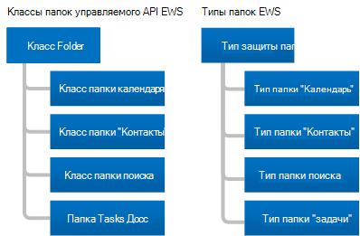
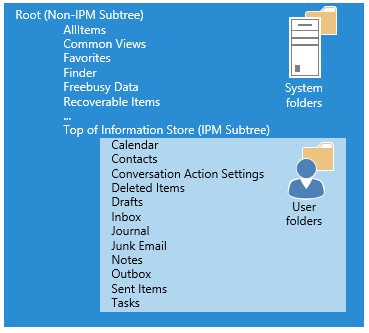

# Папки и элементы в веб-службах Exchange

Сведения о папках и элементах почтового ящика, а также о том, как они представляют собой управляемый API EWS или клиент EWS
  
Папки — это элемент организации почтового ящика Exchange. Папки могут содержать элементы почтового ящика, такие как сообщения электронной почты, контакты, встречи, собрания и задачи, а также другие папки. Exchange содержит различные типы папок, но типы папок похожи друг на друга. Основным различием между ними является тип элемента, который они содержат.
  
Однако элементы имеют уникальные типы. Каждый тип элемента имеет разный набор свойств или схем для определения. В этой статье мы расскажем о типах доступных папок и элементов, а также о различиях между ними.

## Folders

Все папки являются производными от одного базового класса или базового типа, класса [папки](https://msdn.microsoft.com/library/microsoft.exchange.webservices.data.folder%28v=EXCHG.80%29.aspx) в УПРАВЛЯЕМОМ API EWS или типа [папки](https://msdn.microsoft.com/library/812948d8-c7db-45ce-bb3a-77233a53a974%28Office.15%29.aspx) в EWS. На следующем рисунке показаны классы управляемого API EWS и типы EWS. 
  
**Рис. 1. Классы папок управляемого API EWS и типы папок EWS**

  
Основное различие между всеми классами папок и типами папок состоит в том, что можно создать только элементы определенного типа в каждом типе папки. Другое отличие заключается в том, как клиент отображает информацию в папке. Например, Exchange позволяет создавать встречи в папке "Календарь". Вы можете перемещать другие типы элементов в папку "Календарь" после создания, но Outlook не будет их отображать. В Outlook отображаются только элементы календаря, такие как встречи и собрания, в папке "Календарь", [даже если в папке существует другой тип элемента](folders-and-items-in-ews-in-exchange.md#bk_item). 
  
**Таблица 1. Классы папок управляемого API EWS и типы папок EWS**

|**Класс управляемого API EWS**|**Тип EWS**|**Значение Фолдеркласс**|**Contains**|**Примечания**|
|:-----|:-----|:-----|:-----|:-----|
|[Folder](https://msdn.microsoft.com/library/microsoft.exchange.webservices.data.folder%28v=exchg.80%29.aspx)   |[Folder](https://msdn.microsoft.com/library/812948d8-c7db-45ce-bb3a-77233a53a974%28Office.15%29.aspx)   |Кросс. Ноте    |Сообщения электронной почты или папки.    | Это универсальный класс папки или тип для следующих папок [Веллкновнфолдернаме](https://msdn.microsoft.com/library/microsoft.exchange.webservices.data.wellknownfoldername%28v=exchg.80%29.aspx) управляемого API EWS и веб-папок EWS [дистингуишедфолдерид](https://msdn.microsoft.com/library/50018162-2941-4227-8a5b-d6b4686bb32f%28Office.15%29.aspx) : <ul><li>  Root (поддерево IPM)</li><li>нонипмсубтри</li><li>Inbox;</li><li>Удаленные</li><li>Черновики</li><li>Журнал</li><li>Примечания  </li><li>Исходящие</li><li>Отправленные</li><li>Папка сообщений</li><li>Нежелательная почта</li><li>Голосовая почта</li></ul> |
|[календарфолдер](https://msdn.microsoft.com/library/microsoft.exchange.webservices.data.calendarfolder%28v=exchg.80%29.aspx)   |[календарфолдер](https://msdn.microsoft.com/library/48687a78-e757-4c04-9641-bf4302c6b565%28Office.15%29.aspx)   |Кросс. События    |Встречи и собрания.    |Когда пользователь отвечает на приглашение на собрание, встреча добавляется в [веллкновнфолдернаме. Calendar](https://msdn.microsoft.com/library/microsoft.exchange.webservices.data.wellknownfoldername%28v=exchg.80%29.aspx) управляемого API EWS или EWS [дистингуишедфолдерид. календарфолдер](https://msdn.microsoft.com/library/50018162-2941-4227-8a5b-d6b4686bb32f%28Office.15%29.aspx) . Это единственные папки, которые поддерживают автоматическое взаимодействие с приглашениями на собрания и ответами.    Этот класс папки или тип папки поддерживает использование представлений календаря для получения встреч и собраний, основанных на дате начала и даты окончания, с [помощью метода](https://msdn.microsoft.com/library/microsoft.exchange.webservices.data.folder.finditems%28v=EXCHG.80%29.aspx) CalendarView в УПРАВЛЯЕМОМ API EWS и класса [CalendarView](https://msdn.microsoft.com/library/microsoft.exchange.webservices.data.calendarview%28v=exchg.80%29.aspx) , а также для операции [FindItem](https://msdn.microsoft.com/library/ebad6aae-16e7-44de-ae63-a95b24539729%28Office.15%29.aspx) и элемента [CalendarView](https://msdn.microsoft.com/library/a4a953b8-0710-416c-95ef-59e51eba9982%28Office.15%29.aspx) .    |
|[контактсфолдер](https://msdn.microsoft.com/library/microsoft.exchange.webservices.data.contactsfolder%28v=exchg.80%29.aspx)   |[контактсфолдер](https://msdn.microsoft.com/library/6c299de8-2087-4aeb-8e66-2bc7586509a6%28Office.15%29.aspx)   |Кросс. Лицу    |Контакты и списки рассылки.    |Отсутствуют.    |
|[SearchFolder](https://msdn.microsoft.com/library/microsoft.exchange.webservices.data.searchfolder%28v=exchg.80%29.aspx)   |[SearchFolder](https://msdn.microsoft.com/library/1a7d408b-2e98-4391-8834-085ed6d5757c%28Office.15%29.aspx)   |Кросс. Ноте    |Содержимое определяется ограничением или фильтром. Папки поиска не имеют вложенных папок.    |Элементы, соответствующие условиям поиска, фактически не входят в папку поиска; Вместо этого они располагаются в другом месте почтового ящика.    Чтобы обеспечить доступность папок поиска в Outlook, создайте их в папке Finder.    |
|[тасксфолдер](https://msdn.microsoft.com/library/microsoft.exchange.webservices.data.tasksfolder%28v=exchg.80%29.aspx)   |[тасксфолдер](https://msdn.microsoft.com/library/5a9a4612-8064-4986-b467-c44f268c64df%28Office.15%29.aspx)   |Кросс. Ее    |Содержит рабочие элементы, которые необходимо завершить.    |Отсутствуют.    |
   
### Структура папок

Папки предоставляют структуру почтового ящика. Это включает поддерево IPM, известное как верх информационного хранилища в EWS, где большинство пользователей взаимодействуют с почтовым ящиком, а также системные папки, которые большинство пользователей никогда не видят, которые находятся в поддереве или в корне, не являющемся поддеревом IPM в EWS. На следующем рисунке показана структура папок для пользователя и указаны папки для элементов пользователя и системные папки.
  
**Рис. 2. Элементы и системные папки в почтовом ящике**

  
### Хорошо известные папки

Папки в почтовом ящике, некоторые из них представляют собой специальные папки. Они эквивалентны известным папкам в управляемом API EWS или различающихся папкам в EWS. Некоторые из этих папок имеют ограничения на имя папки, где они находятся в структуре папок и могут ли они удаляться. Другие "универсальные" (нестандартные) папки не имеют одинаковых ограничений. Важно ознакомиться со следующими известными или различающиеи папками, так как они являются корневыми папками системы, пользователями и папками поиска, и применяются к большинству реализаций. 
  
**Таблица 2. Основные хорошо известные и различающиеся папки**

|**Понятное имя**|**Значения **веллкновнфолдернаме** для управляемого API EWS**|**Значения **ДИСТИНГУИШЕДФОЛДЕРИД** EWS**|**Описание**|
|:-----|:-----|:-----|:-----|
|Корневая папка (поддерево без IPM)    |Веллкновнфолдернаме. root    |Дистингуишедфолдерид. root    |Содержит корневую папку почтового ящика, которое также называется поддеревом, не являющимся поддеревом IPM. У этой папки нет родительского элемента, и ее нельзя перемещать, копировать, переименовывать или удалять. Каждое хранилище сообщений содержит только одну корневую папку.    |
|Начало хранения данных (поддерево IPM)    |Веллкновнфолдернаме. Мсгфолдеррут    |Дистингуишедфолдерид. мсгфолдеррут    |Содержит папки "Входящие" и другие пользователи.    |
|Finder (папки поиска)    |Веллкновнфолдернаме. SearchFolders    |Дистингуишедфолдерид. searchfolders.    |Содержит папки поиска, которые отображаются в Outlook.    |
   
Полный список значений свойства [веллкновнфолдернаме](https://msdn.microsoft.com/library/microsoft.exchange.webservices.data.folder.wellknownfoldername%28v=exchg.80%29.aspx) для управляемого API EWS представлен в перечислении [веллкновнфолдернаме](https://msdn.microsoft.com/library/microsoft.exchange.webservices.data.wellknownfoldername%28v=EXCHG.80%29.aspx) . Полный список значений **ДИСТИНГУИШЕДФОЛДЕРИД** EWS можно найти в статье [дистингуишедфолдерид](https://msdn.microsoft.com/library/50018162-2941-4227-8a5b-d6b4686bb32f%28Office.15%29.aspx).
  
### свойства папки.

В управляемом API EWS [Свойства папки](https://msdn.microsoft.com/library/microsoft.exchange.webservices.data.folder_properties%28v=exchg.80%29.aspx) являются производными от класса базовой [папки](https://msdn.microsoft.com/library/microsoft.exchange.webservices.data.folder%28v=EXCHG.80%29.aspx) . В службах EWS все папки используют элементы папки, доступные в типе [папки](https://msdn.microsoft.com/library/812948d8-c7db-45ce-bb3a-77233a53a974%28Office.15%29.aspx) . Большая часть свойств и элементов, связанных с папками, является простой (идентификатор родительской папки, отображаемое имя и т. д.), но несколько потребуют немного объяснения. 
  
К свойству [Folder (папка](https://msdn.microsoft.com/library/microsoft.exchange.webservices.data.folder.folderclass%28v=EXCHG.80%29.aspx) ) управляемого API EWS или элементу [фолдеркласс](https://msdn.microsoft.com/library/0041d135-2869-4612-89a5-d1aa86aa1093%28Office.15%29.aspx) EWS применяются следующие предупреждения: 
  
- Если этот параметр задан, то значение свойства или элемента должно быть согласовано с производным классом или типом папки. Например, свойство или элемент **фолдеркласс** не может указывать, что папка является папкой Contacts, а класс или тип этой папки указывает, что папка является папкой календаря. 
    
- Вы можете [создавать папки](how-to-work-with-folders-by-using-ews-in-exchange.md#bk_createfolderewsma) определенного типа, не настраивая свойство или элемент **фолдеркласс** , либо можно создать папку с типом универсальной папки и указать свойство **фолдеркласс** или элемент. Оба параметра создают такой же результат. 
    
- После установки значения **фолдеркласс** путем создания определенного типа папки или свойства **фолдеркласс** или элемента, его нельзя изменить. Например, нельзя изменить IPF. Папка заметок в архитектура IPF. Папка "Контакты". Тем не менее, вы можете заменить его на IPF. Папка Note. contoso. 
    
- Любое значение **фолдеркласс** , в котором не используется один из предварительно определенных префиксов, рассматривается как архитектура IPF. Папка заметок. Например, значение **фолдеркласс** для иамафолдеркласс обрабатывается как архитектура IPF. Папка заметок. 
    
Значение класса Folder является расширяемым. Это означает, что значения **фолдеркласс** по умолчанию, перечисленные в таблице 1, считаются префиксами, и вы можете добавить настраиваемые значения. Например, можно создать папку со значением **фолдеркласс** , равной IPF. Contact. contoso, который рассматривается как папка контактов. 
  
Вы можете определить, какие разрешения есть у клиента в папках, например "Удалить", "прочитать" и "Изменить", с помощью свойства [Folder. еффективеригхтс](https://msdn.microsoft.com/library/microsoft.exchange.webservices.data.folder.effectiverights%28v=EXCHG.80%29.aspx) или элемента [еффективеригхтс](https://msdn.microsoft.com/library/bf5278eb-3a1a-4d27-9d16-b8be043bb023%28Office.15%29.aspx) в веб-интерфейсе EWS. 
  
### Общедоступные папки

Общие папки предназначены для осуществления общего доступа к файлам. Это простой и эффективный способ сбора, организации и использования информации внутри рабочей группы или в масштабах всей организации. Вы также можете использовать общедоступные папки для архивации контента группы рассылки. Подробную информацию о общедоступных папках можно узнать в статье доступ к общедоступным [папкам с помощью EWS в Exchange](public-folder-access-with-ews-in-exchange.md).

### Скрытые папки

Все папки, создаваемые Exchange в корне почтового ящика, скрываются, и вы можете использовать управляемый API EWS или EWS для скрытия дополнительных папок в верхней части банка данных. Дополнительные сведения о скрытых папках можно посмотреть [в статье Working with Hidden Folders with EWS in Exchange](how-to-work-with-hidden-folders-by-using-ews-in-exchange.md). 

### Папки поиска

Папки поиска — это так же, как обычные папки, за исключением того, что у них есть свойство или элемент, определяющий фильтр поиска. Вы можете создавать папки поиска в любой папке почтового ящика Exchange, а также создавать их так же, как и любые другие папки. Однако для отображения папки поиска в Outlook, Outlook Web App или Outlook Live объекты [SearchFolder](https://msdn.microsoft.com/library/microsoft.exchange.webservices.data.searchfolder%28v=exchg.80%29.aspx) , созданные с помощью управляемого API EWS, должны находиться в папке [веллкновнфолдернаме. SearchFolders](https://msdn.microsoft.com/library/microsoft.exchange.webservices.data.wellknownfoldername%28v=exchg.80%29.aspx) , а [SearchFolder](https://msdn.microsoft.com/library/1a7d408b-2e98-4391-8834-085ed6d5757c%28Office.15%29.aspx) типы, созданные с помощью EWS, должны находиться в папке [дистингуишедфолдерид. SearchFolders](https://msdn.microsoft.com/library/50018162-2941-4227-8a5b-d6b4686bb32f%28Office.15%29.aspx) . Если папка поиска создана в другом расположении, она по-прежнему доступна, и ее можно просмотреть в пользовательских клиентских приложениях. 

## Элементы

Службы EWS в Exchange используют **элементы** для представления отдельных сообщений электронной почты, встреч, собраний, контактов, списков рассылки, задач, сообщений и других элементов в почтовом ящике. Элементы являются строго типизированными, то есть имеют определенный связанный класс или схему или не строго типизированные, также известные как универсальные элементы. Универсальные элементы — это объекты [элементов](https://msdn.microsoft.com/library/microsoft.exchange.webservices.data.item%28v=exchg.80%29.aspx) в УПРАВЛЯЕМОМ API EWS и типах [элементов](https://msdn.microsoft.com/library/4dfe8f48-e7b4-444d-bdf9-a34e180f598b%28Office.15%29.aspx) в EWS. Распространенные элементы, такие как сообщения электронной почты, контакты, списки рассылки, записи и задачи, являются строго типизированными, и вы можете задать определенные свойства или элементы схематизированные. 
  
**Таблица 3. Строго типизированные элементы**

|**Тип элемента управляемого API EWS**|**Элемент элемента EWS**|
|:-----|:-----|
|[Встреча](https://msdn.microsoft.com/library/microsoft.exchange.webservices.data.appointment%28v=exchg.80%29.aspx)   |[календаритем](https://msdn.microsoft.com/library/b0c1fd27-b6da-46e5-88b8-88f00c71ba80%28Office.15%29.aspx)   |
|[контакт](https://msdn.microsoft.com/library/microsoft.exchange.webservices.data.contact%28v=exchg.80%29.aspx);   |[контакт](https://msdn.microsoft.com/library/66bfff50-7a91-4d81-b6a0-610b9962f677%28Office.15%29.aspx);   |
|[ContactGroup](https://msdn.microsoft.com/library/microsoft.exchange.webservices.data.contactgroup%28v=exchg.80%29.aspx)   |[дистрибутионлист](https://msdn.microsoft.com/library/f65aea01-e870-44a2-8571-fa6c001341cc%28Office.15%29.aspx)   |
|[EmailMessage](https://msdn.microsoft.com/library/microsoft.exchange.webservices.data.emailmessage%28v=exchg.80%29.aspx)   |[Сообщение](https://msdn.microsoft.com/library/2400b33c-43b2-4fc2-b6fb-275a99e0e810%28Office.15%29.aspx)   |
|[PostItem](https://msdn.microsoft.com/library/microsoft.exchange.webservices.data.postitem%28v=exchg.80%29.aspx)   |[PostItem](https://msdn.microsoft.com/library/7727ed84-9591-4a1c-bb04-12129926499b%28Office.15%29.aspx)   |
|[Task](https://msdn.microsoft.com/library/microsoft.exchange.webservices.data.task%28v=exchg.80%29.aspx)   |[Task](https://msdn.microsoft.com/library/7c84927e-db28-4c5d-b0b5-cbcc2b88d869%28Office.15%29.aspx)   |
   
Строго типизированные элементы управляемого API EWS являются производными от базового класса [элемента](https://msdn.microsoft.com/library/microsoft.exchange.webservices.data.item%28v=EXCHG.80%29.aspx) . Тем не менее, обычно вы работаете с одним из производных типов, перечисленных в таблице 3, а не непосредственно с классом **Item** . Однако при работе с классом [итемколлектион](https://msdn.microsoft.com/library/dd634001%28v=EXCHG.80%29.aspx) вы можете работать непосредственно с экземплярами класса **Item** . В этом случае следует реализовать логику, определяющую тип элемента в хранилище, который представляет экземпляр класса **Item** . Для работы с этим элементом необходимо выполнить присоединение к элементу с помощью экземпляра класса, представляющего элемент. 
  
### Элементы в папках

Некоторые папки имеют ограничения на типы элементов, которые могут содержаться в них. Это ограничения, которые база данных почтовых ящиков Exchange применяется к папкам, а не к ограничениям представления клиента. 
  
**Таблица 4. Ограничения для элементов для папок**

|**Класс папки управляемого API EWS**|**Тип папки EWS**|**Restriction**|
|:-----|:-----|:-----|
|[Класс базовой папки](https://msdn.microsoft.com/library/microsoft.exchange.webservices.data.folder%28v=exchg.80%29.aspx)   |[Folder](https://msdn.microsoft.com/library/812948d8-c7db-45ce-bb3a-77233a53a974%28Office.15%29.aspx)   |В универсальных папках можно создавать только объекты [EmailMessage](https://msdn.microsoft.com/library/microsoft.exchange.webservices.data.emailmessage%28v=exchg.80%29.aspx) управляемого API EWS, а также объекты- [элементы](https://msdn.microsoft.com/library/microsoft.exchange.webservices.data.postitem%28v=exchg.80%29.aspx) и типы [сообщений](https://msdn.microsoft.com/library/2400b33c-43b2-4fc2-b6fb-275a99e0e810%28Office.15%29.aspx) EWS или типы **элементов** . Вы можете перемещать другие типы элементов в обычные папки, но клиент может их не отображать.    |
|[календарфолдер](https://msdn.microsoft.com/library/microsoft.exchange.webservices.data.calendarfolder%28v=exchg.80%29.aspx)   |[календарфолдер](https://msdn.microsoft.com/library/48687a78-e757-4c04-9641-bf4302c6b565%28Office.15%29.aspx)   |В папке Calendar можно создавать только объекты [встречи](https://msdn.microsoft.com/library/microsoft.exchange.webservices.data.appointment%28v=exchg.80%29.aspx) управляемого API EWS и типы [календаритем](https://msdn.microsoft.com/library/b0c1fd27-b6da-46e5-88b8-88f00c71ba80%28Office.15%29.aspx) EWS. Вы можете переместить другие типы элементов в папку "Календарь", но клиент может их не отображать.    |
|[контактсфолдер](https://msdn.microsoft.com/library/microsoft.exchange.webservices.data.contactsfolder%28v=exchg.80%29.aspx)   |[контактсфолдер](https://msdn.microsoft.com/library/6c299de8-2087-4aeb-8e66-2bc7586509a6%28Office.15%29.aspx)   |Вы можете создавать только новые [Контакты](https://msdn.microsoft.com/library/microsoft.exchange.webservices.data.contact%28v=exchg.80%29.aspx) и объекты [CONTACTGROUP](https://msdn.microsoft.com/library/microsoft.exchange.webservices.data.contactgroup%28v=exchg.80%29.aspx) управляемого API EWS, а также типы [контактов](https://msdn.microsoft.com/library/66bfff50-7a91-4d81-b6a0-610b9962f677%28Office.15%29.aspx) EWS или типы [дистрибутионлист](https://msdn.microsoft.com/library/f65aea01-e870-44a2-8571-fa6c001341cc%28Office.15%29.aspx) в папке "Контакты". Вы можете переместить другие типы элементов в папку "Контакты", но клиент может их не отображать.    |
|[SearchFolder](https://msdn.microsoft.com/library/microsoft.exchange.webservices.data.searchfolder%28v=exchg.80%29.aspx)   |[SearchFolder](https://msdn.microsoft.com/library/1a7d408b-2e98-4391-8834-085ed6d5757c%28Office.15%29.aspx)   |Нет ограничений. Элементы на самом деле не располагаются в папке поиска; они находятся в другом месте почтового ящика.    |
|[тасксфолдер](https://msdn.microsoft.com/library/microsoft.exchange.webservices.data.tasksfolder%28v=exchg.80%29.aspx)   |[тасксфолдер](https://msdn.microsoft.com/library/5a9a4612-8064-4986-b467-c44f268c64df%28Office.15%29.aspx)   |В папке Tasks можно создавать новые объекты [задач](https://msdn.microsoft.com/library/microsoft.exchange.webservices.data.task%28v=exchg.80%29.aspx) управляемого API [EWS или службы EWS.](https://msdn.microsoft.com/library/7c84927e-db28-4c5d-b0b5-cbcc2b88d869%28Office.15%29.aspx) Вы можете переместить другие типы элементов в папку Tasks, но клиент может не отображать их    |

## Обновление более ранних версий продукта

В папках наиболее частые папки остаются неизменными в ранних и текущих версиях продуктов. Однако обратите внимание, что более ранние версии Exchange используют управляемые папки для выполнения управления записями сообщений (управления ЗАПИСЯМИ сообщений). Exchange Online, Exchange Online в составе Office 365 и версии Exchange, начиная с Exchange 2013, используют политики хранения для управления ЗАПИСЯМИ сообщений. Вы можете [обновить управляемые папки, чтобы использовать политики хранения](https://technet.microsoft.com/library/dd298032%28v=exchg.150%29.aspx). 
  
Элементы не изменялись в более ранних и текущих версиях продуктов.

## Содержание

- [Работа с папками с помощью EWS в Exchange](how-to-work-with-folders-by-using-ews-in-exchange.md)
    
- [Работать с скрытыми папками с помощью EWS в Exchange](how-to-work-with-hidden-folders-by-using-ews-in-exchange.md)
    
- [Работа с элементами почтовых ящиков Exchange с помощью веб-служб Exchange](how-to-work-with-exchange-mailbox-items-by-using-ews-in-exchange.md)
    
- [Удаление элементов с помощью EWS в Exchange](deleting-items-by-using-ews-in-exchange.md)
    
- [Экспорт и импорт элементов с помощью EWS в Exchange](exporting-and-importing-items-by-using-ews-in-exchange.md)
    
## См. также

- [Разработка клиентов веб-служб для Exchange](develop-web-service-clients-for-exchange.md)   
- [Начало работы с веб-службами Exchange](start-using-web-services-in-exchange.md)   
- [Общие сведения о разработке клиента EWS для Exchange](ews-client-design-overview-for-exchange.md)
    

