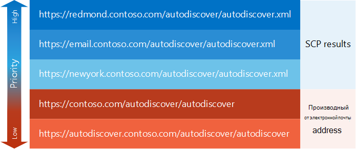

# Создать список конечных точек службы автообнаружения

Узнайте, как создать упорядоченный список конечных точек службы автообнаружения.
  
Первая задача в ходе [процесса автообнаружения](autodiscover-for-exchange.md) является создание списка конечных точек службы автообнаружения для вашего приложения, для пробного. Эти конечных точек службы автообнаружения могут поступать из [поиска SCP](how-to-find-autodiscover-endpoints-by-using-scp-lookup-in-exchange.md) или могут быть производными от адреса электронной почты пользователя. В конечном счете можно столкнуться с большим числом конечных точек. Давайте рассмотрим, как можно распределить по приоритету. 
  
## Начать с помощью поиска SCP

В списке конечных точек службы автообнаружения, приходящих из [поиска SCP](how-to-find-autodiscover-endpoints-by-using-scp-lookup-in-exchange.md) должен иметь наивысший приоритет. Администраторы могут настроить объекты точки подключения службы для маршрутизации клиент ближайших или наиболее эффективным автообнаружения конечной точки, поэтому рекомендуется начать с этих конечных точек. Так как процесс просмотра SCP схемы определения приоритетов, результаты поиска SCP уже приоритеты, следующим образом: 
  
1. Конечных точек службы автообнаружения из объектов точки подключения службы, областью действия на сайте Active Directory, к которой принадлежит на клиентском компьютере.
    
2. Конечных точек службы автообнаружения из объектов SCP не областью действия на любой сайт Active Directory.
    
3. Конечных точек службы автообнаружения из объектов точки подключения службы, областью действия на другой сайт Active Directory, чем сайта, к которой принадлежит на клиентском компьютере.
    
После того как результаты процесса поиска SCP, можно добавить конечные точки, производные от адреса электронной почты пользователя. Это может служить стандартного набора резервирования и конечных точек в случае нет результатов SCP или конечных точек, возвращаемой с помощью поиска SCP, недостаточно.
  
## Добавление конечных точек, производные от адреса электронной почты пользователя

Когда поиска SCP не работает или конечных точек, возвращаемой с помощью поиска SCP не возвращает успешного ответа, могут быть производными набор конечных точек службы автообнаружения, по умолчанию адрес электронной почты пользователя. Эти конечные точки должны быть низкий приоритет, чем какие-либо, поставляемым с помощью поиска SCP, но они могут понадобиться, если поиска SCP не удалась.
  
### Для получения конечных точек службы автообнаружения

1. Извлеките имя домена из адрес электронной почты пользователя. Например если адрес электронной почты пользователя Sadie.Daniels@contoso.com, имя домена будет contoso.com.
    
2. Создайте конечную точку URL-адреса без расширения имен файлов в следующих форматов:
    
  - «https://» + домена + «/ autodiscover/autodiscover»
    
  - "https://autodiscover." + домена + «/ autodiscover/autodiscover»
    
После компиляции список URL-адреса конечной точки, производные от поиска SCP и адрес электронной почты пользователя, может потребоваться пересмотреть расширения имен файлов в этих URL-адресов, в зависимости от того, используется ли в [веб-службы автообнаружения SOAP](http://msdn.microsoft.com/library/61c21ea9-7fea-4f56-8ada-bf80e1e6b074%28Office.15%29.aspx) или [POX Веб-служба автообнаружения](http://msdn.microsoft.com/library/877152f0-f4b1-4f63-b2ce-924f4bdf2d20%28Office.15%29.aspx).
  
## Добавьте или замените расширения имен файлов в URL-адреса конечной точки

Доступ к службе автообнаружения можно с помощью веб-службы автообнаружения SOAP или веб-службы автообнаружения POX. Каждая служба использует следующий URL-адреса конечной точки, с единственным различием, который расширение имени файла. Веб-служба автообнаружения SOAP использует расширением имени файла «SVC» и веб-служба автообнаружения POX использует расширение имени файла «.xml».
  
По умолчанию конечной точки службы автообнаружения, возвращенный URL-адресов с помощью поиска SCP, POX URL-адреса. Тем не менее при использовании службы автообнаружения SOAP можно просто измените расширение имени файла из «.xml» для «.svc» и повторите запрос SOAP.
  
Производные автообнаружения конечную точку URL-адресов расширение файла задан. Добавьте соответствующее расширение файла автоматического обнаружения веб-службы, которую вы используете перед тем как URL-адрес.
  
## Пример: Создание списка конечных точек службы автообнаружения

Давайте рассмотрим пример. Sadie Daniels (Sadie.Daniels@contoso.com) с помощью веб-служб Exchange (EWS) приложения в первый раз. Приложение использует службы автообнаружения для настройки. Sadie's компьютер присоединен к домену contoso.com и находится в сайте Redmond Active Directory. Приложение создает список конечных точек службы автообнаружения, показано на рисунке 1.
  
**На рисунке 1: Пример списка конечных точек службы автообнаружения**

  
Приложение веб-служб Exchange в этом примере предпочитает веб-службы автообнаружения SOAP, изменяется на расширение имени файла результатов SCP на «.svc» перед отправкой запросов SOAP к ним.
  
## Дальнейшие действия

После создания списка конечных точек службы автообнаружения, попробуйте их путем [отправки запросов для этих конечных точек](how-to-get-user-settings-from-exchange-by-using-autodiscover.md).
  
## См. также

- [Автообнаружение для Exchange](autodiscover-for-exchange.md)
    
- [Найдите конечных точек службы автообнаружения с помощью поиска SCP в Exchange](how-to-find-autodiscover-endpoints-by-using-scp-lookup-in-exchange.md)
    
- [Обработка сообщений об ошибках службы автообнаружения](handling-autodiscover-error-messages.md)
    

