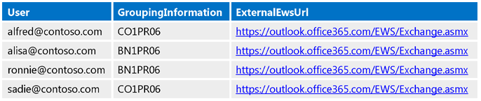
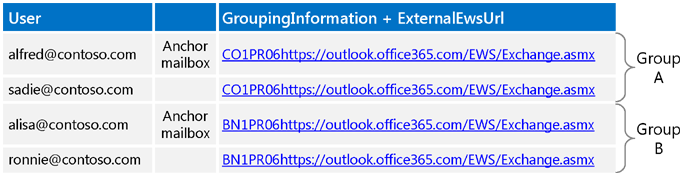
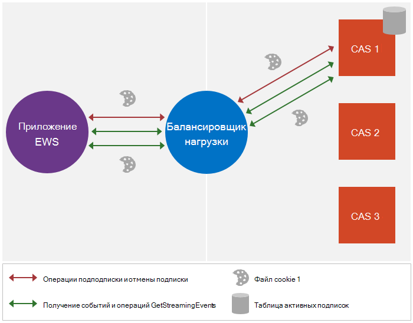
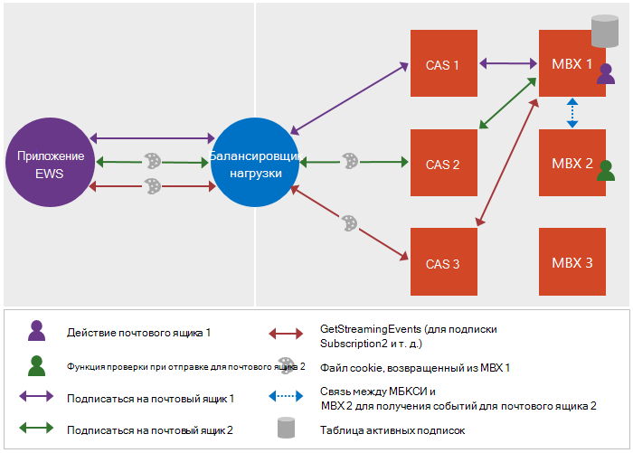

# <a name="maintain-affinity-between-a-group-of-subscriptions-and-the-mailbox-server-in-exchange"></a><span data-ttu-id="7ec7b-103">Поддержка сходства между группой подписок и сервера почтовых ящиков в Exchange</span><span class="sxs-lookup"><span data-stu-id="7ec7b-103">Maintain affinity between a group of subscriptions and the Mailbox server in Exchange</span></span>

<span data-ttu-id="7ec7b-104">Узнайте о поддержке сходства между группой подписок и сервера почтовых ящиков.</span><span class="sxs-lookup"><span data-stu-id="7ec7b-104">Find out about maintaining the affinity between a group of subscriptions and the Mailbox server.</span></span>
  
<span data-ttu-id="7ec7b-105">Сходство — связь последовательность сообщений, запрос и ответ с определенного сервера почтовых ящиков.</span><span class="sxs-lookup"><span data-stu-id="7ec7b-105">Affinity is the association of a sequence of request and response messages with a particular Mailbox server.</span></span> <span data-ttu-id="7ec7b-106">Для большинства функций в Exchange сходства обрабатывается на сервере.</span><span class="sxs-lookup"><span data-stu-id="7ec7b-106">For most functionality in Exchange, affinity is handled by the server.</span></span> <span data-ttu-id="7ec7b-107">Уведомления, однако, исключение.</span><span class="sxs-lookup"><span data-stu-id="7ec7b-107">Notifications, however, are an exception.</span></span> <span data-ttu-id="7ec7b-108">Клиент несет ответственность за обеспечение соответствия с сервером почтовых ящиков для подписки на уведомления.</span><span class="sxs-lookup"><span data-stu-id="7ec7b-108">The client is responsible for maintaining the affinity with the Mailbox server for notification subscriptions.</span></span> <span data-ttu-id="7ec7b-109">В этом сходства позволяет подсистемы балансировки нагрузки и серверы клиентского доступа между клиентом и сервера для подписки на уведомления о маршрутизации и связанных с ними запросов на сервере почтовых ящиков, который поддерживает подписки.</span><span class="sxs-lookup"><span data-stu-id="7ec7b-109">This affinity enables the load balancer and Client Access servers between the client and the server to route notification subscriptions and related requests to the Mailbox server that maintains the subscription.</span></span> <span data-ttu-id="7ec7b-110">Без сходства запрос могут быть маршрутизированы на другой сервер почтовых ящиков, которая не включает клиентских подписок, которые могут вызвать ошибку [ErrorSubscriptionNotFound](http://msdn.microsoft.com/library/4b84d670-74c9-4d6d-84e7-f0a9f76f0d93%28Office.15%29.aspx) должно быть возвращено.</span><span class="sxs-lookup"><span data-stu-id="7ec7b-110">Without affinity, the request might get routed to a different Mailbox server that does not include the client's subscriptions, which can cause an [ErrorSubscriptionNotFound](http://msdn.microsoft.com/library/4b84d670-74c9-4d6d-84e7-f0a9f76f0d93%28Office.15%29.aspx) error to be returned.</span></span> 
  
## <a name="how-is-affinity-maintained"></a><span data-ttu-id="7ec7b-111">Как поддерживается сходства?</span><span class="sxs-lookup"><span data-stu-id="7ec7b-111">How is affinity maintained?</span></span>
<span data-ttu-id="7ec7b-112"><a name="bk_howmaintained"> </a></span><span class="sxs-lookup"><span data-stu-id="7ec7b-112"></span></span>

<span data-ttu-id="7ec7b-113">Сходство в Exchange — на основе файлов cookie.</span><span class="sxs-lookup"><span data-stu-id="7ec7b-113">Affinity in Exchange is cookie based.</span></span> <span data-ttu-id="7ec7b-114">Клиент инициирует создание файла cookie, включая определенных заголовков в запрос подписки, а затем ответа подписки содержит файл cookie.</span><span class="sxs-lookup"><span data-stu-id="7ec7b-114">The client triggers the creation of the cookie by including specific headers in the subscription request, and then the subscription response contains the cookie.</span></span> <span data-ttu-id="7ec7b-115">Затем клиент передает этот файл в последующие запросы, чтобы убедиться, что запрос перенаправляется в правом сервера почтовых ящиков.</span><span class="sxs-lookup"><span data-stu-id="7ec7b-115">The client then sends that cookie in subsequent requests to ensure that the request is routed to the right Mailbox server.</span></span>
  
<span data-ttu-id="7ec7b-116">В частности сходства в Exchange обрабатывается следующее:</span><span class="sxs-lookup"><span data-stu-id="7ec7b-116">More specifically, affinity in Exchange is handled by the following:</span></span> 
  
- <span data-ttu-id="7ec7b-117">X-AnchorMailbox — Заголовок HTTP, который включен в запрос начальной подписки.</span><span class="sxs-lookup"><span data-stu-id="7ec7b-117">X-AnchorMailbox — An HTTP header that is included in the initial subscription request.</span></span> <span data-ttu-id="7ec7b-118">Он определяет первый почтовых ящиков в группе почтовых ящиков, которые совместно использовать сходство на одном сервере почтовых ящиков.</span><span class="sxs-lookup"><span data-stu-id="7ec7b-118">It identifies the first mailbox in a group of mailboxes that share affinity with the same Mailbox server.</span></span>
    
- <span data-ttu-id="7ec7b-119">X-PreferServerAffinity — Заголовка HTTP, который включен в запрос начальной подписки с заголовка X-AnchorMailbox и задано значение true, чтобы указать, что клиент запрашивает обслуживать сходства с сервера почтовых ящиков.</span><span class="sxs-lookup"><span data-stu-id="7ec7b-119">X-PreferServerAffinity — An HTTP header that is included in the initial subscription request with the X-AnchorMailbox header and is set to true to indicate that the client is requesting that affinity be maintained with the Mailbox server.</span></span>
    
- <span data-ttu-id="7ec7b-120">X-BackEndOverrideCookie — Файл cookie, включенных в ответ начальной подписки и содержит файл cookie, балансировки нагрузки и сервера клиентского доступа для маршрутизировать последующие запросы на том же сервере почтовых ящиков.</span><span class="sxs-lookup"><span data-stu-id="7ec7b-120">X-BackEndOverrideCookie — A cookie that is included in the initial subscription response and contains a cookie that the load balancer and Client Access server use to route subsequent requests to the same Mailbox server.</span></span>
    
## <a name="how-do-i-maintain-affinity-by-using-the-ews-managed-api-or-ews"></a><span data-ttu-id="7ec7b-121">Как поддерживать сходства с помощью управляемого интерфейса API веб-служб Exchange или веб-служб Exchange?</span><span class="sxs-lookup"><span data-stu-id="7ec7b-121">How do I maintain affinity by using the EWS Managed API or EWS?</span></span>
<span data-ttu-id="7ec7b-122"><a name="bk_howdoimaintain"> </a></span><span class="sxs-lookup"><span data-stu-id="7ec7b-122"></span></span>

<span data-ttu-id="7ec7b-123">Можно использовать те же действия для обеспечения соответствия для подписки на несколько почтовых ящиков и их серверах почтовых ящиков, независимо от того, используется ли потоковая передача, запросу или push-уведомлений, и независимо от того, является ли целевой локальную систему Exchange server или Exchange Online.</span><span class="sxs-lookup"><span data-stu-id="7ec7b-123">You can use the same steps to maintain affinity for multiple mailbox subscriptions and their Mailbox servers, regardless of whether you are using streaming, pull, or push notifications, and regardless of whether you're targeting an Exchange on-premises server or Exchange Online.</span></span>
  
1. <span data-ttu-id="7ec7b-124">Для каждого почтового ящика, [вызова службы автообнаружения](how-to-get-user-settings-from-exchange-by-using-autodiscover.md) и получение параметров GroupingInformation и ExternalEwsUrl пользователя.</span><span class="sxs-lookup"><span data-stu-id="7ec7b-124">For each mailbox, [call Autodiscover](how-to-get-user-settings-from-exchange-by-using-autodiscover.md) and get the GroupingInformation and ExternalEwsUrl user settings.</span></span> <span data-ttu-id="7ec7b-125">Для службы автообнаружения SOAP используйте элемент [параметра](http://msdn.microsoft.com/library/43db26e1-f7be-49fd-b26b-fc1b10bd3458%28Office.15%29.aspx) и для службы автообнаружения POX, используйте элемент [GroupingInformation](http://msdn.microsoft.com/library/2d8a007f-d79c-43c8-90e3-2c6d883f3a7c%28Office.15%29.aspx) .</span><span class="sxs-lookup"><span data-stu-id="7ec7b-125">For SOAP Autodiscover, you use the [Setting](http://msdn.microsoft.com/library/43db26e1-f7be-49fd-b26b-fc1b10bd3458%28Office.15%29.aspx) element, and for POX Autodiscover, you use the [GroupingInformation](http://msdn.microsoft.com/library/2d8a007f-d79c-43c8-90e3-2c6d883f3a7c%28Office.15%29.aspx) element.</span></span> 
    
2. <span data-ttu-id="7ec7b-126">С помощью параметров GroupingInformation и ExternalEwsUrl из откликов автообнаружения, почтовые ящики месте с GroupingInformation и ExternalEwsUrl объединяется значение в той же группе.</span><span class="sxs-lookup"><span data-stu-id="7ec7b-126">Using the GroupingInformation and ExternalEwsUrl settings from the Autodiscover responses, place mailboxes with the same ExternalEwsUrl and GroupingInformation concatenated value in the same group.</span></span> <span data-ttu-id="7ec7b-127">Если всех групп, имеющих более чем 200 почтовые ящики, разбить групп дальнейший, чтобы каждая группа содержит не более 200 почтовых ящиков.</span><span class="sxs-lookup"><span data-stu-id="7ec7b-127">If any groups have more than 200 mailboxes, break the groups down further so that each group has no more than 200 mailboxes.</span></span>
    
3. <span data-ttu-id="7ec7b-128">Создайте и используйте один объект [ExchangeService](http://msdn.microsoft.com/en-us/library/microsoft.exchange.webservices.data.exchangeservice%28v=EXCHG.80%29.aspx) для остальной части процедуры.</span><span class="sxs-lookup"><span data-stu-id="7ec7b-128">Create and use one [ExchangeService](http://msdn.microsoft.com/en-us/library/microsoft.exchange.webservices.data.exchangeservice%28v=EXCHG.80%29.aspx) object for the rest of the procedure.</span></span> <span data-ttu-id="7ec7b-129">При использовании одного объекта **ExchangeService** , файлы cookie и заголовки (если они заданы), автоматически сохраняются.</span><span class="sxs-lookup"><span data-stu-id="7ec7b-129">When you use the same **ExchangeService** object, cookies and headers (when they are set) are automatically maintained.</span></span> <span data-ttu-id="7ec7b-130">Обратите внимание на то, что если не требуется группа потоковой передачи подписок в одно, не для создания другого объекта **ExchangeService** для каждого пользователя с олицетворенным.</span><span class="sxs-lookup"><span data-stu-id="7ec7b-130">Note that if you do not intend to group streaming subscriptions into a single connection, you are free to create a different **ExchangeService** object for each impersonated user.</span></span> 
    
4. <span data-ttu-id="7ec7b-131">[Отправить подписки](notification-subscriptions-mailbox-events-and-ews-in-exchange.md) запрос для пользователей, имена которых сначала отображается, когда всем пользователям в группе сортируются в алфавитном порядке (мы будем называть этого пользователя в качестве пользователя почтового ящика привязки).</span><span class="sxs-lookup"><span data-stu-id="7ec7b-131">[Send a subscription](notification-subscriptions-mailbox-events-and-ews-in-exchange.md) request for the user whose user name appears first when all users in the group are sorted alphabetically (we'll refer to this user as the anchor mailbox user).</span></span> <span data-ttu-id="7ec7b-132">Выполните следующие действия:</span><span class="sxs-lookup"><span data-stu-id="7ec7b-132">Do the following:</span></span> 
    
  - <span data-ttu-id="7ec7b-133">Включите заголовок X-AnchorMailbox со значением, равным SMTP-адрес пользователя почтового ящика привязки.</span><span class="sxs-lookup"><span data-stu-id="7ec7b-133">Include the X-AnchorMailbox header with a value set to the SMTP address of the anchor mailbox user.</span></span>
    
  - <span data-ttu-id="7ec7b-134">Включите заголовок X-PreferServerAffinity со значением, равным true.</span><span class="sxs-lookup"><span data-stu-id="7ec7b-134">Include the X-PreferServerAffinity header with a value set to true.</span></span>
    
  - <span data-ttu-id="7ec7b-135">Используйте роль [ApplicationImpersonation](http://technet.microsoft.com/en-us/library/dd776119%28v=exchg.150%29.aspx) (тип [ExchangeImpersonation](http://msdn.microsoft.com/library/d8cbac49-47d0-4745-a2a7-545d33f8da93%28Office.15%29.aspx) ).</span><span class="sxs-lookup"><span data-stu-id="7ec7b-135">Use the [ApplicationImpersonation](http://technet.microsoft.com/en-us/library/dd776119%28v=exchg.150%29.aspx) role (the [ExchangeImpersonation](http://msdn.microsoft.com/library/d8cbac49-47d0-4745-a2a7-545d33f8da93%28Office.15%29.aspx) type).</span></span> 
    
5. <span data-ttu-id="7ec7b-136">В ответе подписки получает значение X-BackEndOverrideCookie.</span><span class="sxs-lookup"><span data-stu-id="7ec7b-136">In the subscription response, get the X-BackEndOverrideCookie value.</span></span> <span data-ttu-id="7ec7b-137">Включите это значение в каждой из подписки на последующие запросы для пользователей в эту группу.</span><span class="sxs-lookup"><span data-stu-id="7ec7b-137">Include this value in each of the subsequent subscription requests for users in this group.</span></span>
    
6. <span data-ttu-id="7ec7b-138">Для каждого дополнительного пользователя в группе отправить запрос подписки и сделайте следующее:</span><span class="sxs-lookup"><span data-stu-id="7ec7b-138">For each additional user in the group, send a subscription request and do the following:</span></span>
    
  - <span data-ttu-id="7ec7b-139">Включите заголовок X-AnchorMailbox со значением, равным SMTP-адрес пользователя почтового ящика привязки для группы.</span><span class="sxs-lookup"><span data-stu-id="7ec7b-139">Include the X-AnchorMailbox header with a value set to the SMTP address of the anchor mailbox user for the group.</span></span>
    
  - <span data-ttu-id="7ec7b-140">Включите заголовок X-PreferServerAffinity со значением, равным true.</span><span class="sxs-lookup"><span data-stu-id="7ec7b-140">Include the X-PreferServerAffinity header with a value set to true.</span></span>
    
  - <span data-ttu-id="7ec7b-141">Включите X-BackEndOverrideCookie, который был возвращен в ответ подписки привязки почтового ящика пользователя.</span><span class="sxs-lookup"><span data-stu-id="7ec7b-141">Include the X-BackEndOverrideCookie that was returned in the anchor mailbox user's subscription response.</span></span>
    
  - <span data-ttu-id="7ec7b-142">Используйте роль [ApplicationImpersonation](http://technet.microsoft.com/en-us/library/dd776119%28v=exchg.150%29.aspx) (тип [ExchangeImpersonation](http://msdn.microsoft.com/library/d8cbac49-47d0-4745-a2a7-545d33f8da93%28Office.15%29.aspx) ).</span><span class="sxs-lookup"><span data-stu-id="7ec7b-142">Use the [ApplicationImpersonation](http://technet.microsoft.com/en-us/library/dd776119%28v=exchg.150%29.aspx) role (the [ExchangeImpersonation](http://msdn.microsoft.com/library/d8cbac49-47d0-4745-a2a7-545d33f8da93%28Office.15%29.aspx) type).</span></span> 
    
    <span data-ttu-id="7ec7b-143">Обратите внимание на то, сервер использует значения X-PreferServerAffinity и X BackendOverrideCookie друг с другом для выполнения маршрутизации на сервер почтовых ящиков.</span><span class="sxs-lookup"><span data-stu-id="7ec7b-143">Note that the server uses the X-PreferServerAffinity and X-BackendOverrideCookie values together to perform the routing to the mailbox server.</span></span> <span data-ttu-id="7ec7b-144">Заголовок X-AnchorMailbox также является обязательным, но обрабатывается на сервере, если два значения являются допустимыми.</span><span class="sxs-lookup"><span data-stu-id="7ec7b-144">The X-AnchorMailbox header is also required, but is ignored by the server if the other two values are valid.</span></span> <span data-ttu-id="7ec7b-145">Если X-AnchorMailbox и X PreferServerAffinity — в запросе и X BackendOverrideCookie не указан, чтобы перенаправлять запросы используется значение X-AnchorMailbox.</span><span class="sxs-lookup"><span data-stu-id="7ec7b-145">If X-AnchorMailbox and X-PreferServerAffinity are in a request and X-BackendOverrideCookie is not included, the X-AnchorMailbox value is used to route the requests.</span></span>
    
    <span data-ttu-id="7ec7b-146">Так как X PreferServerAffinity и значения X BackendOverrideCookie выполнения маршрутизации, если когда-либо перемещение почтовых ящиков привязки к другой группе или сервера, логику не изменяется, поскольку X-BackendOverrideCookie будет перенаправлять запрос к правильному серверу для группы.</span><span class="sxs-lookup"><span data-stu-id="7ec7b-146">Because the X-PreferServerAffinity and X-BackendOverrideCookie values perform the routing, if the anchor mailbox ever moves to another group or server, the logic does not change because the X-BackendOverrideCookie will route the request to the correct server for the group.</span></span>
    
7. <span data-ttu-id="7ec7b-147">Отправка одного [GetStreamingEvents](http://msdn.microsoft.com/library/dbe83857-c4f8-4d98-813f-e03c289697a1%28Office.15%29.aspx) или [GetEvents](http://msdn.microsoft.com/library/22d4da6b-d8a8-484f-82c4-3e4b8f5431cd%28Office.15%29.aspx) запросов для группы и сделайте следующее:</span><span class="sxs-lookup"><span data-stu-id="7ec7b-147">Send a single [GetStreamingEvents](http://msdn.microsoft.com/library/dbe83857-c4f8-4d98-813f-e03c289697a1%28Office.15%29.aspx) or [GetEvents](http://msdn.microsoft.com/library/22d4da6b-d8a8-484f-82c4-3e4b8f5431cd%28Office.15%29.aspx) requests for the group, and do the following:</span></span> 
    
  - <span data-ttu-id="7ec7b-148">Включить [SubscriptionId](http://msdn.microsoft.com/library/3f86c178-2311-4844-82db-c2a0e469d116%28Office.15%29.aspx) значений, возвращенных в каждой из них ответов для почтовых ящиков в группе.</span><span class="sxs-lookup"><span data-stu-id="7ec7b-148">Include the [SubscriptionId](http://msdn.microsoft.com/library/3f86c178-2311-4844-82db-c2a0e469d116%28Office.15%29.aspx) values returned in each of the individual subscription responses for mailboxes in the group.</span></span> 
    
  - <span data-ttu-id="7ec7b-149">При наличии более чем 200 подписок для группы, создание нескольких запросов.</span><span class="sxs-lookup"><span data-stu-id="7ec7b-149">If more than 200 subscriptions exist for the group, create multiple requests.</span></span> <span data-ttu-id="7ec7b-150">Максимальное количество значений [SubscriptionId](http://msdn.microsoft.com/library/3f86c178-2311-4844-82db-c2a0e469d116%28Office.15%29.aspx) необходимо включить в запрос равно 200.</span><span class="sxs-lookup"><span data-stu-id="7ec7b-150">The maximum number of [SubscriptionId](http://msdn.microsoft.com/library/3f86c178-2311-4844-82db-c2a0e469d116%28Office.15%29.aspx) values to include in a request is 200.</span></span> 
    
  - <span data-ttu-id="7ec7b-151">Если вам требуется несколько подключений, чем доступно для целевого почтового ящика, используйте учетную запись службы для олицетворения почтового ящика привязки группы; в противном случае не используйте олицетворения.</span><span class="sxs-lookup"><span data-stu-id="7ec7b-151">If you need more connections than are available to the target mailbox, use the service account to impersonate the anchor mailbox for the group; otherwise, do not use impersonation.</span></span> <span data-ttu-id="7ec7b-152">В идеальном варианте необходимо олицетворить уникальный почтовых ящиков на [GetStreamingEvents](http://msdn.microsoft.com/library/dbe83857-c4f8-4d98-813f-e03c289697a1%28Office.15%29.aspx) или [GetEvents](http://msdn.microsoft.com/library/22d4da6b-d8a8-484f-82c4-3e4b8f5431cd%28Office.15%29.aspx) запрос, чтобы никогда не возникнет ограничения полосы пропускания.</span><span class="sxs-lookup"><span data-stu-id="7ec7b-152">Ideally, you want to impersonate a unique mailbox per [GetStreamingEvents](http://msdn.microsoft.com/library/dbe83857-c4f8-4d98-813f-e03c289697a1%28Office.15%29.aspx) or [GetEvents](http://msdn.microsoft.com/library/22d4da6b-d8a8-484f-82c4-3e4b8f5431cd%28Office.15%29.aspx) request so that you never encounter throttling limits.</span></span> 
    
  - <span data-ttu-id="7ec7b-153">Используйте ApplicationImpersonation, если вам требуется [несколько подключений, чем доступно для целевого почтового ящика](how-to-maintain-affinity-between-group-of-subscriptions-and-mailbox-server.md#bk_throttling); в противном случае не используйте ApplicationImpersonation.</span><span class="sxs-lookup"><span data-stu-id="7ec7b-153">Use ApplicationImpersonation if you need [more connections than are available to the target mailbox](how-to-maintain-affinity-between-group-of-subscriptions-and-mailbox-server.md#bk_throttling); otherwise, do not use ApplicationImpersonation.</span></span>
    
  - <span data-ttu-id="7ec7b-154">Включать заголовок X-PreferServerAffinity и присвойте ей значение true.</span><span class="sxs-lookup"><span data-stu-id="7ec7b-154">Include the X-PreferServerAffinity header and set it to true.</span></span> <span data-ttu-id="7ec7b-155">Это значение автоматически включается, если вы используете объект **ExchangeService** , созданный на шаге 2.</span><span class="sxs-lookup"><span data-stu-id="7ec7b-155">This value is automatically included if you are using the **ExchangeService** object that you created in step 2.</span></span> 
    
  - <span data-ttu-id="7ec7b-156">Включите BackEndOverrideCookie X для группы (X-BackEndOverrideCookie, который был возвращен в ответ подписки пользователя почтового ящика привязки).</span><span class="sxs-lookup"><span data-stu-id="7ec7b-156">Include the X-BackEndOverrideCookie for the group (the X-BackEndOverrideCookie that was returned in the anchor mailbox user's subscription response).</span></span> <span data-ttu-id="7ec7b-157">Это значение автоматически включается, если вы используете объект **ExchangeService** , созданный на шаге 2.</span><span class="sxs-lookup"><span data-stu-id="7ec7b-157">This value is automatically included if you are using the **ExchangeService** object that you created in step 2.</span></span> 
    
8. <span data-ttu-id="7ec7b-158">Передайте возвращенные события отдельный поток для обработки.</span><span class="sxs-lookup"><span data-stu-id="7ec7b-158">Pass the returned events to a separate thread for processing.</span></span>
    
## <a name="what-throttling-values-do-i-need-to-take-into-consideration"></a><span data-ttu-id="7ec7b-159">Какие регулирования значения необходимо принять во внимание?</span><span class="sxs-lookup"><span data-stu-id="7ec7b-159">What throttling values do I need to take into consideration?</span></span>
<span data-ttu-id="7ec7b-160"><a name="bk_throttling"> </a></span><span class="sxs-lookup"><span data-stu-id="7ec7b-160"></span></span>

<span data-ttu-id="7ec7b-161">При планировании внедрения уведомлений, необходимо учитывать два значения: число подключений и число подписок.</span><span class="sxs-lookup"><span data-stu-id="7ec7b-161">As you plan your notification implementation, you'll want to take two values into consideration: the number of connections, and the number of subscriptions.</span></span> <span data-ttu-id="7ec7b-162">В следующей таблице перечислены значения по умолчанию для каждого из параметров [регулирования](ews-throttling-in-exchange.md) и как используются параметры.</span><span class="sxs-lookup"><span data-stu-id="7ec7b-162">The following table lists the default values for each [throttling](ews-throttling-in-exchange.md) setting and how the settings are used.</span></span> <span data-ttu-id="7ec7b-163">Для каждого значения бюджета, выделяемого для целевого почтового ящика.</span><span class="sxs-lookup"><span data-stu-id="7ec7b-163">For each value, the budget is allocated to the target mailbox.</span></span> <span data-ttu-id="7ec7b-164">По этой причине использование олицетворения для получения дополнительных подключений шаг является обязательным в различных сценариях.</span><span class="sxs-lookup"><span data-stu-id="7ec7b-164">For this reason, using impersonation to gain additional connections is a required step in many scenarios.</span></span> 
  
<span data-ttu-id="7ec7b-165">**В таблице 1. Регулирования значения по умолчанию**</span><span class="sxs-lookup"><span data-stu-id="7ec7b-165">**Table 1. Default throttling values**</span></span>

|<span data-ttu-id="7ec7b-166">**Область внимание**</span><span class="sxs-lookup"><span data-stu-id="7ec7b-166">**Area of consideration**</span></span>|<span data-ttu-id="7ec7b-167">**Параметр регулирования**</span><span class="sxs-lookup"><span data-stu-id="7ec7b-167">**Throttling setting**</span></span>|<span data-ttu-id="7ec7b-168">**Default value**</span><span class="sxs-lookup"><span data-stu-id="7ec7b-168">**Default value**</span></span>|<span data-ttu-id="7ec7b-169">**Описание**</span><span class="sxs-lookup"><span data-stu-id="7ec7b-169">**Description**</span></span>|
|:-----|:-----|:-----|:-----|
|<span data-ttu-id="7ec7b-170">Потоковая передача подключений</span><span class="sxs-lookup"><span data-stu-id="7ec7b-170">Streaming connections</span></span>  <br/> |<span data-ttu-id="7ec7b-171">По умолчанию, выступающие ограничения подключения</span><span class="sxs-lookup"><span data-stu-id="7ec7b-171">Default hanging connection limit</span></span>  <br/> |<span data-ttu-id="7ec7b-172">10 для Exchange Online</span><span class="sxs-lookup"><span data-stu-id="7ec7b-172">10 for Exchange Online</span></span>  <br/> <span data-ttu-id="7ec7b-173">3 для Exchange 2013</span><span class="sxs-lookup"><span data-stu-id="7ec7b-173">3 for Exchange 2013</span></span>  <br/> |<span data-ttu-id="7ec7b-174">Максимальное число одновременных подключений потоковой передачи, которые могут иметь учетную запись, одновременно открытых на сервере.</span><span class="sxs-lookup"><span data-stu-id="7ec7b-174">The maximum number of concurrent streaming connections that an account can have open on the server at one time.</span></span> <span data-ttu-id="7ec7b-175">Для работы в рамках это ограничение, использование учетной записи службы с помощью роль ApplicationImpersonation, назначенных для почтовых ящиков конечного и олицетворения первым пользователем в каждой группе идентификатор подписки при начало в потоке событий.</span><span class="sxs-lookup"><span data-stu-id="7ec7b-175">To work within this limit, use a service account with the ApplicationImpersonation role assigned for the target mailboxes, and impersonate the first user in each subscription ID group when getting streamed events.</span></span>  <br/> |
|<span data-ttu-id="7ec7b-176">Включения или отключения подключений</span><span class="sxs-lookup"><span data-stu-id="7ec7b-176">Pull or push connections</span></span>  <br/> |<span data-ttu-id="7ec7b-177">EWSMaxConcurrency</span><span class="sxs-lookup"><span data-stu-id="7ec7b-177">EWSMaxConcurrency</span></span>  <br/> |<span data-ttu-id="7ec7b-178">27</span><span class="sxs-lookup"><span data-stu-id="7ec7b-178">27</span></span>  <br/> |<span data-ttu-id="7ec7b-179">Максимальное число одновременных подключений включения или отключения (запросов, которые получены, но еще не ответил), что локальная учетная запись может иметь open на сервере за один раз.</span><span class="sxs-lookup"><span data-stu-id="7ec7b-179">The maximum number of concurrent pull or push connections (requests that have been received but not yet responded to) that an account can have open on the server at one time.</span></span>  <br/> |
|<span data-ttu-id="7ec7b-180">Подписки</span><span class="sxs-lookup"><span data-stu-id="7ec7b-180">Subscriptions</span></span>  <br/> |<span data-ttu-id="7ec7b-181">EWSMaxSubscriptions</span><span class="sxs-lookup"><span data-stu-id="7ec7b-181">EWSMaxSubscriptions</span></span>  <br/> |<span data-ttu-id="7ec7b-182">20 для Exchange Online</span><span class="sxs-lookup"><span data-stu-id="7ec7b-182">20 for Exchange Online</span></span>  <br/> <span data-ttu-id="7ec7b-183">5000 для Exchange 2013</span><span class="sxs-lookup"><span data-stu-id="7ec7b-183">5000 for Exchange 2013</span></span>  <br/> |<span data-ttu-id="7ec7b-184">Максимальное число nonexpired подписок учетной записи, у которых есть за один раз.</span><span class="sxs-lookup"><span data-stu-id="7ec7b-184">The maximum number of nonexpired subscriptions that an account can have at one time.</span></span> <span data-ttu-id="7ec7b-185">Это значение уменьшается при создании подписки на сервере.</span><span class="sxs-lookup"><span data-stu-id="7ec7b-185">This value is decremented when the subscription is created on the server.</span></span>  <br/> |
   
<span data-ttu-id="7ec7b-186">В следующем примере показано обработки бюджеты между любого целевого почтового ящика и учетной записи службы, имеющей роль [ApplicationImpersonation](http://technet.microsoft.com/en-us/library/dd776119%28v=exchg.150%29.aspx) , назначенных для почтовых ящиков целевой.</span><span class="sxs-lookup"><span data-stu-id="7ec7b-186">The following example shows how budgets are handled between any target mailbox and the service account that has the [ApplicationImpersonation](http://technet.microsoft.com/en-us/library/dd776119%28v=exchg.150%29.aspx) role assigned for the target mailboxes.</span></span> 
  
- <span data-ttu-id="7ec7b-187">ServiceAccount1 (sa1) олицетворяет число пользователей (m1, m2, m3 и т. д.) и создает подписки для каждого почтового ящика.</span><span class="sxs-lookup"><span data-stu-id="7ec7b-187">ServiceAccount1 (sa1) impersonates many users (m1, m2, m3, and so on) and creates subscriptions for each mailbox.</span></span> <span data-ttu-id="7ec7b-188">Обратите внимание, что при создании подписок, владелец подписки sa1, поэтому при sa1 открывает подключение с подписок, веб-служб Exchange обеспечивает, что подписок принадлежат sa1.</span><span class="sxs-lookup"><span data-stu-id="7ec7b-188">Note that when the subscriptions are created, the subscription owner is sa1, so when sa1 opens a connection with the subscriptions, EWS enforces that the subscriptions are owned by sa1.</span></span>
    
- <span data-ttu-id="7ec7b-189">Sa1 можно открыть подключение следующими способами:</span><span class="sxs-lookup"><span data-stu-id="7ec7b-189">Sa1 can open the connection in the following ways:</span></span>
    
1. <span data-ttu-id="7ec7b-190">Без олицетворения поэтому подключение является вычитается sa1.</span><span class="sxs-lookup"><span data-stu-id="7ec7b-190">Without impersonation, so the connection is charged against sa1.</span></span>
    
2. <span data-ttu-id="7ec7b-191">С помощью любого пользователя олицетворения — m1 для примера —, чтобы подключение, вычитается копию m1 бюджета.</span><span class="sxs-lookup"><span data-stu-id="7ec7b-191">By impersonating any of the users — m1 for example — so that the connection is charged against a copy of m1's budget.</span></span> <span data-ttu-id="7ec7b-192">(M1 самого можно открывать подключений с помощью Exchange Online и все учетные записи служб, олицетворения m1 может подключений с помощью скопированного бюджета.)</span><span class="sxs-lookup"><span data-stu-id="7ec7b-192">(M1 itself can open ten connections by using Exchange Online, and all service accounts impersonating m1 can open ten connections by using the copied budget.)</span></span>
    
- <span data-ttu-id="7ec7b-193">Если предела подключения доступны следующие решения:</span><span class="sxs-lookup"><span data-stu-id="7ec7b-193">If the connection limit is hit, the following workarounds are available:</span></span>
    
  - <span data-ttu-id="7ec7b-194">Если используется параметр 1, администратор может создать несколько учетных записей служб для олицетворения дополнительных пользователей.</span><span class="sxs-lookup"><span data-stu-id="7ec7b-194">If option 1 is used, the administrator can create multiple service accounts to impersonate additional users.</span></span>
    
  - <span data-ttu-id="7ec7b-195">Если используется параметр 2, код может олицетворять другого пользователя — m2 для примера.</span><span class="sxs-lookup"><span data-stu-id="7ec7b-195">If option 2 is used, the code can impersonate another user — m2 for example.</span></span>
    
## <a name="example-maintaining-affinity-between-a-group-of-subscriptions-and-the-mailbox-server"></a><span data-ttu-id="7ec7b-196">Пример: Обслуживание сходства между группой подписок и сервера почтовых ящиков</span><span class="sxs-lookup"><span data-stu-id="7ec7b-196">Example: Maintaining affinity between a group of subscriptions and the Mailbox server</span></span>
<span data-ttu-id="7ec7b-197"><a name="bk_ce"> </a></span><span class="sxs-lookup"><span data-stu-id="7ec7b-197"></span></span>

<span data-ttu-id="7ec7b-198">Хорошо, давайте посмотрим в действии.</span><span class="sxs-lookup"><span data-stu-id="7ec7b-198">Okay, let's see it in action.</span></span> <span data-ttu-id="7ec7b-199">В следующем примере кода показано, как группы пользователей и использование заголовков X-AnchorMailbox и X PreferServerAffinity и X BackendOverrideCookie cookie на обслуживание сходства с сервера почтовых ящиков.</span><span class="sxs-lookup"><span data-stu-id="7ec7b-199">The following code example shows you how to group users and use the X-AnchorMailbox and X-PreferServerAffinity headers and the X-BackendOverrideCookie cookie to maintain affinity with the Mailbox server.</span></span> <span data-ttu-id="7ec7b-200">Поскольку роль в материале сходства заголовков и файл cookie, в этом примере в центре внимания XML веб-служб Exchange запросы и ответы.</span><span class="sxs-lookup"><span data-stu-id="7ec7b-200">Because the headers and the cookie are of primary importance in the affinity story, this example focuses on the EWS XML requests and responses.</span></span> <span data-ttu-id="7ec7b-201">Чтобы использовать управляемый API веб-служб Exchange для создания тело подписки запросы и ответы, обратитесь к разделу [потока уведомлений о событиях почтовых ящиков с помощью веб-служб Exchange в Exchange](how-to-stream-notifications-about-mailbox-events-by-using-ews-in-exchange.md) и [уведомлений о событиях почтовых ящиков с помощью веб-служб Exchange в Exchange по запросу](how-to-pull-notifications-about-mailbox-events-by-using-ews-in-exchange.md).</span><span class="sxs-lookup"><span data-stu-id="7ec7b-201">To use the EWS Managed API to create the body of the subscription requests and responses, see [Stream notifications about mailbox events by using EWS in Exchange](how-to-stream-notifications-about-mailbox-events-by-using-ews-in-exchange.md) and [Pull notifications about mailbox events by using EWS in Exchange](how-to-pull-notifications-about-mailbox-events-by-using-ews-in-exchange.md).</span></span> <span data-ttu-id="7ec7b-202">В этом разделе содержатся дополнительные действия, относящиеся к обслуживанию сходства и добавление заголовков в ваших запросов.</span><span class="sxs-lookup"><span data-stu-id="7ec7b-202">This section includes additional steps particular to maintaining affinity and adding the headers to your requests.</span></span>
  
<span data-ttu-id="7ec7b-203">В этом примере имеется четыре пользователей: alfred@contoso.com, alisa@contoso.com, ronnie@contoso.com и sadie@contoso.com.</span><span class="sxs-lookup"><span data-stu-id="7ec7b-203">This example has four users: alfred@contoso.com, alisa@contoso.com, ronnie@contoso.com, and sadie@contoso.com.</span></span> <span data-ttu-id="7ec7b-204">На следующем рисунке показана GroupingInformation и ExternalEwsUrl [Параметры автообнаружения](how-to-get-user-settings-from-exchange-by-using-autodiscover.md) для пользователей.</span><span class="sxs-lookup"><span data-stu-id="7ec7b-204">The following figure shows the GroupingInformation and ExternalEwsUrl [Autodiscover settings](how-to-get-user-settings-from-exchange-by-using-autodiscover.md) for the users.</span></span> 
  
<span data-ttu-id="7ec7b-205">**На рисунке 1. Параметры автообнаружения, используемые для групповых почтовых ящиков**</span><span class="sxs-lookup"><span data-stu-id="7ec7b-205">**Figure 1. Autodiscover settings used to group mailboxes**</span></span>


  
<span data-ttu-id="7ec7b-207">С помощью параметров из откликов автообнаружения, почтовые ящики сгруппированные по составное значения параметров GroupingInformation и ExternalEwsUrl.</span><span class="sxs-lookup"><span data-stu-id="7ec7b-207">Using the settings from the Autodiscover responses, the mailboxes are grouped by the concatenated value of the GroupingInformation and ExternalEwsUrl settings.</span></span> <span data-ttu-id="7ec7b-208">В этом примере Алексей и Sadie имеют те же значения, поэтому они находятся в одной группе и Alisa и Ronnie совместно использовать те же значения, поэтому они находятся в другую группу.</span><span class="sxs-lookup"><span data-stu-id="7ec7b-208">In this example, Alfred and Sadie have the same values, so they are in one group, and Alisa and Ronnie share the same values, so they are in another group.</span></span>
  
<span data-ttu-id="7ec7b-209">**На рисунке 2. Создание группы почтовых ящиков**</span><span class="sxs-lookup"><span data-stu-id="7ec7b-209">**Figure 2. Creating mailbox groups**</span></span>


  
<span data-ttu-id="7ec7b-211">В этом примере мы рассмотрим а группы. Мы будет использовать те же действия для группы B, но используйте другое значение X-AnchorMailbox для этой группы.</span><span class="sxs-lookup"><span data-stu-id="7ec7b-211">For the purpose of this example, we'll focus on Group A. We would use the same steps for group B, but use a different X-AnchorMailbox value for that group.</span></span>
  
<span data-ttu-id="7ec7b-212">С помощью [ApplicationImpersonation](http://technet.microsoft.com/en-us/library/dd776119%28v=exchg.150%29.aspx), создайте запрос подписки для почтового ящика привязки (alfred@contoso.com), с помощью заголовка X-AnchorMailbox, задайте значение свой адрес электронной почты и значение заголовка X-PreferServerAffinity значение true.</span><span class="sxs-lookup"><span data-stu-id="7ec7b-212">Using [ApplicationImpersonation](http://technet.microsoft.com/en-us/library/dd776119%28v=exchg.150%29.aspx), create the subscription request for the anchor mailbox (alfred@contoso.com), with the X-AnchorMailbox header set to the their email address and an X-PreferServerAffinity header value of true.</span></span> <span data-ttu-id="7ec7b-213">Установка значений этих двух заголовка вызовет сервер для создания X BackEndOverrideCookie для ответа.</span><span class="sxs-lookup"><span data-stu-id="7ec7b-213">Setting these two header values will trigger the server to create an X-BackEndOverrideCookie for the response.</span></span>
  
<span data-ttu-id="7ec7b-214">Если вы используете управляемый API веб-служб Exchange, используйте метод[Add](http://msdn.microsoft.com/EN-US/library/cy7xta5e) [HttpHeaders](http://msdn.microsoft.com/en-us/library/microsoft.exchange.webservices.data.exchangeservice_members%28v=exchg.80%29.aspx)для добавления двух верхних запрос на подписку, как показано.</span><span class="sxs-lookup"><span data-stu-id="7ec7b-214">If you're using the EWS Managed API, use the [HttpHeaders](http://msdn.microsoft.com/en-us/library/microsoft.exchange.webservices.data.exchangeservice_members%28v=exchg.80%29.aspx)[Add](http://msdn.microsoft.com/EN-US/library/cy7xta5e) method to add the two headers to your subscription request, as shown.</span></span> 
  
```cs
service.HttpHeaders.Add("X-AnchorMailbox", Mailbox.SMTPAddress);
service.HttpHeaders.Add("X-PreferServerAffinity", "true");
```

<span data-ttu-id="7ec7b-215">Поэтому запрос подписки пользователя Алексей выглядит следующим образом.</span><span class="sxs-lookup"><span data-stu-id="7ec7b-215">So Alfred's subscription request looks like this.</span></span>
  
```XML
POST https://outlook.office365.com/EWS/Exchange.asmx HTTP/1.1
Content-Type: text/xml; charset=utf-8
Accept: text/xml
User-Agent: ExchangeServicesClient/15.00.0516.014
X-AnchorMailbox: alfred@contoso.com
X-PreferServerAffinity: true
Host: outlook.office365.com
<?xml version="1.0" encoding="utf-8"?>
<soap:Envelope xmlns:xsi="http://www.w3.org/2001/XMLSchema-instance" xmlns:m="http://schemas.microsoft.com/exchange/services/2006/messages" xmlns:t="http://schemas.microsoft.com/exchange/services/2006/types" xmlns:soap="http://schemas.xmlsoap.org/soap/envelope/">
  <soap:Header>
    <t:RequestServerVersion Version="Exchange2013" />
    <t:ExchangeImpersonation>
      <t:ConnectingSID>
        <t:SmtpAddress>alfred@contoso.com</t:SmtpAddress>
      </t:ConnectingSID>
    </t:ExchangeImpersonation>
  </soap:Header>
  <soap:Body>
    <m:Subscribe>
      <m:StreamingSubscriptionRequest>
        <t:FolderIds>
          <t:DistinguishedFolderId Id="inbox" />
        </t:FolderIds>
        <t:EventTypes>
          <t:EventType>NewMailEvent</t:EventType>
        </t:EventTypes>
      </m:StreamingSubscriptionRequest>
    </m:Subscribe>
  </soap:Body>
</soap:Envelope>
```

<span data-ttu-id="7ec7b-216">Следующее сообщение XML — это ответ на запрос пользователя Алексей подписки, а также X-BackEndOverrideCookie.</span><span class="sxs-lookup"><span data-stu-id="7ec7b-216">The following XML message is the response to Alfred's subscription request, and it includes the X-BackEndOverrideCookie.</span></span> <span data-ttu-id="7ec7b-217">Отправьте этот файл cookie для всех последующих запросов для пользователей в эту группу.</span><span class="sxs-lookup"><span data-stu-id="7ec7b-217">Resend this cookie for all subsequent requests for users in this group.</span></span> <span data-ttu-id="7ec7b-218">Обратите внимание на то, что ответ также содержит дополнительные файлы cookie, такие как exchangecookie файла cookie, используемый Exchange 2010.</span><span class="sxs-lookup"><span data-stu-id="7ec7b-218">Notice that the response also contains additional cookies, such as the exchangecookie cookie used by Exchange 2010.</span></span> <span data-ttu-id="7ec7b-219">Exchange Online, Exchange Online как часть Office 365 и версии Exchange, начиная с Exchange 2013 игнорировать exchangecookie, если он включен в подписки на последующие запросы.</span><span class="sxs-lookup"><span data-stu-id="7ec7b-219">Exchange Online, Exchange Online as part of Office 365, and versions of Exchange starting with Exchange 2013, ignore exchangecookie if it is included in subsequent subscription requests.</span></span>
  
```XML
HTTP/1.1 200 OK
Content-Type: text/xml; charset=utf-8
Set-Cookie: exchangecookie=ddb8c383aef34c7694132aa679744feb; expires=Thu, 25-Sep-2014 18:42:45 GMT; path=/;
    HttpOnly
Set-Cookie: X-BackEndOverrideCookie=CO1PR06MB222.namprd06.prod.outlook.com~1941996295; path=/; secure; HttpOnly
Set-Cookie: X-BackEndCookie=alfred@contoso.com=Ox8XKzcXLxg==; 
    expires=Wed, 25-Sep-2013 18:52:49 GMT; path=/EWS; secure; HttpOnly
<?xml version="1.0" encoding="utf-8"?>
<s:Envelope xmlns:s="http://schemas.xmlsoap.org/soap/envelope/">
  <s:Header>
    <h:ServerVersionInfo MajorVersion="15"
                         MinorVersion="0"
                         MajorBuildNumber="775"
                         MinorBuildNumber="7"
                         Version="V2_4"
                         xmlns:h="http://schemas.microsoft.com/exchange/services/2006/types"
                         xmlns="http://schemas.microsoft.com/exchange/services/2006/types"
                         xmlns:xsd="http://www.w3.org/2001/XMLSchema"
                         xmlns:xsi="http://www.w3.org/2001/XMLSchema-instance"/>
  </s:Header>
  <s:Body xmlns:xsi="http://www.w3.org/2001/XMLSchema-instance"
          xmlns:xsd="http://www.w3.org/2001/XMLSchema">
    <m:SubscribeResponse xmlns:m="http://schemas.microsoft.com/exchange/services/2006/messages"
                         xmlns:t="http://schemas.microsoft.com/exchange/services/2006/types">
      <m:ResponseMessages>
        <m:SubscribeResponseMessage ResponseClass="Success">
          <m:ResponseCode>NoError</m:ResponseCode>
          <m:SubscriptionId>JgBjbzFwcjA2bWIyMjIubmFtcHJkMDYucHJvZC5vdXRsb29rLmNvbRAAAAAUeGk+7JFdSaFM8/NI/gQQpVdgZX6H0Ag=</m:SubscriptionId>
        </m:SubscribeResponseMessage>
      </m:ResponseMessages>
    </m:SubscribeResponse>
  </s:Body>
</s:Envelope>
```

<span data-ttu-id="7ec7b-220">С помощью BackEndOverrideCookie X из ответа пользователя Алексей и заголовок X-AnchorMailbox для Sadie создается запрос подписки, другой член группы A. Sadie запрос подписки выглядит следующим образом.</span><span class="sxs-lookup"><span data-stu-id="7ec7b-220">Using the X-BackEndOverrideCookie from Alfred's response and the X-AnchorMailbox header, the subscription request is created for Sadie, the other member of Group A. Sadie's subscription request looks like this.</span></span>
  
```XML
POST https://outlook.office365.com/EWS/Exchange.asmx HTTP/1.1
Content-Type: text/xml; charset=utf-8
Accept: text/xml
User-Agent: ExchangeServicesClient/15.00.0516.014
X-AnchorMailbox: alfred@consoso.com
X-PreferServerAffinity: true
Host: outlook.office365.com
Cookie: X-BackEndOverrideCookie=CO1PR06MB222.namprd06.prod.outlook.com~1941996295
<?xml version="1.0" encoding="utf-8"?>
<soap:Envelope xmlns:xsi="http://www.w3.org/2001/XMLSchema-instance" xmlns:m="http://schemas.microsoft.com/exchange/services/2006/messages" xmlns:t="http://schemas.microsoft.com/exchange/services/2006/types" xmlns:soap="http://schemas.xmlsoap.org/soap/envelope/">
  <soap:Header>
    <t:RequestServerVersion Version="Exchange2013" />
    <t:ExchangeImpersonation>
      <t:ConnectingSID>
        <t:SmtpAddress>sadie@consoso.com </t:SmtpAddress>
      </t:ConnectingSID>
    </t:ExchangeImpersonation>
  </soap:Header>
  <soap:Body>
    <m:Subscribe>
      <m:StreamingSubscriptionRequest>
        <t:FolderIds>
          <t:DistinguishedFolderId Id="inbox" />
        </t:FolderIds>
        <t:EventTypes>
          <t:EventType>NewMailEvent</t:EventType>
        </t:EventTypes>
      </m:StreamingSubscriptionRequest>
    </m:Subscribe>
  </soap:Body>
</soap:Envelope>

```

<span data-ttu-id="7ec7b-221">Ответа подписки на Sadie выглядит следующим образом.</span><span class="sxs-lookup"><span data-stu-id="7ec7b-221">Sadie's subscription response looks like this.</span></span> <span data-ttu-id="7ec7b-222">Обратите внимание на то, что она не включает X-BackEndOverrideCookie.</span><span class="sxs-lookup"><span data-stu-id="7ec7b-222">Note that it does not include the X-BackEndOverrideCookie.</span></span> <span data-ttu-id="7ec7b-223">Клиент не отвечает за кэширования этого значения для последующих запросов.</span><span class="sxs-lookup"><span data-stu-id="7ec7b-223">The client is responsible for caching that value for future requests.</span></span>
  
```XML
HTTP/1.1 200 OK
Content-Type: text/xml; charset=utf-8
Set-Cookie: exchangecookie=640ea858f69d47ff8cce8b44c337f6d9; path=/
Set-Cookie: X-BackEndCookie=alfred@contoso.com=Ox8XKzcXLxg==; 
   expires= Wed, 25-Sep-2013 18:53:06 GMT; path=/EWS; secure; HttpOnly
<?xml version="1.0" encoding="utf-8"?>
<s:Envelope xmlns:s="http://schemas.xmlsoap.org/soap/envelope/">
  <s:Header>
    <h:ServerVersionInfo MajorVersion="15"
                         MinorVersion="0"
                         MajorBuildNumber="775"
                         MinorBuildNumber="7"
                         Version="V2_4"
                         xmlns:h="http://schemas.microsoft.com/exchange/services/2006/types"
                         xmlns="http://schemas.microsoft.com/exchange/services/2006/types"
                         xmlns:xsd="http://www.w3.org/2001/XMLSchema"
                         xmlns:xsi="http://www.w3.org/2001/XMLSchema-instance"/>
  </s:Header>
  <s:Body xmlns:xsi="http://www.w3.org/2001/XMLSchema-instance"
          xmlns:xsd="http://www.w3.org/2001/XMLSchema">
    <m:SubscribeResponse xmlns:m="http://schemas.microsoft.com/exchange/services/2006/messages"
                         xmlns:t="http://schemas.microsoft.com/exchange/services/2006/types">
      <m:ResponseMessages>
        <m:SubscribeResponseMessage ResponseClass="Success">
          <m:ResponseCode>NoError</m:ResponseCode>
          <m:SubscriptionId>JgBjbzFwcjA2bWIyMjIubmFtcHJkMDYucHJvZC5vdXRsb29rLmNvbRAAAAB4EQOy2pfrQJfM3hzs/nZJIZssan6H0Ag=</m:SubscriptionId>
        </m:SubscribeResponseMessage>
      </m:ResponseMessages>
    </m:SubscribeResponse>
  </s:Body>
</s:Envelope>
```

<span data-ttu-id="7ec7b-224">Использование значений [SubscriptionId](http://msdn.microsoft.com/library/3f86c178-2311-4844-82db-c2a0e469d116%28Office.15%29.aspx) из ответов подписки, был создан запрос операции [GetStreamingEvents](http://msdn.microsoft.com/library/dbe83857-c4f8-4d98-813f-e03c289697a1%28Office.15%29.aspx) для всех подписок в группе.</span><span class="sxs-lookup"><span data-stu-id="7ec7b-224">Using the [SubscriptionId](http://msdn.microsoft.com/library/3f86c178-2311-4844-82db-c2a0e469d116%28Office.15%29.aspx) values from the subscription responses, a [GetStreamingEvents](http://msdn.microsoft.com/library/dbe83857-c4f8-4d98-813f-e03c289697a1%28Office.15%29.aspx) operation request was created for all the subscriptions in the group.</span></span> <span data-ttu-id="7ec7b-225">Из-за меньше, чем 200 подписки в эту группу, они все отправляются в один запрос.</span><span class="sxs-lookup"><span data-stu-id="7ec7b-225">Because there are less than 200 subscriptions in this group, they are all sent in one request.</span></span> <span data-ttu-id="7ec7b-226">Заголовок X-PreferServerAffinity задано значение true и X-BackEndOverrideCookie включен.</span><span class="sxs-lookup"><span data-stu-id="7ec7b-226">The X-PreferServerAffinity header is set to true and the X-BackEndOverrideCookie is included.</span></span> 
  
```XML
POST https://outlook.office365.com/EWS/Exchange.asmx HTTP/1.1
Content-Type: text/xml; charset=utf-8
Accept: text/xml
User-Agent: ExchangeServicesClient/15.00.0516.014
X-AnchorMailbox: alfred@contoso.com
X-PreferServerAffinity: true
Host: outlook.office365.com
Cookie: X-BackEndOverrideCookie=CO1PR06MB222.namprd06.prod.outlook.com~1941996295
<?xml version="1.0" encoding="utf-8"?>
<soap:Envelope xmlns:xsi="http://www.w3.org/2001/XMLSchema-instance" xmlns:m="http://schemas.microsoft.com/exchange/services/2006/messages" xmlns:t="http://schemas.microsoft.com/exchange/services/2006/types" xmlns:soap="http://schemas.xmlsoap.org/soap/envelope/">
  <soap:Header>
    <t:RequestServerVersion Version="Exchange2013" />
    <t:ExchangeImpersonation>
      <t:ConnectingSID>
        <t:SmtpAddress>sadie@contoso.com</t:SmtpAddress>
      </t:ConnectingSID>
    </t:ExchangeImpersonation>
  </soap:Header>
  <soap:Body>
    <m:GetStreamingEvents>
      <m:SubscriptionIds>
        <t:SubscriptionId>JgBjbzFwcjA2bWIyMjIubmFtcHJkMDYucHJvZC5vdXRsb29rLmNvbRAAAAB4EQOy2pfrQJfM3hzs/nZJIZssan6H0Ag=</t:SubscriptionId>
        <t:SubscriptionId>JgBjbzFwcjA2bWIyMjIubmFtcHJkMDYucHJvZC5vdXRsb29rLmNvbRAAAAAUeGk+7JFdSaFM8/NI/gQQpVdgZX6H0Ag=</t:SubscriptionId>
      </m:SubscriptionIds>
      <m:ConnectionTimeout>10</m:ConnectionTimeout>
    </m:GetStreamingEvents>
  </soap:Body>
</soap:Envelope>
```

<span data-ttu-id="7ec7b-227">Возвращенный события затем передаются в отдельном потоке для обработки.</span><span class="sxs-lookup"><span data-stu-id="7ec7b-227">The returned events are then passed to a separate thread for processing.</span></span>
  
## <a name="how-has-affinity-changed"></a><span data-ttu-id="7ec7b-228">Как изменилось сходства?</span><span class="sxs-lookup"><span data-stu-id="7ec7b-228">How has affinity changed?</span></span>
<span data-ttu-id="7ec7b-229"><a name="bk_howchanged"> </a></span><span class="sxs-lookup"><span data-stu-id="7ec7b-229"></span></span>

<span data-ttu-id="7ec7b-230">В Exchange 2010, подписок, сохраняются на сервере клиентского доступа, как показано на рисунке 3.</span><span class="sxs-lookup"><span data-stu-id="7ec7b-230">In Exchange 2010, subscriptions are maintained on the Client Access server, as shown in Figure 3.</span></span> <span data-ttu-id="7ec7b-231">В версиях Exchange, более поздней, чем Exchange 2010 подписок, сохраняются на сервере почтовых ящиков, как показано на рисунке 4.</span><span class="sxs-lookup"><span data-stu-id="7ec7b-231">In versions of Exchange later than Exchange 2010, subscriptions are maintained on the Mailbox server, as shown in Figure 4.</span></span>
  
<span data-ttu-id="7ec7b-232">**На рисунке 3. Процесс за обеспечение соответствия в Exchange 2010**</span><span class="sxs-lookup"><span data-stu-id="7ec7b-232">**Figure 3. Process for maintaining affinity in Exchange 2010**</span></span>


  
<span data-ttu-id="7ec7b-234">**На рисунке 4. Процесс за обеспечение соответствия в Exchange Online и Exchange 2013**</span><span class="sxs-lookup"><span data-stu-id="7ec7b-234">**Figure 4. Process for maintaining affinity in Exchange Online and Exchange 2013**</span></span>


  
<span data-ttu-id="7ec7b-236">В Exchange 2010, клиент знает только адрес балансировщика нагрузки и exchangecookie, возвращенные сервером гарантирует, что запрос перенаправляется в правом сервера клиентского доступа.</span><span class="sxs-lookup"><span data-stu-id="7ec7b-236">In Exchange 2010, the client only knows the address of the load balancer, and the exchangecookie that is returned by the server ensures that the request is routed to the right Client Access server.</span></span> <span data-ttu-id="7ec7b-237">Тем не менее в более поздних версий, балансировки нагрузки и роли сервера клиентского доступа и нужно перенаправлять запросы должным образом, прежде чем они станут на сервер почтовых ящиков.</span><span class="sxs-lookup"><span data-stu-id="7ec7b-237">However, in later versions, the load balancer and the Client Access server roles both have to route the requests appropriately before they get to the Mailbox server.</span></span> <span data-ttu-id="7ec7b-238">Чтобы сделать, что необходима дополнительная информация, вот почему появились новые заголовки и файл cookie.</span><span class="sxs-lookup"><span data-stu-id="7ec7b-238">To do that, additional information is required, which is why the new headers and cookie were introduced.</span></span> <span data-ttu-id="7ec7b-239">Статья [подписки на уведомления, события почтового ящика и веб-службах Exchange](notification-subscriptions-mailbox-events-and-ews-in-exchange.md) объясняется, как подписки поддерживаются в Exchange 2013.</span><span class="sxs-lookup"><span data-stu-id="7ec7b-239">The article [Notification subscriptions, mailbox events, and EWS in Exchange](notification-subscriptions-mailbox-events-and-ews-in-exchange.md) explains how subscriptions are maintained in Exchange 2013.</span></span> 
  
<span data-ttu-id="7ec7b-240">Пользователь может заметить, что более поздней версии по-прежнему возвращается exchangecookie, использующего Exchange 2010.</span><span class="sxs-lookup"><span data-stu-id="7ec7b-240">You might notice that the exchangecookie that Exchange 2010 uses is still returned by later versions.</span></span> <span data-ttu-id="7ec7b-241">Нет вреда, в том числе этот файл cookie в запросах, но более поздние версии Exchange игнорировать его.</span><span class="sxs-lookup"><span data-stu-id="7ec7b-241">There's no harm in including this cookie in requests, but later versions of Exchange ignore it.</span></span>
  
## <a name="see-also"></a><span data-ttu-id="7ec7b-242">См. также</span><span class="sxs-lookup"><span data-stu-id="7ec7b-242">See also</span></span>

- [<span data-ttu-id="7ec7b-243">Подписки на уведомления, события почтовых ящиков и службы EWS в Exchange</span><span class="sxs-lookup"><span data-stu-id="7ec7b-243">Notification subscriptions, mailbox events, and EWS in Exchange</span></span>](notification-subscriptions-mailbox-events-and-ews-in-exchange.md)
- [<span data-ttu-id="7ec7b-244">Поток уведомлений о событиях почтовых ящиков с помощью веб-служб Exchange в Exchange</span><span class="sxs-lookup"><span data-stu-id="7ec7b-244">Stream notifications about mailbox events by using EWS in Exchange</span></span>](how-to-stream-notifications-about-mailbox-events-by-using-ews-in-exchange.md)
- [<span data-ttu-id="7ec7b-245">По запросу уведомлений о событиях почтовых ящиков с помощью веб-служб Exchange в Exchange</span><span class="sxs-lookup"><span data-stu-id="7ec7b-245">Pull notifications about mailbox events by using EWS in Exchange</span></span>](how-to-pull-notifications-about-mailbox-events-by-using-ews-in-exchange.md)
- [<span data-ttu-id="7ec7b-246">Обработка ошибок, связанных с уведомлений в веб-служб Exchange в Exchange</span><span class="sxs-lookup"><span data-stu-id="7ec7b-246">Handling notification-related errors in EWS in Exchange</span></span>](handling-notification-related-errors-in-ews-in-exchange.md)
- [<span data-ttu-id="7ec7b-247">Изменения в управлении сходства для подписок на веб-служб Exchange...</span><span class="sxs-lookup"><span data-stu-id="7ec7b-247">Changes in Managing Affinity for EWS Subscriptions…</span></span>](http://blogs.msdn.com/b/mstehle/archive/2013/04/17/changes-in-managing-affinity-for-ews-subscriptions.aspx)
- [<span data-ttu-id="7ec7b-248">Веб-служб Exchange регулирования в Exchange</span><span class="sxs-lookup"><span data-stu-id="7ec7b-248">EWS throttling in Exchange</span></span>](ews-throttling-in-exchange.md)
    

