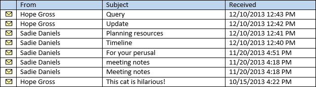
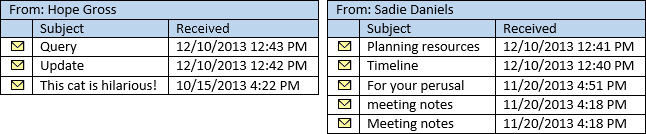
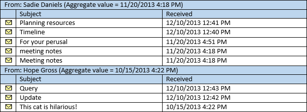

# <a name="perform-grouped-searches-by-using-ews-in-exchange"></a><span data-ttu-id="e67bb-103">Выполнение поиска по сгруппированных с помощью веб-служб Exchange в Exchange</span><span class="sxs-lookup"><span data-stu-id="e67bb-103">Perform grouped searches by using EWS in Exchange</span></span>

<span data-ttu-id="e67bb-104">Узнайте, как выполнять сгруппированных поисков в управляемый API EWS или приложение веб-служб Exchange, предназначенное для Exchange.</span><span class="sxs-lookup"><span data-stu-id="e67bb-104">Find out how to perform grouped searches in your EWS Managed API or EWS application that targets Exchange.</span></span>
  
<span data-ttu-id="e67bb-105">Сгруппированные поисков полезны, в том, что они можно настроить как результатов поиска в организации.</span><span class="sxs-lookup"><span data-stu-id="e67bb-105">Grouped searches are useful in that they gives you control over how search results are organized.</span></span> <span data-ttu-id="e67bb-106">Результаты поиска упорядоченный позволяют упростить для приложения для обработки результатов или они отображаются конечному пользователю управлять ими.</span><span class="sxs-lookup"><span data-stu-id="e67bb-106">Organized search results can make it easier for your application to process results or display them to an end user in a manageable way.</span></span>
  
<span data-ttu-id="e67bb-107">Группировка works, поместив все элементы в наборе результатов, которые имеют одинаковые значения определенного поля в группу.</span><span class="sxs-lookup"><span data-stu-id="e67bb-107">Grouping works by putting all items within the result set that have the same value of a specific field into a group.</span></span> <span data-ttu-id="e67bb-108">К примеру можно сгруппировать результаты по отправителям, все элементы из определенного пользователя будет находиться в отдельной группы и элементов в каждой группе сортируются в порядке, заданная в представлении.</span><span class="sxs-lookup"><span data-stu-id="e67bb-108">For example, you can group your results by the sender, and all items from the same person will be in a separate group, and the items within each group will be sorted according to the order you specify on the view.</span></span> <span data-ttu-id="e67bb-109">Самих групп сортируются по статистического значения на основе выбранного поля.</span><span class="sxs-lookup"><span data-stu-id="e67bb-109">The groups themselves are sorted by an aggregate value based on a field you choose.</span></span>
  
<span data-ttu-id="e67bb-110">**В таблице 1. Управляемый API EWS методы и операции веб-служб Exchange для организации результатов поиска**</span><span class="sxs-lookup"><span data-stu-id="e67bb-110">**Table 1. EWS Managed API methods and EWS operations for organizing search results**</span></span>

|<span data-ttu-id="e67bb-111">**Если вы хотите...**</span><span class="sxs-lookup"><span data-stu-id="e67bb-111">**If you want to…**</span></span>|<span data-ttu-id="e67bb-112">**В управляемый API веб-служб Exchange используйте...**</span><span class="sxs-lookup"><span data-stu-id="e67bb-112">**In the EWS Managed API, use…**</span></span>|<span data-ttu-id="e67bb-113">**В веб-служб Exchange используйте...**</span><span class="sxs-lookup"><span data-stu-id="e67bb-113">**In EWS, use…**</span></span>|
|:-----|:-----|:-----|
|<span data-ttu-id="e67bb-114">Элементы с тем же значением в определенное свойство в результатах Упорядочить по группам</span><span class="sxs-lookup"><span data-stu-id="e67bb-114">Organize items with the same value in a specific property in your results into groups</span></span>  <br/> |[<span data-ttu-id="e67bb-115">Grouping.GroupOn</span><span class="sxs-lookup"><span data-stu-id="e67bb-115">Grouping.GroupOn</span></span>](http://msdn.microsoft.com/ru-ru/library/microsoft.exchange.webservices.data.grouping.groupon%28v=exchg.80%29.aspx) <br/> |<span data-ttu-id="e67bb-116">Элемент [FieldURI](http://msdn.microsoft.com/library/24af8e3b-3074-4c8c-8d0a-52446508d044%28Office.15%29.aspx) как дочерний элемент [GroupBy](http://msdn.microsoft.com/library/9728619b-4674-4b9d-9f6c-e75c6165966c%28Office.15%29.aspx)</span><span class="sxs-lookup"><span data-stu-id="e67bb-116">[FieldURI](http://msdn.microsoft.com/library/24af8e3b-3074-4c8c-8d0a-52446508d044%28Office.15%29.aspx) element as a child of the [GroupBy](http://msdn.microsoft.com/library/9728619b-4674-4b9d-9f6c-e75c6165966c%28Office.15%29.aspx) element</span></span>  <br/> |
|<span data-ttu-id="e67bb-117">Сортировка элементов в каждой группе по значению в определенное свойство</span><span class="sxs-lookup"><span data-stu-id="e67bb-117">Sort items within each group by the value in a specific property</span></span>  <br/> |[<span data-ttu-id="e67bb-118">ItemView.OrderBy</span><span class="sxs-lookup"><span data-stu-id="e67bb-118">ItemView.OrderBy</span></span>](http://msdn.microsoft.com/ru-ru/library/microsoft.exchange.webservices.data.itemview.orderby%28v=exchg.80%29.aspx) <br/> |<span data-ttu-id="e67bb-119">Элемент [SortOrder](http://msdn.microsoft.com/library/c2413f0b-8c03-46ae-9990-13338b3c53a6%28Office.15%29.aspx)</span><span class="sxs-lookup"><span data-stu-id="e67bb-119">[SortOrder](http://msdn.microsoft.com/library/c2413f0b-8c03-46ae-9990-13338b3c53a6%28Office.15%29.aspx) element</span></span>  <br/> |
|<span data-ttu-id="e67bb-120">Сортировать группы</span><span class="sxs-lookup"><span data-stu-id="e67bb-120">Sort the groups</span></span>  <br/> |[<span data-ttu-id="e67bb-121">Grouping.AggregateOn</span><span class="sxs-lookup"><span data-stu-id="e67bb-121">Grouping.AggregateOn</span></span>](http://msdn.microsoft.com/ru-ru/library/microsoft.exchange.webservices.data.grouping.aggregateon%28v=exchg.80%29.aspx) <br/><br/> [<span data-ttu-id="e67bb-122">Grouping.AggregateType</span><span class="sxs-lookup"><span data-stu-id="e67bb-122">Grouping.AggregateType</span></span>](http://msdn.microsoft.com/ru-ru/library/microsoft.exchange.webservices.data.grouping.aggregatetype%28v=exchg.80%29.aspx) <br/><br/> [<span data-ttu-id="e67bb-123">Grouping.SortDirection</span><span class="sxs-lookup"><span data-stu-id="e67bb-123">Grouping.SortDirection</span></span>](http://msdn.microsoft.com/ru-ru/library/microsoft.exchange.webservices.data.grouping.sortdirection%28v=exchg.80%29.aspx) <br/> |<span data-ttu-id="e67bb-124">Элемент **FieldURI** в качестве дочернего для элемента [AggregateOn](http://msdn.microsoft.com/library/9b0a03f2-3282-46e1-b1a0-cbb9a0fbe9bb%28Office.15%29.aspx)</span><span class="sxs-lookup"><span data-stu-id="e67bb-124">**FieldURI** element as a child of the [AggregateOn](http://msdn.microsoft.com/library/9b0a03f2-3282-46e1-b1a0-cbb9a0fbe9bb%28Office.15%29.aspx) element</span></span><br/><br/> <span data-ttu-id="e67bb-125">**Агрегированные** атрибут **AggregateOn** элемента</span><span class="sxs-lookup"><span data-stu-id="e67bb-125">**Aggregate** attribute on the **AggregateOn** element</span></span><br/><br/><span data-ttu-id="e67bb-126">Атрибут **заказа** на элемент **GroupBy**</span><span class="sxs-lookup"><span data-stu-id="e67bb-126">**Order** attribute on the **GroupBy** element</span></span>  <br/> |
   
<span data-ttu-id="e67bb-127">Давайте его пошаговое руководство по.</span><span class="sxs-lookup"><span data-stu-id="e67bb-127">Let's take it step by step.</span></span>
  
## <a name="group-results-by-a-specific-property"></a><span data-ttu-id="e67bb-128">Группа результатов по определенное свойство</span><span class="sxs-lookup"><span data-stu-id="e67bb-128">Group results by a specific property</span></span>
<span data-ttu-id="e67bb-129"><a name="bk_GroupResults"> </a></span><span class="sxs-lookup"><span data-stu-id="e67bb-129"></span></span>

<span data-ttu-id="e67bb-130">— Это первый шаг в использовании группировки выберите свойство или атрибут элементов в хранилище Exchange, по которому выполняется группировка.</span><span class="sxs-lookup"><span data-stu-id="e67bb-130">The first step to using grouping is to select a property, or attribute on the items in the Exchange store, to group by.</span></span> <span data-ttu-id="e67bb-131">Управляемый API веб-служб Exchange предоставляет их в качестве свойств класса на соответствующие классы во время веб-служб Exchange предоставляет их как XML-элементы.</span><span class="sxs-lookup"><span data-stu-id="e67bb-131">The EWS Managed API exposes these as class properties on the corresponding classes, while EWS exposes them as XML elements.</span></span> <span data-ttu-id="e67bb-132">Можно выбрать любое свойство, включая настраиваемые или расширенные свойства, но будет полезно понять, как элементы сгруппированы на основе значения свойства выбранного.</span><span class="sxs-lookup"><span data-stu-id="e67bb-132">You can choose any property, including custom or extended properties, but it is helpful to understand how items are grouped based on the value of the property you choose.</span></span> 

<span data-ttu-id="e67bb-133">Все элементы, которые имеют одинаковые значения в свойстве, выбранное для группировки по будет объединять.</span><span class="sxs-lookup"><span data-stu-id="e67bb-133">All items that have the same value in the property you choose to group by will be grouped together.</span></span> <span data-ttu-id="e67bb-134">Это может показаться очевидны, но это важных сведений.</span><span class="sxs-lookup"><span data-stu-id="e67bb-134">This might seem obvious, but it is an important detail.</span></span> <span data-ttu-id="e67bb-135">Что произойдет, если группировать по свойству даты и времени, например [Item.DateTimeReceived](http://msdn.microsoft.com/ru-ru/library/microsoft.exchange.webservices.data.item.datetimereceived%28v=exchg.80%29.aspx) в управляемый API EWS или элемент [DateTimeReceived](http://msdn.microsoft.com/library/8f489bd4-2434-4d0a-91fe-1b5ba7eb5765%28Office.15%29.aspx) в веб.</span><span class="sxs-lookup"><span data-stu-id="e67bb-135">Consider what happens if you group by a date/time property, such as [Item.DateTimeReceived](http://msdn.microsoft.com/ru-ru/library/microsoft.exchange.webservices.data.item.datetimereceived%28v=exchg.80%29.aspx) in the EWS Managed API, or the [DateTimeReceived](http://msdn.microsoft.com/library/8f489bd4-2434-4d0a-91fe-1b5ba7eb5765%28Office.15%29.aspx) element in EWS.</span></span> <span data-ttu-id="e67bb-136">Назначение может быть упорядочить результаты по группам, с каждой группы, содержащей элементы в тот же день.</span><span class="sxs-lookup"><span data-stu-id="e67bb-136">The intent might be to organize the results into groups, with each group containing items from the same day.</span></span> <span data-ttu-id="e67bb-137">Тем не менее группировки просматривает все значения, которое содержит время.</span><span class="sxs-lookup"><span data-stu-id="e67bb-137">However, grouping looks at the entire value, which includes the time.</span></span> 

<span data-ttu-id="e67bb-138">Конечный результат —, чтобы элементов, полученных в то же время вниз до второго, находятся в свои собственные группы будут группироваться элементы.</span><span class="sxs-lookup"><span data-stu-id="e67bb-138">The end result is that the items will be grouped so that items received at the same time, down to the second, are in their own groups.</span></span> <span data-ttu-id="e67bb-139">Результаты сортируются по всей вероятности в большое число групп с небольшое число элементов в каждой группе.</span><span class="sxs-lookup"><span data-stu-id="e67bb-139">The results will most likely be sorted into a large number of groups with a small number of items in each group.</span></span> 
  
<span data-ttu-id="e67bb-140">Для получения набора с небольшим количеством групп и большего количества элементов в каждой группе результатов, выберите свойство, которое может работать несколько значений, например [EmailMessage.From](http://msdn.microsoft.com/ru-ru/library/microsoft.exchange.webservices.data.emailmessage.from%28v=exchg.80%29.aspx) или [Item.Categories](http://msdn.microsoft.com/ru-ru/library/microsoft.exchange.webservices.data.item.categories%28v=exchg.80%29.aspx) в управляемый API EWS или [из](http://msdn.microsoft.com/library/5a52d644-3677-4049-874c-12bd5c3080dc%28Office.15%29.aspx) или [категории](http://msdn.microsoft.com/library/d84d4927-b524-4e62-bf3d-1f12fec8c21a%28Office.15%29.aspx) в веб-служб Exchange.</span><span class="sxs-lookup"><span data-stu-id="e67bb-140">To get a results set with a smaller number of groups and a larger number of items in each group, choose a property that is likely to have a smaller number of values, such as [EmailMessage.From](http://msdn.microsoft.com/ru-ru/library/microsoft.exchange.webservices.data.emailmessage.from%28v=exchg.80%29.aspx) or [Item.Categories](http://msdn.microsoft.com/ru-ru/library/microsoft.exchange.webservices.data.item.categories%28v=exchg.80%29.aspx) in the EWS Managed API, or [From](http://msdn.microsoft.com/library/5a52d644-3677-4049-874c-12bd5c3080dc%28Office.15%29.aspx) or [Categories](http://msdn.microsoft.com/library/d84d4927-b524-4e62-bf3d-1f12fec8c21a%28Office.15%29.aspx) in EWS.</span></span> <span data-ttu-id="e67bb-141">На следующем рисунке показана список по электронной почте, которые отображаются в папке "Входящие".</span><span class="sxs-lookup"><span data-stu-id="e67bb-141">The following figure shows a list of emails that appear in an Inbox.</span></span> 
  
<span data-ttu-id="e67bb-142">**На рисунке 1. Сообщения в папке "Входящие"**</span><span class="sxs-lookup"><span data-stu-id="e67bb-142">**Figure 1. Messages in an Inbox**</span></span>


  
<span data-ttu-id="e67bb-144">Если группа элементов на рисунке 1 в свойстве **EmailMessage.From** , результатом будет две группы, другая — для сообщений, отправленных пользователем надеюсь полная и один для сообщений, отправленных пользователем Sadie Daniels.</span><span class="sxs-lookup"><span data-stu-id="e67bb-144">If you group the items in Figure 1 by the **EmailMessage.From** property, the result will be two groups, one for messages sent by Hope Gross, and one for messages sent by Sadie Daniels.</span></span> 
  
<span data-ttu-id="e67bb-145">**На рисунке 2. Сообщения, разделенных на группы на основе свойства отправителя**</span><span class="sxs-lookup"><span data-stu-id="e67bb-145">**Figure 2. Messages separated into groups based on the From property**</span></span>


  
## <a name="sort-the-items-within-groups"></a><span data-ttu-id="e67bb-147">Сортировка элементов в группах</span><span class="sxs-lookup"><span data-stu-id="e67bb-147">Sort the items within groups</span></span>
<span data-ttu-id="e67bb-148"><a name="bk_SortItems"> </a></span><span class="sxs-lookup"><span data-stu-id="e67bb-148"></span></span>

<span data-ttu-id="e67bb-149">Можно управлять способ сортировки элементов в каждой группе с помощью свойства [ItemView.OrderBy](http://msdn.microsoft.com/ru-ru/library/microsoft.exchange.webservices.data.itemview.orderby%28v=exchg.80%29.aspx) в управляемый API EWS или элемент [SortOrder](http://msdn.microsoft.com/library/c2413f0b-8c03-46ae-9990-13338b3c53a6%28Office.15%29.aspx) в веб-служб Exchange.</span><span class="sxs-lookup"><span data-stu-id="e67bb-149">You can control how items are sorted within each group by using the [ItemView.OrderBy](http://msdn.microsoft.com/ru-ru/library/microsoft.exchange.webservices.data.itemview.orderby%28v=exchg.80%29.aspx) property in the EWS Managed API, or the [SortOrder](http://msdn.microsoft.com/library/c2413f0b-8c03-46ae-9990-13338b3c53a6%28Office.15%29.aspx) element in EWS.</span></span> <span data-ttu-id="e67bb-150">То же упорядочение применяется к каждой группе.</span><span class="sxs-lookup"><span data-stu-id="e67bb-150">The same ordering applies to each group.</span></span> <span data-ttu-id="e67bb-151">Например Сортировка элементов на рисунке 1 в свойстве **Item.DateTimeReceived** в порядке убывания, элемент, недавно полученные от полная надеюсь будет первым в группе полная надеюсь, и будет элемента, недавно полученные от Sadie Daniels Сначала в группе Sadie Daniels.</span><span class="sxs-lookup"><span data-stu-id="e67bb-151">For example, if you sort the items from Figure 1 by the **Item.DateTimeReceived** property, in descending order, the item most recently received from Hope Gross will be first in the Hope Gross group, and the item most recently received from Sadie Daniels will be first in the Sadie Daniels group.</span></span> <span data-ttu-id="e67bb-152">Легко создавать групп на рисунке 2 еще сортируются таким способом.</span><span class="sxs-lookup"><span data-stu-id="e67bb-152">Conveniently, the groups in Figure 2 are already sorted this way.</span></span> 
  
## <a name="sort-the-groups"></a><span data-ttu-id="e67bb-153">Сортировать группы</span><span class="sxs-lookup"><span data-stu-id="e67bb-153">Sort the groups</span></span>
<span data-ttu-id="e67bb-154"><a name="bk_SortGroups"> </a></span><span class="sxs-lookup"><span data-stu-id="e67bb-154"></span></span>

<span data-ttu-id="e67bb-155">Теперь, когда у вас есть группах сопоставлены, завершающий шаг сортировка самих групп.</span><span class="sxs-lookup"><span data-stu-id="e67bb-155">Now that you have your groups settled, the final step is sorting the groups themselves.</span></span> <span data-ttu-id="e67bb-156">Так как самих групп, не содержащих конкретных значений, процесс группировки должен присвоить значение сортировки для каждой группы.</span><span class="sxs-lookup"><span data-stu-id="e67bb-156">Because the groups themselves have no specific values, the grouping process has to assign a sort value to each group.</span></span> <span data-ttu-id="e67bb-157">Это делается путем объединение значений определенное свойство в каждой группе, указанного в свойстве [Grouping.AggregateOn](http://msdn.microsoft.com/ru-ru/library/microsoft.exchange.webservices.data.grouping.aggregateon%28v=exchg.80%29.aspx) в управляемый API EWS или элемент [FieldURI](http://msdn.microsoft.com/library/24af8e3b-3074-4c8c-8d0a-52446508d044%28Office.15%29.aspx) как дочерний элемент [AggregateOn](http://msdn.microsoft.com/library/9b0a03f2-3282-46e1-b1a0-cbb9a0fbe9bb%28Office.15%29.aspx) в веб-служб Exchange.</span><span class="sxs-lookup"><span data-stu-id="e67bb-157">This is done by aggregation of the values of a specific property within each group, specified by the [Grouping.AggregateOn](http://msdn.microsoft.com/ru-ru/library/microsoft.exchange.webservices.data.grouping.aggregateon%28v=exchg.80%29.aspx) property in the EWS Managed API, or the [FieldURI](http://msdn.microsoft.com/library/24af8e3b-3074-4c8c-8d0a-52446508d044%28Office.15%29.aspx) element as a child of the [AggregateOn](http://msdn.microsoft.com/library/9b0a03f2-3282-46e1-b1a0-cbb9a0fbe9bb%28Office.15%29.aspx) element in EWS.</span></span> <span data-ttu-id="e67bb-158">Свойство [Grouping.AggregateType](http://msdn.microsoft.com/ru-ru/library/microsoft.exchange.webservices.data.grouping.aggregatetype%28v=exchg.80%29.aspx) в управляемый API веб-служб Exchange (или **статистической обработки** атрибута на элемент **AggregateOn** в веб-служб Exchange) задает значение, которое из элементов в каждой группе присваивается значение параметра сортировки для группы, либо Наибольшее значение или наименьшее значение.</span><span class="sxs-lookup"><span data-stu-id="e67bb-158">The [Grouping.AggregateType](http://msdn.microsoft.com/ru-ru/library/microsoft.exchange.webservices.data.grouping.aggregatetype%28v=exchg.80%29.aspx) property in the EWS Managed API (or the **Aggregate** attribute on the **AggregateOn** element in EWS) specifies which value from the items within each group is assigned to the sort value for the group — either the largest value or the smallest value.</span></span> <span data-ttu-id="e67bb-159">И, наконец порядок сортировки (по убыванию или по возрастанию) задается свойство [Grouping.SortDirection](http://msdn.microsoft.com/ru-ru/library/microsoft.exchange.webservices.data.grouping.sortdirection%28v=exchg.80%29.aspx) в управляемый API EWS или атрибут **заказа** на элемент [GroupBy](http://msdn.microsoft.com/library/9728619b-4674-4b9d-9f6c-e75c6165966c%28Office.15%29.aspx) в веб-служб Exchange.</span><span class="sxs-lookup"><span data-stu-id="e67bb-159">Finally, the sort order (descending or ascending) is specified by the [Grouping.SortDirection](http://msdn.microsoft.com/ru-ru/library/microsoft.exchange.webservices.data.grouping.sortdirection%28v=exchg.80%29.aspx) property in the EWS Managed API, or the **Order** attribute on the [GroupBy](http://msdn.microsoft.com/library/9728619b-4674-4b9d-9f6c-e75c6165966c%28Office.15%29.aspx) element in EWS.</span></span> 
  
<span data-ttu-id="e67bb-160">Например если группы из на рисунке 2 сортируются по статистическая обработка в свойстве **Item.DateTimeReceived** , с помощью наименьшее значение и сортировка в порядке убывания элементы возвращаются в том порядке, в показано на рисунке 3.</span><span class="sxs-lookup"><span data-stu-id="e67bb-160">For example, if the groups from Figure 2 are sorted by aggregating on the **Item.DateTimeReceived** property, using the smallest value, and sorting in descending order, the items are returned in the order in shown Figure 3.</span></span> 
  
<span data-ttu-id="e67bb-161">**На рисунке 3. Результаты поиска сгруппированных где группы отсортированы по свойству DateTimeReceived**</span><span class="sxs-lookup"><span data-stu-id="e67bb-161">**Figure 3. Grouped search results with the groups sorted by the DateTimeReceived property**</span></span>


  
<span data-ttu-id="e67bb-163">Далее разделах показано, как можно извлечь группировки и сортировки друг с другом в коде.</span><span class="sxs-lookup"><span data-stu-id="e67bb-163">The next sections show you how you might pull grouping and sorting together in code.</span></span>
  
## <a name="example-perform-a-grouped-search-by-using-the-ews-managed-api"></a><span data-ttu-id="e67bb-164">Пример: Выполнение сгруппированных поиска с помощью управляемого интерфейса API веб-служб Exchange</span><span class="sxs-lookup"><span data-stu-id="e67bb-164">Example: Perform a grouped search by using the EWS Managed API</span></span>
<span data-ttu-id="e67bb-165"><a name="bk_GroupSearchEWSMA"> </a></span><span class="sxs-lookup"><span data-stu-id="e67bb-165"></span></span>

<span data-ttu-id="e67bb-166">Следующие методы управляемый API EWS можно использовать группировки.</span><span class="sxs-lookup"><span data-stu-id="e67bb-166">The following EWS Managed API methods can use grouping:</span></span>
  
- [<span data-ttu-id="e67bb-167">ExchangeService.FindItems</span><span class="sxs-lookup"><span data-stu-id="e67bb-167">ExchangeService.FindItems</span></span>](http://msdn.microsoft.com/ru-ru/library/microsoft.exchange.webservices.data.exchangeservice.finditems%28v=exchg.80%29.aspx)
    
- [<span data-ttu-id="e67bb-168">Folder.FindItems</span><span class="sxs-lookup"><span data-stu-id="e67bb-168">Folder.FindItems</span></span>](http://msdn.microsoft.com/ru-ru/library/microsoft.exchange.webservices.data.folder.finditems%28v=exchg.80%29.aspx)
    
<span data-ttu-id="e67bb-169">В следующем примере используется метод **ExchangeService.FindItems** ; Тем не менее же правила и основные понятия применяются в метод **Folder.FindItems** .</span><span class="sxs-lookup"><span data-stu-id="e67bb-169">The following example uses the **ExchangeService.FindItems** method; however, the same rules and concepts apply to the **Folder.FindItems** method.</span></span> <span data-ttu-id="e67bb-170">В следующем примере определяется метод с именем **GroupItemsByFrom** .</span><span class="sxs-lookup"><span data-stu-id="e67bb-170">In this example, a method called **GroupItemsByFrom** is defined.</span></span> <span data-ttu-id="e67bb-171">Принимает объект [ExchangeService](http://msdn.microsoft.com/ru-ru/library/microsoft.exchange.webservices.data.exchangeservice%28v=exchg.80%29.aspx) и объект [WellKnownFolderName](http://msdn.microsoft.com/ru-ru/library/microsoft.exchange.webservices.data.wellknownfoldername%28v=exchg.80%29.aspx) как параметры.</span><span class="sxs-lookup"><span data-stu-id="e67bb-171">It takes an [ExchangeService](http://msdn.microsoft.com/ru-ru/library/microsoft.exchange.webservices.data.exchangeservice%28v=exchg.80%29.aspx) object and a [WellKnownFolderName](http://msdn.microsoft.com/ru-ru/library/microsoft.exchange.webservices.data.wellknownfoldername%28v=exchg.80%29.aspx) object as parameters.</span></span> <span data-ttu-id="e67bb-172">Он запрашивает первые 50 элементов в папке, сгруппированные по свойству **EmailMessage.From** , отсортированные по свойству **Item.DateTimeReceived** в убывающем порядке.</span><span class="sxs-lookup"><span data-stu-id="e67bb-172">It requests the first 50 items in the folder, grouped by the **EmailMessage.From** property, sorted by the **Item.DateTimeReceived** property in descending order.</span></span> <span data-ttu-id="e67bb-173">Самих групп сортируются по наименьшее значение свойства **Item.DateTimeReceived** на свои элементы в убывающем порядке.</span><span class="sxs-lookup"><span data-stu-id="e67bb-173">The groups themselves are sorted by the smallest **Item.DateTimeReceived** property value on their items, in descending order.</span></span> 
  
<span data-ttu-id="e67bb-174">В этом примере предполагается, что объект **ExchangeService** была ли инициализирована с допустимые значения для свойства [URL-адреса](http://msdn.microsoft.com/ru-ru/library/microsoft.exchange.webservices.data.exchangeservice.url%28v=exchg.80%29.aspx) и [учетных данных](http://msdn.microsoft.com/ru-ru/library/microsoft.exchange.webservices.data.exchangeservicebase.credentials%28v=exchg.80%29.aspx) .</span><span class="sxs-lookup"><span data-stu-id="e67bb-174">This example assumes that the **ExchangeService** object has been initialized with valid values in the [Credentials](http://msdn.microsoft.com/ru-ru/library/microsoft.exchange.webservices.data.exchangeservicebase.credentials%28v=exchg.80%29.aspx) and [Url](http://msdn.microsoft.com/ru-ru/library/microsoft.exchange.webservices.data.exchangeservice.url%28v=exchg.80%29.aspx) properties.</span></span> 
  
```cs
static void GroupItemsByFrom(ExchangeService service, WellKnownFolderName folder)
{
    // Limit the result set to 50 items.
    ItemView view = new ItemView(50);
    view.PropertySet = new PropertySet(ItemSchema.Subject,
                                       ItemSchema.DateTimeReceived,
                                       EmailMessageSchema.From,
                                       ItemSchema.Categories);
    // Item searches do not support Deep traversal.
    view.Traversal = ItemTraversal.Shallow;
    // Specify the sorting done within the groups.
    view.OrderBy.Add(ItemSchema.DateTimeReceived, SortDirection.Descending);
    // Configure grouping.
    Grouping groupByFrom = new Grouping();
    groupByFrom.GroupOn = EmailMessageSchema.From;
    groupByFrom.AggregateOn = ItemSchema.DateTimeReceived;
    groupByFrom.AggregateType = AggregateType.Minimum;
    groupByFrom.SortDirection = SortDirection.Descending;
    try
    {
        GroupedFindItemsResults<Item> results = service.FindItems(folder,
            view, groupByFrom);
        foreach (ItemGroup<Item> group in results.ItemGroups)
        {
            Console.WriteLine("Group: {0}", group.GroupIndex);
            foreach (Item item in group.Items)
            {
                if (item is EmailMessage)
                {
                    EmailMessage message = item as EmailMessage;
                    Console.WriteLine("From: {0}", message.From);
                    Console.WriteLine("Subject: {0}", message.Subject);
                    Console.WriteLine("Id: {0}\n", message.Id.ToString());
                }
            }
        }
    }
    catch (Exception ex)
    {
        Console.WriteLine("Exception while enumerating results: {0}", ex.Message);
    }
}
```

## <a name="example-perform-a-grouped-search-by-using-ews"></a><span data-ttu-id="e67bb-175">Пример: Выполнение сгруппированных поиска с помощью веб-служб Exchange</span><span class="sxs-lookup"><span data-stu-id="e67bb-175">Example: Perform a grouped search by using EWS</span></span>
<span data-ttu-id="e67bb-176"><a name="bk_GroupSearchEWS"> </a></span><span class="sxs-lookup"><span data-stu-id="e67bb-176"></span></span>

<span data-ttu-id="e67bb-177">В следующем примере запрос показывает [FindItem операция](http://msdn.microsoft.com/library/ebad6aae-16e7-44de-ae63-a95b24539729%28Office.15%29.aspx) запроса для первых 50 элементов в папке, сгруппированные по элемент **из** , отсортированные по элемент **DateTimeReceived** в убывающем порядке.</span><span class="sxs-lookup"><span data-stu-id="e67bb-177">The following request example shows a [FindItem operation](http://msdn.microsoft.com/library/ebad6aae-16e7-44de-ae63-a95b24539729%28Office.15%29.aspx) request for the first 50 items in the folder, grouped by the **From** element, sorted by the **DateTimeReceived** element in descending order.</span></span> <span data-ttu-id="e67bb-178">Самих групп сортируются по наименьшее значение элемента **DateTimeReceived** на свои элементы в убывающем порядке.</span><span class="sxs-lookup"><span data-stu-id="e67bb-178">The groups themselves are sorted by the smallest **DateTimeReceived** element value on their items, in descending order.</span></span> 
  
```XML
<?xml version="1.0" encoding="utf-8"?>
<soap:Envelope xmlns:xsi="http://www.w3.org/2001/XMLSchema-instance" 
    xmlns:m="http://schemas.microsoft.com/exchange/services/2006/messages" 
    xmlns:t="http://schemas.microsoft.com/exchange/services/2006/types" 
    xmlns:soap="http://schemas.xmlsoap.org/soap/envelope/">
  <soap:Header>
    <t:RequestServerVersion Version="Exchange2007_SP1" />
    <t:TimeZoneContext>
      <t:TimeZoneDefinition Id="Eastern Standard Time" />
    </t:TimeZoneContext>
  </soap:Header>
  <soap:Body>
    <m:FindItem Traversal="Shallow">
      <m:ItemShape>
        <t:BaseShape>IdOnly</t:BaseShape>
        <t:AdditionalProperties>
          <t:FieldURI FieldURI="item:Subject" />
          <t:FieldURI FieldURI="item:DateTimeReceived" />
          <t:FieldURI FieldURI="message:From" />
          <t:FieldURI FieldURI="item:Categories" />
        </t:AdditionalProperties>
      </m:ItemShape>
      <m:IndexedPageItemView MaxEntriesReturned="50" Offset="0" BasePoint="Beginning" />
      <m:GroupBy Order="Descending">
        <t:FieldURI FieldURI="message:From" />
        <t:AggregateOn Aggregate="Minimum">
          <t:FieldURI FieldURI="item:DateTimeReceived" />
        </t:AggregateOn>
      </m:GroupBy>
      <m:SortOrder>
        <t:FieldOrder Order="Descending">
          <t:FieldURI FieldURI="item:DateTimeReceived" />
        </t:FieldOrder>
      </m:SortOrder>
      <m:ParentFolderIds>
        <t:DistinguishedFolderId Id="inbox" />
      </m:ParentFolderIds>
    </m:FindItem>
  </soap:Body>
</soap:Envelope>
```

<span data-ttu-id="e67bb-179">Сервер возвращает ответ.</span><span class="sxs-lookup"><span data-stu-id="e67bb-179">The server returns the following response.</span></span>
  
```XML
<?xml version="1.0" encoding="utf-8"?>
<s:Envelope xmlns:s="http://schemas.xmlsoap.org/soap/envelope/">
  <s:Header>
    <h:ServerVersionInfo MajorVersion="15" MinorVersion="0" MajorBuildNumber="712" MinorBuildNumber="22" Version="V2_3" 
        xmlns:h="http://schemas.microsoft.com/exchange/services/2006/types" 
        xmlns="http://schemas.microsoft.com/exchange/services/2006/types" 
        xmlns:xsd="http://www.w3.org/2001/XMLSchema" 
        xmlns:xsi="http://www.w3.org/2001/XMLSchema-instance" />
  </s:Header>
  <s:Body xmlns:xsi="http://www.w3.org/2001/XMLSchema-instance" xmlns:xsd="http://www.w3.org/2001/XMLSchema">
    <m:FindItemResponse xmlns:m="http://schemas.microsoft.com/exchange/services/2006/messages" 
      xmlns:t="http://schemas.microsoft.com/exchange/services/2006/types">
      <m:ResponseMessages>
        <m:FindItemResponseMessage ResponseClass="Success">
          <m:ResponseCode>NoError</m:ResponseCode>
          <m:RootFolder IndexedPagingOffset="10" TotalItemsInView="8" IncludesLastItemInRange="true">
            <t:Groups>
              <t:GroupedItems>
                <t:GroupIndex>0</t:GroupIndex>
                <t:Items>
                  <t:Message>
                    <t:ItemId Id="AAMkAGM2..." ChangeKey="CQAAABYA..." />
                    <t:Subject>Planning resources</t:Subject>
                    <t:DateTimeReceived>2013-12-10T17:41:05Z</t:DateTimeReceived>
                    <t:From>
                      <t:Mailbox>
                        <t:Name>Sadie Daniels</t:Name>
                        <t:EmailAddress>/O=FIRST ORGANIZATION/OU=EXCHANGE ADMINISTRATIVE GROUP (FYDIBOHF23SPDLT)/CN=RECIPIENTS/CN=8D84A3F4CBB34D48838A3AECF99795C0-SADIE</t:EmailAddress>
                        <t:RoutingType>EX</t:RoutingType>
                      </t:Mailbox>
                    </t:From>
                  </t:Message>
                  <t:Message>
                    <t:ItemId Id="AAMkAGM2..." ChangeKey="CQAAABYA..." />
                    <t:Subject>Timeline</t:Subject>
                    <t:DateTimeReceived>2013-12-10T17:40:37Z</t:DateTimeReceived>
                    <t:Categories>
                      <t:String>Project</t:String>
                    </t:Categories>
                    <t:From>
                      <t:Mailbox>
                        <t:Name>Sadie Daniels</t:Name>
                        <t:EmailAddress>/O=FIRST ORGANIZATION/OU=EXCHANGE ADMINISTRATIVE GROUP (FYDIBOHF23SPDLT)/CN=RECIPIENTS/CN=8D84A3F4CBB34D48838A3AECF99795C0-SADIE</t:EmailAddress>
                        <t:RoutingType>EX</t:RoutingType>
                      </t:Mailbox>
                    </t:From>
                  </t:Message>
                  <t:Message>
                    <t:ItemId Id="AAMkAGM2..." ChangeKey="CQAAABYA..." />
                    <t:Subject>For your perusal</t:Subject>
                    <t:DateTimeReceived>2013-11-20T21:51:16Z</t:DateTimeReceived>
                    <t:From>
                      <t:Mailbox>
                        <t:Name>Sadie Daniels</t:Name>
                        <t:EmailAddress>/O=FIRST ORGANIZATION/OU=EXCHANGE ADMINISTRATIVE GROUP (FYDIBOHF23SPDLT)/CN=RECIPIENTS/CN=8D84A3F4CBB34D48838A3AECF99795C0-SADIE</t:EmailAddress>
                        <t:RoutingType>EX</t:RoutingType>
                      </t:Mailbox>
                    </t:From>
                  </t:Message>
                  <t:Message>
                    <t:ItemId Id="AAMkAGM2..." ChangeKey="CQAAABYA..." />
                    <t:Subject>meeting notes</t:Subject>
                    <t:DateTimeReceived>2013-11-20T21:18:51Z</t:DateTimeReceived>
                    <t:Categories>
                      <t:String>Blue category</t:String>
                    </t:Categories>
                    <t:From>
                      <t:Mailbox>
                        <t:Name>Sadie Daniels</t:Name>
                        <t:EmailAddress>/O=FIRST ORGANIZATION/OU=EXCHANGE ADMINISTRATIVE GROUP (FYDIBOHF23SPDLT)/CN=RECIPIENTS/CN=8D84A3F4CBB34D48838A3AECF99795C0-SADIE</t:EmailAddress>
                        <t:RoutingType>EX</t:RoutingType>
                      </t:Mailbox>
                    </t:From>
                  </t:Message>
                  <t:Message>
                    <t:ItemId Id="AAMkAGM2..." ChangeKey="CQAAABYA..." />
                    <t:Subject>Meeting notes</t:Subject>
                    <t:DateTimeReceived>2013-11-20T21:18:51Z</t:DateTimeReceived>
                    <t:From>
                      <t:Mailbox>
                        <t:Name>Sadie Daniels</t:Name>
                        <t:EmailAddress>/O=FIRST ORGANIZATION/OU=EXCHANGE ADMINISTRATIVE GROUP (FYDIBOHF23SPDLT)/CN=RECIPIENTS/CN=8D84A3F4CBB34D48838A3AECF99795C0-SADIE</t:EmailAddress>
                        <t:RoutingType>EX</t:RoutingType>
                      </t:Mailbox>
                    </t:From>
                  </t:Message>
                </t:Items>
              </t:GroupedItems>
              <t:GroupedItems>
                <t:GroupIndex>1</t:GroupIndex>
                <t:Items>
                  <t:Message>
                    <t:ItemId Id="AAMkAGM2..." ChangeKey="CQAAABYA..." />
                    <t:Subject>Query</t:Subject>
                    <t:DateTimeReceived>2013-12-10T17:43:15Z</t:DateTimeReceived>
                    <t:From>
                      <t:Mailbox>
                        <t:Name>Hope Gross</t:Name>
                        <t:EmailAddress>/O=FIRST ORGANIZATION/OU=EXCHANGE ADMINISTRATIVE GROUP (FYDIBOHF23SPDLT)/CN=RECIPIENTS/CN=9B55E4100C064D9D8C5F72FF36802ED3-HOPE</t:EmailAddress>
                        <t:RoutingType>EX</t:RoutingType>
                      </t:Mailbox>
                    </t:From>
                  </t:Message>
                  <t:Message>
                    <t:ItemId Id="AAMkAGM2..." ChangeKey="CQAAABYA..." />
                    <t:Subject>Update</t:Subject>
                    <t:DateTimeReceived>2013-12-10T17:42:33Z</t:DateTimeReceived>
                    <t:Categories>
                      <t:String>Project</t:String>
                      <t:String>Blue category</t:String>
                    </t:Categories>
                    <t:From>
                      <t:Mailbox>
                        <t:Name>Hope Gross</t:Name>
                        <t:EmailAddress>/O=FIRST ORGANIZATION/OU=EXCHANGE ADMINISTRATIVE GROUP (FYDIBOHF23SPDLT)/CN=RECIPIENTS/CN=9B55E4100C064D9D8C5F72FF36802ED3-HOPE</t:EmailAddress>
                        <t:RoutingType>EX</t:RoutingType>
                      </t:Mailbox>
                    </t:From>
                  </t:Message>
                  <t:Message>
                    <t:ItemId Id="AAMkAGM2..." ChangeKey="CQAAABYA..." />
                    <t:Subject>This cat is hilarious!</t:Subject>
                    <t:DateTimeReceived>2013-10-15T20:22:12Z</t:DateTimeReceived>
                    <t:From>
                      <t:Mailbox>
                        <t:Name>Hope Gross</t:Name>
                        <t:EmailAddress>/O=FIRST ORGANIZATION/OU=EXCHANGE ADMINISTRATIVE GROUP (FYDIBOHF23SPDLT)/CN=RECIPIENTS/CN=9B55E4100C064D9D8C5F72FF36802ED3-HOPE</t:EmailAddress>
                        <t:RoutingType>EX</t:RoutingType>
                      </t:Mailbox>
                    </t:From>
                  </t:Message>
                </t:Items>
              </t:GroupedItems>
            </t:Groups>
          </m:RootFolder>
        </m:FindItemResponseMessage>
      </m:ResponseMessages>
    </m:FindItemResponse>
  </s:Body>
</s:Envelope>
```

## <a name="version-differences"></a><span data-ttu-id="e67bb-180">Различия версий</span><span class="sxs-lookup"><span data-stu-id="e67bb-180">Version differences</span></span>
<span data-ttu-id="e67bb-181"><a name="bk_VersionDiffs"> </a></span><span class="sxs-lookup"><span data-stu-id="e67bb-181"></span></span>

<span data-ttu-id="e67bb-182">Версии Exchange, начиная с основной номер версии 15 и заканчивая построения 15.0.775.38 возврата **группы** элементов (типа **GroupedItemsType**) вместо [GroupedItems](http://msdn.microsoft.com/library/53170df4-4272-4b37-b23f-cd8e2d4a7396%28Office.15%29.aspx) элементы в ответе SOAP.</span><span class="sxs-lookup"><span data-stu-id="e67bb-182">Versions of Exchange starting with major version 15 and ending with build 15.0.775.38 return **Group** elements (of type **GroupedItemsType**) in place of [GroupedItems](http://msdn.microsoft.com/library/53170df4-4272-4b37-b23f-cd8e2d4a7396%28Office.15%29.aspx) elements in the SOAP response.</span></span> <span data-ttu-id="e67bb-183">Если вы используете управляемый API веб-служб Exchange, это приведет к коллекции [GroupedFindItemsResults.ItemGroups](http://msdn.microsoft.com/ru-ru/library/office/dd633961%28v=exchg.80%29.aspx) 0 объектов.</span><span class="sxs-lookup"><span data-stu-id="e67bb-183">If you are using the EWS Managed API, this will cause the [GroupedFindItemsResults.ItemGroups](http://msdn.microsoft.com/ru-ru/library/office/dd633961%28v=exchg.80%29.aspx) collection to contain 0 objects.</span></span> <span data-ttu-id="e67bb-184">При использовании веб-служб Exchange элементы **группы** должны обрабатываться как элементы **GroupedItems** .</span><span class="sxs-lookup"><span data-stu-id="e67bb-184">If you are using EWS, **Group** elements should be handled as **GroupedItems** elements.</span></span> 
  
<span data-ttu-id="e67bb-185">Версии Exchange, начиная с версии 15 возвращать дополнительные элементы **группы** или **GroupedItems** с помощью атрибута **xsi: nil** значение **true** в ответе SOAP.</span><span class="sxs-lookup"><span data-stu-id="e67bb-185">Versions of Exchange starting with major version 15 return extra **Group** or **GroupedItems** elements with the **xsi:nil** attribute set to **true** in the SOAP response.</span></span> <span data-ttu-id="e67bb-186">Если используется управляемый API веб-служб Exchange, эти дополнительные элементы приведет к [ServiceXmlDeserializationException](http://msdn.microsoft.com/ru-ru/library/microsoft.exchange.webservices.data.servicexmldeserializationexception%28v=exchg.80%29.aspx) исключение.</span><span class="sxs-lookup"><span data-stu-id="e67bb-186">If you are using the EWS Managed API, these extra elements will cause a [ServiceXmlDeserializationException](http://msdn.microsoft.com/ru-ru/library/microsoft.exchange.webservices.data.servicexmldeserializationexception%28v=exchg.80%29.aspx) to be thrown.</span></span> <span data-ttu-id="e67bb-187">Если вы используете веб-служб Exchange, эти дополнительные элементы можно пропустить.</span><span class="sxs-lookup"><span data-stu-id="e67bb-187">If you are using EWS, these extra elements should be ignored.</span></span> 
  
## <a name="see-also"></a><span data-ttu-id="e67bb-188">См. также</span><span class="sxs-lookup"><span data-stu-id="e67bb-188">See also</span></span>

- [<span data-ttu-id="e67bb-189">Поиск и веб-службах Exchange</span><span class="sxs-lookup"><span data-stu-id="e67bb-189">Search and EWS in Exchange</span></span>](search-and-ews-in-exchange.md)    
- [<span data-ttu-id="e67bb-190">ExchangeService.FindItems</span><span class="sxs-lookup"><span data-stu-id="e67bb-190">ExchangeService.FindItems</span></span>](http://msdn.microsoft.com/ru-ru/library/microsoft.exchange.webservices.data.exchangeservice.finditems%28v=exchg.80%29.aspx)    
- [<span data-ttu-id="e67bb-191">Folder.FindItems</span><span class="sxs-lookup"><span data-stu-id="e67bb-191">Folder.FindItems</span></span>](http://msdn.microsoft.com/ru-ru/library/microsoft.exchange.webservices.data.folder.finditems%28v=exchg.80%29.aspx)   
- [<span data-ttu-id="e67bb-192">Класс группировки</span><span class="sxs-lookup"><span data-stu-id="e67bb-192">Grouping class</span></span>](http://msdn.microsoft.com/ru-ru/library/microsoft.exchange.webservices.data.grouping%28v=exchg.80%29.aspx)    
- [<span data-ttu-id="e67bb-193">FindItem Operation</span><span class="sxs-lookup"><span data-stu-id="e67bb-193">FindItem operation</span></span>](http://msdn.microsoft.com/library/ebad6aae-16e7-44de-ae63-a95b24539729%28Office.15%29.aspx)
    

