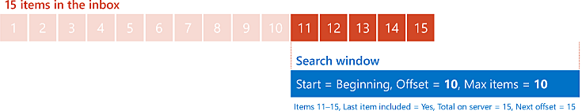
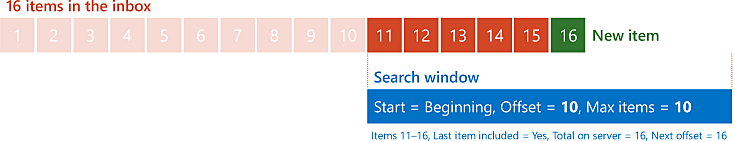
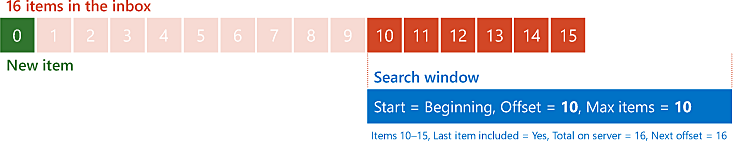

# <a name="perform-paged-searches-by-using-ews-in-exchange"></a><span data-ttu-id="9f4cc-103">Выполнение поиска по выгружаемый с помощью веб-служб Exchange в Exchange</span><span class="sxs-lookup"><span data-stu-id="9f4cc-103">Perform paged searches by using EWS in Exchange</span></span>

<span data-ttu-id="9f4cc-104">Узнайте, как выполнять выгружаемый поисков в управляемый API EWS или приложение веб-служб Exchange, предназначенное для Exchange.</span><span class="sxs-lookup"><span data-stu-id="9f4cc-104">Find out how to perform paged searches in your EWS Managed API or EWS application that targets Exchange.</span></span>
  
<span data-ttu-id="9f4cc-105">Разбиение на страницы — это функция в веб-служб Exchange, которая позволяет контролировать размер результатов поиска.</span><span class="sxs-lookup"><span data-stu-id="9f4cc-105">Paging is a feature in EWS that enables you to control the size of the results of a search.</span></span> <span data-ttu-id="9f4cc-106">А не получить весь результирующий набор в один ответа веб-служб Exchange, вы можете получить меньшего размера в несколько ответов веб-служб Exchange.</span><span class="sxs-lookup"><span data-stu-id="9f4cc-106">Rather than retrieve the entire result set in one EWS response, you can retrieve smaller sets in multiple EWS responses.</span></span> <span data-ttu-id="9f4cc-107">Например рассмотрим пользователя с 10 000 сообщений электронной почты в своей папки "Входящие".</span><span class="sxs-lookup"><span data-stu-id="9f4cc-107">For example, consider a user with 10,000 email messages in their Inbox.</span></span> <span data-ttu-id="9f4cc-108">Гипотетически можно извлечь все 10 000 сообщения электронной почты в один большой ответ, но может потребоваться, разбить на более управляемые фрагменты для повышения производительности и пропускной способности.</span><span class="sxs-lookup"><span data-stu-id="9f4cc-108">Hypothetically, you could retrieve all 10,000 emails in one very large response, but you might want to break that up into more manageable chunks for bandwidth or performance reasons.</span></span> <span data-ttu-id="9f4cc-109">Разбиение на страницы предоставляет средства делать это.</span><span class="sxs-lookup"><span data-stu-id="9f4cc-109">Paging gives you the tools to do just that.</span></span>
  
> [!NOTE]
> <span data-ttu-id="9f4cc-110">Во время гипотетически можно получить 10 000 элементов в один запрос на самом деле, вероятнее всего, не из-за регулирование веб-служб Exchange.</span><span class="sxs-lookup"><span data-stu-id="9f4cc-110">While you can hypothetically retrieve 10,000 items in one request, in reality, this is unlikely due to EWS throttling.</span></span> <span data-ttu-id="9f4cc-111">Чтобы узнать, обратитесь к разделу [регулирование веб-служб Exchange в Exchange](ews-throttling-in-exchange.md).</span><span class="sxs-lookup"><span data-stu-id="9f4cc-111">To find out more, see [EWS throttling in Exchange](ews-throttling-in-exchange.md).</span></span> 
  
<span data-ttu-id="9f4cc-112">**В таблице 1. Параметры разбивки по страницам в управляемый API EWS и веб-служб Exchange**</span><span class="sxs-lookup"><span data-stu-id="9f4cc-112">**Table 1. Paging parameters in the EWS Managed API and EWS**</span></span>

|<span data-ttu-id="9f4cc-113">**Порядок настройки или получить...**</span><span class="sxs-lookup"><span data-stu-id="9f4cc-113">**To configure or retrieve the…**</span></span>|<span data-ttu-id="9f4cc-114">**В управляемый API веб-служб Exchange используйте...**</span><span class="sxs-lookup"><span data-stu-id="9f4cc-114">**In the EWS Managed API, use…**</span></span>|<span data-ttu-id="9f4cc-115">**В веб-служб Exchange используйте...**</span><span class="sxs-lookup"><span data-stu-id="9f4cc-115">**In EWS, use…**</span></span>|
|:-----|:-----|:-----|
|<span data-ttu-id="9f4cc-116">Максимальное количество элементов или папок в ответ</span><span class="sxs-lookup"><span data-stu-id="9f4cc-116">Maximum number of items or folders in a response</span></span>  <br/> |<span data-ttu-id="9f4cc-117">Параметр **pageSize** [Конструктор ItemView](http://msdn.microsoft.com/ru-ru/library/microsoft.exchange.webservices.data.itemview.itemview%28v=exchg.80%29.aspx) или [FolderView конструктор](http://msdn.microsoft.com/ru-ru/library/microsoft.exchange.webservices.data.folderview.folderview%28v=exchg.80%29.aspx)</span><span class="sxs-lookup"><span data-stu-id="9f4cc-117">The **pageSize** parameter to the [ItemView constructor](http://msdn.microsoft.com/ru-ru/library/microsoft.exchange.webservices.data.itemview.itemview%28v=exchg.80%29.aspx) or the [FolderView constructor](http://msdn.microsoft.com/ru-ru/library/microsoft.exchange.webservices.data.folderview.folderview%28v=exchg.80%29.aspx)</span></span> <br/> <span data-ttu-id="9f4cc-118">Или</span><span class="sxs-lookup"><span data-stu-id="9f4cc-118">Or</span></span>  <br/> <span data-ttu-id="9f4cc-119">Свойство [PagedView.PageSize](http://msdn.microsoft.com/ru-ru/library/microsoft.exchange.webservices.data.pagedview.pagesize%28v=exchg.80%29.aspx)</span><span class="sxs-lookup"><span data-stu-id="9f4cc-119">The [PagedView.PageSize](http://msdn.microsoft.com/ru-ru/library/microsoft.exchange.webservices.data.pagedview.pagesize%28v=exchg.80%29.aspx) property</span></span>  <br/> |<span data-ttu-id="9f4cc-120">Атрибут **MaxEntriesReturned** на элемент [IndexedPageItemView](http://msdn.microsoft.com/library/6d1b0b04-cc35-4a57-bd7a-824136d14fda%28Office.15%29.aspx) или элемент [IndexedPageFolderView](http://msdn.microsoft.com/library/c6dac232-244b-4db0-9a15-5e01b8aa7a7d%28Office.15%29.aspx)</span><span class="sxs-lookup"><span data-stu-id="9f4cc-120">The **MaxEntriesReturned** attribute on the [IndexedPageItemView](http://msdn.microsoft.com/library/6d1b0b04-cc35-4a57-bd7a-824136d14fda%28Office.15%29.aspx) element or the [IndexedPageFolderView](http://msdn.microsoft.com/library/c6dac232-244b-4db0-9a15-5e01b8aa7a7d%28Office.15%29.aspx) element</span></span>  <br/> |
|<span data-ttu-id="9f4cc-121">Отправная точка в список элементов и папок</span><span class="sxs-lookup"><span data-stu-id="9f4cc-121">Starting point in the list of items or folders</span></span>  <br/> |<span data-ttu-id="9f4cc-122">Параметр **offsetBasePoint** конструктор **ItemView** или конструктор **FolderView**</span><span class="sxs-lookup"><span data-stu-id="9f4cc-122">The **offsetBasePoint** parameter to the **ItemView** constructor or the **FolderView** constructor</span></span>  <br/> <span data-ttu-id="9f4cc-123">Или</span><span class="sxs-lookup"><span data-stu-id="9f4cc-123">Or</span></span>  <br/> <span data-ttu-id="9f4cc-124">Свойство [PagedView.OffsetBasePoint](http://msdn.microsoft.com/ru-ru/library/microsoft.exchange.webservices.data.pagedview.offsetbasepoint%28v=exchg.80%29.aspx)</span><span class="sxs-lookup"><span data-stu-id="9f4cc-124">The [PagedView.OffsetBasePoint](http://msdn.microsoft.com/ru-ru/library/microsoft.exchange.webservices.data.pagedview.offsetbasepoint%28v=exchg.80%29.aspx) property</span></span>  <br/> |<span data-ttu-id="9f4cc-125">Атрибут **Базисная точка** на элемент **IndexedPageItemView** или элемент **IndexedPageFolderView**</span><span class="sxs-lookup"><span data-stu-id="9f4cc-125">The **BasePoint** attribute on the **IndexedPageItemView** element or the **IndexedPageFolderView** element</span></span>  <br/> |
|<span data-ttu-id="9f4cc-126">Смещение от начальной точки</span><span class="sxs-lookup"><span data-stu-id="9f4cc-126">Offset from the starting point</span></span>  <br/> |<span data-ttu-id="9f4cc-127">Значение параметра **offset** конструктор **ItemView** или конструктор **FolderView**</span><span class="sxs-lookup"><span data-stu-id="9f4cc-127">The **offset** parameter to the **ItemView** constructor or the **FolderView** constructor</span></span>  <br/> <span data-ttu-id="9f4cc-128">Или</span><span class="sxs-lookup"><span data-stu-id="9f4cc-128">Or</span></span>  <br/> <span data-ttu-id="9f4cc-129">Свойство [PagedView.Offset](http://msdn.microsoft.com/ru-ru/library/microsoft.exchange.webservices.data.pagedview.offset%28v=exchg.80%29.aspx)</span><span class="sxs-lookup"><span data-stu-id="9f4cc-129">The [PagedView.Offset](http://msdn.microsoft.com/ru-ru/library/microsoft.exchange.webservices.data.pagedview.offset%28v=exchg.80%29.aspx) property</span></span>  <br/> |<span data-ttu-id="9f4cc-130">Атрибут **смещение** на элемент **IndexedPageItemView** или элемент **IndexedPageFolderView**</span><span class="sxs-lookup"><span data-stu-id="9f4cc-130">The **Offset** attribute on the **IndexedPageItemView** element or the **IndexedPageFolderView** element</span></span>  <br/> |
|<span data-ttu-id="9f4cc-131">Общее число результатов на сервере</span><span class="sxs-lookup"><span data-stu-id="9f4cc-131">Total number of results on the server</span></span>  <br/> |<span data-ttu-id="9f4cc-132">Свойство [FindItemsResults.TotalCount](http://msdn.microsoft.com/ru-ru/library/dd635348%28v=exchg.80%29.aspx) или [FindFoldersResults.TotalCount](http://msdn.microsoft.com/ru-ru/library/microsoft.exchange.webservices.data.findfoldersresults.totalcount%28v=exchg.80%29.aspx)</span><span class="sxs-lookup"><span data-stu-id="9f4cc-132">The [FindItemsResults.TotalCount](http://msdn.microsoft.com/ru-ru/library/dd635348%28v=exchg.80%29.aspx) property or the [FindFoldersResults.TotalCount](http://msdn.microsoft.com/ru-ru/library/microsoft.exchange.webservices.data.findfoldersresults.totalcount%28v=exchg.80%29.aspx) property</span></span>  <br/> |<span data-ttu-id="9f4cc-133">Атрибут **TotalItemsInView** на элемент [RootFolder (FindItemResponseMessage)](http://msdn.microsoft.com/library/187e009f-efaa-42a8-8962-329a645213ab%28Office.15%29.aspx) или элемент [RootFolder (FindFolderResponseMessage)](http://msdn.microsoft.com/library/5089c815-663f-46be-bc59-aed9ee20f94a%28Office.15%29.aspx)</span><span class="sxs-lookup"><span data-stu-id="9f4cc-133">The **TotalItemsInView** attribute on the [RootFolder (FindItemResponseMessage)](http://msdn.microsoft.com/library/187e009f-efaa-42a8-8962-329a645213ab%28Office.15%29.aspx) element or the [RootFolder (FindFolderResponseMessage)](http://msdn.microsoft.com/library/5089c815-663f-46be-bc59-aed9ee20f94a%28Office.15%29.aspx) element</span></span>  <br/> |
|<span data-ttu-id="9f4cc-134">Смещение первого элемента или папки, не включенные в текущий ответ</span><span class="sxs-lookup"><span data-stu-id="9f4cc-134">Offset of first item or folder not included in current response</span></span>  <br/> |<span data-ttu-id="9f4cc-135">Свойство [FindItemsResults.NextPageOffset](http://msdn.microsoft.com/ru-ru/library/ee693014%28v=exchg.80%29.aspx) или [FindFoldersResults.NextPageOffset](http://msdn.microsoft.com/ru-ru/library/microsoft.exchange.webservices.data.findfoldersresults.nextpageoffset%28v=exchg.80%29.aspx)</span><span class="sxs-lookup"><span data-stu-id="9f4cc-135">The [FindItemsResults.NextPageOffset](http://msdn.microsoft.com/ru-ru/library/ee693014%28v=exchg.80%29.aspx) property or the [FindFoldersResults.NextPageOffset](http://msdn.microsoft.com/ru-ru/library/microsoft.exchange.webservices.data.findfoldersresults.nextpageoffset%28v=exchg.80%29.aspx) property</span></span>  <br/> |<span data-ttu-id="9f4cc-136">Атрибут **IndexedPagingOffset** на элемент **RootFolder**</span><span class="sxs-lookup"><span data-stu-id="9f4cc-136">The **IndexedPagingOffset** attribute on the **RootFolder** element</span></span>  <br/> |
|<span data-ttu-id="9f4cc-137">Индикатор ответа включает последнего элемента или папки в список</span><span class="sxs-lookup"><span data-stu-id="9f4cc-137">Indicator that response includes the last item or folder in the list</span></span>  <br/> |<span data-ttu-id="9f4cc-138">Свойство [FindItemsResults.MoreAvailable](http://msdn.microsoft.com/ru-ru/library/dd635477%28v=exchg.80%29.aspx) или [FindFoldersResults.MoreAvailable](http://msdn.microsoft.com/ru-ru/library/microsoft.exchange.webservices.data.findfoldersresults.moreavailable%28v=exchg.80%29.aspx)</span><span class="sxs-lookup"><span data-stu-id="9f4cc-138">The [FindItemsResults.MoreAvailable](http://msdn.microsoft.com/ru-ru/library/dd635477%28v=exchg.80%29.aspx) property or the [FindFoldersResults.MoreAvailable](http://msdn.microsoft.com/ru-ru/library/microsoft.exchange.webservices.data.findfoldersresults.moreavailable%28v=exchg.80%29.aspx) property</span></span>  <br/> |<span data-ttu-id="9f4cc-139">Атрибут **IncludesLastItemInRange** на элемент **RootFolder**</span><span class="sxs-lookup"><span data-stu-id="9f4cc-139">The **IncludesLastItemInRange** attribute on the **RootFolder** element</span></span>  <br/> |
   
## <a name="how-paging-works"></a><span data-ttu-id="9f4cc-140">Как работает разбиение на страницы</span><span class="sxs-lookup"><span data-stu-id="9f4cc-140">How paging works</span></span>
<span data-ttu-id="9f4cc-141"><a name="bk_HowPagingWorks"> </a></span><span class="sxs-lookup"><span data-stu-id="9f4cc-141"></span></span>

<span data-ttu-id="9f4cc-142">Чтобы понять, как работает разбиение на страницы, будет полезно представить сообщений в папке как реклама на стендах разместить рядом друг с другом в поле за пределами дома.</span><span class="sxs-lookup"><span data-stu-id="9f4cc-142">To understand how paging works, it's helpful to visualize the messages in a folder as billboards lined up side by side in a field outside your house.</span></span> <span data-ttu-id="9f4cc-143">Вы можете увидеть некоторые из этих Реклама на стендах через магического окно.</span><span class="sxs-lookup"><span data-stu-id="9f4cc-143">You can see some of these billboards through a magical window.</span></span> <span data-ttu-id="9f4cc-144">У вас есть возможность изменять размер окна (для одновременного просмотра большего или меньшего числа Реклама на стендах) и переместить окно (для управления какой Реклама на стендах, могут видеть).</span><span class="sxs-lookup"><span data-stu-id="9f4cc-144">You have the ability to change the size of the window (to see more or fewer billboards at once) and to move the window (to control which billboards you can see).</span></span> <span data-ttu-id="9f4cc-145">В этом манипуляции окна подкачки.</span><span class="sxs-lookup"><span data-stu-id="9f4cc-145">This manipulation of the window is paging.</span></span> 
  
<span data-ttu-id="9f4cc-146">При отправке запроса на сервере Exchange, укажите размер окна с точки зрения количества элементов для возврата.</span><span class="sxs-lookup"><span data-stu-id="9f4cc-146">When you send your request to the Exchange server, you specify the size of your window in terms of how many items to return.</span></span> <span data-ttu-id="9f4cc-147">Задать позицию окна, путем указания начальной точки либо (начало строки) или в конце строки и смещение из этого отправной точки, выраженная в количестве элементов.</span><span class="sxs-lookup"><span data-stu-id="9f4cc-147">You set the position of the window by specifying a starting point (either the beginning of the line or the end of the line) and an offset from that starting point, expressed in a number of items.</span></span> <span data-ttu-id="9f4cc-148">В начало окна — это число элементов, указанных с учетом смещения от начальной точки.</span><span class="sxs-lookup"><span data-stu-id="9f4cc-148">The beginning of the window is the number of items specified by the offset from the starting point.</span></span>
  
<span data-ttu-id="9f4cc-149">Где разбиение на страницы получает несколько интересных — в ответ сервера, а также как приложения могут использовать этот ответ для фигуры его следующего запроса.</span><span class="sxs-lookup"><span data-stu-id="9f4cc-149">Where paging gets a bit more interesting is in the server's response, and how your application can use that response to shape its next request.</span></span> <span data-ttu-id="9f4cc-150">Сервер предоставляет три свойства, которые можно использовать для определения способа настройки «окна» для следующего запроса:</span><span class="sxs-lookup"><span data-stu-id="9f4cc-150">The server gives you three pieces of information that you can use to determine how to configure your "window" for your next request:</span></span> 
  
- <span data-ttu-id="9f4cc-151">Ли результаты в ответе содержат последнего элемента в общей результирующий набор на сервере.</span><span class="sxs-lookup"><span data-stu-id="9f4cc-151">Whether the results in the response include the last item in the overall result set on the server.</span></span>
    
- <span data-ttu-id="9f4cc-152">Общее число элементов в результирующем наборе на сервере.</span><span class="sxs-lookup"><span data-stu-id="9f4cc-152">The total number of items in the result set on the server.</span></span>
    
- <span data-ttu-id="9f4cc-153">Что далее значение смещения следует, чтобы перейти к следующему элементу в наборе результатов, не включенные в текущий ответ окна.</span><span class="sxs-lookup"><span data-stu-id="9f4cc-153">What the next offset value should be, if you want to advance your window to the next item in the result set that isn't included in the current response.</span></span>
    
<span data-ttu-id="9f4cc-154">Рассмотрим простой пример.</span><span class="sxs-lookup"><span data-stu-id="9f4cc-154">Let's look at a simple example.</span></span> <span data-ttu-id="9f4cc-155">Например, вы можете с 15 сообщений в его папки «Входящие».</span><span class="sxs-lookup"><span data-stu-id="9f4cc-155">Imagine an Inbox with 15 messages in it.</span></span> <span data-ttu-id="9f4cc-156">Приложение отправляет начального запроса для извлечения не более 10 элементов, начиная с начала списка сообщений (чтобы смещение равно нулю).</span><span class="sxs-lookup"><span data-stu-id="9f4cc-156">Your application sends an initial request to retrieve a maximum of 10 items, starting at the beginning of the list of messages (so the offset is zero).</span></span> <span data-ttu-id="9f4cc-157">Сервер отвечает кодом первые 10 сообщений и указывает, что ответ не включает последнего элемента, что всего их 15 элементов, и что следующего смещения должна быть 10.</span><span class="sxs-lookup"><span data-stu-id="9f4cc-157">The server responds with the first 10 messages, and indicates that the response does not include the last item, that there are a total of 15 items, and that the next offset should be 10.</span></span>
  
<span data-ttu-id="9f4cc-158">**На рисунке 1. Запроса 10 элементов с нулевым смещением от начала списка 15 элементов**</span><span class="sxs-lookup"><span data-stu-id="9f4cc-158">**Figure 1. Requesting 10 items at offset 0 from the beginning of a list of 15 items**</span></span>


  
<span data-ttu-id="9f4cc-160">Затем приложение выполняется повторная отправка же запрос к серверу при изменении только, что смещение теперь — 10.</span><span class="sxs-lookup"><span data-stu-id="9f4cc-160">Your application then resends the same request to the server, with the only change being that the offset is now 10.</span></span> <span data-ttu-id="9f4cc-161">Сервер возвращает последние пять элементов и указывает, что ответ включают последнего элемента, что всего их 15 элементов, и что следующего смещения должен быть 15 (хотя Конечно, вы достигнут конец, поэтому не может быть следующего смещения.)</span><span class="sxs-lookup"><span data-stu-id="9f4cc-161">The server returns the last five items, and indicates that the response does include the last item, that there are a total of 15 items, and that the next offset should be 15 (though of course, you've reached the end, so there won't be a next offset.)</span></span>
  
<span data-ttu-id="9f4cc-162">**На рисунке 2. Запроса 10 элементов с нулевым смещением от начала списка 15 элементов**</span><span class="sxs-lookup"><span data-stu-id="9f4cc-162">**Figure 2. Requesting 10 items at offset 10 from the beginning of a list of 15 items**</span></span>


  
## <a name="design-considerations-for-paging"></a><span data-ttu-id="9f4cc-164">Рекомендации по проектированию для разбивки по страницам</span><span class="sxs-lookup"><span data-stu-id="9f4cc-164">Design considerations for paging</span></span>
<span data-ttu-id="9f4cc-165"><a name="bk_DesignConsiderations"> </a></span><span class="sxs-lookup"><span data-stu-id="9f4cc-165"></span></span>

<span data-ttu-id="9f4cc-166">Максимально эффективно разбиение на страницы в приложении требуются некоторые внимание.</span><span class="sxs-lookup"><span data-stu-id="9f4cc-166">Making the most out of paging in your application does require some consideration.</span></span> <span data-ttu-id="9f4cc-167">Например ограничениями на максимальный размер необходимо сделать «окна»?</span><span class="sxs-lookup"><span data-stu-id="9f4cc-167">For example, how large do you make your "window"?</span></span> <span data-ttu-id="9f4cc-168">Что делать, если изменить результаты на сервере при перемещении «окна»?</span><span class="sxs-lookup"><span data-stu-id="9f4cc-168">What do you do if the results on the server change while you're moving your "window"?</span></span>
  
### <a name="determine-the-size-of-your-window"></a><span data-ttu-id="9f4cc-169">Определите размер окна</span><span class="sxs-lookup"><span data-stu-id="9f4cc-169">Determine the size of your window</span></span>

<span data-ttu-id="9f4cc-170">Нет нет «универсальная» максимальное число элементов, которые следует использовать все приложения.</span><span class="sxs-lookup"><span data-stu-id="9f4cc-170">There is no "one-size-fits-all" maximum number of entries that all applications should use.</span></span> <span data-ttu-id="9f4cc-171">Определение числа, необходимой для приложения зависит от нескольких различных факторов.</span><span class="sxs-lookup"><span data-stu-id="9f4cc-171">Determining the number that's right for your application depends on several different factors.</span></span> <span data-ttu-id="9f4cc-172">Тем не менее будет полезно необходимо помнить следующее:</span><span class="sxs-lookup"><span data-stu-id="9f4cc-172">However, it's helpful to keep the following guidelines in mind:</span></span>
  
- <span data-ttu-id="9f4cc-173">По умолчанию Exchange ограничивает максимальное число элементов, которые могут быть возвращены в одном запросе до 1000.</span><span class="sxs-lookup"><span data-stu-id="9f4cc-173">By default, Exchange limits the maximum number of items that can be returned in a single request to 1000.</span></span>
    
- <span data-ttu-id="9f4cc-174">Установка максимальное число записей для большего число результатов в без отправки меньшее число запросов, чтобы получить все элементы, за счет того, чтобы больше ожидать ответа.</span><span class="sxs-lookup"><span data-stu-id="9f4cc-174">Setting the maximum number of entries to a larger number results in having to send fewer requests to get all items, at the cost of having to wait longer for responses.</span></span>
    
- <span data-ttu-id="9f4cc-175">Установка максимальное число записей меньшее число результатов для ускорения времени отклика, но при этом необходимости отправки нескольких запросов для получения всех элементов.</span><span class="sxs-lookup"><span data-stu-id="9f4cc-175">Setting the maximum number of entries to a smaller number results in quicker response times, at the cost of having to send more requests to get all items.</span></span>
    
### <a name="handling-changes-to-the-result-set"></a><span data-ttu-id="9f4cc-176">Обработка изменений в наборе результатов</span><span class="sxs-lookup"><span data-stu-id="9f4cc-176">Handling changes to the result set</span></span>

<span data-ttu-id="9f4cc-177">В простой пример ранее в этой статье количество элементов в папке "Входящие" пользователя оставались константу.</span><span class="sxs-lookup"><span data-stu-id="9f4cc-177">In the simple example earlier in this article, the number of items in the user's Inbox remained constant.</span></span> <span data-ttu-id="9f4cc-178">Тем не менее на самом деле, количество элементов в папке "Входящие" можно изменить часто.</span><span class="sxs-lookup"><span data-stu-id="9f4cc-178">However, in reality, the number of items in an Inbox can change frequently.</span></span> <span data-ttu-id="9f4cc-179">Новые сообщения могут поступать и элементов можно удалить или переместить в любое время.</span><span class="sxs-lookup"><span data-stu-id="9f4cc-179">New messages can arrive and items can be deleted or moved at any time.</span></span> <span data-ttu-id="9f4cc-180">Но как листание воздействия?</span><span class="sxs-lookup"><span data-stu-id="9f4cc-180">But how does this impact paging?</span></span> <span data-ttu-id="9f4cc-181">Изменим более ранних пример сценария можно найти сведения.</span><span class="sxs-lookup"><span data-stu-id="9f4cc-181">Let's modify the earlier example scenario to find out.</span></span>
  
<span data-ttu-id="9f4cc-182">Мы будем еще раз запустите с 15 элементов в папке "Входящие" пользователя и отправить же начального запроса.</span><span class="sxs-lookup"><span data-stu-id="9f4cc-182">We'll start again with the 15 items in the user's Inbox, and send the same initial request.</span></span> <span data-ttu-id="9f4cc-183">Как до, сервер отвечает кодом первые 10 сообщений и указывает, что ответ не включает последнего элемента, что всего их 15 элементов, и что следующего смещения должна быть 10, как показано на рисунке 1.</span><span class="sxs-lookup"><span data-stu-id="9f4cc-183">As before, the server responds with the first 10 messages, and indicates that the response does not include the last item, that there are a total of 15 items, and that the next offset should be 10, as shown in Figure 1.</span></span>
  
<span data-ttu-id="9f4cc-184">Теперь во время приложения эти 10 элементов, новое сообщение поступает в папке "Входящие" и добавляется в результирующем наборе на сервере.</span><span class="sxs-lookup"><span data-stu-id="9f4cc-184">Now, while your application is processing those 10 items, a new message arrives in the Inbox and is added to the result set on the server.</span></span> <span data-ttu-id="9f4cc-185">Приложение выполняется повторная отправка одного запроса к серверу (только со смещением, равным 10).</span><span class="sxs-lookup"><span data-stu-id="9f4cc-185">Your application resends the same request to the server (only with the offset set to 10).</span></span> <span data-ttu-id="9f4cc-186">Данный момент сервер получает обратно шесть элементов и означает, что всего 16 элементов в наборе результатов.</span><span class="sxs-lookup"><span data-stu-id="9f4cc-186">This time the server gets back six items, and indicates that there are a total of 16 items in the result set.</span></span>
  
<span data-ttu-id="9f4cc-187">На этом этапе может возникнуть вопрос, если это еще проблем.</span><span class="sxs-lookup"><span data-stu-id="9f4cc-187">At this point you might be wondering if this is even a problem.</span></span> <span data-ttu-id="9f4cc-188">В конце концов, полученный 16 элементов обратно через две ответы так почему усилиями?</span><span class="sxs-lookup"><span data-stu-id="9f4cc-188">After all, you got 16 items back over the two responses, so why all the fuss?</span></span> <span data-ttu-id="9f4cc-189">Ответ зависит от того, где в списке помещается новый элемент.</span><span class="sxs-lookup"><span data-stu-id="9f4cc-189">The answer depends on where in the list the new item is placed.</span></span> <span data-ttu-id="9f4cc-190">Если список сортируется таким образом, самые старые элементы (по времени и дате получения) первого, нет не причина для вопросов в этом сценарии.</span><span class="sxs-lookup"><span data-stu-id="9f4cc-190">If the list is sorted so that the oldest items (by received date/time) are first, there's no cause for concern in this scenario.</span></span> <span data-ttu-id="9f4cc-191">Новый элемент будет помещен в конце списка и будет включено в второй ответ.</span><span class="sxs-lookup"><span data-stu-id="9f4cc-191">The new item will be placed at the end of the list, and will be included in the second response.</span></span>
  
<span data-ttu-id="9f4cc-192">**На рисунке 3. Запроса 10 элементов с нулевым смещением от начала списка, состоящего из 16 элементов с 16-й элемент в списке, новый**</span><span class="sxs-lookup"><span data-stu-id="9f4cc-192">**Figure 3. Requesting 10 items at offset 10 from the beginning of a list of 16 items, with the 16th item in the list being new**</span></span>


  
<span data-ttu-id="9f4cc-194">Если список сортируется таким образом, первый новых элементов, — это различных сценариев.</span><span class="sxs-lookup"><span data-stu-id="9f4cc-194">If the list is sorted so that the newest items are first, it's a different story.</span></span> <span data-ttu-id="9f4cc-195">В этом случае первый элемент в второй запрос будет последний элемент из предыдущего запроса, а также оставшиеся пять элементов из исходного 15.</span><span class="sxs-lookup"><span data-stu-id="9f4cc-195">In this case, the first item in the second request would be the last item from the previous request plus the remaining five items from the original 15.</span></span> <span data-ttu-id="9f4cc-196">Чтобы собрать это с точки зрения мнимой магического окна, вы сдвинуто позицию в вашем окне 10, но Реклама на стендах сами также переходят на 1.</span><span class="sxs-lookup"><span data-stu-id="9f4cc-196">To put it in terms of our imaginary magical window, you shifted your window's position by 10, but the billboards themselves also shifted by 1.</span></span>
  
<span data-ttu-id="9f4cc-197">**На рисунке 4. Запроса 10 элементов с нулевым смещением от начала списка, состоящего из 16 элементов с первый элемент в списке, новый**</span><span class="sxs-lookup"><span data-stu-id="9f4cc-197">**Figure 4. Requesting 10 items at offset 10 from the beginning of a list of 16 items, with the first item in the list being new**</span></span>


  
<span data-ttu-id="9f4cc-199">Одним из способов для обнаружения изменений в результаты на сервере является использование концепции элемент привязки.</span><span class="sxs-lookup"><span data-stu-id="9f4cc-199">One way to detect a change to the results on the server is to use the concept of an anchor item.</span></span> <span data-ttu-id="9f4cc-200">Элемент привязки — это дополнительные элемента в ответ, который не обрабатывается наряду с результатов, но используется для сравнения с помощью следующего результатов, чтобы просмотреть, если сами элементы изменились.</span><span class="sxs-lookup"><span data-stu-id="9f4cc-200">An anchor item is an additional item in your response that is not processed along with the rest of the results, but is used to compare with the next results to see if the items themselves have shifted.</span></span> <span data-ttu-id="9f4cc-201">Построение еще раз в нашем примере, если приложение использует размер «окна» 10, вы фактически задать максимальное число элементов, чтобы вернуться на 11.</span><span class="sxs-lookup"><span data-stu-id="9f4cc-201">Building again on our simple example, if your application is using a "window" size of 10, you actually set the maximum number of items to return to 11.</span></span> <span data-ttu-id="9f4cc-202">Приложение обрабатывает первых 10 элементов в ответе как обычно.</span><span class="sxs-lookup"><span data-stu-id="9f4cc-202">Your application processes the first 10 items in the response as usual.</span></span> <span data-ttu-id="9f4cc-203">Для последнего элемента сохранение идентификатор элемента в качестве привязки, затем выполнить следующий запрос со смещением 10.</span><span class="sxs-lookup"><span data-stu-id="9f4cc-203">For the last item, you save the item's identifier as an anchor, then issue the next request with an offset of 10.</span></span> <span data-ttu-id="9f4cc-204">Если данные не был изменен, первый элемент в второй ответ должен иметь идентификатор элемента, которая соответствует привязки.</span><span class="sxs-lookup"><span data-stu-id="9f4cc-204">If the data has not changed, the first item in the second response should have an item identifier that matches the anchor.</span></span> <span data-ttu-id="9f4cc-205">Идентификаторы элементов не совпадают, известно, что данные удалены или вставлен в частях списка, вы уже «разбитым на страницы» через.</span><span class="sxs-lookup"><span data-stu-id="9f4cc-205">If the item identifiers don't match, you know that the data has been removed or inserted in the parts of the list you have already "paged" over.</span></span>
  
<span data-ttu-id="9f4cc-206">Даже когда вы знаете, что данные были изменены, по-прежнему необходимо решить, как для выполнения действий.</span><span class="sxs-lookup"><span data-stu-id="9f4cc-206">Even when you know that the data has changed, you still need to decide how to react.</span></span> <span data-ttu-id="9f4cc-207">Либо не универсальная ответить на этот вопрос.</span><span class="sxs-lookup"><span data-stu-id="9f4cc-207">There isn't a one-size-fits-all answer for this question either.</span></span> <span data-ttu-id="9f4cc-208">Действия пользователя будут зависеть от характера приложения и как важна для захвата всех элементов.</span><span class="sxs-lookup"><span data-stu-id="9f4cc-208">Your actions will depend on the nature of your application and how critical it is to capture all items.</span></span> <span data-ttu-id="9f4cc-209">Может игнорировать полностью, перезапустите процесс с самого начала или резервного отслеживание и пытается определить, где произошло изменение.</span><span class="sxs-lookup"><span data-stu-id="9f4cc-209">You might ignore it altogether, restart the process from the beginning, or back track and try to detect where the change happened.</span></span>
  
## <a name="example-perform-a-paged-search-by-using-the-ews-managed-api"></a><span data-ttu-id="9f4cc-210">Пример: Выполнение выгружаемый поиска с помощью управляемого интерфейса API веб-служб Exchange</span><span class="sxs-lookup"><span data-stu-id="9f4cc-210">Example: Perform a paged search by using the EWS Managed API</span></span>
<span data-ttu-id="9f4cc-211"><a name="bk_PagedSearchEWSMA"> </a></span><span class="sxs-lookup"><span data-stu-id="9f4cc-211"></span></span>

<span data-ttu-id="9f4cc-212">Разбиение по страницам поддерживается следующими методами управляемый API EWS:</span><span class="sxs-lookup"><span data-stu-id="9f4cc-212">Paging is supported by the following EWS Managed API methods:</span></span>
  
- [<span data-ttu-id="9f4cc-213">ExchangeService.FindFolders</span><span class="sxs-lookup"><span data-stu-id="9f4cc-213">ExchangeService.FindFolders</span></span>](http://msdn.microsoft.com/ru-ru/library/microsoft.exchange.webservices.data.exchangeservice.findfolders%28v=exchg.80%29.aspx)
    
- [<span data-ttu-id="9f4cc-214">ExchangeService.FindItems</span><span class="sxs-lookup"><span data-stu-id="9f4cc-214">ExchangeService.FindItems</span></span>](http://msdn.microsoft.com/ru-ru/library/microsoft.exchange.webservices.data.exchangeservice.finditems%28v=exchg.80%29.aspx)
    
- [<span data-ttu-id="9f4cc-215">Folder.FindFolders</span><span class="sxs-lookup"><span data-stu-id="9f4cc-215">Folder.FindFolders</span></span>](http://msdn.microsoft.com/ru-ru/library/microsoft.exchange.webservices.data.folder.findfolders%28v=exchg.80%29.aspx)
    
- [<span data-ttu-id="9f4cc-216">Folder.FindFolders</span><span class="sxs-lookup"><span data-stu-id="9f4cc-216">Folder.FindFolders</span></span>](http://msdn.microsoft.com/ru-ru/library/microsoft.exchange.webservices.data.folder.finditems%28v=exchg.80%29.aspx)
    
<span data-ttu-id="9f4cc-217">При использовании управляемого интерфейса API EWS приложения настраивает разбиение на страницы с классом [ItemView](http://msdn.microsoft.com/ru-ru/library/microsoft.exchange.webservices.data.itemview%28v=exchg.80%29.aspx) или [FolderView](http://msdn.microsoft.com/ru-ru/library/microsoft.exchange.webservices.data.folderview%28v=exchg.80%29.aspx) и получает данные с сервера в отношении разбиение на страницы из [FindItemsResults](http://msdn.microsoft.com/ru-ru/library/dd635381%28v=exchg.80%29.aspx) или [FindFoldersResults](http://msdn.microsoft.com/ru-ru/library/microsoft.exchange.webservices.data.findfoldersresults%28v=exchg.80%29.aspx) класс.</span><span class="sxs-lookup"><span data-stu-id="9f4cc-217">If you are using the EWS Managed API, your application configures paging with the [ItemView](http://msdn.microsoft.com/ru-ru/library/microsoft.exchange.webservices.data.itemview%28v=exchg.80%29.aspx) or [FolderView](http://msdn.microsoft.com/ru-ru/library/microsoft.exchange.webservices.data.folderview%28v=exchg.80%29.aspx) class and receives information from the server regarding paging from the [FindItemsResults](http://msdn.microsoft.com/ru-ru/library/dd635381%28v=exchg.80%29.aspx) or [FindFoldersResults](http://msdn.microsoft.com/ru-ru/library/microsoft.exchange.webservices.data.findfoldersresults%28v=exchg.80%29.aspx) class.</span></span> 
  
<span data-ttu-id="9f4cc-218">В следующем примере извлекается всех элементов в папке с помощью выгружаемый поиска, которое возвращает пять элементов в каждой ответ.</span><span class="sxs-lookup"><span data-stu-id="9f4cc-218">The following example retrieves all the items in a folder using a paged search that returns five items in each response.</span></span> <span data-ttu-id="9f4cc-219">Он также получает дополнительные элемента в качестве привязки для обнаружения изменений в результаты на сервере.</span><span class="sxs-lookup"><span data-stu-id="9f4cc-219">It also retrieves an additional item to serve as an anchor to detect changes to the results on the server.</span></span> 
  
<span data-ttu-id="9f4cc-220">В этом примере предполагается, что объект **ExchangeService** была ли инициализирована с допустимые значения для свойства [URL-адреса](http://msdn.microsoft.com/ru-ru/library/microsoft.exchange.webservices.data.exchangeservice.url%28v=exchg.80%29.aspx) и [учетных данных](http://msdn.microsoft.com/ru-ru/library/microsoft.exchange.webservices.data.exchangeservicebase.credentials%28v=exchg.80%29.aspx) .</span><span class="sxs-lookup"><span data-stu-id="9f4cc-220">This example assumes that the **ExchangeService** object has been initialized with valid values in the [Credentials](http://msdn.microsoft.com/ru-ru/library/microsoft.exchange.webservices.data.exchangeservicebase.credentials%28v=exchg.80%29.aspx) and [Url](http://msdn.microsoft.com/ru-ru/library/microsoft.exchange.webservices.data.exchangeservice.url%28v=exchg.80%29.aspx) properties.</span></span> 
  
```cs
using Microsoft.Exchange.WebServices.Data;
static void PageSearchItems(ExchangeService service, WellKnownFolderName folder)
{
    int pageSize = 5;
    int offset = 0;
    // Request one more item than your actual pageSize.
    // This will be used to detect a change to the result
    // set while paging.
    ItemView view = new ItemView(pageSize + 1, offset);
    view.PropertySet = new PropertySet(ItemSchema.Subject);
    view.OrderBy.Add(ItemSchema.DateTimeReceived, SortDirection.Descending);
    view.Traversal = ItemTraversal.Shallow;
    bool moreItems = true;
    ItemId anchorId = null;
    while (moreItems)
    {
        try
        {
            FindItemsResults<Item> results = service.FindItems(folder, view);
            moreItems = results.MoreAvailable;
            if (moreItems &amp;&amp; anchorId != null)
            {
                // Check the first result to make sure it matches
                // the last result (anchor) from the previous page.
                // If it doesn't, that means that something was added
                // or deleted since you started the search.
                if (results.Items.First<Item>().Id != anchorId)
                {
                    Console.WriteLine("The collection has changed while paging. Some results may be missed.");
                }
            }
            if (moreItems)
                view.Offset += pageSize;
            anchorId = results.Items.Last<Item>().Id;
            // Because you're including an additional item on the end of your results
            // as an anchor, you don't want to display it.
            // Set the number to loop as the smaller value between
            // the number of items in the collection and the page size.
            int displayCount = results.Items.Count > pageSize ? pageSize : results.Items.Count;
            for (int i = 0; i < displayCount; i++)
            {
                Item item = results.Items[i];
                Console.WriteLine("Subject: {0}", item.Subject);
                Console.WriteLine("Id: {0}\n", item.Id.ToString());
            }
        }
        catch (Exception ex)
        {
            Console.WriteLine("Exception while paging results: {0}", ex.Message);
        }
    }
}
```

## <a name="example-perform-a-paged-search-by-using-ews"></a><span data-ttu-id="9f4cc-221">Пример: Выполнение выгружаемый поиска с помощью веб-служб Exchange</span><span class="sxs-lookup"><span data-stu-id="9f4cc-221">Example: Perform a paged search by using EWS</span></span>
<span data-ttu-id="9f4cc-222"><a name="bk_PagedSearchEWS"> </a></span><span class="sxs-lookup"><span data-stu-id="9f4cc-222"></span></span>

<span data-ttu-id="9f4cc-223">Разбиение на страницы поддерживает следующие операции веб-служб Exchange.</span><span class="sxs-lookup"><span data-stu-id="9f4cc-223">Paging is supported by the following EWS operations:</span></span>
  
- [<span data-ttu-id="9f4cc-224">FindFolder</span><span class="sxs-lookup"><span data-stu-id="9f4cc-224">FindFolder</span></span>](http://msdn.microsoft.com/library/7a9855aa-06cc-45ba-ad2a-645c15b7d031%28Office.15%29.aspx)
    
- [<span data-ttu-id="9f4cc-225">FindItem</span><span class="sxs-lookup"><span data-stu-id="9f4cc-225">FindItem</span></span>](http://msdn.microsoft.com/library/ebad6aae-16e7-44de-ae63-a95b24539729%28Office.15%29.aspx)
    
<span data-ttu-id="9f4cc-226">Если вы используете веб-служб Exchange, приложения настраивает разбиение на страницы элемент [IndexedPageItemView](http://msdn.microsoft.com/library/6d1b0b04-cc35-4a57-bd7a-824136d14fda%28Office.15%29.aspx) или элемент [IndexedPageFolderView](http://msdn.microsoft.com/library/c6dac232-244b-4db0-9a15-5e01b8aa7a7d%28Office.15%29.aspx) и получает данные с сервера в отношении разбиение на страницы из [RootFolder () FindItemResponseMessage)](http://msdn.microsoft.com/library/187e009f-efaa-42a8-8962-329a645213ab%28Office.15%29.aspx) или элемент [RootFolder (FindFolderResponseMessage)](http://msdn.microsoft.com/library/5089c815-663f-46be-bc59-aed9ee20f94a%28Office.15%29.aspx) .</span><span class="sxs-lookup"><span data-stu-id="9f4cc-226">If you're using EWS, your application configures paging with the [IndexedPageItemView](http://msdn.microsoft.com/library/6d1b0b04-cc35-4a57-bd7a-824136d14fda%28Office.15%29.aspx) element or the [IndexedPageFolderView](http://msdn.microsoft.com/library/c6dac232-244b-4db0-9a15-5e01b8aa7a7d%28Office.15%29.aspx) element and receives information from the server regarding paging from the [RootFolder (FindItemResponseMessage)](http://msdn.microsoft.com/library/187e009f-efaa-42a8-8962-329a645213ab%28Office.15%29.aspx) element or the [RootFolder (FindFolderResponseMessage)](http://msdn.microsoft.com/library/5089c815-663f-46be-bc59-aed9ee20f94a%28Office.15%29.aspx) element.</span></span> 
  
<span data-ttu-id="9f4cc-227">В этом примере запрос отправляется запрос **FindItem** более шести элементов, начиная с смещением нуля в начале списка элементов в папке "Входящие" пользователя.</span><span class="sxs-lookup"><span data-stu-id="9f4cc-227">In this request example, a **FindItem** request is sent for a maximum of six items, starting at an offset of zero from the beginning of the list of items in the user's Inbox.</span></span> 
  
```XML
<?xml version="1.0" encoding="utf-8"?>
<soap:Envelope xmlns:xsi="http://www.w3.org/2001/XMLSchema-instance" 
    xmlns:m="http://schemas.microsoft.com/exchange/services/2006/messages" 
    xmlns:t="http://schemas.microsoft.com/exchange/services/2006/types" 
    xmlns:soap="http://schemas.xmlsoap.org/soap/envelope/">
  <soap:Header>
    <t:RequestServerVersion Version="Exchange2007_SP1" />
    <t:TimeZoneContext>
      <t:TimeZoneDefinition Id="Eastern Standard Time" />
    </t:TimeZoneContext>
  </soap:Header>
  <soap:Body>
    <m:FindItem Traversal="Shallow">
      <m:ItemShape>
        <t:BaseShape>IdOnly</t:BaseShape>
        <t:AdditionalProperties>
          <t:FieldURI FieldURI="item:Subject" />
        </t:AdditionalProperties>
      </m:ItemShape>
      <m:IndexedPageItemView MaxEntriesReturned="6" Offset="0" BasePoint="Beginning" />
      <m:ParentFolderIds>
        <t:DistinguishedFolderId Id="inbox" />
      </m:ParentFolderIds>
    </m:FindItem>
  </soap:Body>
</soap:Envelope>
```

<span data-ttu-id="9f4cc-228">Сервер возвращает ответ, который содержит шесть элементов.</span><span class="sxs-lookup"><span data-stu-id="9f4cc-228">The server returns the following response, which contains six items.</span></span> <span data-ttu-id="9f4cc-229">В ответе также указывается, что всего восемь элементов в списке результатов на сервере, и что последнего элемента в списке результатов не указан в этом ответа.</span><span class="sxs-lookup"><span data-stu-id="9f4cc-229">The response also indicates that there are a total of eight items in the results on the server, and that the last item in the results list is not present in this response.</span></span>
  
```XML
<?xml version="1.0" encoding="utf-8"?>
<s:Envelope xmlns:s="http://schemas.xmlsoap.org/soap/envelope/">
  <s:Header>
    <h:ServerVersionInfo MajorVersion="15" MinorVersion="0" MajorBuildNumber="775" MinorBuildNumber="35" Version="V2_4" 
        xmlns:h="http://schemas.microsoft.com/exchange/services/2006/types" 
        xmlns="http://schemas.microsoft.com/exchange/services/2006/types" 
        xmlns:xsd="http://www.w3.org/2001/XMLSchema" 
        xmlns:xsi="http://www.w3.org/2001/XMLSchema-instance" />
  </s:Header>
  <s:Body xmlns:xsi="http://www.w3.org/2001/XMLSchema-instance" xmlns:xsd="http://www.w3.org/2001/XMLSchema">
    <m:FindItemResponse xmlns:m="http://schemas.microsoft.com/exchange/services/2006/messages" 
        xmlns:t="http://schemas.microsoft.com/exchange/services/2006/types">
      <m:ResponseMessages>
        <m:FindItemResponseMessage ResponseClass="Success">
          <m:ResponseCode>NoError</m:ResponseCode>
          <m:RootFolder IndexedPagingOffset="6" TotalItemsInView="8" IncludesLastItemInRange="false">
            <t:Items>
              <t:Message>
                <t:ItemId Id="AAMkAGM2..." ChangeKey="CQAAABYA..." />
                <t:Subject>Query</t:Subject>
              </t:Message>
              <t:Message>
                <t:ItemId Id="AAMkAGM2..." ChangeKey="CQAAABYA..." />
                <t:Subject>Update</t:Subject>
              </t:Message>
              <t:Message>
                <t:ItemId Id="AAMkAGM2..." ChangeKey="CQAAABYA..." />
                <t:Subject>Planning resources</t:Subject>
              </t:Message>
              <t:Message>
                <t:ItemId Id="AAMkAGM2..." ChangeKey="CQAAABYA..." />
                <t:Subject>Timeline</t:Subject>
              </t:Message>
              <t:Message>
                <t:ItemId Id="AAMkAGM2..." ChangeKey="CQAAABYA..." />
                <t:Subject>For your perusal</t:Subject>
              </t:Message>
              <t:Message>
                <t:ItemId Id="AAMkAGM2..." ChangeKey="CQAAABYA..." />
                <t:Subject>meeting notes</t:Subject>
              </t:Message>
            </t:Items>
          </m:RootFolder>
        </m:FindItemResponseMessage>
      </m:ResponseMessages>
    </m:FindItemResponse>
  </s:Body>
</s:Envelope>
```

<span data-ttu-id="9f4cc-230">В этом примере же запрос будет отправлен, но на этот раз атрибут **смещение** будет изменен до пяти, это означает, что сервер должен возвращать не более шести элементов, начиная с смещения пяти с самого начала.</span><span class="sxs-lookup"><span data-stu-id="9f4cc-230">In this example, the same request is sent, but this time, the **Offset** attribute is changed to five, which indicates that the server should return at most six items starting at offset five from the beginning.</span></span> 
  
```XML
<?xml version="1.0" encoding="utf-8"?>
<soap:Envelope xmlns:xsi="http://www.w3.org/2001/XMLSchema-instance" 
    xmlns:m="http://schemas.microsoft.com/exchange/services/2006/messages" 
    xmlns:t="http://schemas.microsoft.com/exchange/services/2006/types" 
    xmlns:soap="http://schemas.xmlsoap.org/soap/envelope/">
  <soap:Header>
    <t:RequestServerVersion Version="Exchange2007_SP1" />
    <t:TimeZoneContext>
      <t:TimeZoneDefinition Id="Eastern Standard Time" />
    </t:TimeZoneContext>
  </soap:Header>
  <soap:Body>
    <m:FindItem Traversal="Shallow">
      <m:ItemShape>
        <t:BaseShape>IdOnly</t:BaseShape>
        <t:AdditionalProperties>
          <t:FieldURI FieldURI="item:Subject" />
        </t:AdditionalProperties>
      </m:ItemShape>
      <m:IndexedPageItemView MaxEntriesReturned="6" Offset="5" BasePoint="Beginning" />
      <m:ParentFolderIds>
        <t:DistinguishedFolderId Id="inbox" />
      </m:ParentFolderIds>
    </m:FindItem>
  </soap:Body>
</soap:Envelope>
```

<span data-ttu-id="9f4cc-231">Сервер отправляет ответ, который содержит три элемента.</span><span class="sxs-lookup"><span data-stu-id="9f4cc-231">The server sends the following response, which contains three items.</span></span> <span data-ttu-id="9f4cc-232">Ответ также указывает, что общее число элементов в списке результатов на сервере, по-прежнему восемь и этого последнего элемента в список включается в этот ответ результаты.</span><span class="sxs-lookup"><span data-stu-id="9f4cc-232">The response also indicates that the total number of items in the results on the server is still eight, and that the last item in the results list is included in this response.</span></span>
  
```XML
<?xml version="1.0" encoding="utf-8"?>
<s:Envelope xmlns:s="http://schemas.xmlsoap.org/soap/envelope/">
  <s:Header>
    <h:ServerVersionInfo MajorVersion="15" MinorVersion="0" MajorBuildNumber="775" MinorBuildNumber="35" Version="V2_4" 
        xmlns:h="http://schemas.microsoft.com/exchange/services/2006/types" 
        xmlns="http://schemas.microsoft.com/exchange/services/2006/types" 
        xmlns:xsd="http://www.w3.org/2001/XMLSchema" 
        xmlns:xsi="http://www.w3.org/2001/XMLSchema-instance" />
  </s:Header>
  <s:Body xmlns:xsi="http://www.w3.org/2001/XMLSchema-instance" xmlns:xsd="http://www.w3.org/2001/XMLSchema">
    <m:FindItemResponse xmlns:m="http://schemas.microsoft.com/exchange/services/2006/messages" 
    xmlns:t="http://schemas.microsoft.com/exchange/services/2006/types">
      <m:ResponseMessages>
        <m:FindItemResponseMessage ResponseClass="Success">
          <m:ResponseCode>NoError</m:ResponseCode>
          <m:RootFolder IndexedPagingOffset="8" TotalItemsInView="8" IncludesLastItemInRange="true">
            <t:Items>
              <t:Message>
                <t:ItemId Id="AAMkAGM2..." ChangeKey="CQAAABYA..." />
                <t:Subject>meeting notes</t:Subject>
              </t:Message>
              <t:Message>
                <t:ItemId Id="AAMkAGM2..." ChangeKey="CQAAABYA..." />
                <t:Subject>Meeting notes</t:Subject>
              </t:Message>
              <t:Message>
                <t:ItemId Id="AAMkAGM2..." ChangeKey="CQAAABYA..." />
                <t:Subject>This cat is hilarious!</t:Subject>
              </t:Message>
            </t:Items>
          </m:RootFolder>
        </m:FindItemResponseMessage>
      </m:ResponseMessages>
    </m:FindItemResponse>
  </s:Body>
</s:Envelope>
```

## <a name="see-also"></a><span data-ttu-id="9f4cc-233">См. также</span><span class="sxs-lookup"><span data-stu-id="9f4cc-233">See also</span></span>


- [<span data-ttu-id="9f4cc-234">Поиск и веб-службах Exchange</span><span class="sxs-lookup"><span data-stu-id="9f4cc-234">Search and EWS in Exchange</span></span>](search-and-ews-in-exchange.md)
    
- [<span data-ttu-id="9f4cc-235">Метод ExchangeService.FindFolders</span><span class="sxs-lookup"><span data-stu-id="9f4cc-235">ExchangeService.FindFolders method</span></span>](http://msdn.microsoft.com/ru-ru/library/microsoft.exchange.webservices.data.exchangeservice.findfolders%28v=exchg.80%29.aspx)
    
- [<span data-ttu-id="9f4cc-236">Метод ExchangeService.FindItems</span><span class="sxs-lookup"><span data-stu-id="9f4cc-236">ExchangeService.FindItems method</span></span>](http://msdn.microsoft.com/ru-ru/library/microsoft.exchange.webservices.data.exchangeservice.finditems%28v=exchg.80%29.aspx)
    
- [<span data-ttu-id="9f4cc-237">Метод Folder.FindFolders</span><span class="sxs-lookup"><span data-stu-id="9f4cc-237">Folder.FindFolders method</span></span>](http://msdn.microsoft.com/ru-ru/library/microsoft.exchange.webservices.data.folder.findfolders%28v=exchg.80%29.aspx)
    
- [<span data-ttu-id="9f4cc-238">Метод Folder.FindFolders</span><span class="sxs-lookup"><span data-stu-id="9f4cc-238">Folder.FindFolders method</span></span>](http://msdn.microsoft.com/ru-ru/library/microsoft.exchange.webservices.data.folder.finditems%28v=exchg.80%29.aspx)
    
- [<span data-ttu-id="9f4cc-239">FindFolder Operation</span><span class="sxs-lookup"><span data-stu-id="9f4cc-239">FindFolder operation</span></span>](http://msdn.microsoft.com/library/7a9855aa-06cc-45ba-ad2a-645c15b7d031%28Office.15%29.aspx)
    
- [<span data-ttu-id="9f4cc-240">FindItem Operation</span><span class="sxs-lookup"><span data-stu-id="9f4cc-240">FindItem operation</span></span>](http://msdn.microsoft.com/library/ebad6aae-16e7-44de-ae63-a95b24539729%28Office.15%29.aspx)
    
- [<span data-ttu-id="9f4cc-241">Веб-служб Exchange регулирования в Exchange</span><span class="sxs-lookup"><span data-stu-id="9f4cc-241">EWS throttling in Exchange</span></span>](ews-throttling-in-exchange.md)
    

