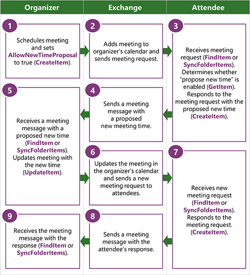

# <a name="propose-a-new-meeting-time-by-using-ews-in-exchange"></a><span data-ttu-id="437ba-103">Предложение нового времени проведения собрания с помощью веб-служб Exchange в Exchange</span><span class="sxs-lookup"><span data-stu-id="437ba-103">Propose a new meeting time by using EWS in Exchange</span></span>

<span data-ttu-id="437ba-104">Узнайте, как предложение нового времени из клиентского приложения Exchange с помощью веб-служб Exchange в Exchange.</span><span class="sxs-lookup"><span data-stu-id="437ba-104">Find out how to propose new meeting times from your Exchange client application by using EWS in Exchange.</span></span>
  
<span data-ttu-id="437ba-105">Новая функция время предложить позволяет участникам предложение нового времени для организатора собрания в рамках процесса календаря Exchange.</span><span class="sxs-lookup"><span data-stu-id="437ba-105">The propose new time feature enables attendees to propose new meeting times to the meeting organizer as part of the Exchange calendar workflow.</span></span> <span data-ttu-id="437ba-106">При участником предлагает нового собрания, организатором можно использовать предлагаемого нового собрания для обновления собрания и отправить обновления всем участникам.</span><span class="sxs-lookup"><span data-stu-id="437ba-106">When an attendee proposes a new meeting, the organizer can use the proposed new meeting time to update the meeting and send updates to all attendees.</span></span> <span data-ttu-id="437ba-107">Прежде чем можно будет включить участникам предлагать другое время собрания, необходимо определить, позволяет ли организатора для новых предложений по времени.</span><span class="sxs-lookup"><span data-stu-id="437ba-107">Before you can enable attendees to propose new meeting times, you need to determine whether the organizer allows for new time proposals.</span></span> <span data-ttu-id="437ba-108">В этой статье описывается, как определить, является ли может предложить новый времени и использование веб-служб Exchange для предложение нового времени.</span><span class="sxs-lookup"><span data-stu-id="437ba-108">This article describes how to determine whether you can propose a new time and how to use EWS to propose a new time.</span></span>
  
> [!NOTE]
> <span data-ttu-id="437ba-109">Управляемый API EWS не реализует эту функцию.</span><span class="sxs-lookup"><span data-stu-id="437ba-109">The EWS Managed API does not implement this functionality.</span></span> 
  
## <a name="determine-whether-you-can-propose-a-new-time-for-a-meeting-by-using-ews"></a><span data-ttu-id="437ba-110">Определить, является ли может предложить новое время собрания с помощью веб-служб Exchange</span><span class="sxs-lookup"><span data-stu-id="437ba-110">Determine whether you can propose a new time for a meeting by using EWS</span></span>
<span data-ttu-id="437ba-111"><a name="bk_Determine"> </a></span><span class="sxs-lookup"><span data-stu-id="437ba-111"></span></span>

<span data-ttu-id="437ba-112">Прежде чем предлагать новые времени проведения собрания, необходимо найти ссылки на эти собрания и определить, настроен ли Организатор собрания для поддержки новых предложений по времени.</span><span class="sxs-lookup"><span data-stu-id="437ba-112">Before you can propose a new time for a meeting, you need to find a reference to that meeting and determine whether the meeting organizer configured the meeting to support new time proposals.</span></span> <span data-ttu-id="437ba-113">Можно получить ссылку на собрание, выполните одно из следующих:</span><span class="sxs-lookup"><span data-stu-id="437ba-113">You can get a reference to a meeting by doing either of the following:</span></span> 
  
- <span data-ttu-id="437ba-114">Поиск приглашения на собрание в папке "Входящие"</span><span class="sxs-lookup"><span data-stu-id="437ba-114">Finding the meeting request in the Inbox</span></span>
    
- <span data-ttu-id="437ba-115">Поиск встречи в календаре</span><span class="sxs-lookup"><span data-stu-id="437ba-115">Finding the appointment in the calendar</span></span>
    
<span data-ttu-id="437ba-116">Чтобы найти ссылки на собрания, выполните следующие действия:</span><span class="sxs-lookup"><span data-stu-id="437ba-116">Use the following steps to find a meeting reference:</span></span>
  
1. <span data-ttu-id="437ba-117">Используйте операции EWS [FindItem](http://msdn.microsoft.com/library/ebad6aae-16e7-44de-ae63-a95b24539729%28Office.15%29.aspx) (или метод [Folder.FindItems](http://msdn.microsoft.com/en-us/library/microsoft.exchange.webservices.data.folder.finditems%28v=EXCHG.80%29.aspx) управляемый API EWS) для нахождения цели собрания элемента календаря или запроса.</span><span class="sxs-lookup"><span data-stu-id="437ba-117">Use the [FindItem](http://msdn.microsoft.com/library/ebad6aae-16e7-44de-ae63-a95b24539729%28Office.15%29.aspx) EWS operation (or the [Folder.FindItems](http://msdn.microsoft.com/en-us/library/microsoft.exchange.webservices.data.folder.finditems%28v=EXCHG.80%29.aspx) EWS Managed API method) to find the target meeting request or calendar item.</span></span> <span data-ttu-id="437ba-118">Кроме того можно использовать операцию [SyncFolderItems](http://msdn.microsoft.com/library/7f0de089-8876-47ec-a871-df118ceae75d%28Office.15%29.aspx) EWS для получения идентификатора конечного, элемента календаря или запрос на собрания.</span><span class="sxs-lookup"><span data-stu-id="437ba-118">Alternatively, you can use the [SyncFolderItems](http://msdn.microsoft.com/library/7f0de089-8876-47ec-a871-df118ceae75d%28Office.15%29.aspx) EWS operation to get the identifier of the target meeting request or calendar item.</span></span> 
    
2. <span data-ttu-id="437ba-119">Синтаксический анализ результаты операции **FindItem** (или метод **Folder.FindItems** ) для получения элемента идентификатор элемента собрания.</span><span class="sxs-lookup"><span data-stu-id="437ba-119">Parse the results of the **FindItem** operation (or **Folder.FindItems** method) to get the item identifier of the meeting item.</span></span> 
    
3. <span data-ttu-id="437ba-120">Получение объектов ответа для собрания с помощью операции [GetItem](http://msdn.microsoft.com/library/e3590b8b-c2a7-4dad-a014-6360197b68e4%28Office.15%29.aspx) веб-служб Exchange.</span><span class="sxs-lookup"><span data-stu-id="437ba-120">Use the [GetItem](http://msdn.microsoft.com/library/e3590b8b-c2a7-4dad-a014-6360197b68e4%28Office.15%29.aspx) EWS operation to get the response objects for the meeting.</span></span> 
    
<span data-ttu-id="437ba-121">В следующем XML показывается, что отправляется запрос объекты ответа на элемент.</span><span class="sxs-lookup"><span data-stu-id="437ba-121">The following XML shows what is sent to request the response objects on an item.</span></span>
  
```XML
<?xml version="1.0" encoding="utf-8"?>
<soap:Envelope xmlns:xsi="http://www.w3.org/2001/XMLSchema-instance"
               xmlns:xsd="http://www.w3.org/2001/XMLSchema"
               xmlns:soap="http://schemas.xmlsoap.org/soap/envelope/"
               xmlns:t="http://schemas.microsoft.com/exchange/services/2006/types"
               xmlns:m="http://schemas.microsoft.com/exchange/services/2006/messages">
  <soap:Header>
    <t:RequestServerVersion Version="Exchange2013" />
    <t:MailboxCulture>en-US</t:MailboxCulture>
  </soap:Header>
  <soap:Body>
    <m:GetItem>
      <m:ItemShape>
        <t:BaseShape>IdOnly</t:BaseShape>
        <t:AdditionalProperties>
          <t:FieldURI FieldURI="item:ResponseObjects"/>
          <t:FieldURI FieldURI="item:Subject"/>
          <t:FieldURI FieldURI="calendar:Start"/>
          <t:FieldURI FieldURI="calendar:End"/>
        </t:AdditionalProperties>
      </m:ItemShape>
      <m:ItemIds>
        <t:ItemId Id="AAMkADEzOTExYjJkL1AAA=" ChangeKey="CwAAAB/G6X"/>
      </m:ItemIds>
    </m:GetItem>
  </soap:Body>
</soap:Envelope>
```

<span data-ttu-id="437ba-122">Ответа операции **GetItem** будет выглядеть следующий XML-код, если запрос идентификатор элемента, собрания начала и время окончания, коллекции объектов ответа и организатора обеспечивает предложенного изменения во время собрания.</span><span class="sxs-lookup"><span data-stu-id="437ba-122">The **GetItem** operation response will look similar to the following XML if you request the item identifier, the meeting start and end time, the response object collection, and if the organizer allows for proposed changes to the meeting time.</span></span> <span data-ttu-id="437ba-123">Коллекцию объектов ответа, которая представляется элемент [ResponseObjects](http://msdn.microsoft.com/library/ad29e064-3f3d-4b7b-aa4c-9ec27326381d%28Office.15%29.aspx) , содержит набор ответов, подходящие для элемента календаря.</span><span class="sxs-lookup"><span data-stu-id="437ba-123">The response object collection, which is represented by the [ResponseObjects](http://msdn.microsoft.com/library/ad29e064-3f3d-4b7b-aa4c-9ec27326381d%28Office.15%29.aspx) element, contains the set of responses that are valid for the calendar item.</span></span> <span data-ttu-id="437ba-124">Элемент **ProposeNewTime** — это объект ответа, которое указывает, что пользователь может предложить новое время собрания.</span><span class="sxs-lookup"><span data-stu-id="437ba-124">The **ProposeNewTime** element is a response object that indicates that the user can propose a new time for the meeting.</span></span> <span data-ttu-id="437ba-125">Элементы [AcceptItem](http://msdn.microsoft.com/library/05a15431-77e1-411a-a16b-5481d364d3cc%28Office.15%29.aspx), [TentativelyAcceptItem](http://msdn.microsoft.com/library/ce6f50ef-ad8a-47e4-915a-487b2ef7a2e0%28Office.15%29.aspx)и [DeclineItem](http://msdn.microsoft.com/library/2d8d2389-924e-4d03-a324-35d56cf0d6b1%28Office.15%29.aspx) представляют объекты ответа, которые можно использовать для предложение нового времени проведения собрания для организатора собрания.</span><span class="sxs-lookup"><span data-stu-id="437ba-125">The [AcceptItem](http://msdn.microsoft.com/library/05a15431-77e1-411a-a16b-5481d364d3cc%28Office.15%29.aspx), [TentativelyAcceptItem](http://msdn.microsoft.com/library/ce6f50ef-ad8a-47e4-915a-487b2ef7a2e0%28Office.15%29.aspx), and [DeclineItem](http://msdn.microsoft.com/library/2d8d2389-924e-4d03-a324-35d56cf0d6b1%28Office.15%29.aspx) elements represent the response objects that you can use to propose a new meeting time to the meeting organizer.</span></span> 
  
```XML
<s:Envelope xmlns:s="http://schemas.xmlsoap.org/soap/envelope/">
  <s:Header>
    <h:ServerVersionInfo MajorVersion="15" 
                         MinorVersion="0" 
                         MajorBuildNumber="815" 
                         MinorBuildNumber="6" 
                         Version="V2_7" 
                         xmlns:h="http://schemas.microsoft.com/exchange/services/2006/types" 
                         xmlns="http://schemas.microsoft.com/exchange/services/2006/types" 
                         xmlns:xsd="http://www.w3.org/2001/XMLSchema" 
                         xmlns:xsi="http://www.w3.org/2001/XMLSchema-instance"/>
  </s:Header>
  <s:Body xmlns:xsi="http://www.w3.org/2001/XMLSchema-instance" 
          xmlns:xsd="http://www.w3.org/2001/XMLSchema">
    <m:GetItemResponse xmlns:m="http://schemas.microsoft.com/exchange/services/2006/messages" 
                       xmlns:t="http://schemas.microsoft.com/exchange/services/2006/types">
      <m:ResponseMessages>
        <m:GetItemResponseMessage ResponseClass="Success">
          <m:ResponseCode>NoError</m:ResponseCode>
          <m:Items>
            <t:MeetingRequest>
              <t:ItemId Id="AAMkADEzOTExYjJkL1AAA=" ChangeKey="CwAAAB/G6X"/>
              <t:Subject>Competitive analysis: kick off meeting</t:Subject>
              <t:ResponseObjects>
                <t:AcceptItem/>
                <t:TentativelyAcceptItem/>
                <t:DeclineItem/>
                <t:ProposeNewTime/>
                <t:ReplyToItem/>
                <t:ReplyAllToItem/>
                <t:ForwardItem/>
              </t:ResponseObjects>
              <t:Start>2013-11-09T17:00:00Z</t:Start>
              <t:End>2013-11-09T17:30:00Z</t:End>
            </t:MeetingRequest>
          </m:Items>
        </m:GetItemResponseMessage>
      </m:ResponseMessages>
    </m:GetItemResponse>
  </s:Body>
</s:Envelope>
```

## <a name="propose-a-new-meeting-time-by-using-ews"></a><span data-ttu-id="437ba-126">Предложение нового времени проведения собрания с помощью веб-служб Exchange</span><span class="sxs-lookup"><span data-stu-id="437ba-126">Propose a new meeting time by using EWS</span></span>
<span data-ttu-id="437ba-127"><a name="bk_Propose"> </a></span><span class="sxs-lookup"><span data-stu-id="437ba-127"></span></span>

<span data-ttu-id="437ba-128">Если объект ответа **ProposeNewTime** полученные при использовании операции **GetItem** для получения элемента календаря или приглашения на собрание, он может ответить с предлагаемого нового собрания.</span><span class="sxs-lookup"><span data-stu-id="437ba-128">If you received a **ProposeNewTime** response object when you used the **GetItem** operation to get a calendar item or meeting request, you can respond with a proposed new meeting time.</span></span> <span data-ttu-id="437ba-129">Если вы не получите объект ответа **ProposeNewTime** , не будут иметь возможность предложить новое время собрания в рамках процесса календаря.</span><span class="sxs-lookup"><span data-stu-id="437ba-129">If you didn't receive a **ProposeNewTime** response object, you won't be able to propose a new meeting time as part of the calendar workflow.</span></span> <span data-ttu-id="437ba-130">Тем не менее, можно ответить Организатор для запроса нового времени проведения собрания.</span><span class="sxs-lookup"><span data-stu-id="437ba-130">You can, however, reply to the organizer to request a new meeting time.</span></span> <span data-ttu-id="437ba-131">Если вы получите объект ответа **ProposeNewTime** , ответ на приглашение на собрание с учетом его идентификатор и предложение нового времени проведения собрания организатора.</span><span class="sxs-lookup"><span data-stu-id="437ba-131">If you receive a **ProposeNewTime** response object, you can respond to the meeting by referencing its identifier, and propose a new meeting time to the organizer.</span></span> <span data-ttu-id="437ba-132">Это, где объект ответа **ProposeNewTime** отличается от шаблона объекта типичного ответа, то есть не отвечает с объектом ответа **ProposeNewTime** .</span><span class="sxs-lookup"><span data-stu-id="437ba-132">This is where the **ProposeNewTime** response object is different than the typical response object pattern in that you don't respond with a **ProposeNewTime** response object.</span></span> <span data-ttu-id="437ba-133">Используйте один из другой собрания объекты ответа, например **AcceptItem**, **TentativelyAcceptItem**или **DeclineItem**предложение нового собрания.</span><span class="sxs-lookup"><span data-stu-id="437ba-133">You use one of the other meeting response objects, such as **AcceptItem**, **TentativelyAcceptItem**, or **DeclineItem**, to propose a new meeting.</span></span> <span data-ttu-id="437ba-134">В этом примере используется объект ответа **AcceptItem** .</span><span class="sxs-lookup"><span data-stu-id="437ba-134">This example uses the **AcceptItem** response object.</span></span> 
  
```XML
<?xml version="1.0" encoding="UTF-8"?>
<soap:Envelope xmlns:soap="http://schemas.xmlsoap.org/soap/envelope/"
               xmlns:t="http://schemas.microsoft.com/exchange/services/2006/types"
               xmlns:m="http://schemas.microsoft.com/exchange/services/2006/messages">
  <soap:Header>
    <t:RequestServerVersion Version="Exchange2013"/>
  </soap:Header>
  <soap:Body>
    <m:CreateItem>
      <m:Items>
        <t:AcceptItem>
          <t:Body BodyType="Text">This time works better for the HiPPO.</t:Body>
          <t:ReferenceItemId Id="AAMkADEzOTExYjJkL1AAA=" ChangeKey="CwAAAB/G6X"/>
          <t:ProposedStart>2013-11-28T04:00:00Z</t:ProposedStart>
          <t:ProposedEnd>2013-11-28T04:30:00Z</t:ProposedEnd>
        </t:AcceptItem>
      </m:Items>
    </m:CreateItem>
  </soap:Body>
</soap:Envelope>
```

<span data-ttu-id="437ba-135">Ответ на этот запрос содержит идентификатор элемента календаря, который был добавлен в календаре участника и копию приглашения на собрание, помещенные в папку Deleted Items участника.</span><span class="sxs-lookup"><span data-stu-id="437ba-135">The response to this request contains the identifier of the calendar item that was added to the attendee's calendar and a copy of the meeting request that was placed in the attendee's Deleted Items folder.</span></span> <span data-ttu-id="437ba-136">Сообщение ответа с помощью нового предложения времени также был сохранен в папке "Отправленные" участника (требуется найти собрания ответное сообщение для получения дескриптора на нем).</span><span class="sxs-lookup"><span data-stu-id="437ba-136">The response message with the new time proposal was also saved in the attendee's Sent Items folder (you will need to find the meeting response message to get a handle on it).</span></span>
  
```XML
<s:Envelope xmlns:s="http://schemas.xmlsoap.org/soap/envelope/">
  <s:Header>
    <h:ServerVersionInfo MajorVersion="15" 
                         MinorVersion="0" 
                         MajorBuildNumber="815" 
                         MinorBuildNumber="6" 
                         Version="V2_7" 
                         xmlns:h="http://schemas.microsoft.com/exchange/services/2006/types" 
                         xmlns="http://schemas.microsoft.com/exchange/services/2006/types" 
                         xmlns:xsd="http://www.w3.org/2001/XMLSchema" 
                         xmlns:xsi="http://www.w3.org/2001/XMLSchema-instance"/>
  </s:Header>
  <s:Body xmlns:xsi="http://www.w3.org/2001/XMLSchema-instance" 
          xmlns:xsd="http://www.w3.org/2001/XMLSchema">
    <m:CreateItemResponse xmlns:m="http://schemas.microsoft.com/exchange/services/2006/messages" 
                          xmlns:t="http://schemas.microsoft.com/exchange/services/2006/types">
      <m:ResponseMessages>
        <m:CreateItemResponseMessage ResponseClass="Success">
          <m:ResponseCode>NoError</m:ResponseCode>
          <m:Items>
            <t:CalendarItem>
              <t:ItemId Id="AAMkAGRmOWE2OWAAA=" ChangeKey="DwAAJsmU"/>
            </t:CalendarItem>
            <t:MeetingRequest>
              <t:ItemId Id="AAMkAGRmOWE2AAABB=" ChangeKey="AAAGJu1A"/>
            </t:MeetingRequest>
          </m:Items>
        </m:CreateItemResponseMessage>
      </m:ResponseMessages>
    </m:CreateItemResponse>
  </s:Body>
</s:Envelope>
```

<span data-ttu-id="437ba-137">Организатор будет [MeetingResponse](http://msdn.microsoft.com/library/9f798e79-dafd-4d4d-9967-95fd8e5c0502%28Office.15%29.aspx) при сообщение участника отвечает предлагаемого нового собрания.</span><span class="sxs-lookup"><span data-stu-id="437ba-137">The organizer will receive a [MeetingResponse](http://msdn.microsoft.com/library/9f798e79-dafd-4d4d-9967-95fd8e5c0502%28Office.15%29.aspx) message when the attendee responds with a proposed new meeting time.</span></span> <span data-ttu-id="437ba-138">Сообщение **MeetingResponse** содержит предлагаемого нового собрания время начала и время окончания и идентификатор элемента связанного календаря в календарь организатора.</span><span class="sxs-lookup"><span data-stu-id="437ba-138">The **MeetingResponse** message contains the proposed new meeting start time and end time, and the identifier of the associated calendar item in the organizer's calendar.</span></span> <span data-ttu-id="437ba-139">Организатор можно использовать эти сведения для обновления их существующего элемента календаря для собрания.</span><span class="sxs-lookup"><span data-stu-id="437ba-139">The organizer can use that information to update their existing calendar item for the meeting.</span></span> <span data-ttu-id="437ba-140">Далее представлен рабочий процесс для организатора ответ на сообщение **MeetingResponse** , которая предлагает собрание:</span><span class="sxs-lookup"><span data-stu-id="437ba-140">The following is the workflow for the organizer to respond to a **MeetingResponse** message that proposes a new meeting time:</span></span> 
  
1. <span data-ttu-id="437ba-141">Определите, будет ли **ProposedStart** или **ProposedEnd** элементов были установлены в **MeetingResponse**.</span><span class="sxs-lookup"><span data-stu-id="437ba-141">Determine whether the **ProposedStart** or **ProposedEnd** elements have been set in the **MeetingResponse**.</span></span> <span data-ttu-id="437ba-142">Если это так, перейдите к шагу 2.</span><span class="sxs-lookup"><span data-stu-id="437ba-142">If so, go to step 2.</span></span> <span data-ttu-id="437ba-143">В противном случае сообщение **MeetingResponse** только указывает, ли участником принято, под вопросом или отклонил приглашение на собрание.</span><span class="sxs-lookup"><span data-stu-id="437ba-143">If not, the **MeetingResponse** message only indicates whether the attendee has accepted, tentatively accepted, or declined the meeting.</span></span> 
    
2. <span data-ttu-id="437ba-144">Получите существующего элемента календаря организатора собрания с помощью идентификатора веб-служб Exchange, возвращаемых в элементе **AssociatedCalendarItemId** .</span><span class="sxs-lookup"><span data-stu-id="437ba-144">Get the organizer's existing calendar item for the meeting by using the EWS identifier returned in the **AssociatedCalendarItemId** element.</span></span> 
    
3. <span data-ttu-id="437ba-145">Сравнение исходного начала и время окончания предложенного новое время собрания.</span><span class="sxs-lookup"><span data-stu-id="437ba-145">Compare the original start and end time with the proposed new meeting time.</span></span> <span data-ttu-id="437ba-146">Если предложенные новые собрания допустима организатора, перейдите к шагу 4.</span><span class="sxs-lookup"><span data-stu-id="437ba-146">If the proposed new meeting time is acceptable to the organizer, go to step 4.</span></span> <span data-ttu-id="437ba-147">В противном случае Организатор собрания можно игнорировать назначенное время собрания, или отправить ответ по электронной почте участника, предложенное новое время собрания.</span><span class="sxs-lookup"><span data-stu-id="437ba-147">Otherwise, the meeting organizer can either ignore the proposed meeting time, or send an email response to the attendee that proposed the new meeting time.</span></span>
    
4. <span data-ttu-id="437ba-148">(Необязательно) Выполните вызов операции веб-служб Exchange [GetUserAvailability](http://msdn.microsoft.com/library/8da17226-5d3a-4525-9ffa-d83730f47bb1%28Office.15%29.aspx) , чтобы узнать, совместимо ли предложенного времени будут работать для всех участников, включая почтовые ящики оборудования и ресурсов.</span><span class="sxs-lookup"><span data-stu-id="437ba-148">(Optional) Perform a [GetUserAvailability](http://msdn.microsoft.com/library/8da17226-5d3a-4525-9ffa-d83730f47bb1%28Office.15%29.aspx) EWS operation call to find out whether the proposed time will work for all attendees, including room and resource mailboxes.</span></span> <span data-ttu-id="437ba-149">(Вы можно также использовать метод [ExchangeService.GetUserAvailability](http://msdn.microsoft.com/en-us/library/microsoft.exchange.webservices.data.exchangeservice.getuseravailability%28v=exchg.80%29.aspx) управляемый API EWS для этого.)</span><span class="sxs-lookup"><span data-stu-id="437ba-149">(You can also use the [ExchangeService.GetUserAvailability](http://msdn.microsoft.com/en-us/library/microsoft.exchange.webservices.data.exchangeservice.getuseravailability%28v=exchg.80%29.aspx) EWS Managed API method to do this.)</span></span> 
    
5. <span data-ttu-id="437ba-150">Организатор можно обновлять их собрания с помощью нового предложенного времени и отправлять обновления всех участников с помощью операции EWS [UpdateItem](http://msdn.microsoft.com/library/5d027523-e0bc-4da2-b60b-0cb9fc1fdfe4%28Office.15%29.aspx) (или метод управляемый API EWS [Appointment.Update](http://msdn.microsoft.com/en-us/library/microsoft.exchange.webservices.data.appointment.update%28v=exchg.80%29.aspx) ).</span><span class="sxs-lookup"><span data-stu-id="437ba-150">The organizer can then update their meeting with the new proposed meeting times and send the updates to all attendees by using the [UpdateItem](http://msdn.microsoft.com/library/5d027523-e0bc-4da2-b60b-0cb9fc1fdfe4%28Office.15%29.aspx) EWS operation (or the [Appointment.Update](http://msdn.microsoft.com/en-us/library/microsoft.exchange.webservices.data.appointment.update%28v=exchg.80%29.aspx) EWS Managed API method).</span></span> 
    
<span data-ttu-id="437ba-151">На следующем рисунке показана процесс, который происходит между Организатор собрания, участником и на сервере Exchange, обрабатывать вызовы веб-служб Exchange.</span><span class="sxs-lookup"><span data-stu-id="437ba-151">The following figure shows the process that occurs between the meeting organizer, the attendee, and the Exchange server that handled the EWS calls.</span></span>
  
<span data-ttu-id="437ba-152">**На рисунке 1. Процесс предложение нового времени проведения собрания**</span><span class="sxs-lookup"><span data-stu-id="437ba-152">**Figure 1. Process for proposing a new meeting time**</span></span>


  
## <a name="version-differences"></a><span data-ttu-id="437ba-155">Различия версий</span><span class="sxs-lookup"><span data-stu-id="437ba-155">Version differences</span></span>
<span data-ttu-id="437ba-156"><a name="bk_Behavior"> </a></span><span class="sxs-lookup"><span data-stu-id="437ba-156"></span></span>

<span data-ttu-id="437ba-157">Новая функция время предложить была представлена в версии Exchange построения 15.00.0800.007.</span><span class="sxs-lookup"><span data-stu-id="437ba-157">The propose new time feature was introduced in Exchange build version 15.00.0800.007.</span></span> <span data-ttu-id="437ba-158">В более ранних версиях Exchange пользователи приложений веб-служб Exchange должны отправлять отдельные электронной почты организатора собрания для запроса другое время собрания.</span><span class="sxs-lookup"><span data-stu-id="437ba-158">In earlier versions of Exchange, EWS application users have to send a separate email to the meeting organizer to request a different meeting time.</span></span> 
  
## <a name="see-also"></a><span data-ttu-id="437ba-159">См. также</span><span class="sxs-lookup"><span data-stu-id="437ba-159">See also</span></span>


- [<span data-ttu-id="437ba-160">Календари и веб-службах Exchange</span><span class="sxs-lookup"><span data-stu-id="437ba-160">Calendars and EWS in Exchange</span></span>](calendars-and-ews-in-exchange.md)
    
- [<span data-ttu-id="437ba-161">Создание встречи и собрания с помощью веб-служб Exchange в Exchange 2013</span><span class="sxs-lookup"><span data-stu-id="437ba-161">Create appointments and meetings by using EWS in Exchange 2013</span></span>](how-to-create-appointments-and-meetings-by-using-ews-in-exchange-2013.md)
    
- [<span data-ttu-id="437ba-162">Получение встречи и собрания с помощью веб-служб Exchange в Exchange</span><span class="sxs-lookup"><span data-stu-id="437ba-162">Get appointments and meetings by using EWS in Exchange</span></span>](how-to-get-appointments-and-meetings-by-using-ews-in-exchange.md)
    
- [<span data-ttu-id="437ba-163">Обновление встречи и собрания с помощью веб-служб Exchange в Exchange</span><span class="sxs-lookup"><span data-stu-id="437ba-163">Update appointments and meetings by using EWS in Exchange</span></span>](how-to-update-appointments-and-meetings-by-using-ews-in-exchange.md)
    
- [<span data-ttu-id="437ba-164">Удаление встреч и отмены собраний с помощью веб-служб Exchange в Exchange</span><span class="sxs-lookup"><span data-stu-id="437ba-164">Delete appointments and cancel meetings by using EWS in Exchange</span></span>](how-to-delete-appointments-and-cancel-meetings-by-using-ews-in-exchange.md)
    

