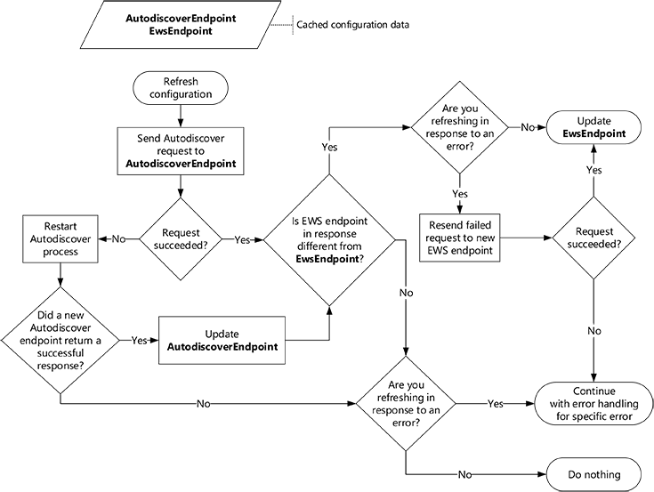

# Обновление сведений о конфигурации с помощью службы автообнаружения

Узнайте, как и когда обновлять сведения о конфигурации подключения Exchange с помощью автообнаружения.
  
Когда приложение EWS запускается в первый раз, служба автообнаружения предоставляет удобный способ сбора необходимой информации для подключения к почтовому ящику Exchange пользователя. Но Автообнаружение не только для первого использования. Регулярное использование автообнаружения позволяет обеспечить подключение приложения, чтобы оно отвечало на изменения в развертывании Exchange.
  
## Конечная точка автообнаружения кэша и параметры EWS

Мы рекомендуем регулярно использовать автообнаружение, как регулярно его использовать. В идеале вы можете быстро выравнивать ответы на изменения в среде, создавая слишком много ненужных сетевых трафиков. Когда приложение получает успешный ответ автообнаружения в первый раз, необходимо сохранить следующие сведения, чтобы не было необходимости повторять процесс автообнаружения каждый раз, когда отправляется запрос EWS.
  
**Таблица 1. Сведения для кэширования запросов автообнаружения**

|**Настройка для кэширования**|**Допустимо для...**|**Сведения**|
|:-----|:-----|:-----|
|Конечная точка автообнаружения    |Пока она работает    |При сохранении конечной точки автообнаружения, возвращающей успешный ответ, нет необходимости повторять процесс [создания списка конечных точек автообнаружения](how-to-generate-a-list-of-autodiscover-endpoints.md) и пытаться выполнить их, пока не будет получен успешный ответ.   **Note**: управляемый API EWS не поддерживает кэширование конечной точки автообнаружения.           |
|URL-адрес EWS и другие параметры, полученные из отклика автообнаружения    |Одна неделя    |При сохранении URL-адреса EWS и других связанных параметров вам не нужно [отправлять новый запрос автообнаружения](how-to-get-user-settings-from-exchange-by-using-autodiscover.md) для каждого запроса EWS или перезапускать приложение. Тем не менее, даже если URL-адрес EWS работает для пользователя, сервер может быть доступен более оптимальный.   Например, почтовый ящик пользователя мог быть перемещен на новый сервер почтовых ящиков, что привело к новой конечной точке EWS. Мы рекомендуем обновить параметры пользователя, отправив новый запрос автообнаружения через одну неделю с момента последнего запроса автообнаружения. Это время можно настроить в соответствии с требованиями приложения.    |
   
## Обновление кэшированных данных конфигурации

Теперь, когда у вас есть кэшированные сведения, давайте рассмотрим, как можно сохранить новый кэш. Мы рекомендуем обновлять кэшированные данные в следующих случаях:
  
- Срок действия информации истечет.
    
- Возникает [ошибка, связанная с подключением](#bk_ConnectionErrors) , и последняя Дата последнего обновления данных в течение часа назад.
    
Чтобы обновить кэшированные данные, отправьте запрос автообнаружения в кэшированную конечную точку автообнаружения и выполните следующие действия:
  
- Если запрос выполнен успешно, Сравните конечную точку EWS в ответе с кэшированной конечной точкой EWS и выполните следующие действия:
    
  - Если они отличаются, используйте новую конечную точку EWS. Если вы обновляете сообщение об ошибке, повторите неудачный запрос с новой конечной точкой.
    
  - Если они одинаковы, продолжайте использовать исходную конечную точку EWS. При обновлении после ошибки обрабатывайте ошибку соответствующим образом.
    
- Если запрос не удается выполнить, запустите [процесс автообнаружения](autodiscover-for-exchange.md) с самого начала. После получения успешного ответа замените кэшированную конечную точку автообнаружения на конечную точку автообнаружения, которая была успешно выполнена, и продолжайте использовать новую конечную точку EWS. Если вы не получаете успешный ответ, продолжайте использовать исходную конечную точку автообнаружения и конечную точку EWS. При обновлении после ошибки обрабатывайте ошибку соответствующим образом. 
    
На следующем рисунке представлено визуальное представление этого процесса.
  
**Рис. 1. Процесс обновления сведений о конфигурации с помощью службы автообнаружения**

  
### Ошибки, связанные с подключением

Обновление кэшированных сведений о конфигурации может помочь с некоторыми ошибками, но не всеми. 
  
**Таблица 2. Ошибки, устраняемые при обновлении кэша**

|**Error**|**Реализация управляемого API EWS**|**Примечания**|
|:-----|:-----|:-----|
|Ошибки DNS или ошибки сети   Пример: не удалось найти имя узла.    |[сервицеремотиксцептион](https://docs.microsoft.com/dotnet/api/microsoft.exchange.webservices.data.serviceremoteexception?view=exchange-ews-api)   |Любая ошибка, указывающая на то, что сервер не удалось найти или к которому можно получить доступ, можно устранить, выполнив функцию автообнаружения.    Ваша кэшированная конечная точка EWS может стать недействительной, а служба автообнаружения может указывать на новый сервер.    |
|Ошибки состояния HTTP   Пример: служба 503 недоступна    |[сервицеремотиксцептион](https://docs.microsoft.com/dotnet/api/microsoft.exchange.webservices.data.serviceremoteexception?view=exchange-ews-api)   |Ошибки состояния HTTP могут происходить по разным причинам.   Тем не менее, рекомендуется попробовать службу автообнаружения, чтобы узнать, доступна ли для пользователя новая конечная точка EWS.    |
|Коды ошибок EWS    Пример: Еррорконнектионфаилед   |[респонсекодетипе](../web-service-reference/responsecode.md)   | Большинство кодов ошибок EWS не гарантируют обновление сведений о конфигурации.   Однако ниже указано, что необходимо обновить сведения о конфигурации. - **еррорконнектионфаилед**  - **еррормаилбоксмовеинпрогресс**   |
   
## См. также

- [Автообнаружение в Exchange](autodiscover-for-exchange.md)  
- [Создание списка конечных точек автообнаружения](how-to-generate-a-list-of-autodiscover-endpoints.md)   
- [Получение параметров пользователя из Exchange с помощью службы автообнаружения](how-to-get-user-settings-from-exchange-by-using-autodiscover.md)
    

