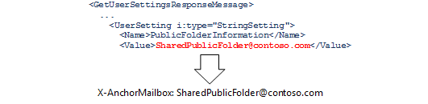
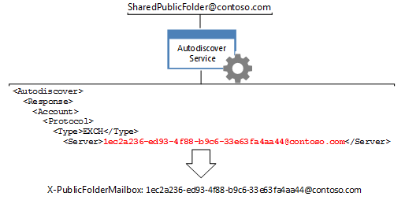

# <a name="route-public-folder-hierarchy-requests"></a><span data-ttu-id="55188-104">Маршрутизация запросов иерархии общедоступных папок</span><span class="sxs-lookup"><span data-stu-id="55188-104">Route public folder hierarchy requests</span></span>

<span data-ttu-id="55188-105">Все запросы для сведений о общедоступных папках, которым требуется знание иерархии общедоступных папок, например перемещение, обновление, удаление или поиск общедоступных папок, необходимо перенаправить на почтовый ящик иерархии общедоступных папок по умолчанию для данного пользователя.</span><span class="sxs-lookup"><span data-stu-id="55188-105">All requests for public folder information that require knowledge of the public folder hierarchy, such as moving, updating, deleting, or finding public folders, need to be routed to the default public folder hierarchy mailbox for the given user.</span></span> <span data-ttu-id="55188-106">Чтобы перенаправить запросы в этот почтовый ящик, необходимо установить для заголовков **x и AnchorMailbox** и **x публикфолдермаилбокс** конкретные значения, возвращаемые службой автообнаружения.</span><span class="sxs-lookup"><span data-stu-id="55188-106">To route the requests to that mailbox, you need to set the **X-AnchorMailbox** and **X-PublicFolderMailbox** headers to specific values returned by the Autodiscover service.</span></span> 
  
<span data-ttu-id="55188-107">**Общие сведения о общедоступных папках**</span><span class="sxs-lookup"><span data-stu-id="55188-107">**Overview of public folders**</span></span>

|<span data-ttu-id="55188-108">Заголовок</span><span class="sxs-lookup"><span data-stu-id="55188-108">Header</span></span>|<span data-ttu-id="55188-109">Что нужно сделать?</span><span class="sxs-lookup"><span data-stu-id="55188-109">What do I need?</span></span>|<span data-ttu-id="55188-110">Как это сделать?</span><span class="sxs-lookup"><span data-stu-id="55188-110">How do I get it?</span></span>|
|:-----|:-----|:-----|
|<span data-ttu-id="55188-111">**X — AnchorMailbox**</span><span class="sxs-lookup"><span data-stu-id="55188-111">**X-AnchorMailbox**</span></span> <br/> |<span data-ttu-id="55188-112">Значение [публикфолдеринформатион](http://msdn.microsoft.com/en-us/library/dn751006%28v=exchg.150%29.aspx) из ответа SOAP службы автообнаружения [GetUserSettings](http://msdn.microsoft.com/en-us/library/office/dd877096%28v=exchg.150%29.aspx) , которое становится значением заголовка **X/AnchorMailbox** .</span><span class="sxs-lookup"><span data-stu-id="55188-112">The [PublicFolderInformation](http://msdn.microsoft.com/en-us/library/dn751006%28v=exchg.150%29.aspx) value from a [GetUserSettings](http://msdn.microsoft.com/en-us/library/office/dd877096%28v=exchg.150%29.aspx) Autodiscover SOAP response, which becomes the value of the **X-AnchorMailbox** header.</span></span><br/><br/> <span data-ttu-id="55188-113"></span><span class="sxs-lookup"><span data-stu-id="55188-113"></span></span>| <span data-ttu-id="55188-114">1. Отправьте запрос **жетусерсеттинг** с SMTP-адресом для почтового ящика пользователя.</span><span class="sxs-lookup"><span data-stu-id="55188-114">1. Send a **GetUserSetting** request with the SMTP address for the user's mailbox.</span></span><br/><br/><span data-ttu-id="55188-115">2. кэширование значения элемента **публикфолдеринформатион** , возвращаемого службой автообнаружения.</span><span class="sxs-lookup"><span data-stu-id="55188-115">2. Cache the value of the **PublicFolderInformation** element that the Autodiscover service returns.</span></span> <span data-ttu-id="55188-116">Это может быть кэшировано из существующего вызова автообнаружения в коде или с помощью нового [вызова GetUserSettings управляемого API EWS](#bk_getpfinfoewsma) или [запроса GetUserSettings SOAP](#bk_getpfinfoews).</span><span class="sxs-lookup"><span data-stu-id="55188-116">This can be a cached from an existing Autodiscover call in your code, or a new [EWS Managed API GetUserSettings call](#bk_getpfinfoewsma) or a [GetUserSettings SOAP request](#bk_getpfinfoews).</span></span>  <br/><br/><span data-ttu-id="55188-117">3. Используйте элемент **публикфолдеринформатион** для заполнения значения заголовка **X – AnchorMailbox** .</span><span class="sxs-lookup"><span data-stu-id="55188-117">3. Use the **PublicFolderInformation** element to populate the value of the **X-AnchorMailbox** header.</span></span> <span data-ttu-id="55188-118">Значение элемента **публикфолдеринформатион** — SMTP-адрес.</span><span class="sxs-lookup"><span data-stu-id="55188-118">The value of the **PublicFolderInformation** element is an SMTP address.</span></span>  <br/> |
|<span data-ttu-id="55188-119">**X — Публикфолдермаилбокс**</span><span class="sxs-lookup"><span data-stu-id="55188-119">**X-PublicFolderMailbox**</span></span> <br/> |<span data-ttu-id="55188-120">Значение [сервера](http://msdn.microsoft.com/en-us/library/bb204084%28v=exchg.150%29.aspx) из [отклика автообнаружения POX](http://msdn.microsoft.com/en-us/library/bb204082%28v=exchg.150%29.aspx), которое становится значением заголовка **X – публикфолдермаилбокс** .</span><span class="sxs-lookup"><span data-stu-id="55188-120">The [Server](http://msdn.microsoft.com/en-us/library/bb204084%28v=exchg.150%29.aspx) value from a [POX Autodiscover response](http://msdn.microsoft.com/en-us/library/bb204082%28v=exchg.150%29.aspx), which becomes the value of the **X-PublicFolderMailbox** header.</span></span><br/><br/> <span data-ttu-id="55188-121"></span><span class="sxs-lookup"><span data-stu-id="55188-121"></span></span>|<span data-ttu-id="55188-122">1. [вызовите службу АВТООБНАРУЖЕНИЯ POX](#bk_makeautodrequest) , используя адрес электронной почты **X – AnchorMailbox** .</span><span class="sxs-lookup"><span data-stu-id="55188-122">1. [Call the POX Autodiscover](#bk_makeautodrequest) service using the **X-AnchorMailbox** email address.</span></span>  <br/><br/><span data-ttu-id="55188-123">2. Используйте **Серверный** элемент, возвращенный службой автообнаружения, для заполнения значения заголовка **X – публикфолдермаилбокс** .</span><span class="sxs-lookup"><span data-stu-id="55188-123">2. Use the **Server** element returned by the Autodiscover service to populate the value of the **X-PublicFolderMailbox** header.</span></span> <span data-ttu-id="55188-124">Значение **X-публикфолдермаилбокс** — это SMTP-адрес, где имя пользователя — GUID.</span><span class="sxs-lookup"><span data-stu-id="55188-124">The value of the **X-PublicFolderMailbox** is an SMTP address where the username is a GUID.</span></span>  <br/> |

<br/>

<span data-ttu-id="55188-125">После определения значений заголовков включите их при выполнении [запросов иерархии общедоступных папок](#bk_setheadervalues).</span><span class="sxs-lookup"><span data-stu-id="55188-125">After you have determined the header values, include them [when you make public folder hierarchy requests](#bk_setheadervalues).</span></span>
  
<span data-ttu-id="55188-126">Действия, описанные в этой статье, относятся к запросам иерархии общедоступных папок.</span><span class="sxs-lookup"><span data-stu-id="55188-126">The steps in this article are specific to public folder hierarchy requests.</span></span> <span data-ttu-id="55188-127">Чтобы определить, является ли ваш запрос иерархией общедоступных папок или запроса содержимого, ознакомьтесь со статьей [Маршрутизация запросов](public-folder-access-with-ews-in-exchange.md#bk_routing)к общедоступным папкам.</span><span class="sxs-lookup"><span data-stu-id="55188-127">To determine whether your request is a public folder hierarchy or content request, see [Routing public folder requests](public-folder-access-with-ews-in-exchange.md#bk_routing).</span></span>
  
## <a name="determine-the-value-of-the-x-anchormailbox-header-by-using-the-ews-managed-api"></a><span data-ttu-id="55188-128">Определение значения заголовка X-AnchorMailbox с помощью управляемого API EWS</span><span class="sxs-lookup"><span data-stu-id="55188-128">Determine the value of the X-AnchorMailbox header by using the EWS Managed API</span></span>
<span data-ttu-id="55188-129"><a name="bk_getpfinfoewsma"> </a></span><span class="sxs-lookup"><span data-stu-id="55188-129"><a name="bk_getpfinfoewsma"> </a></span></span>

<span data-ttu-id="55188-130">Чтобы получить значение [публикфолдеринформатион (POX)](http://msdn.microsoft.com/library/a221aa9e-b4ac-4ec5-aa42-7e2a69e8eaa6%28Office.15%29.aspx) с помощью управляемого API EWS, можно кэшировать значение элемента **публикфолдеринформатион** , который возвращает существующий вызов службы автообнаружения, или создать новый вызов.</span><span class="sxs-lookup"><span data-stu-id="55188-130">To retrieve the [PublicFolderInformation (POX)](http://msdn.microsoft.com/library/a221aa9e-b4ac-4ec5-aa42-7e2a69e8eaa6%28Office.15%29.aspx) value by using the EWS Managed API, you can either cache the value of the **PublicFolderInformation** element that an existing call to the Autodiscover service returns, or make a new call.</span></span> 
  
<span data-ttu-id="55188-131">Если вы создаете новый звонок, вы можете [получить параметры пользователя с помощью управляемого API EWS](how-to-get-user-settings-from-exchange-by-using-autodiscover.md#bk_Managed), чтобы[получить параметры пользователя с помощью управляемого API EWS](how-to-get-user-settings-from-exchange-by-using-autodiscover.md#bk_Managed) для кода, а затем вызвать метод **GetUserSettings** , используя следующий код, который извлекает только значение элемента **публикфолдеринформатион** .</span><span class="sxs-lookup"><span data-stu-id="55188-131">If you're making a new call, you can [Get user settings by using the EWS Managed API](how-to-get-user-settings-from-exchange-by-using-autodiscover.md#bk_Managed)[Get user settings by using the EWS Managed API](how-to-get-user-settings-from-exchange-by-using-autodiscover.md#bk_Managed) to your code, and then call the **GetUserSettings** sample method by using the following code, which retrieves only the value of the **PublicFolderInformation** element.</span></span> <span data-ttu-id="55188-132">Включите SMTP-адрес пользователя почтового ящика в качестве входного параметра.</span><span class="sxs-lookup"><span data-stu-id="55188-132">Include the SMTP address of the mailbox user as an input parameter.</span></span> 
  
```cs
GetUserSettingsResponse userResponse = GetUserSettings(adservice, "sonyaf@contoso.com", 3, UserSettingName.PublicFolderInformation);
Console.WriteLine("X-AnchorMailbox value for public folder hierarchy requests: {0}", userResponse.Settings[UserSettingName.PublicFolderInformation]);
```

<span data-ttu-id="55188-133">После выполнения кода на консоли отображаются следующие сведения:</span><span class="sxs-lookup"><span data-stu-id="55188-133">After running the code, the following information is displayed on the console:</span></span>
  
`X-AnchorMailbox for public folder hierarchy requests: SharedPublicFolder@contoso.com`

<span data-ttu-id="55188-134">Теперь, когда у вас есть значение **публикфолдеринформатион** , включите его в качестве значения для заголовка X – AnchorMailbox во всех запросах иерархии общедоступных папок.</span><span class="sxs-lookup"><span data-stu-id="55188-134">Now that you have the **PublicFolderInformation** value, include it as the value for the X-AnchorMailbox header in all public folder hierarchy requests.</span></span> 
  
`X-AnchorMailbox: SharedPublicFolder@contoso.com`

## <a name="determine-the-value-of-the-x-anchormailbox-header-using-soap"></a><span data-ttu-id="55188-135">Определение значения заголовка X – AnchorMailbox с помощью SOAP</span><span class="sxs-lookup"><span data-stu-id="55188-135">Determine the value of the X-AnchorMailbox header using SOAP</span></span>
<span data-ttu-id="55188-136"><a name="bk_getpfinfoews"> </a></span><span class="sxs-lookup"><span data-stu-id="55188-136"><a name="bk_getpfinfoews"> </a></span></span>

<span data-ttu-id="55188-137">В приведенном ниже примере кода показано, как получить значение **публикфолдеринформатион** с помощью операции SOAP [GetUserSettings](http://msdn.microsoft.com/en-us/library/dd877096%28v=exchg.150%29.aspx) .</span><span class="sxs-lookup"><span data-stu-id="55188-137">The following code example shows how to retrieve the **PublicFolderInformation** value by using the [GetUserSettings](http://msdn.microsoft.com/en-us/library/dd877096%28v=exchg.150%29.aspx) SOAP operation.</span></span> <span data-ttu-id="55188-138">Пользователь почтового ящика указан в элементе [Mailbox](http://msdn.microsoft.com/en-us/library/dd877076%28v=exchg.150%29.aspx) , а элемент [рекуестедсеттингс](http://msdn.microsoft.com/en-us/library/office/dd877107%28v=exchg.150%29.aspx) — ограничено значением [публикфолдеринформатион](http://msdn.microsoft.com/en-us/library/dn751006%28v=exchg.150%29.aspx) .</span><span class="sxs-lookup"><span data-stu-id="55188-138">The mailbox user is specified in the [Mailbox](http://msdn.microsoft.com/en-us/library/dd877076%28v=exchg.150%29.aspx) element, and the [RequestedSettings](http://msdn.microsoft.com/en-us/library/office/dd877107%28v=exchg.150%29.aspx) element limits the response to the [PublicFolderInformation](http://msdn.microsoft.com/en-us/library/dn751006%28v=exchg.150%29.aspx) value.</span></span> 
  
```XML
<?xml version="1.0" encoding="utf-8"?>
<soap:Envelope xmlns:a="http://schemas.microsoft.com/exchange/2010/Autodiscover"
               xmlns:wsa="http://www.w3.org/2005/08/addressing"
               xmlns:xsi="http://www.w3.org/2001/XMLSchema-instance"
               xmlns:soap="http://schemas.xmlsoap.org/soap/envelope/">
  <soap:Header>
    <a:RequestedServerVersion>Exchange2007_SP1</a:RequestedServerVersion>
    <wsa:Action>http://schemas.microsoft.com/exchange/2010/Autodiscover/Autodiscover/GetUserSettings</wsa:Action>
    <wsa:To>https://pod51042.outlook.com/autodiscover/autodiscover.svc</wsa:To>
  </soap:Header>
  <soap:Body>
    <a:GetUserSettingsRequestMessage xmlns:a="http://schemas.microsoft.com/exchange/2010/Autodiscover">
      <a:Request>
        <a:Users>
          <a:User>
            <a:Mailbox>sonyaf@contoso.com</a:Mailbox>
          </a:User>
        </a:Users>
        <a:RequestedSettings>
          <a:Setting>PublicFolderInformation</a:Setting>
        </a:RequestedSettings>
      </a:Request>
    </a:GetUserSettingsRequestMessage>
  </soap:Body>
</soap:Envelope>
```

<span data-ttu-id="55188-139">Ответ включает значение **публикфолдеринформатион** .</span><span class="sxs-lookup"><span data-stu-id="55188-139">The response includes the **PublicFolderInformation** value.</span></span> 
  
```XML
<UserSetting i:type="StringSetting">
    <Name>PublicFolderInformation</Name>
    <Value>SharedPublicFolder@contoso.com</Value>
</UserSetting>
```

<span data-ttu-id="55188-140">Теперь, когда у вас есть значение **публикфолдеринформатион** , включите его в качестве значения для заголовка X – AnchorMailbox во всех запросах иерархии общедоступных папок.</span><span class="sxs-lookup"><span data-stu-id="55188-140">Now that you have the **PublicFolderInformation** value, include it as the value for the X-AnchorMailbox header in all public folder hierarchy requests.</span></span> 
  
`X-AnchorMailbox: SharedPublicFolder@contoso.com`

## <a name="make-an-autodiscover-request-to-determine-the-x-publicfolderinformation-value"></a><span data-ttu-id="55188-141">Выполнение запроса автообнаружения для определения значения X Публикфолдеринформатион</span><span class="sxs-lookup"><span data-stu-id="55188-141">Make an Autodiscover request to determine the X-PublicFolderInformation value</span></span>
<span data-ttu-id="55188-142"><a name="bk_makeautodrequest"> </a></span><span class="sxs-lookup"><span data-stu-id="55188-142"><a name="bk_makeautodrequest"> </a></span></span>

<span data-ttu-id="55188-143">Выполните запрос автообнаружения с помощью SMTP-адреса **публикфолдеринформатион** , который теперь используется в качестве значения **X-AnchorMailbox** .</span><span class="sxs-lookup"><span data-stu-id="55188-143">Make an Autodiscover request by using the **PublicFolderInformation** SMTP address, which is now being used as the **X-AnchorMailbox** value.</span></span> <span data-ttu-id="55188-144">Используйте [сервер Exchange 2013: получение параметров пользователя с помощью кода автообнаружения](http://code.msdn.microsoft.com/exchange/Exchange-2013-Get-user-7e22c86e) для вызова службы автообнаружения, так как она упрощает процесс автообнаружения.</span><span class="sxs-lookup"><span data-stu-id="55188-144">Use the [Exchange 2013: Get user settings with Autodiscover](http://code.msdn.microsoft.com/exchange/Exchange-2013-Get-user-7e22c86e) code sample to call the Autodiscover service because it streamlines the Autodiscover process for you.</span></span> <span data-ttu-id="55188-145">В этом примере кода используются аргументы командной строки, приведенные в следующей таблице, для вызова службы автообнаружения POX на SMTP-адресе **публикфолдеринформатион** .</span><span class="sxs-lookup"><span data-stu-id="55188-145">This code sample uses the command line arguments listed in the following table to call the POX Autodiscover service on the **PublicFolderInformation** SMTP address.</span></span> 
  
|<span data-ttu-id="55188-146">**Аргумент командной строки**</span><span class="sxs-lookup"><span data-stu-id="55188-146">**Command-line argument**</span></span>|<span data-ttu-id="55188-147">**Описание**</span><span class="sxs-lookup"><span data-stu-id="55188-147">**Description**</span></span>|
|:-----|:-----|
|<span data-ttu-id="55188-148">emailAddress</span><span class="sxs-lookup"><span data-stu-id="55188-148">emailAddress</span></span>  <br/> |<span data-ttu-id="55188-149">SMTP-адрес **публикфолдеринформатион** .</span><span class="sxs-lookup"><span data-stu-id="55188-149">The **PublicFolderInformation** SMTP address.</span></span>  <br/> |
|<span data-ttu-id="55188-150">— Скипсоап</span><span class="sxs-lookup"><span data-stu-id="55188-150">-skipSOAP</span></span>  <br/> | <span data-ttu-id="55188-151">Используйте запросы автообнаружения POX для этого сценария.</span><span class="sxs-lookup"><span data-stu-id="55188-151">Use POX Autodiscover requests for this scenario.</span></span>  <br/> |
|<span data-ttu-id="55188-152">— Проверка подлинности Аусемаиладдресс</span><span class="sxs-lookup"><span data-stu-id="55188-152">-auth authEmailAddress</span></span>  <br/> |<span data-ttu-id="55188-153">Адрес электронной почты пользователя почтового ящика, используемый для проверки подлинности.</span><span class="sxs-lookup"><span data-stu-id="55188-153">The mailbox user's email address, which is used for authentication.</span></span> <span data-ttu-id="55188-154">При запуске примера вам будет предложено ввести пароль пользователя почтового ящика.</span><span class="sxs-lookup"><span data-stu-id="55188-154">You will be prompted to enter the mailbox user's password when you run the sample.</span></span>  <br/> |
   
<span data-ttu-id="55188-155">Например, если SharedPublicFolder@contoso.com — SMTP-адрес элемента **публикфолдеринформатион** , а sonyaf@contoso.com — пользователь почтового ящика, аргументы командной строки должны выглядеть следующим образом.</span><span class="sxs-lookup"><span data-stu-id="55188-155">For example, when SharedPublicFolder@contoso.com is the SMTP address of the **PublicFolderInformation** element, and sonyaf@contoso.com is the mailbox user, the command-line arguments should look like this.</span></span> 
  
`SharedPublicFolder@contoso.com -skipSOAP -auth sonyaf@contoso.com`

<span data-ttu-id="55188-156">При запуске **Exchange 2013: получение параметров пользователя с помощью службы автообнаружения** , последний ответ автообнаружения должен быть успешным и включать все параметры пользователя, связанные с идентификатором GUID почтового ящика.</span><span class="sxs-lookup"><span data-stu-id="55188-156">When you run the **Exchange 2013: Get user settings with Autodiscover** sample, the last Autodiscover response should be successful and include all the user settings associated with the mailbox GUID.</span></span> <span data-ttu-id="55188-157">Значение [сервера](http://msdn.microsoft.com/en-us/library/bb204084%28v=exchg.150%29.aspx) , связанное с элементом [Protocol](http://msdn.microsoft.com/en-us/library/bb204278%28v=exchg.150%29.aspx)[тип](http://msdn.microsoft.com/en-us/library/office/bb204223%28v=exchg.150%29.aspx) протокола, — это значение заголовка **X-публикфолдеринформатион** .</span><span class="sxs-lookup"><span data-stu-id="55188-157">The [Server](http://msdn.microsoft.com/en-us/library/bb204084%28v=exchg.150%29.aspx) value associated with the EXCH [Protocol](http://msdn.microsoft.com/en-us/library/bb204278%28v=exchg.150%29.aspx)[Type](http://msdn.microsoft.com/en-us/library/office/bb204223%28v=exchg.150%29.aspx) element is the **X-PublicFolderInformation** header value.</span></span> 
  
```XML
<Autodiscover xmlns="http://schemas.microsoft.com/exchange/autodiscover/responseschema/2006">
  <Response xmlns="http://schemas.microsoft.com/exchange/autodiscover/outlook/responseschema/2006a">
    …
    <Account>
      <AccountType>email</AccountType>
      <Action>settings</Action>
      <Protocol>
        <Type>EXCH</Type>
        <Server>1ec2a236-ed93-4f88-b9c6-33e63fa4aa44@contoso.com</Server>

```

<span data-ttu-id="55188-158">Кроме того, если вы не хотите использовать **Exchange 2013: получение параметров пользователя с помощью службы автообнаружения** , можно получить значение **сервера** , создав [список конечных точек автообнаружения](how-to-generate-a-list-of-autodiscover-endpoints.md)и затем отправив следующий запрос автообнаружения POX для каждого URL-адреса, пока не будет получен успешный ответ.</span><span class="sxs-lookup"><span data-stu-id="55188-158">Alternatively, if you do not want to use the **Exchange 2013: Get user settings with Autodiscover** sample, you can get the **Server** value by [generating a list of Autodiscover endpoints](how-to-generate-a-list-of-autodiscover-endpoints.md), and then sending the following POX Autodiscover request to each URL until you receive a successful response.</span></span> <span data-ttu-id="55188-159">SharedPublicFolder@contoso.com — значение заголовка **X-публикфолдермаилбокс** .</span><span class="sxs-lookup"><span data-stu-id="55188-159">SharedPublicFolder@contoso.com is the value of the **X-PublicFolderMailbox** header.</span></span> 
  
```XML
<?xml version="1.0" encoding="utf-8"?>
<Autodiscover xmlns="http://schemas.microsoft.com/exchange/autodiscover/outlook/requestschema/2006">
  <Request>
    <EMailAddress>SharedPublicFolder@contoso.com</EMailAddress>
    <AcceptableResponseSchema>http://schemas.microsoft.com/exchange/autodiscover/outlook/responseschema/2006a</AcceptableResponseSchema>
  </Request>
</Autodiscover>
```

<span data-ttu-id="55188-160">Дополнительные сведения о процессе автообнаружения: служба [автообнаружения для Exchange](autodiscover-for-exchange.md), [Создание списка конечных точек автообнаружения](how-to-generate-a-list-of-autodiscover-endpoints.md)и [Получение параметров пользователя из Exchange с помощью службы автообнаружения](how-to-get-user-settings-from-exchange-by-using-autodiscover.md).</span><span class="sxs-lookup"><span data-stu-id="55188-160">For more information about the Autodiscover process, see [Autodiscover for Exchange](autodiscover-for-exchange.md), [Generate a list of Autodiscover endpoints](how-to-generate-a-list-of-autodiscover-endpoints.md), and [Get user settings from Exchange by using Autodiscover](how-to-get-user-settings-from-exchange-by-using-autodiscover.md).</span></span>
  
## <a name="set-the-values-of-the-x-anchormailbox-and-x-publicfoldermailbox-headers"></a><span data-ttu-id="55188-161">Задайте значения для заголовков X — AnchorMailbox и X Публикфолдермаилбокс</span><span class="sxs-lookup"><span data-stu-id="55188-161">Set the values of the X-AnchorMailbox and X-PublicFolderMailbox headers</span></span>
<span data-ttu-id="55188-162"><a name="bk_setheadervalues"> </a></span><span class="sxs-lookup"><span data-stu-id="55188-162"><a name="bk_setheadervalues"> </a></span></span>

<span data-ttu-id="55188-163">С помощью значения SMTP-адреса **публикфолдеринформатион** , полученного в разделе [Определение значения заголовка x-AnchorMailbox с помощью управляемого API EWS](#bk_getpfinfoewsma) или [определения значения заголовка x-AnchorMailbox с помощью SOAP](#bk_getpfinfoews) и значения **сервера** , полученного в запросе на [обнаружение для определения значения x-публикфолдеринформатион](#bk_makeautodrequest), задайте значения **x-AnchorMailbox** и **x-публикфолдермаилбокс** в запросе содержимого общедоступной папки.</span><span class="sxs-lookup"><span data-stu-id="55188-163">Using the value of the **PublicFolderInformation** SMTP address acquired in [Determine the value of the X-AnchorMailbox header by using the EWS Managed API](#bk_getpfinfoewsma) or [Determine the value of the X-AnchorMailbox header using SOAP](#bk_getpfinfoews) and the **Server** value acquired in [Make an Autodiscover request to determine the X-PublicFolderInformation value](#bk_makeautodrequest), set the values of **X-AnchorMailbox** and **X-PublicFolderMailbox** headers in your public folder content request.</span></span> 
  
<span data-ttu-id="55188-164">Например, если указан SMTP-адрес **публикфолдеринформатион** SharedPublicFolder@contoso.com и значение **сервера** 1ec2a236-ed93-4f88-b9c6-33e63fa4aa44@contoso.com, при вызове следующих методов или операций необходимо включить следующие заголовки.</span><span class="sxs-lookup"><span data-stu-id="55188-164">For example, given a **PublicFolderInformation** SMTP address of SharedPublicFolder@contoso.com and a **Server** value of 1ec2a236-ed93-4f88-b9c6-33e63fa4aa44@contoso.com, include the following headers when making calls to the following methods or operations.</span></span> 
  
`X-AnchorMailbox: SharedPublicFolder@contoso.com` <br/>
`X-PublicFolderMailbox: 1ec2a236-ed93-4f88-b9c6-33e63fa4aa44@contoso.com`

<span data-ttu-id="55188-165">**Вызовы общедоступных папок, требующие заголовков X AnchorMailbox и X PublicFolder**</span><span class="sxs-lookup"><span data-stu-id="55188-165">**Public folder calls that require the X-AnchorMailbox and X-PublicFolder headers**</span></span>

|<span data-ttu-id="55188-166">**Методы управляемого API EWS**</span><span class="sxs-lookup"><span data-stu-id="55188-166">**EWS Managed API methods**</span></span>|<span data-ttu-id="55188-167">**Операции EWS**</span><span class="sxs-lookup"><span data-stu-id="55188-167">**EWS operations**</span></span>|
|:-----|:-----|
|[<span data-ttu-id="55188-168">Folder. Финдфолдерс</span><span class="sxs-lookup"><span data-stu-id="55188-168">Folder.FindFolders</span></span>](http://msdn.microsoft.com/en-us/library/microsoft.exchange.webservices.data.folder.findfolders%28v=exchg.80%29.aspx) <br/> [<span data-ttu-id="55188-169">Folder. Delete</span><span class="sxs-lookup"><span data-stu-id="55188-169">Folder.Delete</span></span>](http://msdn.microsoft.com/en-us/library/microsoft.exchange.webservices.data.folder.delete%28v=exchg.80%29.aspx) <br/> [<span data-ttu-id="55188-170">Folder. Update</span><span class="sxs-lookup"><span data-stu-id="55188-170">Folder.Update</span></span>](http://msdn.microsoft.com/en-us/library/microsoft.exchange.webservices.data.folder.update%28v=exchg.80%29.aspx) <br/> [<span data-ttu-id="55188-171">Папка. Move</span><span class="sxs-lookup"><span data-stu-id="55188-171">Folder.Move</span></span>](http://msdn.microsoft.com/en-us/library/microsoft.exchange.webservices.data.folder.move%28v=exchg.80%29.aspx) <br/> |[<span data-ttu-id="55188-172">CreateFolder</span><span class="sxs-lookup"><span data-stu-id="55188-172">CreateFolder</span></span>](http://msdn.microsoft.com/library/6f6c334c-b190-4e55-8f0a-38f2a018d1b3%28Office.15%29.aspx) <br/> [<span data-ttu-id="55188-173">FindFolder</span><span class="sxs-lookup"><span data-stu-id="55188-173">FindFolder</span></span>](http://msdn.microsoft.com/library/7a9855aa-06cc-45ba-ad2a-645c15b7d031%28Office.15%29.aspx) <br/> [<span data-ttu-id="55188-174">DeleteFolder</span><span class="sxs-lookup"><span data-stu-id="55188-174">DeleteFolder</span></span>](http://msdn.microsoft.com/library/b0f92682-4895-4bcf-a4a1-e4c2e8403979%28Office.15%29.aspx) <br/> [<span data-ttu-id="55188-175">UpdateFolder</span><span class="sxs-lookup"><span data-stu-id="55188-175">UpdateFolder</span></span>](http://msdn.microsoft.com/library/3494c996-b834-4813-b1ca-d99642d8b4e7%28Office.15%29.aspx) <br/> [<span data-ttu-id="55188-176">MoveFolder</span><span class="sxs-lookup"><span data-stu-id="55188-176">MoveFolder</span></span>](http://msdn.microsoft.com/library/c7233966-6c87-4a14-8156-b1610760176d%28Office.15%29.aspx) <br/> |
   
<span data-ttu-id="55188-177">Чтобы добавить эти заголовки с помощью управляемого API EWS, используйте метод [хттфеадерс. Add](http://msdn.microsoft.com/en-us/library/system.net.http.headers.httpheaders.add%28v=vs.118%29.aspx) .</span><span class="sxs-lookup"><span data-stu-id="55188-177">To add these headers by using the EWS Managed API, use the [HttpHeaders.Add](http://msdn.microsoft.com/en-us/library/system.net.http.headers.httpheaders.add%28v=vs.118%29.aspx) method.</span></span> 
  
```cs
service.HttpHeaders.Add("X-AnchorMailbox", "SharedPublicFolder@contoso.com");service.HttpHeaders.Add("X-PublicFolderMailbox", "1ec2a236-ed93-4f88-b9c6-33e63fa4aa44@contoso.com");
```

<span data-ttu-id="55188-178">Например, в приведенном ниже коде показан запрос [FindFolder](http://msdn.microsoft.com/library/7a9855aa-06cc-45ba-ad2a-645c15b7d031%28Office.15%29.aspx) с заголовком **x – AnchorMailbox** и **x – публикфолдермаилбокс** , для которых заданы значения, полученные в примерах, приведенных в этой статье.</span><span class="sxs-lookup"><span data-stu-id="55188-178">For example, the following code shows a [FindFolder](http://msdn.microsoft.com/library/7a9855aa-06cc-45ba-ad2a-645c15b7d031%28Office.15%29.aspx) request with the **X-AnchorMailbox** and **X-PublicFolderMailbox** header set to the values retrieved in the examples in this article.</span></span> 
  
```XML
POST https://outlook.office365.com/EWS/Exchange.asmx HTTP/1.1
Content-Type: text/xml; charset=utf-8
User-Agent: SoapSender1.0
X-AnchorMailbox: SharedPublicFolder@contoso.com
X-PublicFolderMailbox: 1ec2a236-ed93-4f88-b9c6-33e63fa4aa44@contoso.com
Host: outlook.office365.com
Content-Length: 1174
Expect: 100-continue
Connection: Keep-Alive
<?xml version="1.0" encoding="utf-8"?>
<soap:Envelope xmlns:xsi="http://www.w3.org/2001/XMLSchema-instance" xmlns:m="http://schemas.microsoft.com/exchange/services/2006/messages" xmlns:t="http://schemas.microsoft.com/exchange/services/2006/types" xmlns:soap="http://schemas.xmlsoap.org/soap/envelope/">
  <soap:Header>
    <t:RequestServerVersion Version="Exchange2013_SP1" />
  </soap:Header>
  <soap:Body>
    <m:FindFolder Traversal="Shallow">
      <m:FolderShape>
        <t:BaseShape>AllProperties</t:BaseShape>
      </m:FolderShape>
      <m:IndexedPageFolderView MaxEntriesReturned="1" Offset="0" BasePoint="Beginning" />
      <m:Restriction>
        <t:IsEqualTo>
          <t:FieldURI FieldURI="folder:DisplayName" />
          <t:FieldURIOrConstant>
            <t:Constant Value="My Public Contacts" />
          </t:FieldURIOrConstant>
        </t:IsEqualTo>
      </m:Restriction>
      <m:ParentFolderIds>
        <t:FolderId Id="AQEuAAADy/LIWjRCp0GFb0W6aGPbwwEARg5aCLUc8k6wLfl1c0a/2AAAAwIAAAA=" ChangeKey="AQAAABYAAABGDloItRzyTrAt+XVzRr/YAABdo/XB" />
      </m:ParentFolderIds>
    </m:FindFolder>
  </soap:Body>
</soap:Envelope>
```

## <a name="see-also"></a><span data-ttu-id="55188-179">См. также</span><span class="sxs-lookup"><span data-stu-id="55188-179">See also</span></span>

- [<span data-ttu-id="55188-180">Общих папок в Exchange доступ с EWS</span><span class="sxs-lookup"><span data-stu-id="55188-180">Public folder access with EWS in Exchange</span></span>](public-folder-access-with-ews-in-exchange.md)    
- [<span data-ttu-id="55188-181">Маршрутизация запросов содержимого общедоступных папок</span><span class="sxs-lookup"><span data-stu-id="55188-181">Route public folder content requests</span></span>](how-to-route-public-folder-content-requests.md)    
- [<span data-ttu-id="55188-182">Получение параметров пользователя с помощью управляемого API EWS</span><span class="sxs-lookup"><span data-stu-id="55188-182">Get user settings by using the EWS Managed API</span></span>](how-to-get-user-settings-from-exchange-by-using-autodiscover.md#bk_Managed)
    

