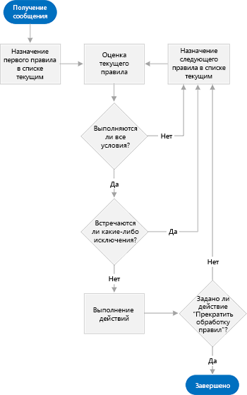
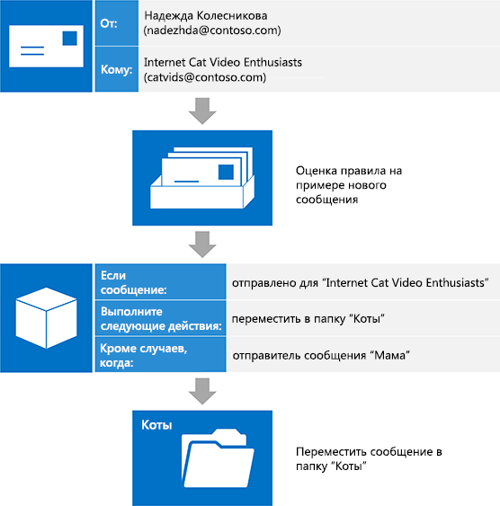

# Управление папкой "Входящие" и EWS в Exchange

Узнайте, как управлять папкой "Входящие" в приложении, использующем управляемый API EWS или веб-службы Exchange, с помощью правил для папки "Входящие" и списка заблокированных отправителей.
  
Почтовые ящики Exchange оснащены функциями, помогающими пользователям автоматически упорядочивать входящую почту. Все эти функции работают на сервере без участия пользователя, но предназначены для разных целей. Управляемый API EWS и веб-службы Exchange предоставляют доступ к этим функциям, позволяя вашим пользователям управлять своими папками "Входящие".
  
**Таблица 1. Функции управления папкой "Входящие"**

|**Задача**|**Применение**|
|:-----|:-----|
|Выполнение действий с входящими сообщениями (например, перенос в другую папку или удаление) на основе определенных условий (например, имени отправителя, темы или вложений)    |Правила для папки "Входящие"    |
|Удаление всех входящих сообщений от определенного отправителя    |Список заблокированных отправителей    |
   
## Правила для папки "Входящие"

Надо признать, не все электронные сообщения одинаково полезны. На каждое сообщение от начальника приходится по одному обновлению списка рассылки, от которого вы постоянно забываете отписаться. Хотя такие письма и интересны, списки рассылки используют огромное количество трафика, а важные сообщения запросто могут затеряться среди них в папке "Входящие". Чтобы сократить количество подобных сообщений, многие пользователи применяют правила для папки "Входящие". В результате папка приобретает намного более аккуратный вид. Приложение может применять такие правила с помощью веб-служб Exchange (EWS).
  
Управляемый API EWS предоставляет методы [ExchangeService.GetInboxRules](https://msdn.microsoft.com/library/microsoft.exchange.webservices.data.exchangeservice.getinboxrules%28v=exchg.80%29.aspx) и [ExchangeService.UpdateInboxRules](https://msdn.microsoft.com/library/microsoft.exchange.webservices.data.exchangeservice.updateinboxrules%28v=exchg.80%29.aspx) для работы с правилами. В веб-службах Exchange для работы с правилами предусмотрены операции [GetInboxRules](https://msdn.microsoft.com/library/b4b2701a-4a23-4acc-8c75-19f7955ad7ae%28Office.15%29.aspx) и [UpdateInboxRules](https://msdn.microsoft.com/library/f982a237-471e-45c5-a2b5-468cfc53150b%28Office.15%29.aspx). Однако обратите внимание, что в управляемом API EWS и веб-службах Exchange действуют следующие ограничения на работу с правилами для папки "Входящие": 
  
- Веб-службы Exchange не могут использовать и создавать правила "только для клиентов" или правила, настроенные в Outlook для работы только на текущем компьютере.
    
- Чтобы изменить текущий набор правил с помощью веб-служб Exchange, необходимо удалить большой двоичный объект правил Outlook (если он существует). Это означает, что при изменении правил с помощью веб-служб Exchange удаляются все правила, отключенные ранее с помощью Outlook.  
    
### Как работают правила?

Обработчик правил действует как привратник для почтового ящика пользователя. Прежде чем сообщение, поступающее в почтовый ящик пользователя, появится в папке "Входящие", оно проверяется по упорядоченному списку правил. Обратите внимание, что это происходит только при получении сообщения и только для папки "Входящие". Эти правила делятся на три части: [условия](#bk_Conditions), [действия](#bk_Actions) и [исключения](#bk_Exceptions).
  
Начиная с правила в начале списка, обработчик правил выполняет указанные ниже действия, пока не будет достигнут конец списка.
  
1. Проверка соответствия сообщения всем условиям, указанным в правиле.
    
1. Если сообщение соответствует всем условиям, обработчик правил переходит к этапу 2.
    
2. Если же сообщение соответствует не всем условиям, обработчик правил загружает следующее правило в списке и повторяет этап 1.
    
2. Проверка соответствия сообщения каким-либо из условий, указанных в правиле.
    
1. Если сообщение соответствует какому-либо из исключений, обработчик правил загружает следующее правило в списке и повторяет этап 1.
    
2. Если же сообщение не соответствует ни одному из исключений, обработчик переходит к этапу 3.
    
3. Выполнение с сообщением действий, указанных в правиле.
    
1. Если указано действие "Остановить обработку других правил", обработчик правил выполняет с сообщением все остальные действия, а затем завершает работу, не сопоставляя сообщение с другими правилами.
    
2. Если действие "Остановить обработку других правил" не указано, обработчик правил загружает следующее правило из списка и заново начинает работу с этапа 1.
    
На приведенном ниже рисунке показан процесс работы обработчика правил.
  
**Рисунок 1. Обзор обработчика правил**

  
### Составные части правила

Чтобы понять, как устроено правило, представьте, что даете указания человеку, которому поручено упорядочить вашу входящую почту. Вы можете сказать: "когда сообщение приступит к этому человеку, \<insert conditions here\> если оно не \<insert actions here\> указано \<insert exceptions here\> . Рассмотрим каждую часть более подробно.
  
#### Условия

[Условия](https://msdn.microsoft.com/library/f049a48c-9585-43f7-8549-0b8cb19a5eea%28Office.15%29.aspx) описывают, в каких случаях должно применяться правило. Хотя условия правила можно не указывать (при этом правило будет применяться к каждому полученному сообщению), чаще всего у правил есть условия, применимые к определенному подмножеству входящих сообщений. Примеры: "если отправитель сообщения — Ольга" или "если сообщение отправлено в список рассылки «Любители кошек»". Правило может включать несколько условий. В этом случае, чтобы обработчик правил выполнил указанное действие, должны соблюдаться все условия. 
  
#### Действия

[Действия](https://msdn.microsoft.com/library/c5aa96b1-2d8b-422f-8c2f-f118572ab23f%28Office.15%29.aspx) описывают, что происходит при срабатывании правила. Примеры: "переместить сообщение в папку «Кошки»" или "присвоить сообщению низкий уровень важности". Правило может включать несколько действий. В этом случае при срабатывании правила выполняются все действия. 
  
#### Исключения

[Исключения](https://msdn.microsoft.com/library/7cd63ac2-3441-4ed4-915b-6f90af4b28fc%28Office.15%29.aspx) описывают, в каких случаях правило не должно применяться, даже если соблюдаются указанные условия. Примеры: "если сообщение отправлено не только мне" или "если это сообщение не от мамы". Правило может содержать несколько исключений. В этом случае при соответствии какому-либо из исключений правило не применяется. 
  
### Пример: "собрать кошек вместе".

Посмотрим, как с помощью правил пользователи могут избежать проблем с трафиком, создаваемых списком рассылки с видео про кошек. Сделаем следующие предположения:
  
- Эти сообщения отправляются в список рассылки "Любители кошек".
    
- Рано или поздно пользователи захотят прочитать эти сообщения, но нам не нужно, чтобы они загромождали папку "Входящие". Лучше собирать их в папке "Кошки".
    
- Но пользователи хотят сразу читать сообщения, отправленные в этот список рассылки их мамами, ведь мама всегда находит самые забавные видео.
    
Обработчику правил задается следующая установка: "Когда приходит сообщение, отправленное в список рассылки «Любители кошек», переместить его в папку «Кошки», если это сообщение не от мамы".  
  
**Таблица 2. Определение правила**

|**Часть правила**|**Значение**|
|:-----|:-----|
|Условия    |Отправлено в список рассылки "Любители кошек"    |
|Действия    |Переместить сообщение в папку "Кошки"    И остановить обработку других правил    |
|Исключения    |Отправитель сообщения — "Мама"    |
   
> [!NOTE]
> Обратите внимание, что полученное в итоге правило содержит действие "Остановить обработку других правил". Как правило, рекомендуется добавлять это действие, чтобы избежать путаницы с правилами, применяемыми к тому или иному сообщению. Тем не менее, пропустив это действие и правильно упорядочив правила, можно добиться более точной обработки входящей почты. В данном случае можно с уверенностью сказать, что для видео с кошками не требуется тщательной обработки. 
  
Вскоре после создания этого правила поступает новое сообщение. Ваша коллега, Лилия, отправляет сообщение в список рассылки. Мысленно выполнив работу обработчика правил, мы увидим, что сообщение отвечает всем условиям (оно отправлено в список рассылки "Любители кошек") и не попадает ни под одно из исключений (оно не отправлено мамой), поэтому правило применяется, а сообщение перемещается в папку "Кошки".
  
На приведенном ниже рисунке показано, как правило применяется к входящему сообщению.
  
**Рис. 2. Входящее сообщение, обрабатываемое правилом**

  
## Блокировка отправителей

Хотя вы можете создать правило, которое перемещает все сообщения от определенного отправителя в папку нежелательной почты, это также можно сделать с помощью списка заблокированных отправителей в параметрах нежелательной почты. Так как количество правил для одного пользователя ограничено, имеет смысл использовать список заблокированных отправителей. Вы можете [добавлять и удалять отдельные адреса из списка заблокированных отправителей](how-to-add-and-remove-email-addresses-from-blocked-senders-list-by-using-ews.md), используя метод [ExchangeService.MarkAsJunk](https://msdn.microsoft.com/library/microsoft.exchange.webservices.data.exchangeservice.markasjunk%28v=exchg.80%29.aspx) управляемого API EWS или операцию [MarkAsJunk](https://msdn.microsoft.com/library/1f71f04d-56a9-4fee-a4e7-d1034438329e%28Office.15%29.aspx) веб-служб Exchange. Обратите внимание: чтобы веб-службы Exchange могли получить доступ к списку заблокированных отправителей, почтовый ящик пользователя должен содержать сообщение, отправленное с добавляемого или удаляемого адреса. 
  
## В этой статье

- [Управление правилами папки "Входящие" с помощью EWS в Exchange](how-to-manage-inbox-rules-by-using-ews-in-exchange.md)
    
- [Добавление и удаление электронных адресов из списка заблокированных отправителей](how-to-add-and-remove-email-addresses-from-blocked-senders-list-by-using-ews.md)
    
## См. также

- [Разработка клиентов веб-служб для Exchange](develop-web-service-clients-for-exchange.md)
    
- [Операция GetInboxRules](https://msdn.microsoft.com/library/b4b2701a-4a23-4acc-8c75-19f7955ad7ae%28Office.15%29.aspx)
    
- [Операция UpdateInboxRules](https://msdn.microsoft.com/library/f982a237-471e-45c5-a2b5-468cfc53150b%28Office.15%29.aspx)
    
- [Операция MarkAsJunk](https://msdn.microsoft.com/library/1f71f04d-56a9-4fee-a4e7-d1034438329e%28Office.15%29.aspx)
    

