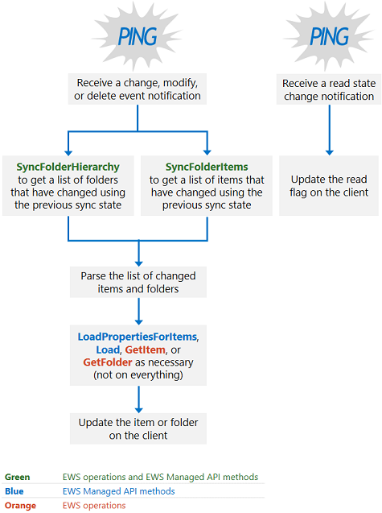

# Синхронизация почтового ящика и веб-службах ExchangeMailbox synchronization and EWS in Exchange

Узнайте, как работает синхронизации почтового ящика, при использовании веб-служб Exchange для доступа к Exchange.Find out how mailbox synchronization works when you use EWS to access Exchange.
  
ВЕБ-службах Exchange используется два типа синхронизации для получения содержимого почтового ящика и изменения содержимого почтового ящика:EWS in Exchange uses two types of synchronization to retrieve mailbox content and changes to mailbox content:
  
- Синхронизация папокFolder synchronization
    
- Элемент синхронизацииItem synchronization
    
В этой статье рассказывается о как типы синхронизации, как работает синхронизации, шаблоны проектирования синхронизации и рекомендации по синхронизации.In this article, you'll learn about both types of synchronization, how synchronization works, synchronization design patterns, and synchronization best practices.
  
## Синхронизация папок и элементовFolder and item synchronization

Синхронизация папок синхронизирует структуру папок или иерархии папок.Folder synchronization syncs a folder structure, or folder hierarchy. Элемент синхронизации синхронизирует элементов в папке.Item synchronization syncs the items within a folder. При синхронизации элементов необходимо синхронизировать каждой папки в почтовом ящике независимо друг от друга.When you synchronize items, you have to sync each folder in the mailbox independently. Можно использовать веб-служб Exchange или управляемый API EWS в приложении для реализации папки и синхронизации элемента.You can use EWS or the EWS Managed API in your application to implement both folder and item synchronization.
  
**В таблице 1. Операции веб-служб Exchange и методы управляемый API EWS для синхронизации папок и элементов****Table 1. EWS operations and EWS Managed API methods for syncing folders and items**

|**Операция служб EWS****EWS operation**|**Метод управляемого API EWS****EWS Managed API method**|
|:-----|:-----|
|[SyncFolderHierarchySyncFolderHierarchy](http://msdn.microsoft.com/library/b31916b1-bc6c-4451-a475-b7c5417f752d%28Office.15%29.aspx)   |[Метод ExchangeService.SyncFolderHierarchyExchangeService.SyncFolderHierarchy method](http://msdn.microsoft.com/en-us/library/microsoft.exchange.webservices.data.exchangeservice.syncfolderhierarchy%28v=exchg.80%29.aspx)   |
|[SyncFolderItemsSyncFolderItems](http://msdn.microsoft.com/library/7f0de089-8876-47ec-a871-df118ceae75d%28Office.15%29.aspx)   |[Метод ExchangeService.SyncFolderItemsExchangeService.SyncFolderItems method](http://msdn.microsoft.com/en-us/library/microsoft.exchange.webservices.data.exchangeservice.syncfolderitems%28v=exchg.80%29.aspx)   |
   
Область синхронизации, которая происходит отличается в зависимости от того, будет ли это начальные и текущие синхронизации, как показано ниже:The scope of the synchronization that occurs differs depending on whether it is an initial or an ongoing sync, as follows:
  
- Начальная синхронизация синхронизирует все папках или элементов на сервере для клиента.An initial synchronization syncs all folders or items on the server to the client. После первоначальной синхронизации клиент имеет состояние синхронизации, в которой хранятся для последующие синхронизации.After the initial synchronization, the client has a sync state that it stores for future synchronizations. Состояние синхронизации представляет все изменения на сервере, на сервере передан клиенту.The sync state represents all the changes on the server that the server communicated to the client.
    
- Постоянная синхронизация синхронизировать все элементы или папки, которые были добавлены, удалены или изменены с момента предыдущей синхронизации.Ongoing synchronizations sync any items or folders that have been added, deleted, or changed since the previous synchronization. Состояние синхронизации используется сервером для расчета изменения сообщение о клиенту во время каждого из циклов текущей синхронизации.The server uses the sync state to calculate the changes to report to the client during each of the ongoing synchronization loops.
    
Каждый метод синхронизации или операции возвращает список изменений, не фактический папки или сообщения, которые изменены.Each synchronization method or operation returns a list of changes, not the actual folder or message that changed. Сообщает изменения элементов и папок с помощью следующие типы изменений:Changes to items and folders are reported by means of the following change types:
  
- Создание — Указывает, что новый элемент или папки должен быть создан на стороне клиента.Create — Indicates that a new item or folder should be created on the client.
    
- Обновление — Указывает, что элемент или папку, должны изменяться на стороне клиента.Update — Indicates that an item or folder should be changed on the client.
    
- DELETE — Указывает, что следует удалить элемент или папку на стороне клиента.Delete — Indicates that an item or folder should be deleted on the client.
    
- ReadStateChange для веб-служб Exchange или ReadFlagChange для управляемого API EWS — указывает, что состояние чтения элемента стала теперь областью, либо из непрочитанные сообщения на чтение или чтение непрочитанные сообщения.ReadStateChange for EWS or ReadFlagChange for the EWS Managed API — Indicates that that the read state of the item has changed, either from unread to read, or read to unread.
    
В Exchange Online, Exchange Online как часть Office 365 и версии Exchange, начиная с Exchange 2010 SP2 элементов и папок возвращаются в порядке от новых к старым.In Exchange Online, Exchange Online as part of Office 365, and versions of Exchange starting with Exchange 2010 SP2, items and folders are returned in order from newest to oldest. В предыдущих версиях Exchange элементов и папок возвращаются от более ранних к более поздним.In previous versions of Exchange, items and folders are returned from oldest to newest.
  
## Каков принцип работы синхронизации веб-служб Exchange?How does EWS synchronization work?

В двух словах при синхронизации почтового ящика в первый раз, используйте процесс, как показано на рисунке 1.In a nutshell, if you're synchronizing a mailbox for the first time, use the process as shown in Figure 1. Несмотря на то, что можно использовать другие [шаблоны проектирования синхронизации](mailbox-synchronization-and-ews-in-exchange.md#bk_syncpatterns), мы рекомендуем этот подход для масштабируемых приложений.Although you can use other [synchronization design patterns](mailbox-synchronization-and-ews-in-exchange.md#bk_syncpatterns), we recommend this approach for scalable applications.
  
**На рисунке 1. Шаблон разработки начальной синхронизации****Figure 1. Initial synchronization design pattern**

  
Если вы используете существующее состояние синхронизации на стороне клиента для синхронизации почтового ящика, рекомендуется реализовать шаблон разработки, как показано на рисунке 2.If you're using an existing sync state on the client to synchronize a mailbox, we recommend that you implement the design pattern as shown in Figure 2. 
  
**На рисунке 2. Шаблон разработки текущей синхронизации****Figure 2. Ongoing synchronization design pattern**

  
## Шаблоны проектирования синхронизацииSynchronization design patterns

Можно использовать один из двух шаблоны проектирования синхронизации в приложении обновлять ваши почтовые ящики: синхронизации на основе уведомлений или подход только для синхронизации.You can use one of two synchronization design patterns in your application to keep your mailboxes up to date: notification-based synchronization, or the synchronization-only approach.
  
Синхронизации на основе уведомлений, как показано на [рисунке 2](mailbox-synchronization-and-ews-in-exchange.md#bk_howdoesitwork), зависит от уведомлений для оповещения клиента, чтобы вызвать методы управляемый API EWS [SyncFolderItems](http://msdn.microsoft.com/en-us/library/microsoft.exchange.webservices.data.exchangeservice.syncfolderitems%28v=exchg.80%29.aspx) или [SyncFolderHierarchy](http://msdn.microsoft.com/en-us/library/microsoft.exchange.webservices.data.exchangeservice.syncfolderhierarchy%28v=exchg.80%29.aspx) или веб-служб Exchange [SyncFolderHierarchy ](http://msdn.microsoft.com/library/b31916b1-bc6c-4451-a475-b7c5417f752d%28Office.15%29.aspx)или [SyncFolderItems](http://msdn.microsoft.com/library/7f0de089-8876-47ec-a871-df118ceae75d%28Office.15%29.aspx) операций.Notification-based synchronization, as illustrated in [Figure 2](mailbox-synchronization-and-ews-in-exchange.md#bk_howdoesitwork), relies on notifications to alert the client to make a call to the EWS Managed API [SyncFolderItems](http://msdn.microsoft.com/en-us/library/microsoft.exchange.webservices.data.exchangeservice.syncfolderitems%28v=exchg.80%29.aspx) or [SyncFolderHierarchy](http://msdn.microsoft.com/en-us/library/microsoft.exchange.webservices.data.exchangeservice.syncfolderhierarchy%28v=exchg.80%29.aspx) methods, or the EWS [SyncFolderHierarchy](http://msdn.microsoft.com/library/b31916b1-bc6c-4451-a475-b7c5417f752d%28Office.15%29.aspx) or [SyncFolderItems](http://msdn.microsoft.com/library/7f0de089-8876-47ec-a871-df118ceae75d%28Office.15%29.aspx) operations. Этот тип синхронизации обычно рекомендуется использовать для масштабирования приложений, но может быть лучший подход для всех пользователей.This type of synchronization is generally recommended for scalable applications, but it might not be the best approach for everyone. На основе уведомлений синхронизации имеет следующие преимущества:Notification-based synchronization has the following advantage: 
  
- Уведомления о оптимизированных для уменьшения вызовов в серверной базе данных Exchange.Notifications are optimized to reduce calls to the backend Exchange database. События очереди и подписок управляются с сервера почтовых ящиков (или сервера клиентского доступа в Exchange 2010 и Exchange 2007); Тем не менее управление событий и подписок использует меньше ресурсов, чем вариант, который является более частое синхронизации обращений к базе данных Exchange.Event queues and subscriptions are managed by the mailbox server (or the Client Access server in Exchange 2010 and Exchange 2007); however, the management of the events and subscriptions uses fewer resources than the alternative, which is more frequent synchronization calls to the Exchange database. Кроме того Exchange имеет определенные [политики регулирования](ews-throttling-in-exchange.md) для уведомлений и подписки, для защиты потребления ресурсов.In addition, Exchange has specific [throttling policies](ews-throttling-in-exchange.md) for notifications and subscriptions, to safeguard consumption of resources. 
    
Тем не менее существует также несколько недостатков с помощью синхронизации на основе уведомлений.However, there are also some drawbacks to using notification-based synchronization:
  
- Уведомления о являются помехами, так как для большинства вариантов включать несколько уведомлений для одного пользователя цель.Notifications are noisy because most scenarios involve multiple notifications for one user intent. Это особенно важно папки календаря.This is especially true of the Calendar folder. Например при получении одного приглашения на собрание несколько уведомлений элемента и папки создаются, включая уведомления для создания элемента, а другой для изменения элемента.For example, when a single meeting request is received, multiple item and folder notifications are created, including a notification to create the item and another to modify the item. Одним из способов устранения этой недостаток – Создание задержка несколько секунд в [нагрузки](http://msdn.microsoft.com/en-us/library/microsoft.exchange.webservices.data.serviceobject.load%28v=exchg.80%29.aspx), [LoadPropertiesForItems](http://msdn.microsoft.com/en-us/library/microsoft.exchange.webservices.data.exchangeservice.loadpropertiesforitems%28v=exchg.80%29.aspx), [GetItem](http://msdn.microsoft.com/en-us/library/exchange/aa565934%28v=exchg.150%29.aspx.aspx)или [GetFolder](http://msdn.microsoft.com/en-us/library/exchange/aa580274%28v=exchg.150%29.aspx.aspx) звонков.One way to mitigate this drawback is to build a delay of a few seconds into your [Load](http://msdn.microsoft.com/en-us/library/microsoft.exchange.webservices.data.serviceobject.load%28v=exchg.80%29.aspx), [LoadPropertiesForItems](http://msdn.microsoft.com/en-us/library/microsoft.exchange.webservices.data.exchangeservice.loadpropertiesforitems%28v=exchg.80%29.aspx), [GetItem](http://msdn.microsoft.com/en-us/library/exchange/aa565934%28v=exchg.150%29.aspx.aspx), or [GetFolder](http://msdn.microsoft.com/en-us/library/exchange/aa580274%28v=exchg.150%29.aspx.aspx) call. В случае приглашения на собрание Если вы внесли вызовов операции **GetItem** немедленно, может иметь один вызов для создания элемента, а другой для изменения элемента.In the case of a meeting request, if you made calls to the **GetItem** operation immediately, you might have one call to create the item and another to modify the item. Вместо этого задержки звонка, можно вызвать операции **GetItem** один раз и проводить изменения, которые охватывают создания и изменения элемента в то же время.Instead, by delaying the call, you can call the **GetItem** operation once and get the changes that encompass the creation and the modification of the item at the same time. 
    
- Уведомления в очереди на сервере почтовых ящиков и подписки будут сохранены на сервере почтовых ящиков.Notifications are queued on the mailbox server and subscriptions are saved on the mailbox server. В случае недоступности сервера почтовых ящиков, который управляет подписки теряется никаких уведомлений о новых, ваш почтовый ящик не синхронизировать и потребуется повторная уведомления.If the mailbox server that manages the subscription is unavailable, you lose any new notifications, your mailbox won't synchronize, and you'll have to resubscribe to the notifications.
    
- Вам потребуется Планирование стратегии устранения в случае, если уведомления с ошибкой.You'll need to plan for mitigation strategies in the event that notifications fail. Таким образом, второй способ шаблон проектирования только для синхронизации, устойчива более чем синхронизации на основе уведомлений, из-за только что клиент поддержка состояния синхронизации — отсутствуют проблемы с сходства на сервер почтовых ящиков Управление подпиской.In this way, the second approach, the synchronization-only design pattern, is more resilient than notification-based synchronization, because it only requires that the client maintain the sync state — there are no issues with affinity to the mailbox server managing the subscription.
    
Если реализован в соответствии с рекомендациями, шаблон проектирования подписки на основе уведомлений зависит от:If implemented as recommended, the notification-based subscription design pattern relies on: 
  
- Уведомления о определить, *Когда* данные изменены.Notifications to determine  *when*  the data changed. 
    
- Управляемый API EWS **SyncFolderHierarchy** или методы **SyncFolderItems** или веб-служб Exchange **SyncFolderHierarchy** или **SyncFolderItems** операций чтобы определить, *какие* изменяется, оптимизация число возвращаемых событий синхронизации.The EWS Managed API **SyncFolderHierarchy** or **SyncFolderItems** methods, or the EWS **SyncFolderHierarchy** or **SyncFolderItems** operations to determine  *what*  changed, optimizing the number of sync events returned. Был элемент создан, обновлении или удалении?Was a new item created, updated, or deleted? Это все, необходимо знать из этих методов, не используйте их для свойства список изменений.That's all you need to know from these methods, don't rely on them for the property list of changes. (Не **GetItem** или **LoadPropertiesForItems** звонок на все элементы или папки возвращаемых).(Don't do a **GetItem** or **LoadPropertiesForItems** call on all items or folders returned). 
    
- С помощью методов **нагрузки** или **LoadPropertiesForItems** в управляемый API EWS или операции EWS **GetItem** для определения *способа* данные изменены и для получения свойств с сервера при необходимости, организация пакетные запросы на основе на объем данных, которые будут возвращены.Using the **Load** or **LoadPropertiesForItems** methods in the EWS Managed API, or the EWS **GetItem** operation to determine  *how*  the data changed and to retrieve properties from the server as needed, organizing batched requests based on the amount of data that will be returned. Это следует сравнение свойств в клиенте и на их только что возвращенный с сервера и в конечном счете создания, удаления или изменения элемента или папки на стороне клиента.This is followed by a comparison of the properties on the client and those just returned from the server, and ultimately the creation, deletion, or modification of the item or folder on the client. 
    
Подход только для синхронизации полностью зависит от методов **SyncFolderItems** и управляемый API EWS **SyncFolderHierarchy** , или **SyncFolderHierarchy** или веб-служб Exchange **SyncFolderItems** операции, которые можно вызвать либо постоянно или как запланированного задания.The synchronization-only approach relies entirely on the **SyncFolderItems** and **SyncFolderHierarchy** EWS Managed API methods, or the **SyncFolderHierarchy** or **SyncFolderItems** EWS operations, which you can either call continuously, or as a timed event. Существует, преимущества и недостатки для этого параметра также.There are pros and cons to this option as well. Только для синхронизации подход устойчивости, так как состояние синхронизации хранится на стороне клиента на уровне почтового ящика и отношения между состояние синхронизации и любого сервера почтовых ящиков, который поддерживает подписки на уведомления не требуется.The synchronization-only approach is more resilient because the sync state is stored on the client at the mailbox level and a unique relationship between the sync state and any the mailbox server that maintains the notification subscription is not required. Подход синхронизации способное перемещения почтовых ящиков из-за его независимости от сервера почтовых ящиков.The synchronization approach can survive a mailbox failover because of its independence from the mailbox server. Тем не менее, подход синхронизации увеличивает задержку для пользователя, так как синхронизации элементов на основе времени или временная — не в режиме реального времени при получении сообщения.However, the synchronization approach increases latency for the user because items are synchronized on a timed or intermittent basis — not in real time when items arrive. Такой подход также дороже, так как вы выполняете обращений к базе данных Exchange по возможности, что изменений внесено не было.This approach is also more costly, because you're making calls to the Exchange database when it's possible that no changes have occurred. 
  
## Рекомендации по синхронизацииSynchronization best practices

Для приложений, хорошо масштабируемое рекомендуется выполнить следующие рекомендации для синхронизации почтовых ящиков в приложении:For highly scalable applications, we recommend that you apply the following best practices to synchronize mailboxes in your application:
  
- При вызове метода управляемый API EWS **SyncFolderItems** или **SyncFolderHierarchy** использовать значение _IdOnly_ для параметра _propertySet_ или при использовании веб-служб Exchange **SyncFolderHierarchy** или **SyncFolderItems** операции используйте значение **IdOnly** для [BaseShape](http://msdn.microsoft.com/library/42c04f3b-abaa-4197-a3d6-d21677ffb1c0%28Office.15%29.aspx) значения для уменьшения обращений к базе данных Exchange.When calling the EWS Managed API **SyncFolderItems** or **SyncFolderHierarchy** method use the  _IdOnly_ value for the  _propertySet_ parameter, or when using the EWS **SyncFolderHierarchy** or **SyncFolderItems** operations use the **IdOnly** value for the [BaseShape](http://msdn.microsoft.com/library/42c04f3b-abaa-4197-a3d6-d21677ffb1c0%28Office.15%29.aspx) value to reduce calls to the Exchange database. Дополнительные свойства, которые вы запрашиваете в наборе свойств **SyncFolderItems** или **SyncFolderHierarchy** позвонить, дополнительные базы данных создаются вызовы.The more properties you request in the property set of the **SyncFolderItems** or **SyncFolderHierarchy** call, the more backend calls are created. Новый вызов RPC выполняется для каждого запроса, значения свойств в то время как только один вызов RPC выполняется для извлечения всех **что ItemID** для запроса - независимо от того, количество результатов для отчета.A new RPC call is made for every property value requested, whereas only one RPC call is made to retrieve all the **ItemIds** for a request - no matter the number of results to report. Поэтому запрос **IdOnly** приводит к вызова одной базы данных, тогда как запрос контейнер свойств темы и отправителя приводит к три обращений к базе данных: один для **темы**, **отправителя**и **идентификатор элемента**.So an **IdOnly** request results in one database call, whereas a property bag request for the subject and sender results in three database calls: one for the **Subject**, one for the **Sender**, and one for the **ItemId**.
    
- Не вызвать методы управляемый API EWS **нагрузки** или **LoadPropertiesForItems** или веб-служб Exchange **GetItem** или **GetFolder** операций, для каждого элемента в ответ синхронизации.Don't call the EWS Managed API **Load** or **LoadPropertiesForItems** methods, or the EWS **GetItem** or **GetFolder** operations, on every item in a synchronization response. Вместо этого анализа результатов; как искать изменения, которые не требуют все свойства, которые нужно извлечь, прочитайте изменения состояния.Instead, parse the results; look for changes that don't require all the properties to be retrieved, like read state changes. Если ответ содержит изменить состояние чтения, просто обновить флаг на стороне клиента и завершения; не требуется, чтобы получить все свойства элемента.If a response includes a read state change, just update the flag on the client and you're done; no need to get all the item properties. И убедитесь в том, что не дублируется усилий при внесении изменений, которые исходит от одного клиента.And make sure that you don't duplicate effort by making changes that originated from the same client. Например если ответа синхронизации включает в себя удаления элемента и удаление произошло в локальном клиенте, не требуется удалить сообщение еще раз или получить все свойства для этого элемента.For example, if the synchronization response includes the deletion of an item, and the deletion happened on the local client, you don't need to delete the message again or get all the properties for that item. 
    
- Избегайте начало ограничением, выполнив следующие:Avoid getting throttled, by doing the following:
    
  - При вызове метода управляемый API EWS **LoadPropertiesForItems** или операции EWS **GetItem** для получения элементов в пакете, не пакета слишком большого числа элементов в запросе; в противном случае вы получаете [регулирование](ews-throttling-in-exchange.md).When you do call the EWS Managed API **LoadPropertiesForItems** method or the EWS **GetItem** operation to get the items in a batch, do not batch too many items in your request; otherwise, you might get [throttled](ews-throttling-in-exchange.md). Рекомендуется включить 10 элементов в пакете.We recommend that you include 10 items per batch.
    
  - Не выполнение слишком большого числа запросов в слишком короткое время.Don't make too many requests in too short a time. Это будет также привести к регулирования и к увеличению времени ответа, а не Сократите его.This will also cause throttling, and increase the response time, rather than shorten it. 
    
  - Если группировка элементов, пакетного все элементы, имеющие те же значения для атрибутов **Id** и **ChangeKey** элемент [FolderId](http://msdn.microsoft.com/library/00d14e3e-4365-4f21-8f88-eaeea73b9bf7%28Office.15%29.aspx) .If you are batching items, batch all items with the same values for the **Id** and **ChangeKey** attributes of the [FolderId](http://msdn.microsoft.com/library/00d14e3e-4365-4f21-8f88-eaeea73b9bf7%28Office.15%29.aspx) element. 
    
  - Если вы получите ограничением, остановите отправлять запросы.If you do get throttled, stop sending requests. Повторная отправка запросов будет продолжить восстановление усилий.Resending requests will prolong the recovery effort. Вместо этого пассивный истечения времени ожидания, а затем повторите попытку отправки запросов к синхронизации.Instead, wait for the back off time to expire, and then try sending your sync requests again.
    
- В зависимости от типа [события уведомления](notification-subscriptions-mailbox-events-and-ews-in-exchange.md#bk_eventtypes) получено:Depending on the type of [notification event](notification-subscriptions-mailbox-events-and-ews-in-exchange.md#bk_eventtypes) received: 
    
  - Для событий **NewMail** или **изменено** вызова метода управляемый API EWS **SyncFolderItems** или операции EWS **SyncFolderItems** так как уведомления не предоставляют **ChangeKey**и уведомления не указывают состояние чтения изменения.For **NewMail** or **Modified** events, call the EWS Managed API **SyncFolderItems** method or the EWS **SyncFolderItems** operation because notifications do not provide a **ChangeKey**, and notifications do not call out read state changes.
    
  - Для **удаленных** событий Если подписки на уведомления было активной до предыдущей синхронизации, просто удалите события локально.For **Deleted** events, if the notification subscription was active before the previous sync, just delete the event locally. Вызовите метод управляемый API EWS **SyncFolderItems** или операции EWS **SyncFolderItems** сразу же после удаления не требуется.You do not need to call the EWS Managed API **SyncFolderItems** method or the EWS **SyncFolderItems** operation immediately after the deletion. 
    
  - Если **изменено** событие было вызвано изменение состояние чтения, не вызовите метод управляемый API EWS **LoadPropertiesForItems** или операции EWS **GetItem** , замените флаг для элемента.If a **Modified** event was caused by a read state change, do not call the EWS Managed API **LoadPropertiesForItems** method or the EWS **GetItem** operation , just change the flag on the item. 
    
- При синхронизации данных календаря, выполните следующие действия:When synchronizing calendar data, proceed as follows:
    
  - Используйте подобного синхронизации на основе уведомлений.Use an approach similar to notification-based synchronization. Так как **SyncFolderItem** не содержит логику календаря, используйте метод управляемый API EWS [FindAppointments](http://msdn.microsoft.com/en-us/library/dd633767%28v=exchg.80%29.aspx) или веб-служб Exchange [операции FindItem](http://msdn.microsoft.com/library/ebad6aae-16e7-44de-ae63-a95b24539729%28Office.15%29.aspx) с элементом [представления календаря](http://msdn.microsoft.com/library/a4a953b8-0710-416c-95ef-59e51eba9982%28Office.15%29.aspx) для просмотра встреч между двумя датами, а затем Вызовите метод управляемый API EWS **LoadPropertiesForItems** или операции EWS **GetItem** для извлечения свойств элемента для элемента календаря.Because **SyncFolderItem** does not include any calendaring logic, use the EWS Managed API [FindAppointments](http://msdn.microsoft.com/en-us/library/dd633767%28v=exchg.80%29.aspx) method, or the EWS [FindItem operation](http://msdn.microsoft.com/library/ebad6aae-16e7-44de-ae63-a95b24539729%28Office.15%29.aspx) with the [CalendarView](http://msdn.microsoft.com/library/a4a953b8-0710-416c-95ef-59e51eba9982%28Office.15%29.aspx) element to view appointments between two dates, and then call the EWS Managed API **LoadPropertiesForItems** method, or the EWS **GetItem** operation to retrieve the item properties for the calendar item. 
    
  - Не опроса с помощью метода управляемый API EWS **FindAppointments** или операции EWS **FindItem** с элементом **представления календаря** .Do not poll using the EWS Managed API **FindAppointments** method, or the EWS **FindItem** operation with a **CalendarView** element. 
    
- При синхронизации папки поиска:When synchronizing search folders:
    
  - Используйте подобного синхронизации на основе уведомлений.Use an approach similar to notification-based synchronization. 
    
  - Использование уведомлений о для определения при изменении данных.Use notifications to determine when data changes.
    
  - Так как **SyncFolderItem** нельзя использовать в папке поиска, используйте метод управляемый API EWS [FindItems](http://msdn.microsoft.com/en-us/library/microsoft.exchange.webservices.data.exchangeservice.finditems%28v=exchg.80%29.aspx) сортировки и выгружаемый или операции EWS **FindItem** с набором элемент [FractionalPageItemView](http://msdn.microsoft.com/library/4111afec-35e7-4c6f-b291-9bbba603f633%28Office.15%29.aspx) и [SortOrder](http://msdn.microsoft.com/library/c2413f0b-8c03-46ae-9990-13338b3c53a6%28Office.15%29.aspx) для определения отличия.Because you can't use **SyncFolderItem** in a search folder, use a sorted and paged EWS Managed API [FindItems](http://msdn.microsoft.com/en-us/library/microsoft.exchange.webservices.data.exchangeservice.finditems%28v=exchg.80%29.aspx) method, or EWS **FindItem** operation with the [FractionalPageItemView](http://msdn.microsoft.com/library/4111afec-35e7-4c6f-b291-9bbba603f633%28Office.15%29.aspx) and [SortOrder](http://msdn.microsoft.com/library/c2413f0b-8c03-46ae-9990-13338b3c53a6%28Office.15%29.aspx) element set, to determine what changed. 
    
  - Используйте метод управляемый API EWS **LoadPropertiesForItems** или операции EWS **GetItem** для извлечения данных.Use the EWS Managed API **LoadPropertiesForItems** method or the EWS **GetItem** operation to retrieve data. 
    
## Синхронизация с фильтрациейFiltered synchronization

Управляемый API EWS **SyncFolderItems** метод и операции EWS **SyncFolderItems** позволяют игнорировать определенные элементы, на основании их что ItemID, установив параметр _ignoreItemIds_ в управляемый API EWS или [Пропустить](http://msdn.microsoft.com/library/7789eec5-ceec-43f2-84d5-d0d15b734076%28Office.15%29.aspx) элемент в веб-служб Exchange.The EWS Managed API **SyncFolderItems** method and the EWS **SyncFolderItems** operation enable you to ignore specific items, based on their ItemIds, by setting the  _ignoreItemIds_ parameter in the EWS Managed API or the [Ignore](http://msdn.microsoft.com/library/7789eec5-ceec-43f2-84d5-d0d15b734076%28Office.15%29.aspx) element in EWS. Идеально подходит, например, для отдельных пользователей приступить к ответить всем полученного сообщения электронной почты для всех сотрудников компании.This is ideal when, for example, individuals begin to reply all to an email message sent to everyone in the company. 
  
Может возникнуть вопрос, можно ли фильтрации личных уведомлений (и поэтому запуск синхронизации) при изменении определенных свойств?You might wonder, can I filter my notifications (and therefore only trigger synchronization) if specific properties change? Несмотря на то, что кажется приемлемой, так как подписки на уведомления о основаны на тип изменения (Создание, обновление, удаление), и не свойство обновляется, вам не удается применить фильтр уведомлений таким образом.Although that does seem reasonable, because notification subscriptions are based on the type of change (create, update, delete), and not the property being updated, you cannot filter notifications in this way. Вместо этого можно сделать следующее:Instead, you can do the following:
  
- Используйте шаблон проектирования подписки на основе уведомлений.Use the notification-based subscription design pattern.
    
- Вызовите управляемый API EWS **SyncFolderItems** и методы **SyncFolderHierarchy** несколько раз с параметром _propertySet_ , установите значение _IdOnly_ , чтобы сделать текущего состояния синхронизации.Call the EWS Managed API **SyncFolderItems** and **SyncFolderHierarchy** methods repeatedly with the  _propertySet_ parameter set to  _IdOnly_ to make your sync state current. Или при использовании веб-служб Exchange, вызовите **SyncFolderHierarchy** и операции **SyncFolderItems** несколько раз с **BaseShape** значение **IdOnly**.Or if using EWS, call the **SyncFolderHierarchy** and **SyncFolderItems** operations repeatedly with the **BaseShape** value set to **IdOnly**. 
    
- Отменить ответа (не его обработки или выполните любое сравнение свойств).Discard the response (don't parse it or do any property comparisons).
    
- Используйте метод управляемый API EWS **FindItems** или операции EWS **FindItem** и сортировка и страницы для предварительного заполнения элементов в отфильтрованные области, который требуется.Use the EWS Managed API **FindItems** method or the EWS **FindItem** operation and sort and page to prepopulate the items in the filtered scope that you care about. 
    
- Используйте состояние синхронизации вызовите метод управляемый API EWS **SyncFolderItems** или операции EWS **SyncFolderItems** , но только отслеживать изменения в наборе отфильтрованные элемента.Use your synchronization state to continue to call the EWS Managed API **SyncFolderItems** method or the EWS **SyncFolderItems** operation, but only monitor the changes in the filtered item set. Если создаются новые элементы, вам придется являются ли эти новые элементы в пределах отфильтрованные области.If new items are created, you'll have to see if those new items are within your filtered scope. 
    
## В этом разделеIn this section

- [Синхронизация папок с помощью веб-служб Exchange в ExchangeSynchronize folders by using EWS in Exchange](how-to-synchronize-folders-by-using-ews-in-exchange.md)
    
- [Синхронизация элементов с помощью веб-служб Exchange в ExchangeSynchronize items by using EWS in Exchange](how-to-synchronize-items-by-using-ews-in-exchange.md)
    
- [Обработка ошибок, связанных с синхронизации в веб-служб Exchange в ExchangeHandling synchronization-related errors in EWS in Exchange](handling-synchronization-related-errors-in-ews-in-exchange.md)
    
## См. такжеSee also

- [Разработка клиентов веб-служб для ExchangeDevelop web service clients for Exchange](develop-web-service-clients-for-exchange.md)
    
- [Метод SyncFolderItemsSyncFolderItems method](http://msdn.microsoft.com/en-us/library/microsoft.exchange.webservices.data.exchangeservice.syncfolderitems%28v=exchg.80%29.aspx)
    
- [Метод SyncFolderHierarchySyncFolderHierarchy method](http://msdn.microsoft.com/en-us/library/microsoft.exchange.webservices.data.exchangeservice.syncfolderhierarchy%28v=exchg.80%29.aspx)
    
- [Операция SyncFolderHierarchySyncFolderHierarchy operation](http://msdn.microsoft.com/library/b31916b1-bc6c-4451-a475-b7c5417f752d%28Office.15%29.aspx)
    
- [Операция SyncFolderItemsSyncFolderItems operation](http://msdn.microsoft.com/library/7f0de089-8876-47ec-a871-df118ceae75d%28Office.15%29.aspx)
    

