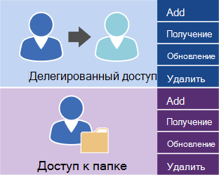

# Управление доступом пользователей с помощью EWS в Exchange

Узнайте, какие у вас есть возможности для управления доступом к учетной записи пользователя на Exchange сервере.
  
Exchange Веб-службы (EWS) и управляемый API EWS предоставляют ограниченное количество операций, которые можно использовать для управления учетными записями Exchange Online, Exchange Online в рамках Office 365 или версии Exchange начиная с Exchange 2013 г. Операции, показанные на следующем рисунке, можно использовать для управления делегатами и для набора разрешений доступа к папкам для других учетных записей. 
  
**Операции EWS для доступа к делегатам и папкам**

  
Если вашему приложению требуется дополнительный контроль над учетной записью на Exchange сервере, для управления учетной записью можно использовать Exchange management Shell. Вы можете вызвать команды Exchange Management Shell, выступая с одним из следующих ок.
  
- Написание приложения с C# или Visual Basic, которое вызывает Exchange управления Shell. Пример кода можно найти в документации [Exchange API](../management/exchange-management-shell.md) управленческой оболочки, чтобы узнать, как вызывать команды. 
    
- Использование Windows PowerShell и Windows PowerShell скриптов для вызова Exchange команды управленческой оболочки. Вы можете найти полный список Exchange Server [PowerShell (Exchange управленческой оболочки)](https://docs.microsoft.com/powershell/exchange/exchange-server/exchange-management-shell?view=exchange-ps)наряду с примерами, которые показывают, как их использовать. 
    
## См. также

- [Настройка приложения веб-служб Exchange](setting-up-your-ews-application.md)   
- [Exchange 2013](https://docs.microsoft.com/powershell/exchange/?view=exchange-ps)  
    

