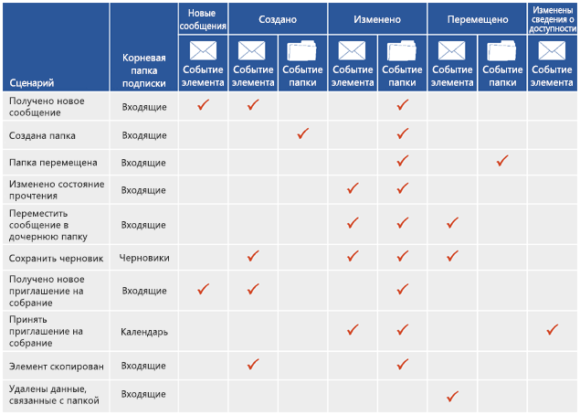

# Подписки на уведомления, события почтовых ящиков и службы EWS в ExchangeNotification subscriptions, mailbox events, and EWS in Exchange

Сведения о подписках на уведомления и событии почтовых ящиков в EWS в Exchange.Find out about notification subscriptions and mailbox event in EWS in Exchange.
  
Чтобы подписаться на уведомления о событиях, возникающих в почтовом ящике или в одной или нескольких папках почтового ящика, можно использовать управляемый API EWS или веб-службы Exchange (EWS). Доступно три типа подписки: на потоковые уведомления, на уведомления по запросу и на push-уведомления. Каждый тип подписки использует собственные методы для получения уведомлений.You can use both the EWS Managed API and Exchange Web Services (EWS) to subscribe to receive notifications when events occur in a mailbox, or in one or more of the folders in a mailbox. Three subscription types are available: streaming notifications, pull notifications, and push notifications. Each of these subscription types uses different techniques to receive or retrieve the notifications.
  
## Какие уведомления выбрать?Getting notifications - what are my options?

Службы EWS предлагают три типа подписки, которые независимо друг от друга уведомляют клиента об изменениях на сервере. Не имеет значения, какую именно подписку вы выберете, вы получите те же самые события уведомлений, отличаться будет только способ получения.EWS includes three subscription types that work independently to notify the client of changes on the server. No matter which subscription type you choose, you'll have access to all the same notification events in the end - it's just a matter of how you get them.
  
**Таблица 1. Типы подписки****Table 1. Subscription types**

|**Вариант****Option**|**Описание****Description**|**Насколько мне это подходит?****Is it right for me?**|
|:-----|:-----|:-----|
|Потоковые уведомленияStreaming notifications    |Уведомления, которые сервер отправляет через соединение, открытое в течение определенного периода времени.Notifications that are sent by the server through a connection that remains open for a specified period of time.    |Потоковые уведомления рекомендуются для большинства приложений. Они похожи на уведомления по запросу и push-уведомления и объединяют в себе свойства обоих указанных типов. После создания подписки на уведомления соединение остается открытым до 30 минут, чтобы сервер успел передать уведомления клиенту. В данном случае не требуется запрашивать обновления, как при подписке на уведомления по запросу. Кроме того, не требуется создавать приложение прослушивателя для веб-службы, которое необходимо для получения push-уведомлений.Streaming notifications are generally recommended for most applications. They're similar to pull and push notifications, and offer the best of both worlds. After you establish your notification subscription, the connection remains open for up to 30 minutes to allow the server to push notifications back to the client. No need to request updates, like you would with a pull subscription, and you don't have to create a web service listener application like you would with a push subscription.    |
|Уведомления по запросуPull notifications    |Уведомления, запрашиваемые или извлекаемые клиентом.Notifications that are requested (or pulled) by the client.    |Уведомления по запросу больше подходят для слабо связанных клиентов, где клиент ненадежно подключен к сети. Эти уведомления могут создавать дополнительный трафик между клиентом и сервером, так как клиент отправляет частые запросы к серверу для получения уведомлений, не все из которых приносят результат.Pull notifications are generally most appropriate for loosely coupled clients, where the client is not reliably connected to the network. Pull notifications can create excess traffic between the client and the server because the client is sending frequent requests to the server to retrieve notifications, and not all requests result in notifications retrieved.    |
|Push-уведомленияPush notifications    |Уведомления, отправляемые (или принудительно отправляемые) сервером в веб-службу на стороне клиента через адрес обратного вызова.Notifications that are sent (or pushed) by the server to a client-side web service via a callback address.    |Как правило, push-уведомления приходят быстрее, чем уведомления по запросу. Кроме того, они подходят для сильно связанных клиентов с IP-адресом, к которым у сервера есть надежный доступ. Тем не менее push-уведомления стали реже использовать после появления потоковых уведомлений в Exchange 2010. Мы также рекомендуем использовать потоковые уведомления вместо push-уведомлений, если это возможно. Кроме того, для использования push-уведомлений требуется написать приложение прослушивателя, в котором и происходит принудительная отправка уведомлений. Уменьшение сетевого трафика — это основное, хоть и незначительное, преимущество данного типа уведомлений по сравнению с уведомлениями по запросу, которое, тем не менее, сводится на нет необходимостью создания отдельного приложения.Generally, push notifications provide for smaller notification latency than pull notifications and are suited for tightly coupled clients to which the server has reliable access and the client is IP addressable. However, push notifications have fallen out of favor since the advent of streaming notifications in Exchange 2010. If possible, we recommend that you use streaming notifications instead of push notifications going forward. Push notifications require that you write a listener application, which is where the notifications are pushed to. This has a slight benefit over pull notifications in that it reduces wire traffic, but it adds overhead by requiring a separate application.    |
   
## На какие события служб EWS можно подписаться?What EWS events can I subscribe to?

Типы событий служб EWS, на которые возможна подписка, определены в статьях "[Перечисление EventType](https://msdn.microsoft.com/library/microsoft.exchange.webservices.data.eventtype%28v=exchg.80%29.aspx)" для управляемого API EWS или "Элемент [EventType](https://msdn.microsoft.com/library/04b70f9e-c226-4130-958e-0db0275cf58b%28Office.15%29.aspx)" для служб EWS. Подписка доступна для следующих событий службы EWS:The types of EWS events that clients subscribe to are defined by the [EventType](https://msdn.microsoft.com/library/microsoft.exchange.webservices.data.eventtype%28v=exchg.80%29.aspx) enumeration for the EWS Managed API or the [EventType](https://msdn.microsoft.com/library/04b70f9e-c226-4130-958e-0db0275cf58b%28Office.15%29.aspx) element for EWS. The following EWS events are available for subscription: 
  
- NewMail — в папку "Входящие" поступило новое сообщение.NewMail — A new message arrived in the Inbox.
    
- Deleted  сообщение безвозвратно удалено из папки "Входящие". Больше об уведомлениях для элементов можно узнать в статьях [Удаление элементов с помощью веб-служб Exchange в Exchange](deleting-items-by-using-ews-in-exchange.md) и [По запросу уведомления для событий, связанных с удаления почтового ящика веб-служб Exchange в Exchange](pull-notifications-for-ews-deletion-related-mailbox-events-in-exchange.md).Deleted — A message was hard deleted from the Inbox. To learn more about deleted item notifications, see [Deleting items by using EWS in Exchange](deleting-items-by-using-ews-in-exchange.md) and [Pull notifications for EWS deletion-related mailbox events in Exchange](pull-notifications-for-ews-deletion-related-mailbox-events-in-exchange.md).
    
- Modified — изменился элемент или папка.Modified — An item or folder was changed.
    
- Moved — элемент или папка перемещены.Moved — An item or folder was moved. 
    
- Copied — скопирован элемент или папка.Copied — An item or folder was copied.
    
- Created — создан элемент или папка.Created — An item or folder was created. 
    
- FreeBusyChanged — изменились сведения о доступности пользователя.FreeBusyChanged — A user's free busy information has been changed.
    
Еще один тип событий служб EWS, событие Status, определяется элементом [EventType](https://msdn.microsoft.com/library/microsoft.exchange.webservices.data.eventtype%28v=exchg.80%29.aspx). На это событие не надо подписываться. Оно отправляется сервером для проверки состояния клиента (только для потоковых и push-уведомлений). Клиент должен ответить на это событие или он будет отключен по истечении времени ожидания.Another EWS event type, the Status event, is defined by the [EventType](https://msdn.microsoft.com/library/microsoft.exchange.webservices.data.eventtype%28v=exchg.80%29.aspx) element, but you don't subscribe to this event. Instead, it's sent by the server to check the status of the client for streaming and push notifications only. The client needs to respond to this event or the client will time out. 
  
Одно действие пользователя может привести к созданию нескольких уведомлений. На рисунке ниже приводится ряд распространенных сценариев и уведомлений, созданных для каждого из них. На получение уведомлений влияют настройки клиента, поэтому приведенный список может быть дополнен другими вариантами конфигураций и соответствующими уведомлениями.A single user action often results in the creation of multiple notifications. To illustrate this, the following figure shows some common scenarios and the notifications created for each one. Client settings have an impact on the notifications received, so this is not an exhaustive list of all the configuration options and resulting notifications.
  
**Рисунок 1. Типы событий, возвращаемые подписками на уведомления****Figure 1. Event types returned by notification subscriptions**

  
На рисунке 1 показан упрощенный процесс создания уведомления. На самом деле, для одного действия пользователя может быть создано несколько уведомлений (даже если они относятся к одному типу). Например, при переносе папки создается три события папки: одно для изменения папки, одно для бывшей родительской папки и еще одно для новой родительской папки. Так как для одной операции может быть создано несколько событий, мы рекомендуем [при создании операции синхронизации задать время ожидания в несколько секунд](mailbox-synchronization-and-ews-in-exchange.md#bk_bestpractices), чтобы синхронизация происходила только после завершения операции.Figure 1 simplifies the notification process. In reality, multiple notifications (even multiple notifications of the same type) can be created for a single user action. For example, in the case of a folder move operation, three folder events are created: one for the folder being modified, one for the old parent folder, and one for the new parent folder. Because numerous events can be fired for a single operation, we recommend that you [build a wait time of a few seconds into your synchronization operations](mailbox-synchronization-and-ews-in-exchange.md#bk_bestpractices), so that you only synchronize when the action is complete, instead of partway through the operation.
  
Кроме того, следует принимать во внимание, что параметры конфигурации, задаваемые конкретным пользователем, также влияют на создание уведомлений. Например, сведения о доступности некоторых пользователей обновляются автоматически, поэтому событие FreeBusyChanged создается в момент получения приглашения на собрание, которое пользователь часто еще не успел прочесть. Если же пользователи, не настраивали обновление сведений о доступности, событие FreeBusyChanged создается, только когда приглашение на собрание будет принято. Эти параметры могут оказывать значительное влияние на уведомления, создаваемые сервером.It's also important to realize that the configuration settings that each user chooses will affect which notifications are created. For example, some users' free busy data is updated automatically and the FreeBusyChanged event is created when a new meeting request is received, even before they've read the item. For other users, free busy data isn't updated and the FreeBusyChanged event isn't created until after the meeting has been accepted. These settings can have a considerable impact on the notifications created by the server.
  
## Принципы работы уведомлений служб EWSHow do EWS notifications work?

Уведомления служб EWS обрабатываются на основании подписки. Обычно для одного почтового ящика создается одна подписка, которая позволяет подписаться на все папки или на некоторые из них. Решите на какие уведомления подписываться (потоковые уведомления, уведомления по запросу или push-уведомления), сведения о каких событиях получать (NewMail, Created, Deleted, Modified и т. д.), а затем создайте подписку. После этого сервер почтового ящика будет асинхронно отправлять клиенту события службы EWS. (Для справки: события синхронны в Exchange 2007, а в Exchange 2010 они хранятся на сервере клиентского доступа, но это не относится к более поздним версиям.)EWS notifications are handled on a subscription basis. Typically there's one subscription per mailbox, and within the mailbox subscription you can subscribe to some or all folders. You decide what kind of notification to subscribe to (streaming, pull, or push) and what kind of events you'd like to receive (NewMail, Created, Deleted, Modified, etc.), and then you create a subscription. The EWS events are then sent asynchronously from the mailbox server to the client. (History lesson: events are synchronous in Exchange 2007 - and events are stored on the Client Access server in Exchange 2010, but no more!).
  
Способы отправки уведомлений клиенту отличаются в зависимости от выбранного типа подписки. В этом разделе содержатся дополнительные сведения о принципах работы каждого из них.Depending on the type of subscription you have, the ways in which the notifications are sent to the client vary. This section describes how each type of subscription works in more detail.
  
### Потоковые уведомления служб EWSEWS streaming notifications

Потоковые уведомления используют ожидающий запрос GET для сервера, чтобы соединение для подписки с потоковой передачей оставалось открытым. Таким образом, выполняется немедленная потоковая передача клиенту всех событий, происходящих, пока соединение активно. Во время одного подключения может быть отправлено несколько уведомлений. Соединение остается открытым в течение определенного времени, но не более 30 минут. После чего клиент снова отправляет ожидающий запрос GET. На рисунке 2 показан принцип работы подписок с потоковой передачей и потоковых уведомлений.Streaming notifications rely on a hanging get request on the server to keep a streaming subscription connection open, so that any events that occur while the connection is active are streamed to the client immediately. Multiple notifications can be sent over the course of a single connection, and the connection stays open until the interval expires, or for a maximum of 30 minutes. After the connection expires, the client sends the hanging get request again. Figure 2 shows how streaming subscriptions and streaming notifications work.
  
**Рисунок 2. Обзор потоковых уведомлений****Figure 2. Streaming notification overview**

  
Дополнительные сведения по созданию потоковых уведомлений см. в статье [Потоковая передача уведомлений о событиях почтовых ящиков с помощью EWS в Exchange](how-to-stream-notifications-about-mailbox-events-by-using-ews-in-exchange.md).For information about creating streaming notifications, see [Stream notifications about mailbox events by using EWS in Exchange](how-to-stream-notifications-about-mailbox-events-by-using-ews-in-exchange.md).
  
### Уведомления по запросу служб EWSEWS pull notifications

Для получения уведомлений по запросу клиент запрашивает их через определенный, регулируемый им интервал. В результате могут приходить ответы GetEvents без уведомлений. На рисунке 3 показан принцип работы подписок и уведомлений по запросу.Pull notifications rely on the client asking for the notifications on an interval that the client manages. This can result in GetEvents responses with no notifications. Figure 3 shows how pull subscriptions and pull notifications work.
  
**Рисунок 3. Обзор уведомлений по запросу****Figure 3. Pull notification overview**

  
Дополнительные сведения по созданию уведомлений по запросу см. в статье [Уведомления по запросу о событиях почтовых ящиков с помощью веб-служб Exchange в Exchange](how-to-pull-notifications-about-mailbox-events-by-using-ews-in-exchange.md).For information about creating pull notifications, see [Pull notifications about mailbox events by using EWS in Exchange](how-to-pull-notifications-about-mailbox-events-by-using-ews-in-exchange.md).
  
### Push-уведомления служб EWSEWS push notifications

Сервер принудительно отправляет push-уведомления обратно клиенту, поэтому трафик используется только при передаче уведомления. На рисунке 4 показан принцип работы принудительных подписок и push-уведомлений.Push notifications rely on the server pushing notifications back to the client. There's only traffic if there's a notification. Figure 4 shows how push subscriptions and push notifications work.
  
**Рисунок 4. Обзор push-уведомлений****Figure 4. Push notification overview**

Если вы используете [push-уведомления в Exchange 2010](https://msdn.microsoft.com/library/db1f8523-fa44-483f-bdb6-ab5939b52eee%28Office.15%29.aspx), рекомендуем перейти к [использованию потоковых уведомлений](https://code.msdn.microsoft.com/exchange/Exchange-2013-Set-push-82738cc5) в приложении, в этом случае вам не понадобится отдельное приложение для получения событий.If you are using [push notifications with Exchange 2010](https://msdn.microsoft.com/library/db1f8523-fa44-483f-bdb6-ab5939b52eee%28Office.15%29.aspx), consider upgrading your application to [use streaming notifications](https://code.msdn.microsoft.com/exchange/Exchange-2013-Set-push-82738cc5), so that you don't need a separate application to receive the events.

  
## Как подписаться на уведомления?How do I subscribe to notifications?

Существует несколько вариантов подписки на уведомления в зависимости от типа подписки, который нужно создать.Depending on the type of subscription you'd like to create, you have a number of options to choose from for subscribing to notifications.
  
**Таблица 2. Методы подписки на уведомления и необходимые операции****Table 2. Operations and methods for subscribing to notifications**

|**Тип подписки****Subscription type**|**Операция служб EWS****EWS operation**|**Методы управляемого API EWS****EWS Managed API methods**|**Действие****What it does**|
|:-----|:-----|:-----|:-----|
|Подписка с потоковой передачейStreaming    |[Операции подпискиSubscribe operation](https://msdn.microsoft.com/library/f17c3d08-c79e-41f1-ba31-6e41e7aafd87%28Office.15%29.aspx)   |Метод [ExchangeService.BeginSubscribeToStreamingNotifications](https://msdn.microsoft.com/library/microsoft.exchange.webservices.data.exchangeservice.beginsubscribetostreamingnotifications%28v=exchg.80%29.aspx)[ExchangeService.BeginSubscribeToStreamingNotifications method](https://msdn.microsoft.com/library/microsoft.exchange.webservices.data.exchangeservice.beginsubscribetostreamingnotifications%28v=exchg.80%29.aspx)   Метод [ExchangeService.BeginSubscribeToStreamingNotificationsOnAllFolders](https://msdn.microsoft.com/library/microsoft.exchange.webservices.data.exchangeservice.beginsubscribetostreamingnotificationsonallfolders%28v=exchg.80%29.aspx)[ExchangeService.BeginSubscribeToStreamingNotificationsOnAllFolders method](https://msdn.microsoft.com/library/microsoft.exchange.webservices.data.exchangeservice.beginsubscribetostreamingnotificationsonallfolders%28v=exchg.80%29.aspx)   Метод [ExchangeService.SubscribeToStreamingNotificationsOnAllFolders](https://msdn.microsoft.com/library/microsoft.exchange.webservices.data.exchangeservice.subscribetostreamingnotifications%28v=exchg.80%29.aspx)[ExchangeService.SubscribeToStreamingNotificationsOnAllFolders method](https://msdn.microsoft.com/library/microsoft.exchange.webservices.data.exchangeservice.subscribetostreamingnotifications%28v=exchg.80%29.aspx)   |Создает запрос подписки на потоковые уведомления.Creates a request to subscribe to streaming notifications.    |
|Подписка по запросуPull    |[Операции подпискиSubscribe operation](https://msdn.microsoft.com/library/f17c3d08-c79e-41f1-ba31-6e41e7aafd87%28Office.15%29.aspx)   |Метод [ExchangeService.BeginSubscribeToPullNotifications](https://msdn.microsoft.com/library/microsoft.exchange.webservices.data.exchangeservice.beginsubscribetopullnotifications%28v=exchg.80%29.aspx)[ExchangeService.BeginSubscribeToPullNotifications method](https://msdn.microsoft.com/library/microsoft.exchange.webservices.data.exchangeservice.beginsubscribetopullnotifications%28v=exchg.80%29.aspx)   Метод [ExchangeService.BeginSubscribeToPullNotificationsOnAllFolders](https://msdn.microsoft.com/library/microsoft.exchange.webservices.data.exchangeservice.beginsubscribetopullnotificationsonallfolders%28v=exchg.80%29.aspx)[ExchangeService.BeginSubscribeToPullNotificationsOnAllFolders method](https://msdn.microsoft.com/library/microsoft.exchange.webservices.data.exchangeservice.beginsubscribetopullnotificationsonallfolders%28v=exchg.80%29.aspx)   Метод [ExchangeService.SubscribeToPullNotifications](https://msdn.microsoft.com/library/microsoft.exchange.webservices.data.exchangeservice.subscribetopullnotifications%28v=exchg.80%29.aspx)[ExchangeService.SubscribeToPullNotifications method](https://msdn.microsoft.com/library/microsoft.exchange.webservices.data.exchangeservice.subscribetopullnotifications%28v=exchg.80%29.aspx)   Метод [ExchangeService.SubscribeToPullNotificationsOnAllFolders](https://msdn.microsoft.com/library/microsoft.exchange.webservices.data.exchangeservice.subscribetopullnotificationsonallfolders%28v=exchg.80%29.aspx)[ExchangeService.SubscribeToPullNotificationsOnAllFolders method](https://msdn.microsoft.com/library/microsoft.exchange.webservices.data.exchangeservice.subscribetopullnotificationsonallfolders%28v=exchg.80%29.aspx)   |Создает запрос подписки на уведомления по запросу.Creates a request to subscribe to pull notifications.    |
|Push-уведомлениеPush    |[Операции подпискиSubscribe operation](https://msdn.microsoft.com/library/f17c3d08-c79e-41f1-ba31-6e41e7aafd87%28Office.15%29.aspx)   |Перегруженный метод [ExchangeService.BeginSubscribeToPushNotifications](https://msdn.microsoft.com/library/microsoft.exchange.webservices.data.exchangeservice.beginsubscribetopushnotifications%28v=exchg.80%29.aspx)[ExchangeService.BeginSubscribeToPushNotifications overloaded method](https://msdn.microsoft.com/library/microsoft.exchange.webservices.data.exchangeservice.beginsubscribetopushnotifications%28v=exchg.80%29.aspx)   Перегруженный метод [ExchangeService.BeginSubscribeToPushNotificationsOnAllFolders](https://msdn.microsoft.com/library/microsoft.exchange.webservices.data.exchangeservice.beginsubscribetopushnotificationsonallfolders%28v=exchg.80%29.aspx)[ExchangeService.BeginSubscribeToPushNotificationsOnAllFolders overload method](https://msdn.microsoft.com/library/microsoft.exchange.webservices.data.exchangeservice.beginsubscribetopushnotificationsonallfolders%28v=exchg.80%29.aspx)   Перегруженный метод [ExchangeService.SubscribeToPushNotifications](https://msdn.microsoft.com/library/microsoft.exchange.webservices.data.exchangeservice.subscribetopushnotifications%28v=exchg.80%29.aspx)[ExchangeService.SubscribeToPushNotifications overloaded method](https://msdn.microsoft.com/library/microsoft.exchange.webservices.data.exchangeservice.subscribetopushnotifications%28v=exchg.80%29.aspx)   Перегруженный метод [ExchangeService.SubscribeToPushNotificationsOnAllFolders](https://msdn.microsoft.com/library/microsoft.exchange.webservices.data.exchangeservice.subscribetopushnotificationsonallfolders%28v=exchg.80%29.aspx)[ExchangeService.SubscribeToPushNotificationsOnAllFolders overloaded method](https://msdn.microsoft.com/library/microsoft.exchange.webservices.data.exchangeservice.subscribetopushnotificationsonallfolders%28v=exchg.80%29.aspx)   |Создает запрос подписки на push-уведомления.Creates a request to subscribe to push notifications.    |
   
## Как получить события служб EWS?How do I get EWS events?

Способ отправки данных о фактических событиях зависит от типа созданной вами подписки.After the subscription is created, the way in which the actual events are sent to the client depends on the subscription type. 
  
Для потоковых уведомлений необходимо создать соединение для подписки с потоковой передачей, а затем добавить в него нужную подписку.For streaming notifications, a streaming subscription connection must be created, and then the subscription is added to the connection. Больше об этом можно узнать в статье [Потоковая передача уведомлений о событиях почтовых ящиков с помощью веб-служб Exchange в Exchange](how-to-stream-notifications-about-mailbox-events-by-using-ews-in-exchange.md).You can read more about this process in [Stream notifications about mailbox events by using EWS in Exchange](how-to-stream-notifications-about-mailbox-events-by-using-ews-in-exchange.md). 
  
Для уведомлений по запросу объект подписки инициализируется при создании подписки, поэтому для получения событий с сервера достаточно вызвать метод **GetEvent** или соответствующую операцию.For pull notifications, the subscription object was initialized when the subscription was created, so you just have to call the **GetEvent** method or operation to retrieve the events from the server. Больше об этом можно узнать в статье [Уведомления по запросу о событиях почтовых ящиков с помощью веб-служб Exchange в Exchange](how-to-pull-notifications-about-mailbox-events-by-using-ews-in-exchange.md).You can read more about this in [Pull notifications about mailbox events by using EWS in Exchange](how-to-pull-notifications-about-mailbox-events-by-using-ews-in-exchange.md). 
  
В таблице ниже перечислены операции и классы, необходимые для получения событий.The following table lists the operations and classes required to retrieve events. 
  
**Таблица 3. Элементы и классы для создания соединения и получения событий****Table 3. Elements and classes for creating a connection and getting events**

|**Тип подписки****Subscription type**|**Операция служб EWS****EWS operation**|**Метод управляемого API EWS****EWS Managed API method**|**Действие****What it does**|
|:-----|:-----|:-----|:-----|
|Подписка с потоковой передачейStreaming    |[Операция GetStreamingEventsGetStreamingEvents operation](https://msdn.microsoft.com/library/8da95423-72bc-4034-90a8-162eedcd059b%28Office.15%29.aspx)   |Метод [StreamingSubscriptionConnection.AddSubscription](https://msdn.microsoft.com/library/microsoft.exchange.webservices.data.streamingsubscriptionconnection.addsubscription%28v=exchg.80%29.aspx)[StreamingSubscriptionConnection.AddSubscription method](https://msdn.microsoft.com/library/microsoft.exchange.webservices.data.streamingsubscriptionconnection.addsubscription%28v=exchg.80%29.aspx)   |Создает на сервере ожидающий запрос GET, ответ на который приходит при возникновении какого-либо события.Creates a hanging get request on the server, which is responded to when events occur.    |
|Подписка по запросуPull    |[Операция GetEventsGetEvents operation](https://msdn.microsoft.com/library/f268efe5-9a1a-41a2-b6a6-51fcde7720a1%28Office.15%29.aspx)   |Метод [PullSubscription.GetEvents](https://msdn.microsoft.com/library/microsoft.exchange.webservices.data.pullsubscription.getevents%28v=exchg.80%29.aspx)[PullSubscription.GetEvents method](https://msdn.microsoft.com/library/microsoft.exchange.webservices.data.pullsubscription.getevents%28v=exchg.80%29.aspx)   |Получает с сервера уведомления по запросу.Gets pull notification events from the server.    |
|Принудительная подпискаPush    |Не применимо.Not applicable.    |Не применимо.Not applicable.    |Push-уведомления автоматически отправляются на прослушиватель для веб-службы (URL-адрес обратного вызова указывается в запросе на подписку). Не требуется вызывать дополнительные методы или операции.Push notifications are automatically sent to the web service listener (the callback URL specified in the subscription request). No additional methods or operations need to be called.    |
   
## Как отменить подписку на уведомления?How do I unsubscribe to notifications?

В таблице ниже указаны способы отмены подписки на различные типы уведомлений.The following table lists the ways in which you can unsubscribe to each type of subscription.
  
**Таблица 4. Методы отмены подписки на уведомления и необходимые операции****Table 4. Operations and methods for unsubscribing to notifications**

|**Тип подписки****Subscription type**|**Службы EWS****EWS**|**Управляемый API EWS****EWS Managed API**||
|:-----|:-----|:-----|:-----|
|Подписка с потоковой передачейStreaming    |[Операция по отмене подпискиUnsubscribe operation](https://msdn.microsoft.com/library/994a9d2b-1501-4804-90f0-12bd914496ec%28Office.15%29.aspx)   |Метод [StreamingSubscription.BeginUnsubscribe](https://msdn.microsoft.com/library/microsoft.exchange.webservices.data.streamingsubscription.beginunsubscribe%28v=exchg.80%29.aspx)[StreamingSubscription.BeginUnsubscribe method](https://msdn.microsoft.com/library/microsoft.exchange.webservices.data.streamingsubscription.beginunsubscribe%28v=exchg.80%29.aspx)   Метод [StreamingSubscription.EndUnsubscribe](https://msdn.microsoft.com/library/microsoft.exchange.webservices.data.streamingsubscription.endunsubscribe%28v=exchg.80%29.aspx)[StreamingSubscription.EndUnsubscribe method](https://msdn.microsoft.com/library/microsoft.exchange.webservices.data.streamingsubscription.endunsubscribe%28v=exchg.80%29.aspx)   Метод [StreamingSubscription.Unsubscribe](https://msdn.microsoft.com/library/microsoft.exchange.webservices.data.streamingsubscription.unsubscribe%28v=exchg.80%29.aspx)[StreamingSubscription.Unsubscribe method](https://msdn.microsoft.com/library/microsoft.exchange.webservices.data.streamingsubscription.unsubscribe%28v=exchg.80%29.aspx)   ||
|Подписка по запросуPull    |[Операция по отмене подпискиUnsubscribe operation](https://msdn.microsoft.com/library/994a9d2b-1501-4804-90f0-12bd914496ec%28Office.15%29.aspx)   |Метод [PullSubscription.BeginUnsubscribe](https://msdn.microsoft.com/library/microsoft.exchange.webservices.data.pullsubscription.beginunsubscribe%28v=exchg.80%29.aspx)[PullSubscription.BeginUnsubscribe method](https://msdn.microsoft.com/library/microsoft.exchange.webservices.data.pullsubscription.beginunsubscribe%28v=exchg.80%29.aspx)   Метод [PullSubscription.EndUnsubscribe](https://msdn.microsoft.com/library/microsoft.exchange.webservices.data.pullsubscription.endunsubscribe%28v=exchg.80%29.aspx)[PullSubscription.EndUnsubscribe method](https://msdn.microsoft.com/library/microsoft.exchange.webservices.data.pullsubscription.endunsubscribe%28v=exchg.80%29.aspx)   Метод [PullSubscription.Unsubscribe](https://msdn.microsoft.com/library/microsoft.exchange.webservices.data.pullsubscription.unsubscribe%28v=exchg.80%29.aspx)[PullSubscription.Unsubscribe method](https://msdn.microsoft.com/library/microsoft.exchange.webservices.data.pullsubscription.unsubscribe%28v=exchg.80%29.aspx)   ||
|Push-уведомлениеPush    |Верните значение **Unsubscribe** в элементе [StatusFrequency](https://msdn.microsoft.com/library/917474e2-a426-4166-b825-53783a41dad4%28Office.15%29.aspx) элемента [SendNotificationResponseMessage](https://msdn.microsoft.com/library/2c6d681b-67ac-4331-bc6b-a2e709b638e3%28Office.15%29.aspx)Return **Unsubscribe** in the [StatusFrequency](https://msdn.microsoft.com/library/917474e2-a426-4166-b825-53783a41dad4%28Office.15%29.aspx) element of the [SendNotificationResponseMessage](https://msdn.microsoft.com/library/2c6d681b-67ac-4331-bc6b-a2e709b638e3%28Office.15%29.aspx)   |Не применимо. Подождите, пока истечет время ожидания для подписки.Not applicable. Let the subscription time out instead.    ||
   
Вы также можете дождаться окончания времени ожидания для любой из подписок.Alternatively, you can let each of the subscriptions time out. 
  
**Таблица 5. Окончание времени ожидания для подписок****Table 5. Subscription time-outs**

|**Тип подписки****Subscription type**|**Значение времени ожидания в службах EWS****Timeout value in EWS**|**Значение времени ожидания в управляемом API EWS****Timeout value in the EWS Managed API**|**Обработка времени ожидания****Timeout handling**|
|:-----|:-----|:-----|:-----|
|Подписка с потоковой передачейStreaming    |Элемент [ConnectionTimeout](https://msdn.microsoft.com/library/14da68a0-bcca-4281-a774-47644baa4ee9%28Office.15%29.aspx)[ConnectionTimeout](https://msdn.microsoft.com/library/14da68a0-bcca-4281-a774-47644baa4ee9%28Office.15%29.aspx) element    | Параметр  *lifetime*  конструктора [StreamingSubscriptionConnection](https://msdn.microsoft.com/library/microsoft.exchange.webservices.data.streamingsubscriptionconnection.streamingsubscriptionconnection%28v=exchg.80%29.aspx)*lifetime*  parameter of the [StreamingSubscriptionConnection](https://msdn.microsoft.com/library/microsoft.exchange.webservices.data.streamingsubscriptionconnection.streamingsubscriptionconnection%28v=exchg.80%29.aspx) constructor    |Для управляемого API EWS по истечении заданного значения времени ожидания запускается событие [OnDisconnect](https://msdn.microsoft.com/library/microsoft.exchange.webservices.data.streamingsubscriptionconnection.ondisconnect%28v=exchg.80%29.aspx). Если не вызван метод [StreamingSubscriptionConnection.Open](https://msdn.microsoft.com/library/microsoft.exchange.webservices.data.streamingsubscriptionconnection.open%28v=exchg.80%29.aspx) соединение прерывается.  For the EWS Managed API, after the timeout value elapses, the [OnDisconnect](https://msdn.microsoft.com/library/microsoft.exchange.webservices.data.streamingsubscriptionconnection.ondisconnect%28v=exchg.80%29.aspx) event is raised. If the [StreamingSubscriptionConnection.Open](https://msdn.microsoft.com/library/microsoft.exchange.webservices.data.streamingsubscriptionconnection.open%28v=exchg.80%29.aspx) method is not called, the connection is closed.    Для служб EWS по истечении заданного значения времени ожидания сообщение [GetUserConfigurationResponse](https://msdn.microsoft.com/library/5e418c91-c836-4de0-a80d-f0dad0c684d7%28Office.15%29.aspx) возвращает для элемента [ConnectionStatus](https://msdn.microsoft.com/library/4300f9d6-8bf9-48c2-9f07-d80197864e17%28Office.15%29.aspx) значение "Закрыто".For EWS, after the timeout value elapses, the [GetUserConfigurationResponse](https://msdn.microsoft.com/library/5e418c91-c836-4de0-a80d-f0dad0c684d7%28Office.15%29.aspx) message returns a [ConnectionStatus](https://msdn.microsoft.com/library/4300f9d6-8bf9-48c2-9f07-d80197864e17%28Office.15%29.aspx) value of Closed.    |
|Подписка по запросуPull    |Элемент [Timeout](https://msdn.microsoft.com/library/c2e1ca5a-6667-4f6f-aac4-89de33bddc54%28Office.15%29.aspx)[Timeout](https://msdn.microsoft.com/library/c2e1ca5a-6667-4f6f-aac4-89de33bddc54%28Office.15%29.aspx) element    | Параметр  *timeout*  метода [SubscribeToPullNotification](https://msdn.microsoft.com/library/microsoft.exchange.webservices.data.exchangeservice.subscribetopullnotifications%28v=exchg.80%29.aspx)*timeout*  parameter of the [SubscribeToPullNotification](https://msdn.microsoft.com/library/microsoft.exchange.webservices.data.exchangeservice.subscribetopullnotifications%28v=exchg.80%29.aspx) method    |По истечении заданного значения времени ожидания сервер удаляет подписку.After the timeout value elapses, the server deletes the subscription.    |
|Push-уведомлениеPush    |Элемент [StatusFrequency](https://msdn.microsoft.com/library/917474e2-a426-4166-b825-53783a41dad4%28Office.15%29.aspx)[StatusFrequency](https://msdn.microsoft.com/library/917474e2-a426-4166-b825-53783a41dad4%28Office.15%29.aspx) element    | Параметр  *frequency*  метода [SubscribeToPushNotification](https://msdn.microsoft.com/library/microsoft.exchange.webservices.data.exchangeservice.subscribetopushnotifications%28v=exchg.80%29.aspx)*frequency*  parameter of the [SubscribeToPushNotification](https://msdn.microsoft.com/library/microsoft.exchange.webservices.data.exchangeservice.subscribetopushnotifications%28v=exchg.80%29.aspx) method    |Если сервер не получает ответ на push-уведомление или проверку состояния связи, он несколько раз пытается отправить уведомление, а затем прекращает отправку. Дополнительные сведения см. в статье [StatusFrequency](https://msdn.microsoft.com/library/917474e2-a426-4166-b825-53783a41dad4%28Office.15%29.aspx).  If the server does not receive a response to a push notification or status ping, it retries sending the notification several times before it stops sending the notifications. For more information, see [StatusFrequency](https://msdn.microsoft.com/library/917474e2-a426-4166-b825-53783a41dad4%28Office.15%29.aspx).    |
   
## Можно ли ограничить подписки?Can I limit subscriptions?

В локальном развертывании можно ограничить количество подписок для каждого пользователя с помощью параметра регулирования количества запросов [EwsMaxSubscriptions](ews-throttling-in-exchange.md) политики регулирования. Эту политику можно применить как ко всем пользователям, так и выборочно к некоторым из них. Политику регулирования **EwsMaxSubscriptions** невозможно настроить для Exchange Online.In an on-premises deployment, you can limit the number of subscriptions per user with the [EwsMaxSubscriptions throttling parameter](ews-throttling-in-exchange.md) of the throttling policy. That policy can be applied to all users or just specific users. The **EwsMaxSubscriptions** throttling policy is not configurable for Exchange Online. 
  
## В этой статьеIn this section

- [Потоковая передача уведомлений о событиях почтовых ящиков с помощью веб-служб Exchange в ExchangeStream notifications about mailbox events by using EWS in Exchange](how-to-stream-notifications-about-mailbox-events-by-using-ews-in-exchange.md)
    
- [Уведомления по запросу о событиях почтовых ящиков с помощью веб-служб Exchange в ExchangePull notifications about mailbox events by using EWS in Exchange](how-to-pull-notifications-about-mailbox-events-by-using-ews-in-exchange.md)
    
- [Поддержание сходства между группой подписок и сервером почтовых ящиков в ExchangeMaintain affinity between a group of subscriptions and the Mailbox server in Exchange](how-to-maintain-affinity-between-group-of-subscriptions-and-mailbox-server.md)
    
- [Обработка ошибок, связанных с уведомлениями, в EWS в ExchangeHandling notification-related errors in EWS in Exchange](handling-notification-related-errors-in-ews-in-exchange.md)
    
## См. такжеSee also

- [Разработка клиентов веб-служб для ExchangeDevelop web service clients for Exchange](develop-web-service-clients-for-exchange.md)
- [Справочник по веб-службам для ExchangeWeb services reference for Exchange](../web-service-reference/web-services-reference-for-exchange.md)
- [Начать работу с использованием веб-служб ExchangeStart using web services in Exchange](start-using-web-services-in-exchange.md)
- [Синхронизация почтового ящика и веб-службах ExchangeMailbox synchronization and EWS in Exchange](mailbox-synchronization-and-ews-in-exchange.md)
- [Пример приложения для push-уведомленийPush Notification Sample Application](https://msdn.microsoft.com/library/db1f8523-fa44-483f-bdb6-ab5939b52eee%28Office.15%29.aspx)
    

