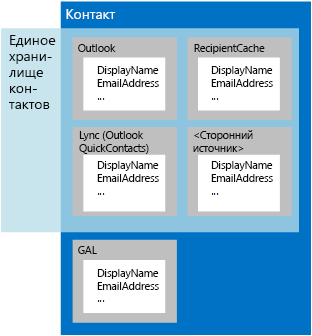

# Пользователи и контакты в EWS для Exchange

Сведения о фиктивных пользователях, едином хранилище контактов и работе с контактами с помощью EWS в Exchange или управляемого API для EWS. 
  
Контакты — это элементы в Exchange, в которых хранится информация об отдельных людях, группах или организациях. Контакты могут включать имена, электронные адреса и другие данные, в том числе адреса для IM, физические адреса, информацию о семье и днях рождения, фотографию или изображение.
  
Контактные данные хранятся в одном из двух расположений:
  
- в доменных службах Active Directory (AD DS), если контакт находится в организации;
    
- в папке "Контакты" или другой папке почтового ящика пользователя, если контакт находится вне организации.
    
Одного человека могут представлять несколько элементов контакта. С помощью фиктивных пользователей в Exchange можно объединить эти различные элементы контакта. *Фиктивный пользователь* сочетает в себе контактные данные из разных источников, относящиеся к одному человеку. Кроме контактных данных из Exchange, фиктивные пользователи также могут содержать данные кэша получателей для почтового ящика, данные скрытой папки QuickContacts для контактов IM, а также данные сторонних источников. Единое хранилище контактов в Exchange позволяет клиентам службы обмена мгновенными сообщениями использовать эти сводные данные, но только без информации из AD DS, как показано на рисунке 1. 
  
**Рис. 1. Источники контактных данных для фиктивных пользователей и единого хранилища контактов**

  
**Таблица 1. Методы управляемого API EWS и операции EWS для работы с контактами**

|**Задача**|**Используйте этот метод управляемого API EWS**|**Используйте эту операцию EWS**|
|:-----|:-----|:-----|
|Создать контакт    |Создать новый экземпляр объекта [Contact](http://msdn.microsoft.com/ru-RU/library/office/microsoft.exchange.webservices.data.contact%28v=exchg.80%29.aspx) и использовать свойство [Contact.Save](http://msdn.microsoft.com/ru-RU/library/office/microsoft.exchange.webservices.data.contact.save%28v=exchg.80%29.aspx)   |[CreateItem](http://msdn.microsoft.com/library/417e994b-0a17-4c24-9527-04796b80b029%28Office.15%29.aspx)   |
|Копировать контакт    |[Contact.Copy](http://msdn.microsoft.com/ru-RU/library/office/microsoft.exchange.webservices.data.contact.copy%28v=exchg.80%29.aspx)   |[CopyItem](http://msdn.microsoft.com/library/bcc68f9e-d511-4c29-bba6-ed535524624a%28Office.15%29.aspx)   |
|Переместить контакт    |[Contact.Move](http://msdn.microsoft.com/ru-RU/library/office/microsoft.exchange.webservices.data.contact.move%28v=exchg.80%29.aspx)   |[MoveItem](http://msdn.microsoft.com/library/dcf40fa7-7796-4a5c-bf5b-7a509a18d208%28Office.15%29.aspx)   |
|Обновить существующий контакт    |[Contact.Bind](http://msdn.microsoft.com/ru-RU/library/office/microsoft.exchange.webservices.data.contact.bind%28v=exchg.80%29.aspx) и [Contact.Update](http://msdn.microsoft.com/ru-RU/library/office/microsoft.exchange.webservices.data.contact.update%28v=exchg.80%29.aspx)   |[UpdateItem](http://msdn.microsoft.com/library/298fdd71-a83d-4407-9728-4f0a8e2d857c%28Office.15%29.aspx)   |
|Удалить контакт    |[Contact.Bind](http://msdn.microsoft.com/ru-RU/library/office/microsoft.exchange.webservices.data.contact.bind%28v=exchg.80%29.aspx) и [Contact.Delete](http://msdn.microsoft.com/ru-RU/library/office/microsoft.exchange.webservices.data.contact.delete%28v=exchg.80%29.aspx)   |[DeleteItem](../web-service-reference/deleteitem-operation.md)   |
|Найти контакт    |[ExchangeService.FindItems](http://msdn.microsoft.com/ru-RU/library/office/microsoft.exchange.webservices.data.exchangeservice.finditems%28v=exchg.80%29.aspx)   |[FindItem](http://msdn.microsoft.com/library/ebad6aae-16e7-44de-ae63-a95b24539729%28Office.15%29.aspx)   |
|Найти пользователей    |Н/Д    |[FindPeople](http://msdn.microsoft.com/library/446106b7-ff2d-4107-90c1-29f4d38ba128%28Office.15%29.aspx)   |
|Развернуть группу рассылки    |[ExchangeService.ExpandGroup](http://msdn.microsoft.com/ru-RU/library/office/microsoft.exchange.webservices.data.exchangeservice.expandgroup%28v=exchg.80%29.aspx)   |[ExpandDL](http://msdn.microsoft.com/library/1f7837e7-9eff-4e10-9577-c40f7ed6af94%28Office.15%29.aspx)   |
|Устранить неоднозначность имени    |[ExchangeService.ResolveName](http://msdn.microsoft.com/ru-RU/library/office/microsoft.exchange.webservices.data.exchangeservice.resolvename%28v=exchg.80%29.aspx)   |[ResolveNames](http://msdn.microsoft.com/library/6b4eb4b3-9ad6-4804-a09f-7e20cfea4dbb%28Office.15%29.aspx)   |
|Получить фиктивного пользователя    |Н/Д    |[GetPersona](http://msdn.microsoft.com/library/e2146df0-53d0-4caf-9758-b600bbc14b6a%28Office.15%29.aspx)   |
|Обработать фотографии контакта    |[Contact.SetContactPicture](http://msdn.microsoft.com/ru-RU/library/office/microsoft.exchange.webservices.data.contact.setcontactpicture%28v=exchg.80%29.aspx), [Contact.GetContactPictureAttachment](http://msdn.microsoft.com/ru-RU/library/office/microsoft.exchange.webservices.data.contact.getcontactpictureattachment%28v=exchg.80%29.aspx) или [Contact.RemoveContactPicture](http://msdn.microsoft.com/ru-RU/library/office/microsoft.exchange.webservices.data.contact.setcontactpicture%28v=exchg.80%29.aspx)   |[GetUserPhoto](http://msdn.microsoft.com/library/f6e8143d-4235-428e-8f9c-ab6e9b1cfa6e%28Office.15%29.aspx) или [GetAttachment](http://msdn.microsoft.com/library/24d10a15-b942-415e-9024-a6375708f326%28Office.15%29.aspx)   |
   
## Фиктивные пользователи

До недавних пор контакты обычно сохранялись централизованно (как правило, в почтовом клиенте). Сейчас контакты все чаще сохраняются в различных расположениях (например, на телефоне, сайте социальной сети, в папке "Контакты" почтового ящика Exchange или службе каталогов организации). Из-за размещения контактных данных в различных расположениях несколько контактов, представляющих одного и того же человека, могут включать неодинаковые сведения. Например, один контакт может содержать рабочий номер телефона, а другой — личный. Имя контакта, сохраненного в папке "Контакты", может также отличаться от имени контакта, сохраненного на телефоне.
  
В Exchange Online (как автономной службе, так и службе в составе Office 365) и локальных версиях Exchange, начиная с Exchange 2013, контакты из разных источников, представляющие одного и того же человека, сопоставлены друг с другом подобно электронным сообщениям, объединенным в беседы, с помощью общих идентификаторов связи. Когда сервер Exchange Server возвращает объединенные контактные данные, они включают набор атрибутов для каждого контакта, таких как исходная папка, отображаемое имя, идентификатор источника и другой идентификатор. Все возвращенные свойства и атрибуты в целом — это фиктивный пользователь, а набор возвращенных свойств — [форма фиктивного пользователя](http://msdn.microsoft.com/library/61d87cd5-3270-40d1-bab7-d0d5bf938607%28Office.15%29.aspx).
  
Так как данные, составляющие фиктивного пользователя, не хранятся централизованно и их можно изменить в любое время, фиктивный пользователь создается, только если вы отправляете запрос серверу Exchange Server. Чтобы отправить запрос на поиск фиктивного пользователя, используйте операцию [FindPeople](http://msdn.microsoft.com/library/446106b7-ff2d-4107-90c1-29f4d38ba128%28Office.15%29.aspx) EWS. Этот запрос может предусматривать применение фильтрования по строке запроса и порядка сортировки к результатам, чтобы облегчить поиск нужного пользователя. Например, вы можете извлечь отображаемое имя и набор всех электронных адресов, сопоставленных с определенным контактом, из папки "Контакты", учетной записи Hotmail или LinkedIn, а также службы каталогов компании. Можно также извлечь набор всех фиктивных пользователей, у которых есть адреса для IM. Связывание контактов для создания фиктивных пользователей происходит автоматически. При этом используется алгоритм, распознающий отношения между контактами, которые сохранены на различных устройствах.  
  
> [!NOTE]
> Управляемый API EWS не реализует эту функцию. 
  
**Таблица 2. Операции EWS для работы с фиктивными пользователями**

|**Имя операции**|**Описание**|
|:-----|:-----|
|[FindPeople](http://msdn.microsoft.com/library/446106b7-ff2d-4107-90c1-29f4d38ba128%28Office.15%29.aspx)   |Возвращает всех доступных фиктивных пользователей из указанной папки контактов или извлекает контакты, которые соответствуют заданной строке запроса.    |
|[GetPersona](http://msdn.microsoft.com/library/e2146df0-53d0-4caf-9758-b600bbc14b6a%28Office.15%29.aspx)   |Возвращает набор свойств, сопоставленных с определенным фиктивным пользователем, таких как все адреса для IM или отображаемые имена, по указанному идентификатору фиктивного пользователя.    |
   
Вы можете использовать операции **GetPersona** и **FindPeople** для эффективного извлечения контактных данных из нескольких источников. Так как все элементы, которые относятся к фиктивному пользователю, сопоставлены с идентификатором связи, эти операции можно применять ко множеству приложений, использующих контактные данные. Вот несколько примеров: 
  
- Приложение на мобильном телефоне, которое использует операцию **GetPersona**, когда пользователь звонит контакту, после чего предлагает дополнительные номера телефонов, если никто не отвечает. 
    
- Приложение, с помощью операции **FindPeople** проверяющее, есть ли в электронных адресах сообщений из папки "Входящие" такие, которые включены в существующего фиктивного пользователя. Адреса, уже не сопоставленные с фиктивным пользователем, можно использовать для оформления потенциальных клиентов или создания списка всех недавних бесед с человеком, который представлен этим пользователем. 
    
- [Почтовое приложение для Outlook](mail-apps-for-outlook-and-ews-in-exchange.md), в котором доступны различные варианты приветствия в зависимости от того, формальна переписка или нет. Формальные приветствия предоставляются с учетом отображаемых имен из службы каталогов, а неформальные — с учетом отображаемых имен из социальной сети. 
    
## Единое хранилище контактов

Фиктивные пользователи доступны не только в почтовом клиенте. Если вы разрабатываете клиент для обмена мгновенными сообщениями, задайте себе такие вопросы (можно все):
  
- Как обеспечить клиентские приложения Lync стандартным набором элементов контакта для IM?
    
- Как управлять списками групп и контактов для IM?
    
- Как управлять специальным клиентским доступом Lync к контактам и группам для IM?
    
Единое хранилище контактов незаметно работает в Exchange, объединяя контактные данные из Exchange и других источников в единую сущность (создавая фиктивного пользователя). Хотя операции EWS, которые вы используете для доступа к единому хранилищу контактов, касаются только контактов для IM, с помощью этого хранилища в Exchange можно работать с фиктивными пользователями в приложениях всех типов. Помните, что у единого хранилища контактов нет доступа к контактным данным AD DS.
  
Контакты для IM хранятся в скрытой папке QuickContacts. С помощью операций **AddNewImContactToGroup** и **AddImContactToGroup** можно добавить контакты в группы, которые хранятся в этой скрытой папке. Так как с помощью единого хранилища контактов можно группировать контакты для IM, стало проще обновлять группы контактов и получать к ним доступ. 
  
> [!NOTE]
> Управляемый API EWS не реализует эту функцию. 
  
**Таблица 3. Операции EWS для доступа к единому хранилищу контактов**

|**Имя операции**|**Описание**|
|:-----|:-----|
|[AddNewImContactToGroup](http://msdn.microsoft.com/library/0cb5525f-faa3-48f1-9551-df55ffc26f46%28Office.15%29.aspx)   |Добавляет новый контакт для IM в группу для IM (количество контактов не должно превышать 1000).    |
|[AddImContactToGroup](http://msdn.microsoft.com/library/376acc42-2684-4596-aca1-82a4a10865c9%28Office.15%29.aspx)   |Добавляет существующий контакт для IM в группу для IM (количество контактов не должно превышать 1000).    |
|[AddImGroup](http://msdn.microsoft.com/library/6df6e504-b7c8-4773-b10f-ffa5defac229%28Office.15%29.aspx)   |Добавляет новую группу для IM (максимальное количество групп — 64).    |
|[AddDistributionGroupToImList](http://msdn.microsoft.com/library/5aa9bec8-71cf-4a6e-8ec8-b4965b40fd4a%28Office.15%29.aspx)   |Добавляет новую группу рассылки в группу для IM (максимальное количество групп — 64).    |
|[GetImItemList](http://msdn.microsoft.com/library/e31d14e1-0c1f-4b69-98b7-157d59c13698%28Office.15%29.aspx)   |Получает список групп для IM и фиктивных пользователей, включающих контакты для IM.    |
|[GetImItems](http://msdn.microsoft.com/library/51186691-46d2-4d5c-b8bc-4ee2bb20fbe7%28Office.15%29.aspx)   |Получает сведения о конкретных группах для IM и фиктивных пользователях, включающих контакты для IM.    |
|[RemoveContactFromImList](http://msdn.microsoft.com/library/28ec96c3-45af-48ff-9f17-718a527dc0ad%28Office.15%29.aspx)   |Удаляет контакт из группы для IM.    |
|[RemoveImContactFromGroup](http://msdn.microsoft.com/library/a190bbec-c71b-4e6a-880b-55854c724d8c%28Office.15%29.aspx)   |Удаляет контакт для IM из группы для IM.    |
|[RemoveDistributionGroupFromImList](http://msdn.microsoft.com/library/252bddf2-98b6-4824-b548-2fba2bda5384%28Office.15%29.aspx)   |Удаляет группу рассылки из группы для IM.    |
|[RemoveImGroup](http://msdn.microsoft.com/library/5e788016-68e0-4a3f-9243-03f6b6c6b389%28Office.15%29.aspx)   |Удаляет группу для IM.    |
|[SetImGroup](http://msdn.microsoft.com/library/2d48aa07-8152-4c3d-a519-061253e80174%28Office.15%29.aspx)   |Изменяет отображаемое имя группы для IM.    |
   
## В этой статье

- [Пакетная обработка контактов с помощью EWS в Exchange](how-to-process-contacts-in-batches-by-using-ews-in-exchange.md)
    
- [Устранение неоднозначности имен с помощью EWS в Exchange 2013](how-to-resolve-ambiguous-names-by-using-ews-in-exchange-2013.md)
    
- [Получение фотографий пользователей с помощью EWS в Exchange](how-to-get-user-photos-by-using-ews-in-exchange.md)
    
## См. также

- [Разработка клиентов веб-служб для Exchange](develop-web-service-clients-for-exchange.md)
    
- [Начало работы с веб-службами Exchange](start-using-web-services-in-exchange.md)
    
- [Общие сведения о разработке клиента EWS для Exchange](ews-client-design-overview-for-exchange.md)
    

