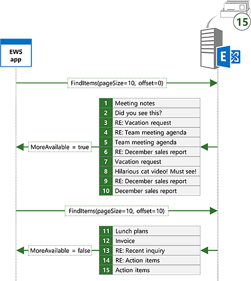

# <a name="search-and-ews-in-exchange"></a><span data-ttu-id="ccd19-103">Поиск и веб-службах Exchange</span><span class="sxs-lookup"><span data-stu-id="ccd19-103">Search and EWS in Exchange</span></span>

<span data-ttu-id="ccd19-104">Узнайте, как выполнять поиск элементов в Exchange с помощью управляемого интерфейса API веб-служб Exchange или веб-служб Exchange.</span><span class="sxs-lookup"><span data-stu-id="ccd19-104">Find out how to search for items in Exchange by using the EWS Managed API or EWS.</span></span>
  
<span data-ttu-id="ccd19-105">Не похоже на этом?</span><span class="sxs-lookup"><span data-stu-id="ccd19-105">Does this sound familiar?</span></span> <span data-ttu-id="ccd19-106">И, наконец, вы начинаете этого проекта, которые вы откладывается для недель, а для получения сведений о проекте, которое ваш начальник отправить вам в электронной почты недели назад.</span><span class="sxs-lookup"><span data-stu-id="ccd19-106">You're finally starting that project you've been putting off for weeks, and you need information about the project that your manager sent you in email weeks ago.</span></span> <span data-ttu-id="ccd19-107">Папки "Входящие" содержит сотни или тысячи возможно сообщений.</span><span class="sxs-lookup"><span data-stu-id="ccd19-107">Your Inbox has hundreds or perhaps thousands of messages in it.</span></span> <span data-ttu-id="ccd19-108">Чем занимаешься?</span><span class="sxs-lookup"><span data-stu-id="ccd19-108">What do you do?</span></span> <span data-ttu-id="ccd19-109">Прокрутке сканирование каждого темы и отправителя, найдите его электронной почты?</span><span class="sxs-lookup"><span data-stu-id="ccd19-109">Do you scroll through your email scanning each subject and sender until you find it?</span></span> <span data-ttu-id="ccd19-110">Или вы используйте функцию поиска в избранные почтовом клиенте быстро нулевые значения в на то, что вам нужно?</span><span class="sxs-lookup"><span data-stu-id="ccd19-110">Or do you use the search feature in your favorite email client to quickly zero in on what you need?</span></span>
  
<span data-ttu-id="ccd19-111">Поиск — это возможно функции необходимы для любой клиент электронной почты.</span><span class="sxs-lookup"><span data-stu-id="ccd19-111">Search is arguably a must-have feature for any email client.</span></span> <span data-ttu-id="ccd19-112">Однако поиска можно использовать для гораздо больше, чем просто предоставление пользователям возможности поиска по почтовому ящику.</span><span class="sxs-lookup"><span data-stu-id="ccd19-112">But search can be used for a lot more than just enabling users to search their mailbox.</span></span> <span data-ttu-id="ccd19-113">Требуется ли ваше приложение для обработки встречи, попадающие в определенное время windows?</span><span class="sxs-lookup"><span data-stu-id="ccd19-113">Does your app need to process appointments that fall within specific time windows?</span></span> <span data-ttu-id="ccd19-114">Возможно, вам необходимо сообщить о во всех элементах задач с определенным состоянием или переместить все контакты с именем конкретной компании в другую папку.</span><span class="sxs-lookup"><span data-stu-id="ccd19-114">Maybe you need to report on all task items with a specific status, or move all contacts with a specific company name to a different folder.</span></span> <span data-ttu-id="ccd19-115">Поиск может помочь со всеми этим требованиям.</span><span class="sxs-lookup"><span data-stu-id="ccd19-115">Search can help with all of these requirements.</span></span>
  
## <a name="search-basics"></a><span data-ttu-id="ccd19-116">Основы поиска</span><span class="sxs-lookup"><span data-stu-id="ccd19-116">Search basics</span></span>
<span data-ttu-id="ccd19-117"><a name="bk_SearchBasics"> </a></span><span class="sxs-lookup"><span data-stu-id="ccd19-117"></span></span>

<span data-ttu-id="ccd19-118">Управляемый API EWS и веб-служб Exchange предоставляют два основных способа указания поиска.</span><span class="sxs-lookup"><span data-stu-id="ccd19-118">The EWS Managed API and EWS offer two basic methods for specifying a search.</span></span> <span data-ttu-id="ccd19-119">Можно использовать [фильтр поиска](how-to-use-search-filters-with-ews-in-exchange.md) или [строки запроса](how-to-perform-an-aqs-search-by-using-ews-in-exchange.md).</span><span class="sxs-lookup"><span data-stu-id="ccd19-119">You can use a [search filter](how-to-use-search-filters-with-ews-in-exchange.md) or a [query string](how-to-perform-an-aqs-search-by-using-ews-in-exchange.md).</span></span> <span data-ttu-id="ccd19-120">Используемый метод зависит от цели поиска за операции поиска.</span><span class="sxs-lookup"><span data-stu-id="ccd19-120">The method you use depends on the intent behind your search.</span></span>
  
<span data-ttu-id="ccd19-121">**В таблице 1. Сценарии фильтры поиска и поисковых запросов**</span><span class="sxs-lookup"><span data-stu-id="ccd19-121">**Table 1. Scenarios for search filters and search queries**</span></span>

|<span data-ttu-id="ccd19-122">**Если вы хотите...**</span><span class="sxs-lookup"><span data-stu-id="ccd19-122">**If you want to…**</span></span>|<span data-ttu-id="ccd19-123">**Использование...**</span><span class="sxs-lookup"><span data-stu-id="ccd19-123">**Use a…**</span></span>|<span data-ttu-id="ccd19-124">**Примечания**</span><span class="sxs-lookup"><span data-stu-id="ccd19-124">**Notes**</span></span>|
|:-----|:-----|:-----|
|<span data-ttu-id="ccd19-125">Ограничение поиска в определенное свойство или набор свойств</span><span class="sxs-lookup"><span data-stu-id="ccd19-125">Limit your search to a specific property or set of properties</span></span>  <br/> |<span data-ttu-id="ccd19-126">Фильтр поиска</span><span class="sxs-lookup"><span data-stu-id="ccd19-126">Search filter</span></span>  <br/> |<span data-ttu-id="ccd19-127">Фильтры поиска предоставляют наиболее уровень элемента управления, по которому выполняется поиск свойства.</span><span class="sxs-lookup"><span data-stu-id="ccd19-127">Search filters provide the best level of control over which properties are searched.</span></span> <span data-ttu-id="ccd19-128">Несмотря на то, что строки запроса можно распределять ограниченный набор свойств с помощью расширенный синтаксис запроса (AQS), фильтры поиска можно назначить любое свойство.</span><span class="sxs-lookup"><span data-stu-id="ccd19-128">Although query strings can target a limited set of properties by using Advanced Query Syntax (AQS), search filters can target any property.</span></span>  <br/> |
|<span data-ttu-id="ccd19-129">Создание операций поиска с несколькими условиями</span><span class="sxs-lookup"><span data-stu-id="ccd19-129">Create searches with multiple criteria</span></span>  <br/> |<span data-ttu-id="ccd19-130">Фильтр поиска</span><span class="sxs-lookup"><span data-stu-id="ccd19-130">Search filter</span></span>  <br/> |<span data-ttu-id="ccd19-131">Фильтры поиска несколько условий поиска может быть присоединен вместе с логической запускалась или или, позволяя поиска как «тема содержит «Заметки к собранию» и отправителя равно «Sadie Daniels»».</span><span class="sxs-lookup"><span data-stu-id="ccd19-131">With search filters, multiple search criteria can be joined together with logical ANDs or ORs, allowing for searches like "subject contains 'Meeting Notes' AND sender equals 'Sadie Daniels'".</span></span> <span data-ttu-id="ccd19-132">Несмотря на то, что строки запросов также можно объединить несколько условий поиска, они ограничены набор свойств, поддерживаемых строки запроса.</span><span class="sxs-lookup"><span data-stu-id="ccd19-132">Although query strings can also join multiple search criteria, they are limited to the set of properties supported by query strings.</span></span>  <br/> |
|<span data-ttu-id="ccd19-133">Настраиваемые свойства поиска</span><span class="sxs-lookup"><span data-stu-id="ccd19-133">Search custom properties</span></span>  <br/> |<span data-ttu-id="ccd19-134">Фильтр поиска</span><span class="sxs-lookup"><span data-stu-id="ccd19-134">Search filter</span></span>  <br/> |<span data-ttu-id="ccd19-135">Фильтры поиска можно распределять настраиваемых свойств.</span><span class="sxs-lookup"><span data-stu-id="ccd19-135">Search filters can target custom properties.</span></span> <span data-ttu-id="ccd19-136">Строки запроса не выполняйте поиск настраиваемых свойств.</span><span class="sxs-lookup"><span data-stu-id="ccd19-136">Query strings do not search custom properties.</span></span>  <br/> |
|<span data-ttu-id="ccd19-137">Поиск с учетом регистра строковые свойства</span><span class="sxs-lookup"><span data-stu-id="ccd19-137">Perform a case sensitive search of string properties</span></span>  <br/> |<span data-ttu-id="ccd19-138">Фильтр поиска</span><span class="sxs-lookup"><span data-stu-id="ccd19-138">Search filter</span></span>  <br/> |<span data-ttu-id="ccd19-139">Строка поиска не учитывают регистр.</span><span class="sxs-lookup"><span data-stu-id="ccd19-139">Query string searches are not case sensitive.</span></span>  <br/> |
|<span data-ttu-id="ccd19-140">Включение режима при поиске строковые свойства элемента управления</span><span class="sxs-lookup"><span data-stu-id="ccd19-140">Control the containment mode when searching string properties</span></span>  <br/> |<span data-ttu-id="ccd19-141">Фильтр поиска</span><span class="sxs-lookup"><span data-stu-id="ccd19-141">Search filter</span></span>  <br/> |<span data-ttu-id="ccd19-142">Поиск строки запроса, всегда поиск подстрок.</span><span class="sxs-lookup"><span data-stu-id="ccd19-142">Query string searches are always substring searches.</span></span> <span data-ttu-id="ccd19-143">Если вам требуется для поиска конкретных префиксами или Требовать точного совпадения, поисковый фильтр — это лучший вариант.</span><span class="sxs-lookup"><span data-stu-id="ccd19-143">If you need to search for specific prefixes, or require exact matches, a search filter is the best choice.</span></span>  <br/> |
|<span data-ttu-id="ccd19-144">Поиск папки</span><span class="sxs-lookup"><span data-stu-id="ccd19-144">Search for folders</span></span>  <br/> |<span data-ttu-id="ccd19-145">Фильтр поиска</span><span class="sxs-lookup"><span data-stu-id="ccd19-145">Search filter</span></span>  <br/> |<span data-ttu-id="ccd19-146">Веб-служб Exchange не поддерживает поиск папок с помощью строки запроса.</span><span class="sxs-lookup"><span data-stu-id="ccd19-146">EWS does not support searching for folders with a query string.</span></span>  <br/> |
|<span data-ttu-id="ccd19-147">Создание папки поиска</span><span class="sxs-lookup"><span data-stu-id="ccd19-147">Create a search folder</span></span>  <br/> |<span data-ttu-id="ccd19-148">Фильтр поиска</span><span class="sxs-lookup"><span data-stu-id="ccd19-148">Search filter</span></span>  <br/> |<span data-ttu-id="ccd19-149">Веб-служб Exchange не поддерживает создание папки поиска с помощью строки запроса.</span><span class="sxs-lookup"><span data-stu-id="ccd19-149">EWS does not support creating search folders with a query string.</span></span>  <br/> |
|<span data-ttu-id="ccd19-150">Поиск во всех часто используемых свойств</span><span class="sxs-lookup"><span data-stu-id="ccd19-150">Search across all commonly used properties</span></span>  <br/> |<span data-ttu-id="ccd19-151">Строки запроса</span><span class="sxs-lookup"><span data-stu-id="ccd19-151">Query string</span></span>  <br/> |<span data-ttu-id="ccd19-152">Строки запросов, которые не содержат AQS будет поиск по всем часто используемых свойств.</span><span class="sxs-lookup"><span data-stu-id="ccd19-152">Query strings that do not contain AQS will search across all commonly used properties.</span></span> <span data-ttu-id="ccd19-153">К примеру значение строки запроса «Mack Chaves» возвращает все сообщения, отправленные с Mack Chaves, а также любые сообщения, для которых «Mack Chaves» в тексте или теме.</span><span class="sxs-lookup"><span data-stu-id="ccd19-153">For example, a query string value of "Mack Chaves" will return all messages sent by Mack Chaves as well as any messages that have "Mack Chaves" in the body or subject.</span></span>  <br/> |
|<span data-ttu-id="ccd19-154">Построение на основе ввода пользователя простого поиска</span><span class="sxs-lookup"><span data-stu-id="ccd19-154">Construct a search based on simple user input</span></span>  <br/> |<span data-ttu-id="ccd19-155">Строки запроса</span><span class="sxs-lookup"><span data-stu-id="ccd19-155">Query string</span></span>  <br/> |<span data-ttu-id="ccd19-156">Строка запроса — отлично подходит для конечному пользователю для быстрого поиска с помощью следующей команды в простой строки.</span><span class="sxs-lookup"><span data-stu-id="ccd19-156">A query string is a great choice for allowing an end user to do a quick search by typing in a simple string.</span></span> <span data-ttu-id="ccd19-157">Поскольку поиск строки запроса включает все часто используемые свойства, результатов будет содержать все элементы, которые содержат условия поиска пользователя.</span><span class="sxs-lookup"><span data-stu-id="ccd19-157">Because a query string search includes all commonly used properties, the results will contain any items that contain the user's search terms.</span></span>  <br/> |
   
### <a name="using-a-search-filter"></a><span data-ttu-id="ccd19-158">С помощью фильтра поиска</span><span class="sxs-lookup"><span data-stu-id="ccd19-158">Using a search filter</span></span>

<span data-ttu-id="ccd19-159">Фильтры поиска предоставить самые разнообразные параметры поиска и максимальную степень контроль над выполнением поиска.</span><span class="sxs-lookup"><span data-stu-id="ccd19-159">Search filters give you a wide range of search options and the greatest degree of control over how the search is performed.</span></span> <span data-ttu-id="ccd19-160">Фильтры поиска можно использовать для выполнения базовой равенство и выполняется поиск сравнения, но можно также поиск в содержимом строковые свойства или Битовая маска сравнений.</span><span class="sxs-lookup"><span data-stu-id="ccd19-160">You can use search filters to perform basic equality and comparison searches, but you can also search within the contents of string properties or do bitmask comparisons.</span></span>
  
<span data-ttu-id="ccd19-161">Например можно выполнить поиск содержимое темы элементов с помощью класса [SearchFilter.ContainsSubstring](http://msdn.microsoft.com/ru-ru/library/microsoft.exchange.webservices.data.searchfilter.containssubstring%28v=exchg.80%29.aspx) в управляемый API веб-служб Exchange.</span><span class="sxs-lookup"><span data-stu-id="ccd19-161">For example, you can search the contents of the subject of items by using the [SearchFilter.ContainsSubstring](http://msdn.microsoft.com/ru-ru/library/microsoft.exchange.webservices.data.searchfilter.containssubstring%28v=exchg.80%29.aspx) class in the EWS Managed API.</span></span> <span data-ttu-id="ccd19-162">В этом примере фильтр поиска создается для поиска темы поиск подстроки «собрания» без учета регистра.</span><span class="sxs-lookup"><span data-stu-id="ccd19-162">In this example, a search filter is created to search the subject for the substring "meeting notes", ignoring case.</span></span> 
  
```cs
SearchFilter.ContainsSubstring subjectFilter = new SearchFilter.ContainsSubstring(ItemSchema.Subject,
    "meeting notes", ContainmentMode.Substring, ComparisonMode.IgnoreCase);
```

<span data-ttu-id="ccd19-163">Можно также выполнить поиск от настраиваемых свойств.</span><span class="sxs-lookup"><span data-stu-id="ccd19-163">You can also search against custom properties.</span></span> <span data-ttu-id="ccd19-164">В этом примере настраиваемое свойство **ItemIndex** поиск значения, превышающие 3.</span><span class="sxs-lookup"><span data-stu-id="ccd19-164">In this example, the custom property **ItemIndex** is searched for values greater than 3.</span></span> 
  
```cs
Guid MyAppGuid = new Guid("{AA3DF801-4FC7-401F-BBC1-7C93D6498C2E}");
ExtendedPropertyDefinition customPropDefinition =
    new ExtendedPropertyDefinition(MyAppGuid, "ItemIndex", MapiPropertyType.Integer); 
SearchFilter.IsGreaterThan customPropFilter =
    new SearchFilter.IsGreaterThan(customPropDefinition, 3);
```

<span data-ttu-id="ccd19-165">Также можно объединить несколько поисковых фильтров для создания более сложного поиска.</span><span class="sxs-lookup"><span data-stu-id="ccd19-165">You can also combine multiple search filters to create more complex searches.</span></span> <span data-ttu-id="ccd19-166">Например можно объединить предыдущих двух фильтров с логического и с помощью класса [SearchFilter.SearchFilterCollection](http://msdn.microsoft.com/ru-ru/library/microsoft.exchange.webservices.data.searchfilter.searchfiltercollection%28v=exchg.80%29.aspx) .</span><span class="sxs-lookup"><span data-stu-id="ccd19-166">For example, you can combine the previous two filters with a logical AND by using the [SearchFilter.SearchFilterCollection](http://msdn.microsoft.com/ru-ru/library/microsoft.exchange.webservices.data.searchfilter.searchfiltercollection%28v=exchg.80%29.aspx) class.</span></span> 
  
```cs
SearchFilter.SearchFilterCollection compoundFilter =
    new SearchFilter.SearchFilterCollection(LogicalOperator.And, subjectFilter, customPropFilter);
```

### <a name="using-a-query-string"></a><span data-ttu-id="ccd19-167">С помощью строки запроса</span><span class="sxs-lookup"><span data-stu-id="ccd19-167">Using a query string</span></span>

<span data-ttu-id="ccd19-168">Строки запросов представляют используется другой подход для поиска.</span><span class="sxs-lookup"><span data-stu-id="ccd19-168">Query strings provide a different approach to search.</span></span> <span data-ttu-id="ccd19-169">У вас есть меньше контроль над поля, которые производится поиск и как выполнять поиск при использовании поиск строки запроса.</span><span class="sxs-lookup"><span data-stu-id="ccd19-169">You have less control over the fields that are searched and how the search is performed when you use a query string search.</span></span> <span data-ttu-id="ccd19-170">Не, который плохо!</span><span class="sxs-lookup"><span data-stu-id="ccd19-170">Not that that's a bad thing!</span></span> <span data-ttu-id="ccd19-171">В некоторых случаях может потребоваться так сказать приведения широкую сеть.</span><span class="sxs-lookup"><span data-stu-id="ccd19-171">In some cases, you might want to cast a wider net, so to speak.</span></span>
  
<span data-ttu-id="ccd19-172">Например можно выполнить поиск «собрания» с помощью метода [ExchangeService.FindItems](http://msdn.microsoft.com/ru-ru/library/jj223808%28v=exchg.80%29.aspx) управляемый API веб-служб Exchange.</span><span class="sxs-lookup"><span data-stu-id="ccd19-172">For example, you can search for "meeting notes" by using the [ExchangeService.FindItems](http://msdn.microsoft.com/ru-ru/library/jj223808%28v=exchg.80%29.aspx) EWS Managed API method.</span></span> 
  
```cs
FindItemsResults<Item> results = service.FindItems(folder, "meeting notes", view);
```

<span data-ttu-id="ccd19-173">Если сравнить результаты поиска в результаты ранее пример поиска **SearchFilter.ContainsSubstring** поиска будет содержать дополнительные результаты.</span><span class="sxs-lookup"><span data-stu-id="ccd19-173">If you compare the results of this search to the results of the **SearchFilter.ContainsSubstring** search example earlier, this search will contain more results.</span></span> <span data-ttu-id="ccd19-174">Возвращает только элементы, которые имеют «собрания» в теме сообщения, во время поиска которого возвращаются элементы, которые имеют «собрания» в теме, текста и другие поля фильтра поиска.</span><span class="sxs-lookup"><span data-stu-id="ccd19-174">The search filter search will return only items that have "meeting notes" in the subject, while this search will return items that have "meeting notes" in the subject, body, and other fields.</span></span> 
  
<span data-ttu-id="ccd19-175">Давайте рассмотрим, как можно усовершенствовать строки запроса, чтобы результаты из фильтра поиска.</span><span class="sxs-lookup"><span data-stu-id="ccd19-175">Let's take a look at how you can refine the query string to get closer to the results you see from the search filter.</span></span> <span data-ttu-id="ccd19-176">С помощью AQS, можно ограничить поиск к теме.</span><span class="sxs-lookup"><span data-stu-id="ccd19-176">Using AQS, you can limit your search to the subject.</span></span>
  
```cs
FindItemsResults<Item> results = service.FindItems(folder, "subject:meeting notes", view);
```

<span data-ttu-id="ccd19-177">Это более подробно, но результаты совпадают с по-прежнему неправильно.</span><span class="sxs-lookup"><span data-stu-id="ccd19-177">This is closer, but the results are still not quite the same.</span></span> <span data-ttu-id="ccd19-178">При использовании нескольких слов строки запроса, вы получите совпадения, даже в том случае, если ключевых слов не в том порядке, который указан или даже в том случае, если они не вплотную друг к другу.</span><span class="sxs-lookup"><span data-stu-id="ccd19-178">When you use a query string with multiple words, you will get matches even if the words are not in the order you specify, or even if they're not adjacent to each other.</span></span> <span data-ttu-id="ccd19-179">С помощью строки запроса «Тема: собрания» получение совпадений для «примечаний к собраниям», «примечания из собрания» и так далее.</span><span class="sxs-lookup"><span data-stu-id="ccd19-179">With the query string "subject:meeting notes", you will get matches for "meeting notes", "notes from the meeting", and so on.</span></span> <span data-ttu-id="ccd19-180">Для уточнения, можно включить условия поиска в двойные кавычки, чтобы указать, что только эту фразу.</span><span class="sxs-lookup"><span data-stu-id="ccd19-180">To further refine, you can wrap the search terms in double quotes to indicate that you want that phrase only.</span></span>
  
```cs
FindItemsResults<Item> results = service.FindItems(folder, "subject:\"meeting notes\"", view);
```

## <a name="requesting-specific-properties-in-search-results"></a><span data-ttu-id="ccd19-181">Разрешения на запрос конкретных свойств в результатах поиска</span><span class="sxs-lookup"><span data-stu-id="ccd19-181">Requesting specific properties in search results</span></span>
<span data-ttu-id="ccd19-182"><a name="bk_RequestSpecific"> </a></span><span class="sxs-lookup"><span data-stu-id="ccd19-182"></span></span>

<span data-ttu-id="ccd19-183">По умолчанию результаты поиска будет содержать все свойства для элементов, которые соответствуют поиска.</span><span class="sxs-lookup"><span data-stu-id="ccd19-183">By default, search results will contain all properties on the items that match the search.</span></span> <span data-ttu-id="ccd19-184">В некоторых случаях может быть необходимые, но в большинстве случаев приложения требуется совокупность свойств.</span><span class="sxs-lookup"><span data-stu-id="ccd19-184">In some cases this might be what you want, but in most cases your application only requires a discrete set of properties.</span></span> <span data-ttu-id="ccd19-185">В этом случае следует ограничить набор свойств, которые возвращаются только свойства приложение должно.</span><span class="sxs-lookup"><span data-stu-id="ccd19-185">In this case, you should limit the set of properties that are returned to only the properties your application needs.</span></span> <span data-ttu-id="ccd19-186">В следующем примере класс [ItemView](http://msdn.microsoft.com/ru-ru/library/microsoft.exchange.webservices.data.itemview%28v=exchg.80%29.aspx) используется для ограничения возвращаемых свойств к теме, дата/время получения и идентификатор элементов.</span><span class="sxs-lookup"><span data-stu-id="ccd19-186">In the following example, the [ItemView](http://msdn.microsoft.com/ru-ru/library/microsoft.exchange.webservices.data.itemview%28v=exchg.80%29.aspx) class is used to limit the returned properties to the subject, date/time received, and ID of the items.</span></span> 
  
```cs
ItemView view = new ItemView(10);
// Creating a new PropertySet with this constructor includes 
// ItemSchema.Id.
view.PropertySet = new PropertySet(ItemSchema.Subject, ItemSchema.DateTimeReceived);
```

## <a name="controlling-search-depth"></a><span data-ttu-id="ccd19-187">Управление глубины для поиска</span><span class="sxs-lookup"><span data-stu-id="ccd19-187">Controlling search depth</span></span>
<span data-ttu-id="ccd19-188"><a name="bk_SearchDepth"> </a></span><span class="sxs-lookup"><span data-stu-id="ccd19-188"></span></span>

<span data-ttu-id="ccd19-189">Настройка обход на представление управляет глубину и области поиска.</span><span class="sxs-lookup"><span data-stu-id="ccd19-189">Setting the traversal on the view controls the depth and scope of the search.</span></span> 
  
<span data-ttu-id="ccd19-190">**В таблице 2. Значения обхода поиска**</span><span class="sxs-lookup"><span data-stu-id="ccd19-190">**Table 2. Search traversal values**</span></span>

|<span data-ttu-id="ccd19-191">**Значение обхода**</span><span class="sxs-lookup"><span data-stu-id="ccd19-191">**Traversal value**</span></span>|<span data-ttu-id="ccd19-192">**Применимо к**</span><span class="sxs-lookup"><span data-stu-id="ccd19-192">**Applies to**</span></span>|<span data-ttu-id="ccd19-193">**Описание**</span><span class="sxs-lookup"><span data-stu-id="ccd19-193">**Description**</span></span>|
|:-----|:-----|:-----|
|<span data-ttu-id="ccd19-194">Неполная</span><span class="sxs-lookup"><span data-stu-id="ccd19-194">Shallow</span></span>  <br/> |<span data-ttu-id="ccd19-195">Элементов и папок</span><span class="sxs-lookup"><span data-stu-id="ccd19-195">Items and Folders</span></span>  <br/> |<span data-ttu-id="ccd19-196">Поиск частичного ограничены являются прямыми потомками папки поиска.</span><span class="sxs-lookup"><span data-stu-id="ccd19-196">Shallow searches are limited to direct children of the folder being searched.</span></span>  <br/> |
|<span data-ttu-id="ccd19-197">Глубокое</span><span class="sxs-lookup"><span data-stu-id="ccd19-197">Deep</span></span>  <br/> |<span data-ttu-id="ccd19-198">Элементы (только для папок поиска) и папок</span><span class="sxs-lookup"><span data-stu-id="ccd19-198">Items (only with search folders) and Folders</span></span>  <br/> |<span data-ttu-id="ccd19-199">Рекурсивно глубокой поисков поиска выполняется поиск папки и вложенные папки.</span><span class="sxs-lookup"><span data-stu-id="ccd19-199">Deep searches recursively search the folder being searched and subfolders.</span></span>  <br/> |
|<span data-ttu-id="ccd19-200">Связанные</span><span class="sxs-lookup"><span data-stu-id="ccd19-200">Associated</span></span>  <br/> |<span data-ttu-id="ccd19-201">Элементы</span><span class="sxs-lookup"><span data-stu-id="ccd19-201">Items</span></span>  <br/> |<span data-ttu-id="ccd19-202">Связанные поиск включаются только связанных элементов из папки поиска.</span><span class="sxs-lookup"><span data-stu-id="ccd19-202">Associated searches only include associated items from the folder being searched.</span></span> <span data-ttu-id="ccd19-203">Связанные элементы, скрытые элементы в папке.</span><span class="sxs-lookup"><span data-stu-id="ccd19-203">Associated items are hidden items within the folder.</span></span>  <br/> |
|<span data-ttu-id="ccd19-204">SoftDeleted</span><span class="sxs-lookup"><span data-stu-id="ccd19-204">SoftDeleted</span></span>  <br/> |<span data-ttu-id="ccd19-205">Элементов и папок</span><span class="sxs-lookup"><span data-stu-id="ccd19-205">Items and Folders</span></span>  <br/> |<span data-ttu-id="ccd19-206">Этот тип обхода является устаревшим.</span><span class="sxs-lookup"><span data-stu-id="ccd19-206">This traversal type is deprecated.</span></span> <span data-ttu-id="ccd19-207">Поиск SoftDeleted включает только элементов, находящихся в корзине.</span><span class="sxs-lookup"><span data-stu-id="ccd19-207">SoftDeleted searches only include items that are in the dumpster.</span></span> <span data-ttu-id="ccd19-208">Корзины вместо нее [папки восстанавливаемых элементов](http://technet.microsoft.com/ru-ru/library/ee364755%28v=exchg.150%29.aspx(Office.15).aspx) в Exchange Online, Exchange Online как часть Office 365 и версии Exchange, начиная с Exchange 2010.</span><span class="sxs-lookup"><span data-stu-id="ccd19-208">The dumpster has been replaced by the [Recoverable Items Folder](http://technet.microsoft.com/ru-ru/library/ee364755%28v=exchg.150%29.aspx(Office.15).aspx) in Exchange Online, Exchange Online as part of Office 365, and versions of Exchange starting with Exchange 2010.</span></span>  <br/> |
   
## <a name="managing-search-results"></a><span data-ttu-id="ccd19-209">Управление результатами поиска</span><span class="sxs-lookup"><span data-stu-id="ccd19-209">Managing search results</span></span>
<span data-ttu-id="ccd19-210"><a name="bk_ManageSearchResults"> </a></span><span class="sxs-lookup"><span data-stu-id="ccd19-210"></span></span>

<span data-ttu-id="ccd19-211">Управляемый API EWS и веб-служб Exchange также позволяют изменить способ возвращаются результаты поиска.</span><span class="sxs-lookup"><span data-stu-id="ccd19-211">The EWS Managed API and EWS also allow you to change how your search results are returned.</span></span> <span data-ttu-id="ccd19-212">Можно использовать представления для задания свойств, которые включаются в результаты, сортировки результатов и страницы результатов, чтобы получить только заданное количество результатов на ответа.</span><span class="sxs-lookup"><span data-stu-id="ccd19-212">You can use views to specify which properties are included in the results, sort results, and page your results to only get back a set number of results per response.</span></span> <span data-ttu-id="ccd19-213">Также можно сгруппировать результаты, значения определенного поля и элемента управления Глубина поиска путем указания типа обхода.</span><span class="sxs-lookup"><span data-stu-id="ccd19-213">You can also group results by specific field values and control the depth of a search by specifying a traversal type.</span></span> <span data-ttu-id="ccd19-214">И, наконец в папках поиска можно использовать для создания сохраняемого поиска, динамически обновляются при получении сообщения.</span><span class="sxs-lookup"><span data-stu-id="ccd19-214">Finally, you can use search folders to create persistent searches that are updated dynamically as new items arrive.</span></span>
  
### <a name="sorting"></a><span data-ttu-id="ccd19-215">Сортировка</span><span class="sxs-lookup"><span data-stu-id="ccd19-215">Sorting</span></span>

<span data-ttu-id="ccd19-216">Можно получить сервер возвращал отсортированный результаты, которые можно упростить для отображения или обработки элементов в порядке.</span><span class="sxs-lookup"><span data-stu-id="ccd19-216">You can get the server to return sorted results, which can make it easier to display or process items in order.</span></span> <span data-ttu-id="ccd19-217">В этом примере результаты сортируются по даты/времени, полученные с помощью новых элементов, первый.</span><span class="sxs-lookup"><span data-stu-id="ccd19-217">In this example, the results will be sorted by the date/time received, with the newest items being first.</span></span>
  
```cs
view.OrderBy.Add(ItemSchema.DateTimeReceived, SortDirection.Descending);
```

### <a name="paging"></a><span data-ttu-id="ccd19-218">Paging</span><span class="sxs-lookup"><span data-stu-id="ccd19-218">Paging</span></span>

<span data-ttu-id="ccd19-219">При отправке запроса поиска с помощью управляемого интерфейса API веб-служб Exchange или веб-служб Exchange, укажите размер представления, который определяет максимальное число элементов, возвращаемых.</span><span class="sxs-lookup"><span data-stu-id="ccd19-219">When you send a search request by using the EWS Managed API or EWS, you specify a view size, which controls the maximum number of items returned.</span></span> <span data-ttu-id="ccd19-220">Тем не менее число элементов на сервере, которые соответствуют поиска может быть больше, чем размер представления.</span><span class="sxs-lookup"><span data-stu-id="ccd19-220">However, the number of items on the server that match your search might be larger than the view size.</span></span> <span data-ttu-id="ccd19-221">В этом случае сервер указывает, что доступны дополнительные элементы.</span><span class="sxs-lookup"><span data-stu-id="ccd19-221">In this case, the server indicates that more items are available.</span></span> <span data-ttu-id="ccd19-222">Можно [использовать разбиение на страницы для повторения поиска](how-to-perform-paged-searches-by-using-ews-in-exchange.md) и следующего набора результатов.</span><span class="sxs-lookup"><span data-stu-id="ccd19-222">You can [use paging to repeat your search](how-to-perform-paged-searches-by-using-ews-in-exchange.md) and get the next set of results.</span></span> 
  
<span data-ttu-id="ccd19-223">Например можно отправить запрос поиска представления размером 10.</span><span class="sxs-lookup"><span data-stu-id="ccd19-223">For example, you can send a search request with a view size of 10.</span></span> <span data-ttu-id="ccd19-224">Может быть их 15 элементов на сервере, которые соответствуют операции поиска, но вы получите только обратно первых 10, а также индикатор ( [FindItemsResults\<TItem\>. MoreAvailable](http://msdn.microsoft.com/ru-ru/library/dd635477%28v=exchg.80%29.aspx) свойства, если вы используете управляемый API EWS), что на сервере существуют дополнительные результаты.</span><span class="sxs-lookup"><span data-stu-id="ccd19-224">There might be 15 items on the server that match your search, but you will only get back the first 10, along with an indicator (the [FindItemsResults\<TItem\>.MoreAvailable](http://msdn.microsoft.com/ru-ru/library/dd635477%28v=exchg.80%29.aspx) property if you're using the EWS Managed API) that there are more results on the server.</span></span> <span data-ttu-id="ccd19-225">Затем можно отправить тот же поиск со смещением 10, чтобы получить следующие 10 элементов, которые соответствуют операции поиска.</span><span class="sxs-lookup"><span data-stu-id="ccd19-225">You can then send the same search with an offset of 10 to ask for the next 10 items that match your search.</span></span> <span data-ttu-id="ccd19-226">Сервер возвращает оставшиеся пять элементов.</span><span class="sxs-lookup"><span data-stu-id="ccd19-226">The server will return the remaining five items.</span></span> 
  
<span data-ttu-id="ccd19-227">**На рисунке 1. Пример выгружаемый поиска**</span><span class="sxs-lookup"><span data-stu-id="ccd19-227">**Figure 1. Paged search example**</span></span>


  
### <a name="grouping"></a><span data-ttu-id="ccd19-231">Группирование</span><span class="sxs-lookup"><span data-stu-id="ccd19-231">Grouping</span></span>

 <span data-ttu-id="ccd19-232">Exchange позволяет получать результаты поиска группы с определенного поля.</span><span class="sxs-lookup"><span data-stu-id="ccd19-232">Exchange enables you to group search results by a specific field.</span></span> <span data-ttu-id="ccd19-233">Это помогает разбить результаты поиска в более управляемыми наборы.</span><span class="sxs-lookup"><span data-stu-id="ccd19-233">This can help break up search results into more manageable sets.</span></span> <span data-ttu-id="ccd19-234">Например можно найти «собрания» и сгруппировать результаты по отправителям.</span><span class="sxs-lookup"><span data-stu-id="ccd19-234">For example, you can search for "meeting notes" and group the results by sender.</span></span> <span data-ttu-id="ccd19-235">Как показано на следующем рисунке, возвращенных элементов будут разделены на группы с все элементы, соответствующие критериям от этого отправителя в одной группе, все найденные элементы из другого пользователя в другую группу и т. д.</span><span class="sxs-lookup"><span data-stu-id="ccd19-235">As shown in the following figure, the items returned will be separated into groups, with all the items that match the criteria from the same sender in one group, all the matching items from another sender in another group, and so on.</span></span> 
  
<span data-ttu-id="ccd19-236">**На рисунке 2. Результаты поиска, сгруппированных по отправителям**</span><span class="sxs-lookup"><span data-stu-id="ccd19-236">**Figure 2. Search results grouped by sender**</span></span>


  
## <a name="search-folders"></a><span data-ttu-id="ccd19-238">Папки поиска</span><span class="sxs-lookup"><span data-stu-id="ccd19-238">Search folders</span></span>
<span data-ttu-id="ccd19-239"><a name="bk_SearchFolders"> </a></span><span class="sxs-lookup"><span data-stu-id="ccd19-239"></span></span>

<span data-ttu-id="ccd19-240">Обычный поиск выполняется поиск, результаты возвращаются в приложение для обработки и поиск перестает существовать.</span><span class="sxs-lookup"><span data-stu-id="ccd19-240">With a regular search, the search is executed, the results are returned to your application for processing, and the search ceases to exist.</span></span> <span data-ttu-id="ccd19-241">Папки поиска позволяют сделать сохраняемого поиска.</span><span class="sxs-lookup"><span data-stu-id="ccd19-241">Search folders provide a way to make a search persistent.</span></span> <span data-ttu-id="ccd19-242">Это очень удобно для поиска, известно, что требуется выполнить несколько раз.</span><span class="sxs-lookup"><span data-stu-id="ccd19-242">This is a great option for searches that you know you will want to execute multiple times.</span></span> <span data-ttu-id="ccd19-243">Вместо выполнение же поиска несколько раз, приведет к оценке поиска «с нуля» каждый раз папки поиска выполняет поиска всегда на, позволяя сервера для обновления существующих результатов установить, как элементы будут добавлены или удалены из области поиска.</span><span class="sxs-lookup"><span data-stu-id="ccd19-243">Rather than executing the same search repeatedly, causing the server to evaluate the search from scratch each time, a search folder makes a search always on, allowing the server to update the existing result set as items are added to or removed from the search scope.</span></span> <span data-ttu-id="ccd19-244">Акт папок поиска как обычные папки, в том, что они отображаются в виде папок элементов, в которых элементы.</span><span class="sxs-lookup"><span data-stu-id="ccd19-244">Search folders act like regular folders, in that they appear as folders that have items in them.</span></span> <span data-ttu-id="ccd19-245">Разница является единственным элементов, содержащихся в папке, соответствующие условия поиска, связанных с папкой.</span><span class="sxs-lookup"><span data-stu-id="ccd19-245">The difference is that the only items contained in the folder are those that match the search criteria that are associated with the folder.</span></span> <span data-ttu-id="ccd19-246">После создания папки поиска приложения можно получить актуальные результаты поиска только что, проверив содержимое папки.</span><span class="sxs-lookup"><span data-stu-id="ccd19-246">After a search folder is created, your application can get up-to-date results of the search just by checking the contents of the folder.</span></span>
  
<span data-ttu-id="ccd19-247">Создание папки поиска при простой создаются Создание поисковых фильтров.</span><span class="sxs-lookup"><span data-stu-id="ccd19-247">Creating a search folder is simple when you've mastered creating search filters.</span></span> <span data-ttu-id="ccd19-248">В следующем примере для отображения всех сообщений электронной почты с темой, содержащий «собрания» создания папки поиска.</span><span class="sxs-lookup"><span data-stu-id="ccd19-248">In the following example, a search folder is created to show all email with a subject that contains "meeting notes".</span></span>
  
```cs
static void CreateSearchFolder(ExchangeService service)
{
    SearchFilter.ContainsSubstring subjectFilter = new SearchFilter.ContainsSubstring(ItemSchema.Subject,
        "meeting notes", ContainmentMode.Substring, ComparisonMode.IgnoreCase);
    SearchFolder searchFolder = new SearchFolder(service);
    searchFolder.DisplayName = "Meeting Notes";
    searchFolder.SearchParameters.RootFolderIds.Add(WellKnownFolderName.Inbox);
    searchFolder.SearchParameters.Traversal = SearchFolderTraversal.Deep;
    searchFolder.SearchParameters.SearchFilter = subjectFilter;
    searchFolder.Save(WellKnownFolderName.SearchFolders);
}
```

## <a name="in-this-section"></a><span data-ttu-id="ccd19-249">В этом разделе</span><span class="sxs-lookup"><span data-stu-id="ccd19-249">In this section</span></span>
<span data-ttu-id="ccd19-250"><a name="bk_InThisSection"> </a></span><span class="sxs-lookup"><span data-stu-id="ccd19-250"></span></span>

- [<span data-ttu-id="ccd19-251">Используйте фильтры поиска с помощью веб-служб Exchange в Exchange</span><span class="sxs-lookup"><span data-stu-id="ccd19-251">Use search filters with EWS in Exchange</span></span>](how-to-use-search-filters-with-ews-in-exchange.md)
    
- [<span data-ttu-id="ccd19-252">Выполнение поискового запроса AQS с помощью веб-служб Exchange в Exchange</span><span class="sxs-lookup"><span data-stu-id="ccd19-252">Perform an AQS search by using EWS in Exchange</span></span>](how-to-perform-an-aqs-search-by-using-ews-in-exchange.md)
    
- [<span data-ttu-id="ccd19-253">Выполнение поиска по выгружаемый с помощью веб-служб Exchange в Exchange</span><span class="sxs-lookup"><span data-stu-id="ccd19-253">Perform paged searches by using EWS in Exchange</span></span>](how-to-perform-paged-searches-by-using-ews-in-exchange.md)
    
- [<span data-ttu-id="ccd19-254">Выполнение поиска по сгруппированных с помощью веб-служб Exchange в Exchange</span><span class="sxs-lookup"><span data-stu-id="ccd19-254">Perform grouped searches by using EWS in Exchange</span></span>](how-to-perform-grouped-searches-by-using-ews-in-exchange.md)
    
- [<span data-ttu-id="ccd19-255">Работа с папками поиска с помощью веб-служб Exchange в Exchange</span><span class="sxs-lookup"><span data-stu-id="ccd19-255">Work with search folders by using EWS in Exchange</span></span>](how-to-work-with-search-folders-by-using-ews-in-exchange.md)
    
## <a name="see-also"></a><span data-ttu-id="ccd19-256">См. также</span><span class="sxs-lookup"><span data-stu-id="ccd19-256">See also</span></span>


- [<span data-ttu-id="ccd19-257">Разработка клиентов веб-служб для Exchange</span><span class="sxs-lookup"><span data-stu-id="ccd19-257">Develop web service clients for Exchange</span></span>](develop-web-service-clients-for-exchange.md)
    
- <span data-ttu-id="ccd19-258">[Папка элементов для восстановления](http://technet.microsoft.com/ru-ru/library/ee364755%28v=exchg.150%29.aspx(Office.15).aspx)</span><span class="sxs-lookup"><span data-stu-id="ccd19-258">[Recoverable Items Folder](http://technet.microsoft.com/ru-ru/library/ee364755%28v=exchg.150%29.aspx(Office.15).aspx)</span></span>
    
- [<span data-ttu-id="ccd19-259">ExchangeService.FindItems</span><span class="sxs-lookup"><span data-stu-id="ccd19-259">ExchangeService.FindItems</span></span>](http://msdn.microsoft.com/ru-ru/library/microsoft.exchange.webservices.data.exchangeservice.finditems%28v=exchg.80%29.aspx)
    
- [<span data-ttu-id="ccd19-260">Параметры политики регулирования, влияющие на веб-служб Exchange операциях поиска</span><span class="sxs-lookup"><span data-stu-id="ccd19-260">Throttling policy parameters that affect EWS search operations</span></span>](ews-throttling-in-exchange.md#bk_ThrottlingSearch)
    

