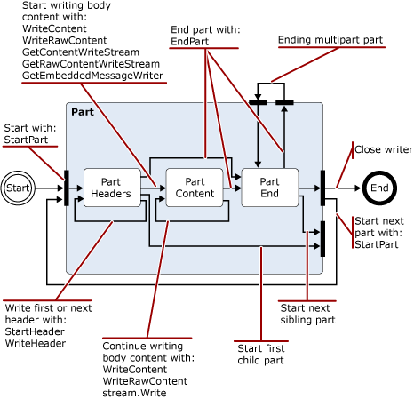

# Чтение и изменение сообщений в транспортный конвейер Exchange 2013

Узнайте о классов .NET Framework, которые можно использовать в Exchange 2013 агенты транспорта для чтения, записи и изменять сообщения.
  
**Применимо к:** Exchange Server 2013
  
- Классы, используемые для чтения, записи или изменять сообщения
- Пространство имен кодировщики
- пространство имен iCalendar
- Пространство имен MIME
- Пространство имен TextConverters
- Пространство имен TNEF
- пространство имен визитных карточек
  
Как сообщения проходят через транспортный конвейер, агента транспорта можно чтения, записи и преобразование содержимого сообщения от различных форматов данных. Например, можно читать и записывать данные MIME, выделите входящих сообщений, которые находятся в формате UUENCODE или формат печати кавычках (qp) и затем преобразовать их в стандартный, в вашей организации или чтение, а затем сохраните сведения календаря или контакт, связанные с входящие сообщения. 
  
Можно также обозначения содержимого, которое необходимо учитывать угрозы безопасности и перемещения или удаления контента или сообщения, содержащие их; например путем удаления ссылок в сообщения в формате HTML.
  
В этой статье сведения о классов .NET Framework, которые можно использовать для чтения, записи и изменения сообщений.
  
> [!CAUTION]
> Многие из свойств и параметров преобразования содержимого API-интерфейсы Разрешить значения достаточно велико, чтобы вызвать проблемы с производительностью, включая отказ в обслуживании. При использовании преобразования содержимого интерфейсы API в агента транспорта, следует применить ограничения на размеры значение свойства и параметр, поддерживает при чтение или запись для ограничения потребления ресурсов вашей агентом. 

## Классы, используемые для чтения, записи или изменять сообщения

В следующей таблице приведены классов .NET Framework, которые можно использовать для чтения, записи и изменения сообщений электронной почты.
  
**Пространства имен обработки сообщений .NET framework**

|**Пространство имен .NET framework**|**занятия**;|
|:-----|:-----|
|[Microsoft.Exchange.Data.Mime.Encoders](https://msdn.microsoft.com/library/Microsoft.Exchange.Data.Mime.Encoders.aspx)   |Содержит классы для в памяти кодирования и декодирования, класс кодировщика потока, который принимает один из декодера или кодировщика классов, содержащихся в перечисление связанного [ByteEncoder](https://msdn.microsoft.com/library/Microsoft.Exchange.Data.Mime.Encoders.ByteEncoder.aspx) базового класса и класс исключений [ByteEncoderException](https://msdn.microsoft.com/library/Microsoft.Exchange.Data.Mime.Encoders.ByteEncoderException.aspx) для кодировщики и декодеры.    |
|[Microsoft.Exchange.Data.ContentTypes.iCalendar](https://msdn.microsoft.com/library/Microsoft.Exchange.Data.ContentTypes.iCalendar.aspx)   |Содержит типы, которые позволяют читать и записывать потоков данных, которые содержат данные календаря. Включает в себя календарь чтения и записи, объект исключения, объект повторения и структуры и перечисления, которые помогут вам получить свойство сведения об элементах календаря.    |
|[Microsoft.Exchange.Data.Mime](https://msdn.microsoft.com/library/Microsoft.Exchange.Data.Mime.aspx)   |Содержит классы, структуры, перечисления и делегаты, которые можно использовать для создания, чтения, записи, проходят через, кодирования и декодирования данных MIME. Включает в себя на основе потока чтения и записи, задающей однонаправленные чтение и запись потоков данных MIME, а также методы на основе модели DOM и классы, которые можно использовать в документах MIME.    |
|[Microsoft.Exchange.Data.TextConverters](https://msdn.microsoft.com/library/Microsoft.Exchange.Data.TextConverters.aspx)   |Содержит классы, структуры, перечисления и делегаты, которые дают возможность чтения и записи в поток данных и выполнения преобразований между определенных типов данных; например HTML-код для форматированный текст (RTF). Текстовые конвертеры позволяют изменить формат потока документ из одной формы в другую, а также выборочно удалить элементы документа, который может привести к риску.    |
|[Microsoft.Exchange.Data.ContentTypes.Tnef](https://msdn.microsoft.com/library/Microsoft.Exchange.Data.ContentTypes.Tnef.aspx)   |Содержит только вперед поток чтения и записи, класс исключения и структуры и перечисления, предназначенных для упрощения чтения и записи данных транспорта Neutral Encapsulation формата TNEF.    |
|[Microsoft.Exchange.Data.ContentTypes.vCard](https://msdn.microsoft.com/library/Microsoft.Exchange.Data.ContentTypes.vCard.aspx)   |Содержит только вперед поток чтения и записи, класс исключения и структуры и перечисления, предназначенных для упрощения чтения и записи данных контактов в формате vCard.    |
   
## Пространство имен кодировщики

Пространство имен кодировщики содержит классы для в памяти кодирования и декодирования. Эти наследование от базового класса [ByteEncoder](https://msdn.microsoft.com/library/Microsoft.Exchange.Data.Mime.Encoders.ByteEncoder.aspx) . Классы кодирования и декодирования для Base64 BinHex, печати кавычках (qp) и Unix-Unix (Uu). Для в памяти кодирования и декодирования используются следующие классы: 
  
- [Base64Encoder](https://msdn.microsoft.com/library/Microsoft.Exchange.Data.Mime.Encoders.Base64Encoder.aspx)
    
- [Base64Decoder](https://msdn.microsoft.com/library/Microsoft.Exchange.Data.Mime.Encoders.Base64Decoder.aspx)
    
- [BinHexEncoder](https://msdn.microsoft.com/library/Microsoft.Exchange.Data.Mime.Encoders.BinHexEncoder.aspx)
    
- [BinHexDecoder](https://msdn.microsoft.com/library/Microsoft.Exchange.Data.Mime.Encoders.BinHexDecoder.aspx)
    
- [QPEncoder](https://msdn.microsoft.com/library/Microsoft.Exchange.Data.Mime.Encoders.QPEncoder.aspx)
    
- [QPDecoder](https://msdn.microsoft.com/library/Microsoft.Exchange.Data.Mime.Encoders.QPDecoder.aspx)
    
- [UUEncoder](https://msdn.microsoft.com/library/Microsoft.Exchange.Data.Mime.Encoders.UUEncoder.aspx)
    
- [UUDecoder](https://msdn.microsoft.com/library/Microsoft.Exchange.Data.Mime.Encoders.UUDecoder.aspx)
    
Кодировщики и декодеры наследование от базового класса [ByteEncoder](https://msdn.microsoft.com/library/Microsoft.Exchange.Data.Mime.Encoders.ByteEncoder.aspx) и используйте класс исключений [ByteEncoderException](https://msdn.microsoft.com/library/Microsoft.Exchange.Data.Mime.Encoders.ByteEncoderException.aspx) для обработки ошибок. 
  
Кроме того пространство имен содержит класс [MacBinaryHeader](https://msdn.microsoft.com/library/Microsoft.Exchange.Data.Mime.Encoders.MacBinaryHeader.aspx) , который определяет файлы, файлы в кодировке и считывает их соответствующий файл заголовка. 
  
И, наконец класс [EncoderStream](https://msdn.microsoft.com/library/Microsoft.Exchange.Data.Mime.Encoders.EncoderStream.aspx) выполняет преобразование к потоку данных, вместо объекта в памяти. Этот класс принимает один из классов декодера или кодировщика и либо операций чтения или записи в соответствии с связанное перечисление [EncoderStreamAccess](https://msdn.microsoft.com/library/Microsoft.Exchange.Data.Mime.Encoders.EncoderStreamAccess.aspx) . 
  
## пространство имен iCalendar

Пространство имен iCalendar обеспечивает прямого — только для чтения и записи данных iCalendar, помимо поддержки структуры и классы для создания, доступ к и изменение iCalendar потоков.
  
Классы [CalendarReader](https://msdn.microsoft.com/library/Microsoft.Exchange.Data.ContentTypes.iCalendar.CalendarReader.aspx) и [CalendarWriter](https://msdn.microsoft.com/library/Microsoft.Exchange.Data.ContentTypes.iCalendar.CalendarWriter.aspx) используются для чтения и записи iCalendar поток данных. 
  
CalendarReader принимает для чтения [потока](https://msdn.microsoft.com/library/System.IO.Stream.aspx) в качестве аргумента для его конструкторов. Затем можно использовать методы [ReadFirstChildComponent](https://msdn.microsoft.com/library/Microsoft.Exchange.Data.ContentTypes.iCalendar.CalendarReader.ReadFirstChildComponent.aspx), [ReadNextSiblingComponent](https://msdn.microsoft.com/library/Microsoft.Exchange.Data.ContentTypes.iCalendar.CalendarReader.ReadNextSiblingComponent.aspx)и [ReadNextComponent](https://msdn.microsoft.com/library/Microsoft.Exchange.Data.ContentTypes.iCalendar.CalendarReader.ReadNextComponent.aspx) для последовательного доступа к компонентам iCalendar в поток данных. На основе значения, указанное для свойства [ComplianceMode](https://msdn.microsoft.com/library/Microsoft.Exchange.Data.ContentTypes.iCalendar.CalendarReader.ComplianceMode.aspx) , ошибки в потоке iCalendar вызовет исключение, или в свойство [ComplianceStatus](https://msdn.microsoft.com/library/Microsoft.Exchange.Data.ContentTypes.iCalendar.CalendarReader.ComplianceStatus.aspx) должно быть задано значение, отличное от [соответствует](https://msdn.microsoft.com/en-us/library/microsoft.exchange.data.contenttypes.icalendar.calendarcompliancestatus.aspx). Вы можете проверить это свойство для обнаружения проблем с входящих данных iCalendar. 
  
Класс [CalendarWriter](https://msdn.microsoft.com/library/Microsoft.Exchange.Data.ContentTypes.iCalendar.CalendarWriter.aspx) принимает доступный для записи [поток](https://msdn.microsoft.com/library/System.IO.Stream.aspx) в качестве аргумента для его конструкторов. 
  
## Пространство имен MIME

Пространство имен MIME содержит классы, которые позволяют создавать, доступа и изменять документы MIME. Можно работать с документами MIME с помощью либо метод на основе потока или на основе модели DOM.
  
### Класс MimeDocument и модели DOM MIME

Класс [MimeDocument](https://msdn.microsoft.com/library/Microsoft.Exchange.Data.Mime.MimeDocument.aspx) позволяет DOM доступ к документам MIME. Использовать объекты этого типа, когда у вас есть доступной памяти для загрузки всей модели DOM и вы должны иметь доступ в случайном порядке для заголовков и содержимое сообщения. 
  
Загрузка данных в объект [MimeDocument](https://msdn.microsoft.com/library/Microsoft.Exchange.Data.Mime.MimeDocument.aspx) с помощью методов [GetLoadStream](https://msdn.microsoft.com/library/Microsoft.Exchange.Data.Mime.MimeDocument.GetLoadStream.aspx) или [нагрузки](https://msdn.microsoft.com/library/Microsoft.Exchange.Data.Mime.MimeDocument.Load.aspx) . Затем можно обхода иерархии модели DOM и создание, изменение или удаление данных MIME. После изменения данных MIME, его можно записать с помощью одного из методов [WriteTo](https://msdn.microsoft.com/library/Microsoft.Exchange.Data.Mime.MimeNode.WriteTo.aspx) к потоку. 
  
На следующем рисунке показана структура данных в объекте [MimeDocument](https://msdn.microsoft.com/library/Microsoft.Exchange.Data.Mime.MimeDocument.aspx) . 
  
**На рисунке 1. Структура MimeDocument объектов**

  
### Классы MimeReader и MimeWriter и синтаксический анализ на основе потока MIME

Классы [MimeReader](https://msdn.microsoft.com/library/Microsoft.Exchange.Data.Mime.MimeReader.aspx) и [MimeWriter](https://msdn.microsoft.com/library/Microsoft.Exchange.Data.Mime.MimeWriter.aspx) разрешение только для прямого доступа к потоков MIME. Используйте эти классы не нужно изменить данные MIME, которые требуются данные, которые уже чтения или записи. Например если вы хотите напечатать сообщения, которые соответствуют предварительно определенный формат, класс [MimeWriter](https://msdn.microsoft.com/library/Microsoft.Exchange.Data.Mime.MimeWriter.aspx) может оказаться полезной. 
  
Класс [MimeDocument](https://msdn.microsoft.com/library/Microsoft.Exchange.Data.Mime.MimeDocument.aspx) инкапсулирует DOM. Классы [MimeReader](https://msdn.microsoft.com/library/Microsoft.Exchange.Data.Mime.MimeReader.aspx) и [MimeWriter](https://msdn.microsoft.com/library/Microsoft.Exchange.Data.Mime.MimeWriter.aspx) представляют состояние компьютеров. Изменение состояния на основе данных, полученных и методами. На рисунках 2-5, диаграммы перехода упрощенный состояний, которые отображают для объекта [MimeReader](https://msdn.microsoft.com/library/Microsoft.Exchange.Data.Mime.MimeReader.aspx) , какие методы являются допустимыми вызов из каждого состояния и состояние, приведет к. 
  
Чтобы использовать эти схемы, следуйте стрелок из одного состояния к другому, отметить вызывает метод или возвращаемые значения, которые вызывают состояния для изменения. На первой схеме Предположим, что вы являетесь в начале потока, к которой принадлежит MimeReader, созданную вами. Чтобы получить состояние заголовков частей вызове [ReadNextPart](https://msdn.microsoft.com/library/Microsoft.Exchange.Data.Mime.MimeReader.ReadNextPart.aspx) или [ReadFirstChildPart](https://msdn.microsoft.com/library/Microsoft.Exchange.Data.Mime.MimeReader.ReadFirstChildPart.aspx)в указанном порядке. Если есть заголовки (то есть, если MIME имеет правильный формат), будет ввести в состояние заголовков частей. В противном случае будет создано исключение. 
  
**На рисунке 2. Схема упрощенный состояний для объектов MimeReader**

  
> [!NOTE]
> Разверните узел рисунках 3, 4 и 5 на состояния, которое указано в каждой из предыдущей диаграммы. 
  
**На рисунке 3. Расширенное представление состояния заголовков частей из на рисунке 2**

  
**На рисунке 4. Расширенное представление состояния заголовка из на рисунке 3, когда параметр встречается в заголовке**

  
> [!NOTE]
> Состояние, представленное на рисунке 5 — рекурсивный, в том, что, если группа адрес обнаружен, можно использовать свойство [GroupRecipientReader](https://msdn.microsoft.com/library/Microsoft.Exchange.Data.Mime.MimeAddressReader.GroupRecipientReader.aspx) прочитать адреса в группе. 
  
**На рисунке 5. Расширенное представление состояния заголовка на рис. 3 при обнаружении адрес или адрес группы**

  
Цифры 6 и 7 показывают диаграммы перехода упрощенный состояний для [MimeWriter](https://msdn.microsoft.com/library/Microsoft.Exchange.Data.Mime.MimeWriter.aspx) объекта. 
  
> [!NOTE]
> На рисунке 7 расширяет состояние заголовки части показано на рисунке 6. 
  
**На рисунке 6. Схема упрощенный состояний для MimeWriter объектов**

  
**На рисунке 7. Расширенное представление состояния заголовков частей из на рисунке 6**

  
## Пространство имен TextConverters

Пространство имен TextConverters содержит типы, которые поддерживают преобразования содержимого сообщений электронной почты. Эти типы можно выполнить преобразование кодовых страниц, удаление HTML-код, который не является безопасной и выполнять другие преобразования текста сообщений электронной почты. Пространство имен [Microsoft.Exchange.Data.TextConverters](https://msdn.microsoft.com/library/Microsoft.Exchange.Data.TextConverters.aspx) включает в себя следующие классы, производные от абстрактного класса [TextConverter](https://msdn.microsoft.com/library/Microsoft.Exchange.Data.TextConverters.TextConverter.aspx) : 
  
- [EnrichedToHtml](https://msdn.microsoft.com/library/Microsoft.Exchange.Data.TextConverters.EnrichedToHtml.aspx)
    
- [EnrichedToText](https://msdn.microsoft.com/library/Microsoft.Exchange.Data.TextConverters.EnrichedToText.aspx)
    
- [HtmlToEnriched](https://msdn.microsoft.com/library/Microsoft.Exchange.Data.TextConverters.HtmlToEnriched.aspx)
    
- [HtmlToHtml](https://msdn.microsoft.com/library/Microsoft.Exchange.Data.TextConverters.HtmlToHtml.aspx)
    
- [HtmlToRtf](https://msdn.microsoft.com/library/Microsoft.Exchange.Data.TextConverters.HtmlToRtf.aspx)
    
- [HtmlToText](https://msdn.microsoft.com/library/Microsoft.Exchange.Data.TextConverters.HtmlToText.aspx)
    
- [RtfCompressedToRtf](https://msdn.microsoft.com/library/Microsoft.Exchange.Data.TextConverters.RtfCompressedToRtf.aspx)
    
- [RtfToHtml](https://msdn.microsoft.com/library/Microsoft.Exchange.Data.TextConverters.RtfToHtml.aspx)
    
- [RtfToRtf](https://msdn.microsoft.com/library/Microsoft.Exchange.Data.TextConverters.RtfToRtf.aspx)
    
- [RtfToRtfCompressed](https://msdn.microsoft.com/library/Microsoft.Exchange.Data.TextConverters.RtfToRtfCompressed.aspx)
    
- [RtfToText](https://msdn.microsoft.com/library/Microsoft.Exchange.Data.TextConverters.RtfToText.aspx)
    
- [TextToHtml](https://msdn.microsoft.com/library/Microsoft.Exchange.Data.TextConverters.TextToHtml.aspx)
    
- [TextToRtf](https://msdn.microsoft.com/library/Microsoft.Exchange.Data.TextConverters.TextToRtf.aspx)
    
- [TextToText](https://msdn.microsoft.com/library/Microsoft.Exchange.Data.TextConverters.TextToText.aspx)
    
Эти текстовые конвертеры позволяют изменить формат потока документов или для удаления элементов, которые не являются безопасными из документа в формате HTML. Эти классы можно использовать непосредственно для преобразования с помощью одного вызова одного из методов преобразовать в базовый класс [TextConverter](https://msdn.microsoft.com/library/Microsoft.Exchange.Data.TextConverters.TextConverter.aspx) или их можно передать конструктору конвертера, который используется для выполнения преобразованные операций чтения или записи. 
  
Функциональные возможности, наследуется из базового класса полезен для выполнения преобразований при достаточно места для хранения исходного документа и его преобразованную выходных данных, либо следует сохранить результаты преобразования. Метод **Convert** принимает входные данные и выходных потоков, читатели текста или текста записи и преобразует содержимое входных данных для связанных выходных данных. 
  
Также включены в пространстве имен программы потока классов, модуля записи и чтения следующий текст:
  
- [ConverterReader](https://msdn.microsoft.com/library/Microsoft.Exchange.Data.TextConverters.ConverterReader.aspx) , производные от **System.IO.TextReader**. 
    
- [ConverterWriter](https://msdn.microsoft.com/library/Microsoft.Exchange.Data.TextConverters.ConverterWriter.aspx) , производные от **System.IO.TextWriter**. 
    
- [ConverterStream](https://msdn.microsoft.com/library/Microsoft.Exchange.Data.TextConverters.ConverterStream.aspx) — производным от **System.IO.Stream**. 
    
Они служат для преобразования, когда у вас место для хранения исходной или его преобразованную вывода при получении входные данные из или отправить выходные данные в поток или выходных данных только для целей поиска или индексирования и поэтому не должны храниться Результат преобразования.
  
## Пространство имен TNEF

Пространство имен Tnef содержит классы и типы, которые позволяют только вперед на основе потока чтения и записи данных TNEF. Формат TNEF имеет формат данных, который используется для инкапсуляции свойств MAPI для клиентов, которые не могут интерпретировать MAPI.
  
Классы [TnefReader](https://msdn.microsoft.com/library/Microsoft.Exchange.Data.ContentTypes.Tnef.TnefReader.aspx) и [TnefWriter](https://msdn.microsoft.com/library/Microsoft.Exchange.Data.ContentTypes.Tnef.TnefWriter.aspx) обеспечивают основные функциональные возможности в пространстве имен [Microsoft.Exchange.Data.ContentTypes.Tnef](https://msdn.microsoft.com/library/Microsoft.Exchange.Data.ContentTypes.Tnef.aspx) . 
  
Класс [TnefReader](https://msdn.microsoft.com/library/Microsoft.Exchange.Data.ContentTypes.Tnef.TnefReader.aspx) принимает поток для чтения в качестве аргумента для его конструкторов. Затем используйте метод [ReadNextAttribute](https://msdn.microsoft.com/library/Microsoft.Exchange.Data.ContentTypes.Tnef.TnefReader.ReadNextAttribute.aspx) для последовательного чтения атрибутов в потоке TNEF. Прочитайте атрибут, можно получить доступ к сведения об атрибуте с помощью свойства только для чтения в объекте [TnefReader](https://msdn.microsoft.com/library/Microsoft.Exchange.Data.ContentTypes.Tnef.TnefReader.aspx) в дополнение к началу [TnefPropertyReader](https://msdn.microsoft.com/library/Microsoft.Exchange.Data.ContentTypes.Tnef.TnefPropertyReader.aspx) для чтения свойство current. Можно также прямой доступ к текущего атрибута с помощью метода [ReadAttributeRawValue](https://msdn.microsoft.com/library/Microsoft.Exchange.Data.ContentTypes.Tnef.TnefReader.ReadAttributeRawValue.aspx) . 
  
Класс [TnefWriter](https://msdn.microsoft.com/library/Microsoft.Exchange.Data.ContentTypes.Tnef.TnefWriter.aspx) принимает доступный для записи [поток](https://msdn.microsoft.com/library/System.IO.Stream.aspx) в качестве аргумента для его конструкторов. Класс [TnefWriter](https://msdn.microsoft.com/library/Microsoft.Exchange.Data.ContentTypes.Tnef.TnefWriter.aspx) предоставляет несколько способов для записи данных в этот поток. 
  
## пространство имен визитных карточек

Пространство имен vCard содержит классы, структуры и перечисления, используемые для чтения и записи контактные данные, содержащиеся в сообщении электронной почты в формате vCard данных. Пространство имен содержит контакта чтения и записи, класс исключения, свойство чтения, параметр чтения и поддержки перечисления, которые позволяют читать vCard данные, связанные с сообщения электронной почты.
  
## См. также

- [Агенты транспорта в Exchange](transport-agents-in-exchange-2013.md)  
- [Транспорта концепции агентов в Exchange 2013](transport-agent-concepts-in-exchange-2013.md) 
- [Справочник по агента транспорта для Exchange 2013](transport-agent-reference-for-exchange-2013.md)
- [Типы мультимедиа MIME](http://www.iana.org/assignments/media-types)
    

